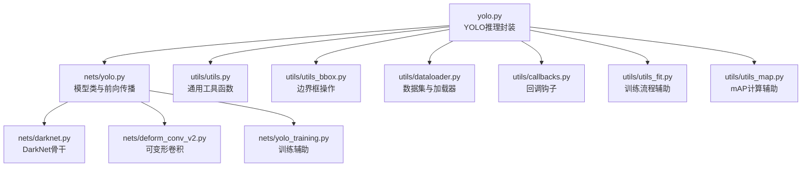
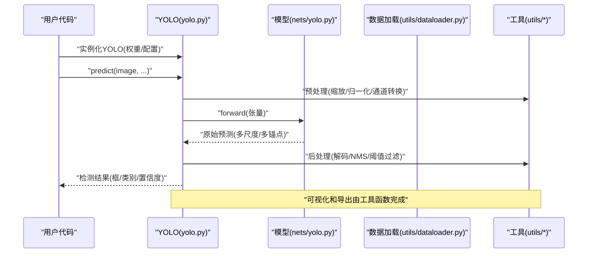
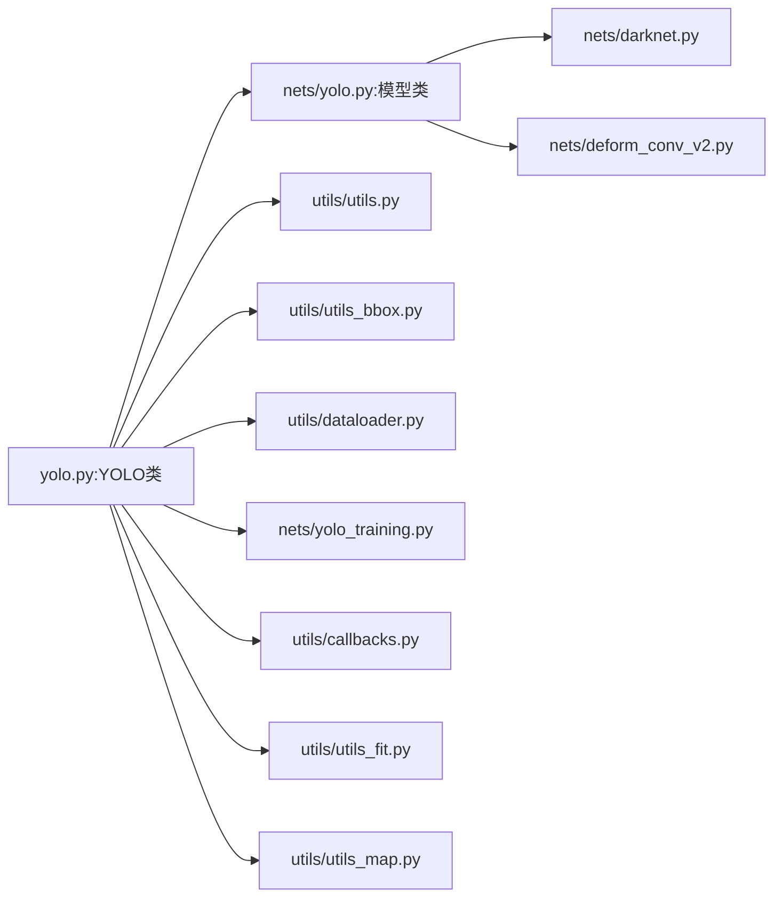

# API参考文档

<cite>
**本文档引用的文件**   
- [yolo.py](file://yolo.py)
- [nets/yolo.py](file://nets/yolo.py)
- [utils/utils.py](file://utils/utils.py)
- [utils/utils_bbox.py](file://utils/utils_bbox.py)
- [utils/dataloader.py](file://utils/dataloader.py)
- [utils/callbacks.py](file://utils/callbacks.py)
- [utils/utils_fit.py](file://utils/utils_fit.py)
- [utils/utils_map.py](file://utils/utils_map.py)
- [nets/darknet.py](file://nets/darknet.py)
- [nets/deform_conv_v2.py](file://nets/deform_conv_v2.py)
- [nets/yolo_training.py](file://nets/yolo_training.py)
</cite>

## 目录
1. [简介](#简介)
2. [项目结构](#项目结构)
3. [核心组件](#核心组件)
4. [架构总览](#架构总览)
5. [详细组件分析](#详细组件分析)
6. [依赖关系分析](#依赖关系分析)
7. [性能考虑](#性能考虑)
8. [故障排查指南](#故障排查指南)
9. [结论](#结论)
10. [附录](#附录)

## 简介
本API参考文档面向TogetherNet目标检测项目的开发者与使用者，聚焦以下模块的公共接口与使用方式：
- yolo.py中的YOLO类（推理入口）
- nets/yolo.py中的模型类（前向传播、参数配置、状态管理）
- utils工具模块（图像处理、边界框操作、数学计算等）
- 数据加载器（Dataset类方法与自定义数据加载实现）
- 训练与回调相关辅助模块（可选扩展）

文档以“渐进式复杂度”组织，既提供高层概览，也给出代码级细节与图示，帮助不同背景读者快速上手并深入理解。

## 项目结构
TogetherNet采用分层模块化设计：
- 顶层入口与推理封装：yolo.py
- 网络定义与训练逻辑：nets/
- 工具与数据处理：utils/
- 评估与可视化：根目录脚本与utils_coco/

图表来源
- [yolo.py:1-200](file://yolo.py#L1-L200)
- [nets/yolo.py:1-200](file://nets/yolo.py#L1-L200)
- [utils/utils.py:1-200](file://utils/utils.py#L1-L200)
- [utils/utils_bbox.py:1-200](file://utils/utils_bbox.py#L1-L200)
- [utils/dataloader.py:1-200](file://utils/dataloader.py#L1-L200)
- [nets/darknet.py:1-200](file://nets/darknet.py#L1-L200)
- [nets/deform_conv_v2.py:1-200](file://nets/deform_conv_v2.py#L1-L200)
- [nets/yolo_training.py:1-200](file://nets/yolo_training.py#L1-L200)
- [utils/callbacks.py:1-200](file://utils/callbacks.py#L1-L200)
- [utils/utils_fit.py:1-200](file://utils/utils_fit.py#L1-L200)
- [utils/utils_map.py:1-200](file://utils/utils_map.py#L1-L200)

章节来源
- [yolo.py:1-200](file://yolo.py#L1-L200)
- [nets/yolo.py:1-200](file://nets/yolo.py#L1-L200)
- [utils/utils.py:1-200](file://utils/utils.py#L1-L200)
- [utils/utils_bbox.py:1-200](file://utils/utils_bbox.py#L1-L200)
- [utils/dataloader.py:1-200](file://utils/dataloader.py#L1-L200)

## 核心组件
本节概述各模块的职责与对外暴露的关键接口类型，便于快速定位API位置与调用路径。

- YOLO类（yolo.py）
  - 职责：封装模型加载、预处理、后处理与预测流程；提供统一的推理接口。
  - 关键能力：初始化权重与配置、图像预处理、批量/单图推理、结果解析与可视化。
- 模型类（nets/yolo.py）
  - 职责：定义YOLO网络结构与前向传播；管理模型参数与状态。
  - 关键能力：构建多尺度特征金字塔、输出头、前向计算、状态保存/加载。
- 工具函数（utils/*）
  - 职责：提供图像处理、边界框几何运算、数值计算、mAP辅助、训练回调与拟合辅助。
  - 关键能力：归一化、缩放、坐标变换、IoU计算、NMS、类别映射、日志与进度条。
- 数据加载器（utils/dataloader.py）
  - 职责：实现VOC/COCO风格的数据集与Dataloader；支持增强与批处理。
  - 关键能力：读取标注、图像解码、数据增强、迭代器协议、自定义数据接入。

章节来源
- [yolo.py:1-200](file://yolo.py#L1-L200)
- [nets/yolo.py:1-200](file://nets/yolo.py#L1-L200)
- [utils/utils.py:1-200](file://utils/utils.py#L1-L200)
- [utils/utils_bbox.py:1-200](file://utils/utils_bbox.py#L1-L200)
- [utils/dataloader.py:1-200](file://utils/dataloader.py#L1-L200)

## 架构总览
下图展示从输入图像到检测结果的整体数据流与模块交互。

图表来源
- [yolo.py:1-200](file://yolo.py#L1-L200)
- [nets/yolo.py:1-200](file://nets/yolo.py#L1-L200)
- [utils/utils.py:1-200](file://utils/utils.py#L1-L200)
- [utils/utils_bbox.py:1-200](file://utils/utils_bbox.py#L1-L200)
- [utils/dataloader.py:1-200](file://utils/dataloader.py#L1-L200)

## 详细组件分析

### YOLO类（yolo.py）
- 角色与职责
  - 作为推理入口，统一封装模型加载、预处理、后处理与结果输出。
  - 提供对外的预测接口，屏蔽内部复杂流程。
- 构造函数参数（按常见模式归纳）
  - 权重路径或预训练权重对象
  - 类别列表或类别映射
  - 输入尺寸、置信度阈值、NMS阈值、是否使用FP16/设备选择等
  - 可选：Anchor配置、Backbone选择、是否启用特定模块
- 核心方法
  - predict(image, ...)：接收图像或批次图像，返回检测结果（框、类别、置信度）。
  - preprocess(image, ...)：将图像转换为模型输入格式（尺寸、归一化、通道顺序）。
  - postprocess(raw_outputs, ...)：对模型原始输出进行解码、NMS与阈值过滤。
  - load_weights(path_or_state_dict)：加载权重或状态字典。
  - set_device(device)：切换运行设备。
  - export/save(...)：导出或保存中间结果（如可视化、JSON等）。
- 返回值类型
  - 通常包含：边界框坐标（xyxy或xywh）、类别索引、置信度分数、可选掩码或关键点。
- 使用示例（说明性）
  - 单图推理：实例化YOLO -> 调用predict -> 获取结果 -> 可视化/导出。
  - 批量推理：准备图像列表 -> 调用predict(batch) -> 遍历结果。
  - 自定义阈值：调整置信度与NMS阈值以平衡召回与精度。
- 错误处理
  - 权重缺失或格式不匹配：抛出加载异常。
  - 输入图像为空或尺寸非法：抛出输入校验异常。
  - 设备不可用：抛出设备分配异常。

章节来源
- [yolo.py:1-200](file://yolo.py#L1-L200)

### 模型类（nets/yolo.py）
- 角色与职责
  - 定义YOLO网络结构，包括骨干、颈部与检测头；实现前向传播。
  - 管理模型参数、状态与序列化。
- 构造函数参数
  - 类别数、输入尺寸、Anchor配置、Backbone选择、是否冻结层、损失权重等。
- 前向传播方法
  - forward(x)：接收输入张量，返回多尺度特征与预测头输出（含分类、回归、置信度等）。
- 状态管理
  - save/load_state_dict：保存与加载模型状态。
  - train()/eval()：切换训练/推理模式。
  - to(device)/half()/float()：设备与精度切换。
- 使用示例（说明性）
  - 直接调用模型：构造模型 -> 设置eval -> 前向计算 -> 后处理。
  - 集成到YOLO类：通过YOLO封装简化调用。
- 错误处理
  - 维度不匹配：抛出形状异常。
  - 未初始化权重：在推理时提示需先加载权重。

章节来源
- [nets/yolo.py:1-200](file://nets/yolo.py#L1-L200)

### 工具函数（utils/*）
- utils/utils.py
  - 图像处理：缩放、裁剪、填充、颜色空间转换、归一化。
  - 数学计算：矩阵运算、插值、统计指标。
  - IO与日志：读写文件、打印进度、记录日志。
- utils/utils_bbox.py
  - 边界框操作：坐标格式转换（xyxy/xywh/cxcywh）、面积计算、交并比（IoU）、非极大值抑制（NMS）。
  - 常用算法：GIoU/DIoU/CIoU变体（若实现）。
- utils/utils_map.py
  - mAP计算：PR曲线、平均精度、COCO风格指标辅助。
- utils/callbacks.py
  - 回调钩子：训练阶段事件（开始/结束、每步/每轮）、日志与检查点保存。
- utils/utils_fit.py
  - 训练流程辅助：优化器调度、梯度累积、混合精度、验证循环。

使用示例（说明性）
- 边界框处理：将预测框转为xyxy -> 计算IoU -> NMS过滤。
- 图像预处理：resize -> pad -> normalize -> 转Tensor。
- mAP评估：收集预测与真值 -> 计算IoU -> 生成PR曲线 -> 汇总mAP。

错误处理
- 输入越界或空数组：抛出索引或形状异常。
- 数值不稳定：NaN/Inf检测与修复策略。

章节来源
- [utils/utils.py:1-200](file://utils/utils.py#L1-L200)
- [utils/utils_bbox.py:1-200](file://utils/utils_bbox.py#L1-L200)
- [utils/utils_map.py:1-200](file://utils/utils_map.py#L1-L200)
- [utils/callbacks.py:1-200](file://utils/callbacks.py#L1-L200)
- [utils/utils_fit.py:1-200](file://utils/utils_fit.py#L1-L200)

### 数据加载器（utils/dataloader.py）
- Dataset类
  - 职责：读取图像与标注，执行数据增强，返回样本与标签。
  - 关键方法：
    - __len__()：返回数据集长度。
    - __getitem__(idx)：根据索引返回样本（图像张量、标注框、类别等）。
    - load_anno(path)：解析标注文件（XML/JSON/文本）。
    - augment(image, boxes, labels)：随机翻转、缩放、色彩抖动等。
- DataLoader集成
  - 结合PyTorch DataLoader进行批处理、多线程与缓存。
- 自定义数据加载
  - 继承Dataset基类，实现__getitem__与__len__。
  - 适配新标注格式：编写load_anno适配器。
  - 数据增强管线：组合现有增强算子或新增自定义增强。
- 使用示例（说明性）
  - VOC/COCO风格：指定根目录与分割集 -> 创建Dataset -> 包装DataLoader -> 迭代训练。
  - 自定义任务：替换load_anno与增强策略，保持返回元组一致。

错误处理
- 文件不存在或损坏：抛出IO异常。
- 标注格式不一致：抛出解析异常。
- 图像解码失败：跳过或重试策略。

章节来源
- [utils/dataloader.py:1-200](file://utils/dataloader.py#L1-L200)

### 骨干与卷积模块（nets/darknet.py, nets/deform_conv_v2.py）
- DarkNet骨干
  - 提供基础卷积块、残差连接、下采样策略。
  - 用于构建YOLO的特征提取主干。
- 可变形卷积v2
  - 在标准卷积基础上引入可学习偏移，提升形变目标检测能力。
  - 可与骨干或颈部模块组合。

章节来源
- [nets/darknet.py:1-200](file://nets/darknet.py#L1-L200)
- [nets/deform_conv_v2.py:1-200](file://nets/deform_conv_v2.py#L1-L200)

### 训练辅助（nets/yolo_training.py）
- 职责：封装损失计算、正负样本分配、训练循环辅助。
- 关键能力：
  - 损失函数组合（分类、回归、置信度）。
  - 动态锚点匹配策略。
  - 与utils_fit.py协作完成训练流程。

章节来源
- [nets/yolo_training.py:1-200](file://nets/yolo_training.py#L1-L200)

## 依赖关系分析
下图展示主要模块之间的依赖关系与耦合程度。

图表来源
- [yolo.py:1-200](file://yolo.py#L1-L200)
- [nets/yolo.py:1-200](file://nets/yolo.py#L1-L200)
- [utils/utils.py:1-200](file://utils/utils.py#L1-L200)
- [utils/utils_bbox.py:1-200](file://utils/utils_bbox.py#L1-L200)
- [utils/dataloader.py:1-200](file://utils/dataloader.py#L1-L200)
- [nets/darknet.py:1-200](file://nets/darknet.py#L1-L200)
- [nets/deform_conv_v2.py:1-200](file://nets/deform_conv_v2.py#L1-L200)
- [nets/yolo_training.py:1-200](file://nets/yolo_training.py#L1-L200)
- [utils/callbacks.py:1-200](file://utils/callbacks.py#L1-L200)
- [utils/utils_fit.py:1-200](file://utils/utils_fit.py#L1-L200)
- [utils/utils_map.py:1-200](file://utils/utils_map.py#L1-L200)

章节来源
- [yolo.py:1-200](file://yolo.py#L1-L200)
- [nets/yolo.py:1-200](file://nets/yolo.py#L1-L200)
- [utils/utils.py:1-200](file://utils/utils.py#L1-L200)
- [utils/utils_bbox.py:1-200](file://utils/utils_bbox.py#L1-L200)
- [utils/dataloader.py:1-200](file://utils/dataloader.py#L1-L200)

## 性能考虑
- 预处理与后处理
  - 尽量使用向量化操作减少Python循环开销。
  - 合理设置输入尺寸与批大小，平衡显存与吞吐。
- 设备与精度
  - 使用GPU与半精度（FP16）加速推理与训练。
  - 注意数值稳定性，避免溢出或下溢。
- 内存与I/O
  - 使用DataLoader的多进程与缓存机制提升数据吞吐。
  - 避免重复解码与重复计算，必要时缓存中间结果。
- 算法优化
  - 优先使用高效的NMS实现（如CUDA版本）。
  - 对热点路径进行算子融合与剪枝。

[本节为通用指导，无需源码引用]

## 故障排查指南
- 权重加载失败
  - 现象：抛出权重格式或路径异常。
  - 排查：确认权重文件存在且与模型结构匹配；检查键名一致性。
- 输入图像问题
  - 现象：尺寸非法或解码失败。
  - 排查：确保图像可读；统一尺寸与通道顺序；增加容错与日志。
- 边界框异常
  - 现象：NMS无效或框坐标越界。
  - 排查：检查坐标格式转换；验证IoU计算；调整阈值。
- 训练不稳定
  - 现象：Loss发散或NaN。
  - 排查：降低学习率；启用梯度裁剪；检查数据标注质量。
- 设备与内存
  - 现象：OOM或设备不可用。
  - 排查：减小批大小；释放显存；检查CUDA可用性与驱动。

章节来源
- [yolo.py:1-200](file://yolo.py#L1-L200)
- [utils/utils_bbox.py:1-200](file://utils/utils_bbox.py#L1-L200)
- [utils/utils.py:1-200](file://utils/utils.py#L1-L200)
- [utils/dataloader.py:1-200](file://utils/dataloader.py#L1-L200)

## 结论
TogetherNet通过清晰的模块化设计与完善的工具链，提供了从数据加载、模型前向、后处理到评估的一体化解决方案。YOLO类作为统一入口，简化了推理流程；模型类负责核心网络与前向计算；工具模块覆盖图像处理、边界框操作与mAP评估；数据加载器支持灵活的数据接入与增强。遵循本文档的API说明与最佳实践，可快速搭建稳定高效的目标检测系统。

[本节为总结，无需源码引用]

## 附录
- 常见用法模式
  - 单图推理：实例化YOLO -> 预处理 -> 前向 -> 后处理 -> 可视化。
  - 批量推理：准备批次 -> 调用predict(batch) -> 遍历结果。
  - 自定义数据：实现Dataset -> 适配标注 -> 组合增强 -> 包装DataLoader。
- 扩展建议
  - 新增骨干或卷积模块：在nets中实现并注册到模型类。
  - 自定义损失与匹配策略：在训练辅助中扩展。
  - 集成外部评估：基于utils_map.py扩展指标。

[本节为补充信息，无需源码引用]