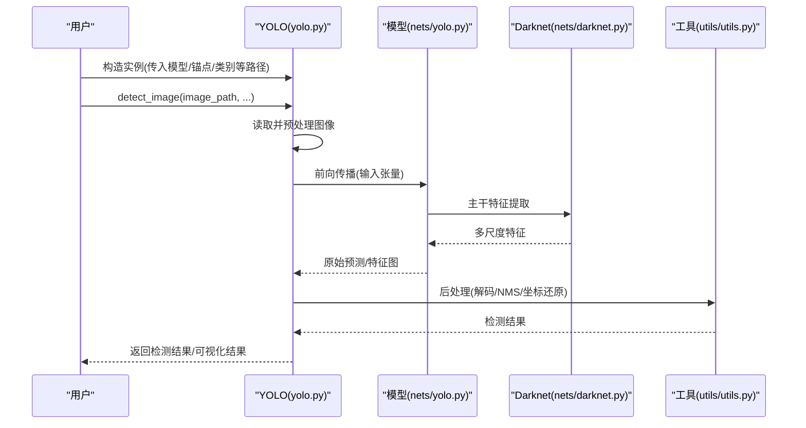
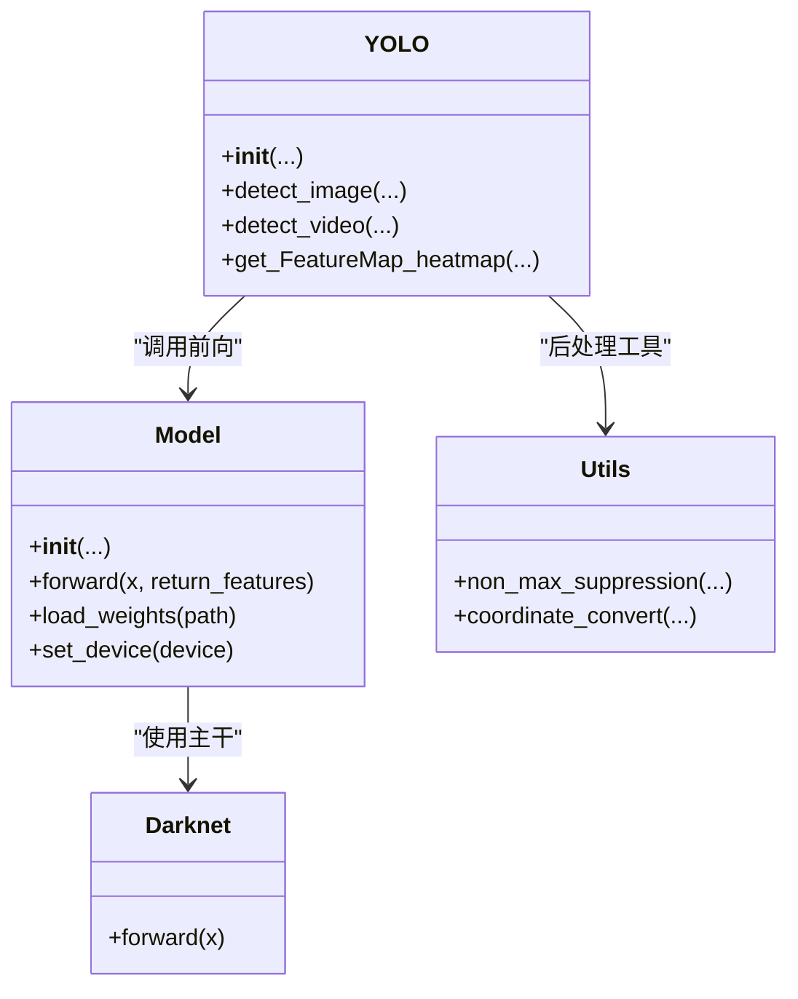

# YOLO核心类API

<cite>
**本文档引用的文件**   
- [yolo.py](file://yolo.py)
- [nets/yolo.py](file://nets/yolo.py)
- [nets/darknet.py](file://nets/darknet.py)
- [utils/utils.py](file://utils/utils.py)
- [predict.py](file://predict.py)
- [README.md](file://README.md)
</cite>

## 目录
1. [简介](#简介)
2. [项目结构](#项目结构)
3. [核心组件](#核心组件)
4. [架构总览](#架构总览)
5. [详细组件分析](#详细组件分析)
6. [依赖关系分析](#依赖关系分析)
7. [性能考虑](#性能考虑)
8. [故障排查指南](#故障排查指南)
9. [结论](#结论)
10. [附录：使用示例与最佳实践](#附录使用示例与最佳实践)

## 简介
本文件为YOLO核心类的完整API文档，聚焦以下目标：
- 全面记录根目录 yolo.py 中 YOLO 类的公共接口（构造函数参数、核心方法等）
- 记录 nets/yolo.py 中模型类的API（前向传播、参数配置、状态管理）
- 提供输入输出类型说明、返回值格式、错误处理与常见异常
- 给出完整的代码示例路径与最佳实践指引

该仓库采用“应用入口 + 网络实现 + 工具库”的分层组织方式。YOLO 类作为推理入口，封装了模型加载、预处理、后处理与可视化；模型类负责前向计算与特征图/热力图提取。

## 项目结构
与本次API文档直接相关的核心文件如下：
- yolo.py：YOLO 推理类，提供图像/视频检测、热力图等高层接口
- nets/yolo.py：模型类定义，包含前向传播、多尺度输出、状态管理等
- nets/darknet.py：Darknet主干网络实现（被模型类使用）
- utils/utils.py：通用工具函数（如NMS、坐标变换等）
- predict.py：预测脚本示例，展示如何调用 YOLO 类进行推理
- README.md：项目说明与使用说明

```mermaid
graph TB
A["yolo.py<br/>YOLO类"] --> B["nets/yolo.py<br/>模型类"]
B --> C["nets/darknet.py<br/>Darknet主干"]
A --> D["utils/utils.py<br/>工具函数"]
E["predict.py<br/>预测脚本示例"] --> A
```

图表来源
- [yolo.py](file://yolo.py)
- [nets/yolo.py](file://nets/yolo.py)
- [nets/darknet.py](file://nets/darknet.py)
- [utils/utils.py](file://utils/utils.py)
- [predict.py](file://predict.py)

章节来源
- [README.md](file://README.md)

## 核心组件
本节概述两个核心组件的职责与交互：
- YOLO 类（yolo.py）：对外暴露的推理API，负责模型初始化、数据预处理、调用模型前向、后处理解码、NMS、结果绘制与保存、热力图生成等
- 模型类（nets/yolo.py）：内部模型实现，负责构建网络、前向传播、返回多尺度特征或检测结果、以及状态管理（权重加载、设备切换等）

章节来源
- [yolo.py](file://yolo.py)
- [nets/yolo.py](file://nets/yolo.py)

## 架构总览
下图展示了从用户调用到模型推理与结果输出的整体流程。

图表来源
- [yolo.py](file://yolo.py)
- [nets/yolo.py](file://nets/yolo.py)
- [nets/darknet.py](file://nets/darknet.py)
- [utils/utils.py](file://utils/utils.py)

## 详细组件分析

### YOLO 类（yolo.py）API
- 职责
  - 初始化：加载模型权重、解析anchors/classes、设置设备与阈值
  - 推理：对单张图像、批量图像、视频流进行检测
  - 可视化：在原图上绘制框、标签、置信度，支持保存与显示
  - 特征可视化：生成FeatureMap热力图
- 关键方法与参数说明（以实际源码为准）
  - 构造函数
    - 主要参数（示例）：model_path、anchors_path、classes_path、num_classes、input_shape、device、score_thresh、nms_thresh、max_boxes 等
    - 行为：根据路径加载权重与配置文件，准备模型与工具
  - detect_image(image_path, output_dir=None, show=False, save=True, heatmap=False, **kwargs)
    - 输入：图像路径、可选输出目录、是否显示、是否保存、是否生成热力图等
    - 输出：检测结果列表（含类别、置信度、边界框坐标）、可视化图像路径或对象
  - detect_video(video_path, output_path=None, fps=None, **kwargs)
    - 输入：视频路径、输出路径、帧率等
    - 输出：逐帧检测结果、合成视频路径
  - get_FeatureMap_heatmap(image_path, layer_name=None, **kwargs)
    - 输入：图像路径、指定层名（可选）
    - 输出：热力图数组或可视化结果
- 返回值格式
  - 检测结果通常为结构化列表/字典，包含类别索引、置信度、边界框坐标（归一化或像素坐标，取决于实现）
  - 可视化结果可为图像对象或保存路径
- 使用示例
  - 参考 predict.py 中的调用方式，演示如何构造实例并执行 detect_image/detect_video/get_FeatureMap_heatmap
- 错误处理与异常
  - 文件不存在/路径无效：抛出IO相关异常
  - 模型权重不匹配/维度不一致：抛出形状或类型错误
  - 输入图像为空/尺寸异常：抛出值错误或断言错误
  - NMS/解码失败：抛出运行时异常或返回空结果
- 注意事项
  - 确保 anchors 与 classes 数量与模型一致
  - 输入图像尺寸应与模型期望的 input_shape 兼容
  - 在GPU环境下注意显存占用与批大小控制

章节来源
- [yolo.py](file://yolo.py)
- [predict.py](file://predict.py)

### 模型类（nets/yolo.py）API
- 职责
  - 构建YOLO网络（基于Darknet主干），定义多尺度输出头
  - 提供前向传播接口，返回原始预测或中间特征
  - 管理模型状态（权重加载、设备切换、训练/推理模式）
- 关键方法与参数说明（以实际源码为准）
  - 构造函数
    - 主要参数：num_classes、anchors、input_shape、device 等
    - 行为：初始化网络层、注册参数、加载权重（若提供）
  - forward(x, return_features=False)
    - 输入：输入张量 x（形状通常为 [B, C, H, W]）
    - 输出：当 return_features=False 时返回多尺度预测；当 True 时可返回中间特征用于热力图
  - load_weights(path)
    - 输入：权重文件路径
    - 行为：加载预训练权重到当前模型
  - set_device(device)
    - 输入：设备字符串或torch.device
    - 行为：将模型与必要缓冲区移动到指定设备
- 状态管理
  - train()/eval()：切换训练/推理模式
  - requires_grad_(bool)：冻结/解冻参数
  - to(device)：移动模型与缓冲区
- 错误处理与异常
  - 权重文件缺失/格式不匹配：抛出加载异常
  - 输入张量维度不合法：抛出形状错误
  - 设备不可用：抛出设备相关异常
- 使用示例
  - 通过 YOLO 类间接调用；也可直接实例化模型类进行自定义推理或研究

章节来源
- [nets/yolo.py](file://nets/yolo.py)
- [nets/darknet.py](file://nets/darknet.py)

### 辅助与工具（utils/utils.py）
- 职责
  - 提供NMS、坐标还原、IoU计算、图像缩放与填充等常用工具
- 典型函数（以实际源码为准）
  - non_max_suppression(detections, score_thresh, nms_thresh, max_boxes)
  - xywh2xyxy / xyxy2xywh 等坐标转换
  - letterbox_resize(image, target_size) 等
- 错误处理
  - 输入为空或非法：返回空列表或抛出异常
  - 数值溢出/NaN：进行裁剪与校验

章节来源
- [utils/utils.py](file://utils/utils.py)

## 依赖关系分析
- YOLO 类依赖模型类进行前向推理，依赖工具类进行后处理
- 模型类依赖 Darknet 主干网络进行特征提取
- 预测脚本示例依赖 YOLO 类完成端到端推理

图表来源
- [yolo.py](file://yolo.py)
- [nets/yolo.py](file://nets/yolo.py)
- [nets/darknet.py](file://nets/darknet.py)
- [utils/utils.py](file://utils/utils.py)

章节来源
- [yolo.py](file://yolo.py)
- [nets/yolo.py](file://nets/yolo.py)
- [nets/darknet.py](file://nets/darknet.py)
- [utils/utils.py](file://utils/utils.py)

## 性能考虑
- 输入尺寸与批大小
  - 增大输入尺寸会提升精度但增加计算与显存消耗
  - 合理设置 batch size 以避免OOM
- 设备选择
  - GPU优先，CPU回退需权衡速度
- 阈值调优
  - score_thresh 与 nms_thresh 影响召回与误检
- 缓存与复用
  - 重复推理可复用模型实例与预处理管线
- I/O优化
  - 视频读取与写入建议使用高效编解码器与缓冲策略

[本节为通用指导，无需具体文件引用]

## 故障排查指南
- 常见问题
  - 找不到模型/锚点/类别文件：检查路径与权限
  - 输入图像为空或尺寸异常：确保图像可读且尺寸符合预期
  - 权重加载失败：确认权重文件版本与模型结构一致
  - 检测结果为空：调整阈值或检查输入质量
  - 显存不足：降低分辨率或batch size，或切换到CPU
- 定位步骤
  - 打印输入形状与设备信息
  - 逐步关闭后处理（如NMS）验证前向是否正常
  - 使用最小可复现示例隔离问题
- 日志与调试
  - 开启详细日志，记录关键中间变量范围与分布
  - 对热力图进行可视化，确认关注区域

章节来源
- [yolo.py](file://yolo.py)
- [nets/yolo.py](file://nets/yolo.py)
- [utils/utils.py](file://utils/utils.py)

## 结论
本API文档围绕 yolo.py 的 YOLO 类与 nets/yolo.py 的模型类展开，明确了构造参数、核心方法、输入输出类型、错误处理与性能建议。结合 predict.py 的使用示例，读者可以快速上手并完成图像/视频检测与特征可视化任务。

[本节为总结性内容，无需具体文件引用]

## 附录：使用示例与最佳实践
- 基本用法
  - 构造 YOLO 实例并传入必要的模型与配置文件路径
  - 调用 detect_image 对单张图片进行推理
  - 调用 detect_video 对视频进行批量推理
  - 调用 get_FeatureMap_heatmap 生成热力图
- 推荐实践
  - 固定随机种子以保证可复现性
  - 统一输入尺寸与预处理流程
  - 针对数据集调优阈值与NMS参数
  - 在GPU上运行并监控显存使用
- 示例位置
  - 参考 predict.py 中的调用方式与参数设置

章节来源
- [predict.py](file://predict.py)
- [yolo.py](file://yolo.py)