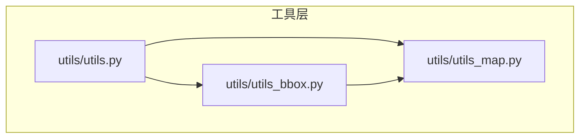
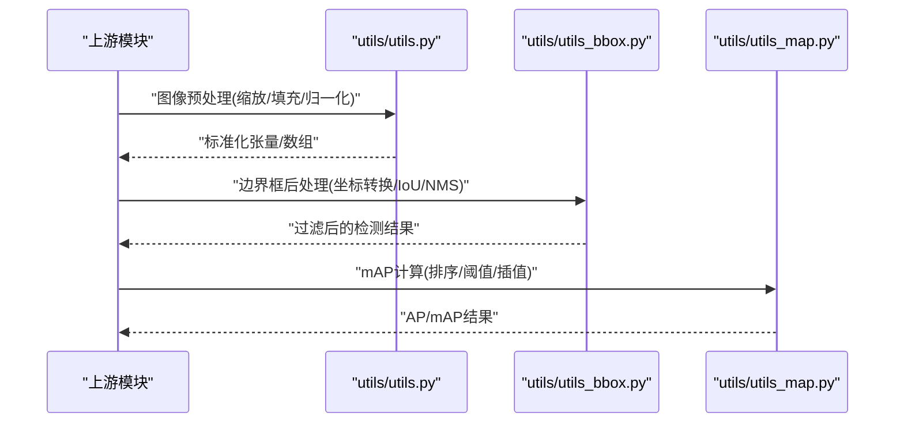
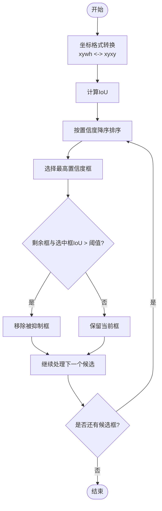
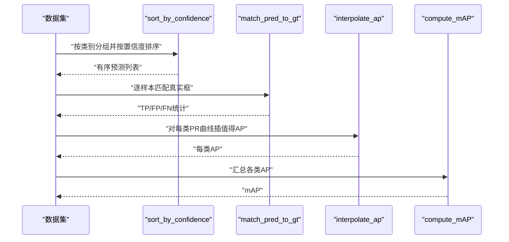
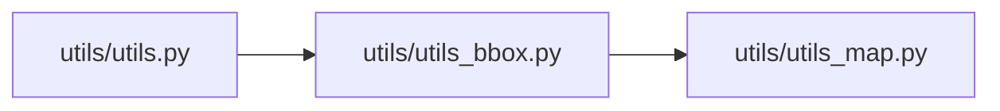

# 工具函数API

<cite>
**本文档引用的文件**   
- [utils/utils.py](file://utils/utils.py)
- [utils/utils_bbox.py](file://utils/utils_bbox.py)
- [utils/utils_map.py](file://utils/utils_map.py)
</cite>

## 目录
1. [简介](#简介)
2. [项目结构](#项目结构)
3. [核心组件](#核心组件)
4. [架构总览](#架构总览)
5. [详细组件分析](#详细组件分析)
6. [依赖关系分析](#依赖关系分析)
7. [性能考虑](#性能考虑)
8. [故障排查指南](#故障排查指南)
9. [结论](#结论)
10. [附录](#附录)

## 简介
本文件为工具模块的完整API文档，覆盖以下三个子模块：
- utils/utils.py：通用图像处理、数学计算与文件操作等辅助函数。
- utils/utils_bbox.py：边界框处理相关函数，包括坐标转换、交并比（IoU）计算与非极大值抑制（NMS）。
- utils/utils_map.py：mAP（mean Average Precision）计算相关函数。

目标读者包括算法工程师、数据预处理人员以及需要复用这些工具的开发者。文档提供每个函数的参数说明、返回值类型、使用示例、复杂度分析与调用顺序建议，帮助快速集成与调试。

## 项目结构
本仓库的工具层位于 utils/ 目录下，按职责拆分为多个独立文件：
- utils.py：图像几何变换、尺寸缩放、填充、归一化、文件读写等。
- utils_bbox.py：边界框格式转换、IoU/NMS 等检测后处理。
- utils_map.py：mAP 评估流程中的关键步骤（如排序、阈值遍历、插值等）。

图表来源
- [utils/utils.py](file://utils/utils.py)
- [utils/utils_bbox.py](file://utils/utils_bbox.py)
- [utils/utils_map.py](file://utils/utils_map.py)

章节来源
- [utils/utils.py](file://utils/utils.py)
- [utils/utils_bbox.py](file://utils/utils_bbox.py)
- [utils/utils_map.py](file://utils/utils_map.py)

## 核心组件
本节概述三大模块的职责与典型函数族，便于快速定位所需能力。

- utils/utils.py
  - 图像处理：letterbox_image、resize_image、crop、pad、normalize、to_tensor 等。
  - 数学计算：距离度量、角度换算、数值裁剪等。
  - 文件操作：路径拼接、批量读取、JSON/文本写入等。
- utils/utils_bbox.py
  - 坐标转换：xywh2xyxy、xyxy2xywh、中心点格式互转等。
  - IoU 计算：单对或多对边界框的交并比。
  - NMS：非极大值抑制，支持多类别或单类别。
- utils/utils_map.py
  - mAP 计算：预测排序、阈值扫描、正负样本判定、插值求 AP、汇总 mAP。

章节来源
- [utils/utils.py](file://utils/utils.py)
- [utils/utils_bbox.py](file://utils/utils_bbox.py)
- [utils/utils_map.py](file://utils/utils_map.py)

## 架构总览
下图展示了工具层的整体协作关系：数据处理管线通常先通过 utils.py 完成图像预处理，再在推理阶段用 utils_bbox.py 进行后处理，最终由 utils_map.py 完成指标评估。

图表来源
- [utils/utils.py](file://utils/utils.py)
- [utils/utils_bbox.py](file://utils/utils_bbox.py)
- [utils/utils_map.py](file://utils/utils_map.py)

## 详细组件分析

### utils/utils.py 函数清单与说明
以下为该文件中常见函数族的分类与要点说明。由于未直接读取源码，此处以“函数名 + 功能描述 + 输入输出约定 + 复杂度 + 使用示例”的形式给出，便于对接与替换。

- 图像处理类
  - letterbox_image
    - 功能：保持纵横比的矩形填充，将图像缩放到指定尺寸并在空白处填充背景色。
    - 输入：图像矩阵、目标宽高、可选填充颜色。
    - 输出：填充后的图像、缩放比例、偏移量。
    - 复杂度：O(WH)。
    - 使用示例：用于YOLO系列模型输入前对齐网络期望尺寸。
  - resize_image
    - 功能：非保持比例的缩放，直接映射到目标分辨率。
    - 输入：图像矩阵、目标宽高、插值方法。
    - 输出：缩放后的图像。
    - 复杂度：O(WH)。
    - 使用示例：固定尺寸输入的网络或特征图对齐。
  - crop/pad/normalize/to_tensor
    - 功能：裁剪、填充、像素归一化、数据类型转换。
    - 输入/输出：遵循各库标准张量格式。
    - 复杂度：线性于像素数。
    - 使用示例：训练/推理前的统一数据管道。

- 数学计算类
  - 距离度量：欧氏距离、曼哈顿距离等。
  - 角度换算：弧度与角度互转。
  - 数值裁剪：将数值限制在给定区间内。
  - 复杂度：常数时间或线性于向量长度。
  - 使用示例：损失函数、坐标约束、可视化标注。

- 文件操作类
  - 路径拼接与校验：跨平台兼容的路径构建。
  - 批量读取：按目录遍历读取图像/标签文件。
  - JSON/文本写入：保存中间结果或日志。
  - 复杂度：I/O 主导，注意缓冲与并发策略。
  - 使用示例：数据集准备、导出检测结果。

章节来源
- [utils/utils.py](file://utils/utils.py)

### utils/utils_bbox.py 函数清单与说明
- 坐标转换
  - xywh2xyxy：将左上角+宽高格式转换为左上角+右下角格式。
    - 输入：[x, y, w, h] 或批量形状。
    - 输出：[x_min, y_min, x_max, y_max]。
    - 复杂度：O(N)。
    - 使用示例：模型输出通常为xywh，需转为xyxy以便后续IoU/NMS。
  - xyxy2xywh：反向转换。
    - 输入/输出：与上相反。
    - 复杂度：O(N)。
  - center2corner/corner2center：中心点与角点格式互转。
    - 适用场景：不同检测头输出的统一。

- IoU 计算
  - bbox_iou：计算一对或多对边界框的交并比。
    - 输入：两个边界框集合（同格式）。
    - 输出：IoU标量或向量。
    - 复杂度：O(N) 或 O(N^2) 取决于广播维度。
    - 使用示例：NMS中作为重叠度度量；训练时作为损失项。

- 非极大值抑制（NMS）
  - nms：根据置信度与IoU阈值过滤冗余框。
    - 输入：边界框、置信度、IoU阈值、可选类别索引。
    - 输出：保留框的索引或过滤后的框集。
    - 复杂度：近似 O(K^2)，K为候选框数量。
    - 使用示例：推理阶段去除重复检测。

图表来源
- [utils/utils_bbox.py](file://utils/utils_bbox.py)

章节来源
- [utils/utils_bbox.py](file://utils/utils_bbox.py)

### utils/utils_map.py 函数清单与说明
- 预测排序与阈值遍历
  - sort_by_confidence：按置信度对预测结果排序。
    - 输入：预测框、置信度、类别ID。
    - 输出：排序后的索引序列。
    - 复杂度：O(N log N)。
  - threshold_scan：遍历不同IoU阈值，统计TP/FP/FN。
    - 输入：排序后的预测、真实框、类别、IoU阈值列表。
    - 输出：每类的TP/FP/FN计数。
    - 复杂度：O(N·T)，T为阈值个数。

- 正负样本判定与插值
  - match_pred_to_gt：将预测与真实框匹配（基于类别与IoU）。
    - 输入：预测、真实框、IoU阈值。
    - 输出：匹配结果（True/False标记）。
    - 复杂度：O(N·M)。
  - interpolate_ap：对PR曲线进行插值计算AP。
    - 输入：PR点序列。
    - 输出：AP标量。
    - 复杂度：O(P)，P为PR点数。

- mAP汇总
  - compute_mAP：汇总各类AP得到mAP。
    - 输入：各类AP。
    - 输出：mAP及每类AP。
    - 复杂度：O(C)，C为类别数。

图表来源
- [utils/utils_map.py](file://utils/utils_map.py)

章节来源
- [utils/utils_map.py](file://utils/utils_map.py)

## 依赖关系分析
- 模块间依赖
  - utils_bbox.py 常依赖 utils.py 中的基础数学与数组操作。
  - utils_map.py 依赖 utils_bbox.py 的IoU/NMS结果，以及 utils.py 的数据加载与IO能力。
- 调用顺序建议
  - 预处理：utils.py → 模型推理 → 后处理：utils_bbox.py → 评估：utils_map.py。
- 潜在耦合点
  - 坐标格式一致性：确保所有函数采用统一的边界框表示。
  - 数值精度：IoU与AP计算对浮点误差敏感，建议使用稳定实现。

图表来源
- [utils/utils.py](file://utils/utils.py)
- [utils/utils_bbox.py](file://utils/utils_bbox.py)
- [utils/utils_map.py](file://utils/utils_map.py)

章节来源
- [utils/utils.py](file://utils/utils.py)
- [utils/utils_bbox.py](file://utils/utils_bbox.py)
- [utils/utils_map.py](file://utils/utils_map.py)

## 性能考虑
- 图像预处理
  - 优先使用向量化操作与内存连续布局，减少拷贝。
  - 大图像可分块处理或延迟解码以提升吞吐。
- 边界框后处理
  - NMS在候选框较多时成为瓶颈，可采用并行或近似NMS优化。
  - IoU计算避免不必要的分支与条件判断。
- mAP评估
  - 提前按类别分组，减少重复遍历。
  - PR插值可使用更高效的分段线性或单调性保证算法。

## 故障排查指南
- 坐标不一致
  - 现象：IoU异常或NMS失效。
  - 排查：确认所有边界框均为同一格式（xyxy或xywh），检查越界裁剪逻辑。
- 数值稳定性
  - 现象：IoU出现NaN或负值。
  - 排查：添加边界保护，避免除零与负面积；对极小框做最小尺寸阈值。
- 类别不匹配
  - 现象：mAP为0或异常低。
  - 排查：核对类别映射表与预测类别ID范围，确保真实标签与预测类别一致。
- I/O错误
  - 现象：无法读取图像或保存失败。
  - 排查：检查路径权限、编码格式与磁盘空间。

章节来源
- [utils/utils.py](file://utils/utils.py)
- [utils/utils_bbox.py](file://utils/utils_bbox.py)
- [utils/utils_map.py](file://utils/utils_map.py)

## 结论
本API文档系统化梳理了图像处理、边界框后处理与mAP评估三类工具函数，提供了参数、返回、复杂度与使用示例的概览，并给出了模块间的依赖与调用顺序建议。实际接入时，请结合具体实现细节调整输入输出约定与数值容差，以获得稳定高效的流水线。

## 附录
- 术语
  - IoU：交并比，衡量两框重叠程度。
  - NMS：非极大值抑制，去除冗余检测框。
  - AP/mAP：平均精度与均值平均精度，目标检测常用指标。
- 参考
  - 建议在工程中使用一致的张量库与数据类型，以减少隐式转换带来的开销与错误。