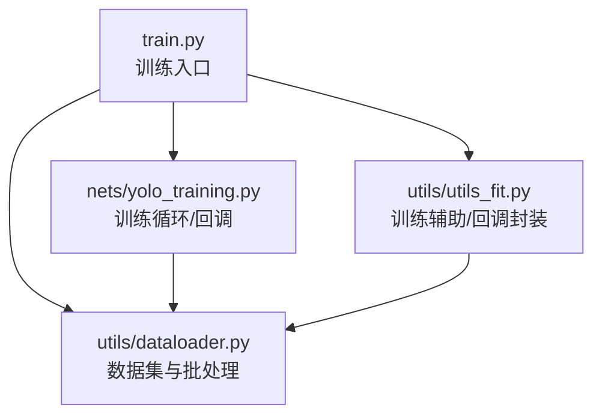
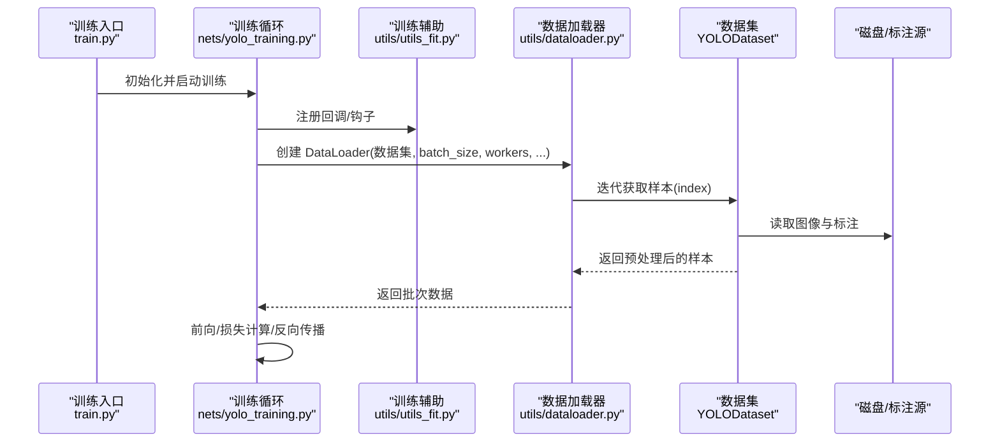
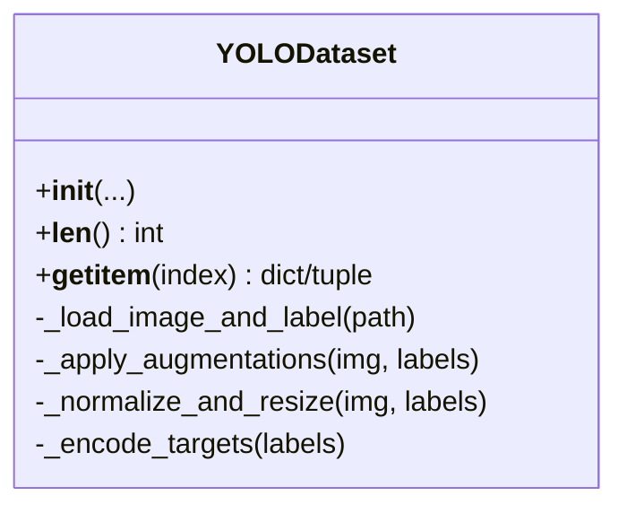
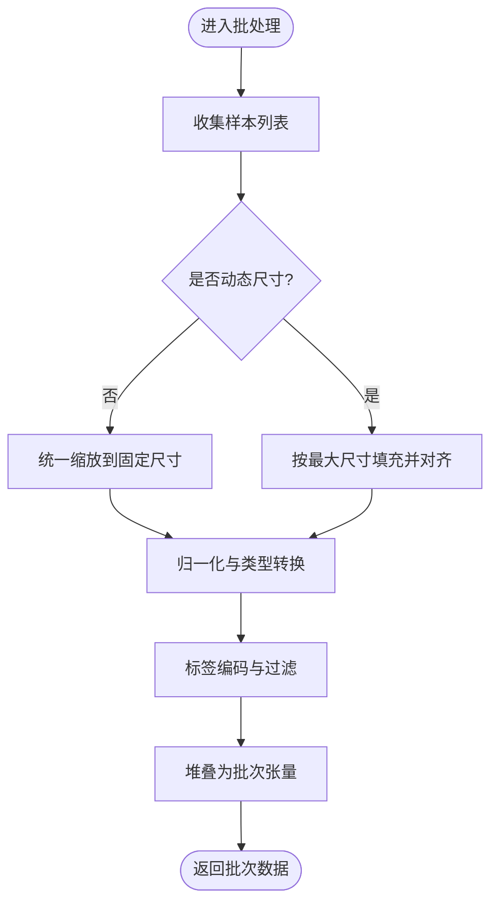
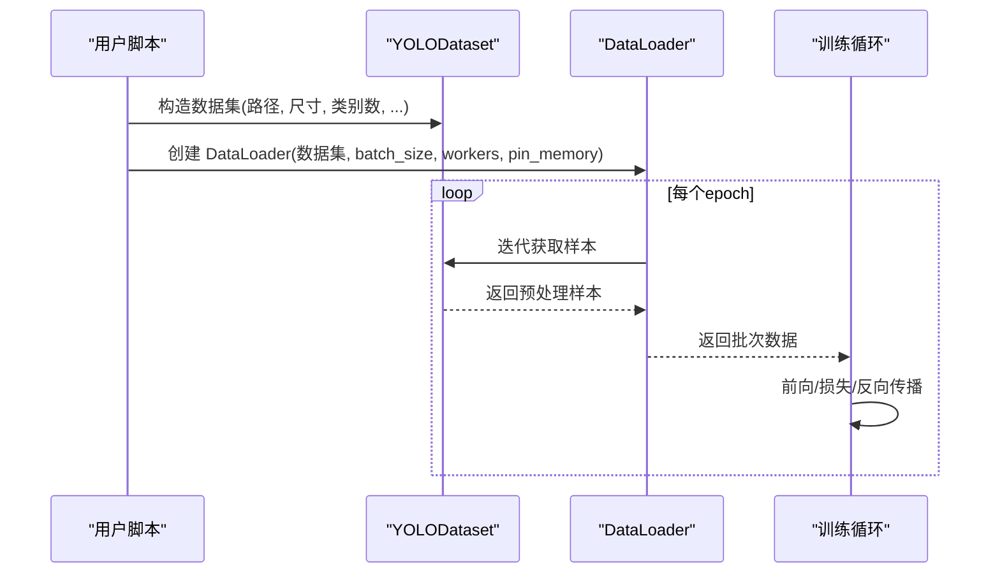
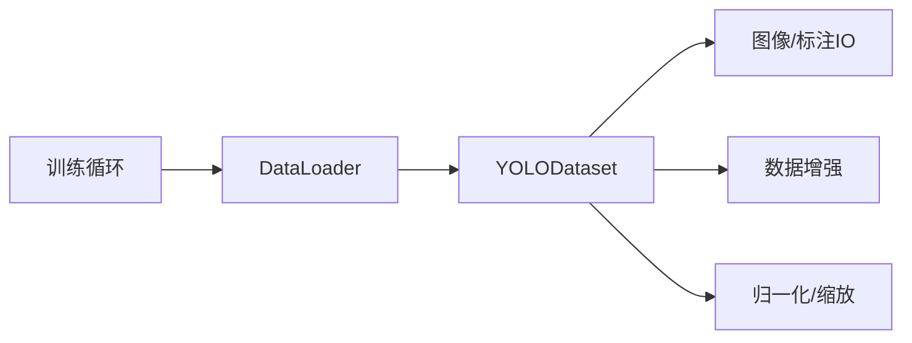

# 数据加载器API

<cite>
**本文引用的文件**   
- [utils/dataloader.py](file://utils/dataloader.py)
- [train.py](file://train.py)
- [nets/yolo_training.py](file://nets/yolo_training.py)
- [utils/utils_fit.py](file://utils/utils_fit.py)
</cite>

## 目录
1. [简介](#简介)
2. [项目结构](#项目结构)
3. [核心组件](#核心组件)
4. [架构总览](#架构总览)
5. [详细组件分析](#详细组件分析)
6. [依赖分析](#依赖分析)
7. [性能考虑](#性能考虑)
8. [故障排查指南](#故障排查指南)
9. [结论](#结论)
10. [附录](#附录)

## 简介
本文件为数据加载器的完整API文档，聚焦于 utils/dataloader.py 中的数据加载类与函数。内容涵盖：
- YOLODataset 类的构造参数、数据预处理方法与批处理逻辑
- 自定义数据集实现指南（继承基类、必要方法、适配不同数据格式）
- 数据增强策略的配置与使用方式
- 多进程数据加载的性能优化建议与内存管理注意事项
- 完整的数据加载示例与常见问题解决方案

## 项目结构
本项目采用按功能模块划分的组织方式，数据加载相关代码位于 utils/dataloader.py；训练流程在 train.py 中编排，训练循环与回调在 nets/yolo_training.py 和 utils/utils_fit.py 中协同工作。

图表来源
- [train.py](file://train.py)
- [nets/yolo_training.py](file://nets/yolo_training.py)
- [utils/utils_fit.py](file://utils/utils_fit.py)
- [utils/dataloader.py](file://utils/dataloader.py)

章节来源
- [train.py](file://train.py)
- [nets/yolo_training.py](file://nets/yolo_training.py)
- [utils/utils_fit.py](file://utils/utils_fit.py)
- [utils/dataloader.py](file://utils/dataloader.py)

## 核心组件
本节对数据加载器中的关键组件进行概览式说明，后续章节将给出更细粒度的API细节与图示。

- 数据集类
  - 负责读取图像与标注、执行数据增强、归一化、尺寸变换、标签编码等预处理步骤
  - 支持单图或批量索引访问，提供 __getitem__ 与 __len__ 接口以兼容 PyTorch DataLoader
- 批处理与打包
  - 将多个样本组合成批次，包含图像张量与对应目标框、类别等结构化输出
  - 支持动态尺寸对齐、填充、掩码等策略（具体以实现为准）
- 数据增强
  - 可选的几何与色彩增强、Mosaic/MixUp 等高级增强（若启用）
  - 通过配置参数控制是否开启及增强强度
- 多进程加载
  - 利用 DataLoader 的 num_workers 与 pin_memory 等选项提升吞吐
  - 注意内存占用与共享内存限制

章节来源
- [utils/dataloader.py](file://utils/dataloader.py)

## 架构总览
下图展示了从训练入口到数据加载的整体调用链与数据流向。

图表来源
- [train.py](file://train.py)
- [nets/yolo_training.py](file://nets/yolo_training.py)
- [utils/utils_fit.py](file://utils/utils_fit.py)
- [utils/dataloader.py](file://utils/dataloader.py)

## 详细组件分析

### YOLODataset 类 API
该类是数据加载的核心，负责将原始图像与标注转换为模型可接受的批次数据。

- 构造参数（常见字段）
  - 根路径与列表文件：用于定位图像与标注文件
  - 输入尺寸：统一图像分辨率
  - 类别数与类别映射：用于标签编码
  - 数据增强开关与强度：如随机翻转、缩放、色彩抖动等
  - 归一化策略：像素值范围、均值方差等
  - 标签格式：边界框坐标体系（如中心宽高 vs 左上右下）、单位（像素/比例）
  - 其他：是否打乱顺序、缓存策略等
- 核心方法
  - __len__: 返回数据集大小
  - __getitem__: 根据索引读取并预处理单个样本，返回字典或元组形式的样本
  - 内部预处理管线：
    - 读取图像与标注
    - 数据增强（几何/色彩/混合增强）
    - 尺寸变换与对齐
    - 归一化与类型转换
    - 标签编码与过滤（无效框剔除、越界修正）
- 批处理逻辑
  - 由外部 DataLoader 调用 __getitem__ 聚合为批次
  - 可能包含：
    - 图像张量堆叠
    - 目标框与类别张量拼接
    - 掩码或权重向量生成（用于忽略区域或加权）
    - 动态尺寸对齐策略（如最大边对齐、固定网格）

图表来源
- [utils/dataloader.py](file://utils/dataloader.py)

章节来源
- [utils/dataloader.py](file://utils/dataloader.py)

### 数据增强策略
- 几何增强
  - 随机水平/垂直翻转
  - 随机旋转、仿射变换
  - 随机裁剪与缩放
- 色彩增强
  - 亮度、对比度、饱和度、色调抖动
  - 灰度转换与通道混洗
- 高级增强（可选）
  - Mosaic：四图拼接
  - MixUp/CutMix：样本混合
- 配置方式
  - 通过构造参数或配置文件启用/关闭增强
  - 设置概率与强度阈值
  - 针对特定任务（小目标检测）调整增强强度

章节来源
- [utils/dataloader.py](file://utils/dataloader.py)

### 批处理与打包
- 输入：来自 __getitem__ 的单个样本
- 输出：批次数据结构，通常包含
  - images: 形状为 [B, C, H, W] 的张量
  - targets: 包含 boxes、labels、scores 等字段的列表或张量
  - masks/weights: 可选的掩码或权重
- 对齐策略
  - 固定尺寸：所有图像缩放到统一分辨率
  - 动态尺寸：按批次内最大尺寸对齐，使用 padding 与 mask
- 标签编码
  - 将绝对坐标转换为相对比例或网格索引
  - 过滤无效框（面积为零、越界等）

图表来源
- [utils/dataloader.py](file://utils/dataloader.py)

章节来源
- [utils/dataloader.py](file://utils/dataloader.py)

### 自定义数据集实现指南
- 继承基类
  - 继承 YOLODataset 或遵循其接口契约（__len__ 与 __getitem__）
- 必要方法
  - __len__: 返回样本总数
  - __getitem__: 返回符合约定格式的样本（图像张量与目标结构）
- 适配不同数据格式
  - 图像格式：JPEG/PNG/TIFF 等
  - 标注格式：VOC XML、COCO JSON、YOLO TXT、自定义 CSV
  - 坐标体系：中心宽高 vs 左上右下；像素 vs 比例
  - 类别映射：字符串到整数 ID 的映射表
- 示例步骤
  - 定义解析器：将原始标注转换为统一结构
  - 重写 __getitem__：按需插入数据增强与后处理
  - 注册新格式：在工厂或配置中声明新的解析器

章节来源
- [utils/dataloader.py](file://utils/dataloader.py)

### 端到端数据加载示例
- 基本用法
  - 实例化数据集对象，传入根路径、列表文件、输入尺寸、类别数等
  - 使用 DataLoader 包装数据集，设置 batch_size、num_workers、pin_memory 等
  - 在训练循环中迭代 DataLoader，获取批次数据并送入模型
- 典型流程
  - 初始化数据集与 DataLoader
  - 遍历批次：images, targets = batch
  - 前向传播与损失计算
  - 反向传播与优化器更新

图表来源
- [train.py](file://train.py)
- [nets/yolo_training.py](file://nets/yolo_training.py)
- [utils/utils_fit.py](file://utils/utils_fit.py)
- [utils/dataloader.py](file://utils/dataloader.py)

章节来源
- [train.py](file://train.py)
- [nets/yolo_training.py](file://nets/yolo_training.py)
- [utils/utils_fit.py](file://utils/utils_fit.py)
- [utils/dataloader.py](file://utils/dataloader.py)

## 依赖分析
- 直接依赖
  - 数据集类依赖图像读取库与标注解析工具
  - 批处理逻辑依赖张量操作与数值归一化工具
- 间接依赖
  - 训练循环依赖 DataLoader 提供的迭代接口
  - 回调与钩子可能在数据加载前后注入日志或监控

图表来源
- [utils/dataloader.py](file://utils/dataloader.py)
- [train.py](file://train.py)
- [nets/yolo_training.py](file://nets/yolo_training.py)
- [utils/utils_fit.py](file://utils/utils_fit.py)

章节来源
- [utils/dataloader.py](file://utils/dataloader.py)
- [train.py](file://train.py)
- [nets/yolo_training.py](file://nets/yolo_training.py)
- [utils/utils_fit.py](file://utils/utils_fit.py)

## 性能考虑
- 多进程加载
  - 合理设置 num_workers：通常为 CPU 核心数的 1/2 到 1 倍
  - 避免过大的 batch_size 导致内存溢出
  - 使用 pin_memory=True 加速 GPU 传输（需确保数据在主机内存）
- I/O 优化
  - 预取与缓存：对频繁访问的小文件启用缓存
  - 并行解码：使用多线程或多进程解码图像
  - 存储格式：优先使用高效格式（如 JPEG），必要时使用 LMDB/HDF5
- 内存管理
  - 及时释放中间变量，避免持有大对象引用
  - 使用生成器或惰性加载减少峰值内存
  - 监控共享内存与进程间通信开销
- 数据增强
  - 将昂贵增强放在 GPU 或使用轻量级CPU实现
  - 对验证集禁用增强以提升评估速度

[本节为通用指导，不直接分析具体文件]

## 故障排查指南
- 常见错误
  - 索引越界：检查数据集长度与索引范围
  - 标注缺失或格式错误：校验标注文件完整性与坐标体系
  - 内存不足：降低 batch_size、workers 或启用缓存
  - 数据不一致：确认类别映射与标签编码一致
- 调试技巧
  - 打印样本形状与标签统计
  - 逐步禁用增强以定位问题
  - 使用最小复现数据集快速验证
- 恢复策略
  - 断点续训：保存 DataLoader 状态与随机种子
  - 回滚到稳定版本的数据增强配置

章节来源
- [utils/dataloader.py](file://utils/dataloader.py)

## 结论
本API文档系统梳理了数据加载器的核心组件与使用方法，提供了从类接口到批处理逻辑的详细说明，并给出了自定义数据集与性能优化的实践建议。通过遵循本文档的指引，用户可以快速搭建稳定高效的数据加载流水线，适配多种数据格式与增强策略，并在大规模训练中保持良好的吞吐与稳定性。

[本节为总结性内容，不直接分析具体文件]

## 附录
- 术语表
  - 数据增强：对原始数据进行随机变换以提升模型鲁棒性
  - 批处理：将多个样本组合为一个批次进行并行处理
  - 归一化：将像素值缩放到指定范围或标准化分布
- 参考链接
  - 训练入口与训练循环文件位置见项目结构

[本节为补充信息，不直接分析具体文件]