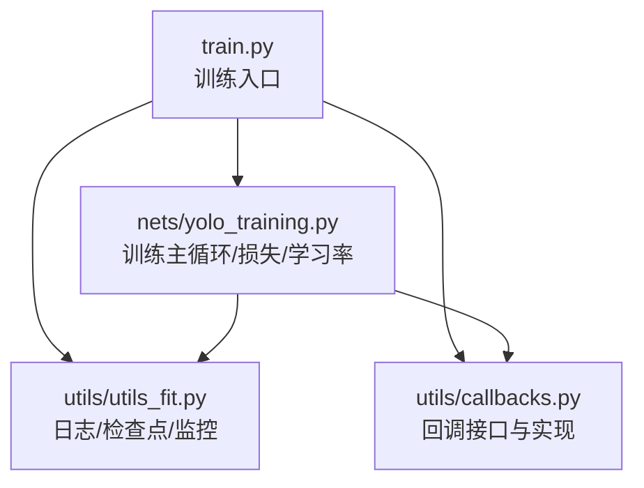
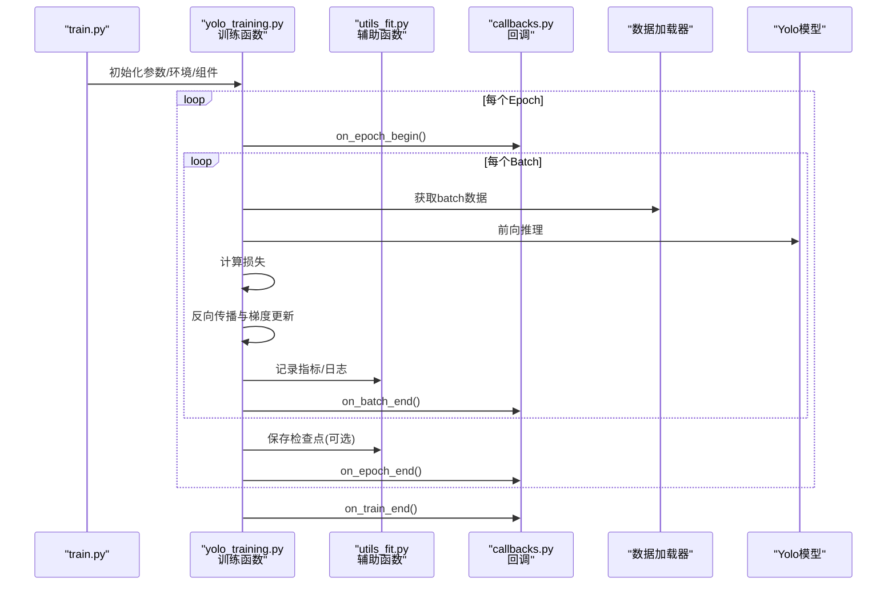
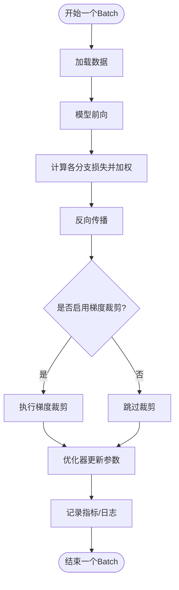
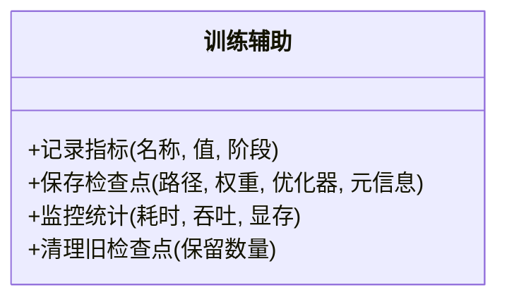
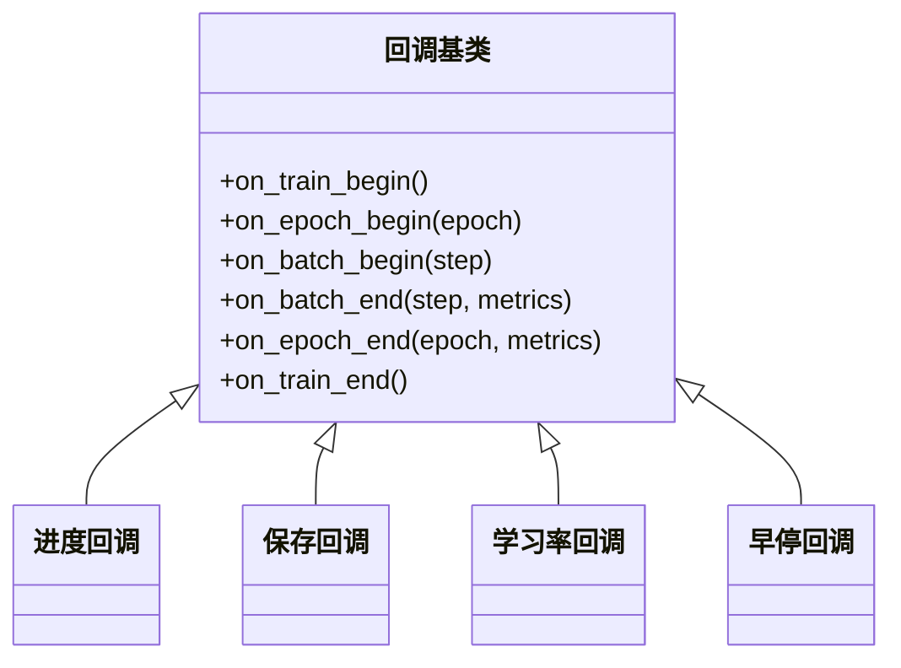
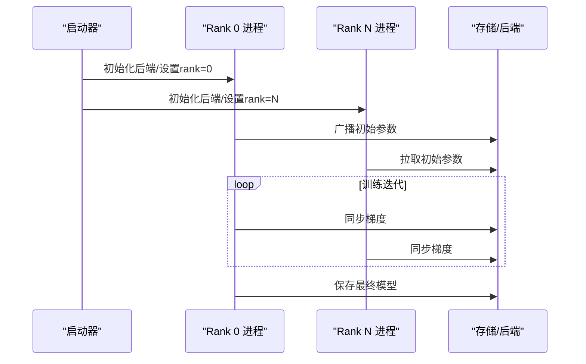
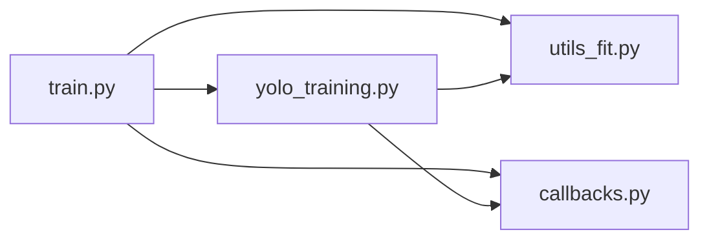

# 训练相关API

<cite>
**本文引用的文件**   
- [nets/yolo_training.py](file://nets/yolo_training.py)
- [utils/utils_fit.py](file://utils/utils_fit.py)
- [utils/callbacks.py](file://utils/callbacks.py)
- [train.py](file://train.py)
</cite>

## 目录
1. [简介](#简介)
2. [项目结构](#项目结构)
3. [核心组件](#核心组件)
4. [架构总览](#架构总览)
5. [详细组件分析](#详细组件分析)
6. [依赖关系分析](#依赖关系分析)
7. [性能考虑](#性能考虑)
8. [故障排查指南](#故障排查指南)
9. [结论](#结论)
10. [附录](#附录)

## 简介
本文件面向使用本项目进行目标检测模型训练的开发者，聚焦“训练相关API”的完整说明。内容覆盖：
- nets/yolo_training.py 中的训练函数与损失计算函数（训练循环、梯度更新、学习率调度）
- utils/utils_fit.py 的训练辅助函数（日志记录、检查点保存、性能监控）
- utils/callbacks.py 的回调接口（训练进度回调、模型保存回调、自定义回调实现方法）
- 分布式训练的API支持与配置选项
- 训练过程中的调试技巧与性能优化建议

## 项目结构
围绕训练相关的代码主要分布在以下模块：
- nets/yolo_training.py：封装Yolo模型的训练流程、损失计算、学习率策略等
- utils/utils_fit.py：提供训练辅助工具（日志、检查点、指标统计等）
- utils/callbacks.py：定义回调接口及常用回调实现
- train.py：训练入口脚本，负责参数解析、环境初始化、调用训练函数

图表来源
- [train.py](file://train.py)
- [nets/yolo_training.py](file://nets/yolo_training.py)
- [utils/utils_fit.py](file://utils/utils_fit.py)
- [utils/callbacks.py](file://utils/callbacks.py)

章节来源
- [train.py](file://train.py)
- [nets/yolo_training.py](file://nets/yolo_training.py)
- [utils/utils_fit.py](file://utils/utils_fit.py)
- [utils/callbacks.py](file://utils/callbacks.py)

## 核心组件
本节概述训练相关API的职责边界与交互方式，便于快速定位与理解整体流程。

- nets/yolo_training.py
  - 训练主循环：迭代数据加载器，执行前向、损失计算、反向传播与参数更新
  - 损失计算：按多尺度输出分支聚合各类损失项（分类、回归、置信度等）
  - 学习率调度：支持多种调度策略（如余弦退火、阶梯下降等），在epoch或step级别更新
  - 可选功能：梯度裁剪、混合精度、EMA权重平滑等

- utils/utils_fit.py
  - 日志记录：训练指标写入TensorBoard/CSV/控制台
  - 检查点保存：周期性保存最佳/最新权重与优化器状态
  - 性能监控：计时、吞吐统计、显存占用采样

- utils/callbacks.py
  - 回调基类与事件钩子：on_epoch_begin/on_batch_end/on_train_end等
  - 内置回调：进度打印、模型保存、学习率调整、早停等
  - 扩展机制：用户可继承基类实现自定义逻辑

- train.py
  - 参数解析与配置合并
  - 设备与分布式环境初始化
  - 构建数据集、模型、优化器、学习率调度器
  - 调用训练函数并管理生命周期

章节来源
- [nets/yolo_training.py](file://nets/yolo_training.py)
- [utils/utils_fit.py](file://utils/utils_fit.py)
- [utils/callbacks.py](file://utils/callbacks.py)
- [train.py](file://train.py)

## 架构总览
下图展示了训练入口到核心训练函数的调用链以及辅助模块的协作关系。

图表来源
- [train.py](file://train.py)
- [nets/yolo_training.py](file://nets/yolo_training.py)
- [utils/utils_fit.py](file://utils/utils_fit.py)
- [utils/callbacks.py](file://utils/callbacks.py)

## 详细组件分析

### 训练主循环与损失计算（nets/yolo_training.py）
- 训练循环要点
  - Epoch/Batch级控制流清晰，支持断点续训（恢复优化器状态与随机种子）
  - 每步执行：数据准备→前向→损失→反向→更新→记录
  - 支持梯度累积以模拟更大批大小
- 损失计算
  - 多尺度输出分别计算分类、回归、置信度损失并按比例加权求和
  - 支持标签平滑、正负样本平衡等策略
- 学习率调度
  - 支持按步长或按轮次更新，常见策略包括线性预热、余弦退火、阶梯衰减
  - 可与Warmup结合，提升初期稳定性
- 其他特性
  - 梯度裁剪防止爆炸
  - 混合精度加速训练（可选）
  - EMA平滑权重用于验证/测试

图表来源
- [nets/yolo_training.py](file://nets/yolo_training.py)

章节来源
- [nets/yolo_training.py](file://nets/yolo_training.py)

### 训练辅助函数（utils/utils_fit.py）
- 日志记录
  - 统一接口将标量指标写入TensorBoard与CSV，支持按epoch/batch粒度
  - 提供控制台格式化输出，便于快速观察训练动态
- 检查点保存
  - 支持保存最佳权重（基于指定指标）、最近权重、以及包含优化器状态的完整快照
  - 自动清理旧检查点，保留Top-K
- 性能监控
  - 记录每步耗时、吞吐（样本/秒）、GPU显存峰值
  - 可选采样策略降低开销

图表来源
- [utils/utils_fit.py](file://utils/utils_fit.py)

章节来源
- [utils/utils_fit.py](file://utils/utils_fit.py)

### 回调接口与实现（utils/callbacks.py）
- 回调基类
  - 定义标准事件钩子：on_train_begin、on_epoch_begin、on_batch_begin、on_batch_end、on_epoch_end、on_train_end
  - 提供上下文访问（当前epoch、step、指标字典等）
- 内置回调
  - 进度回调：打印剩余时间、平均耗时、关键指标
  - 保存回调：根据指标阈值保存最佳模型
  - 学习率回调：配合调度器打印当前lr
  - 早停回调：当指标长时间不提升时提前终止
- 自定义回调
  - 继承基类并重写所需钩子
  - 通过回调管理器注册，按需启用/禁用

图表来源
- [utils/callbacks.py](file://utils/callbacks.py)

章节来源
- [utils/callbacks.py](file://utils/callbacks.py)

### 分布式训练API与配置
- 启动方式
  - 单卡：直接运行训练入口
  - 多卡：通过进程并行或线程并行启动多个训练实例，各自绑定不同GPU
- 通信后端
  - 支持NCCL（推荐，多机多卡）与Gloo（CPU/跨平台）
- 关键配置项
  - 进程数/节点数、本地rank、世界大小、后端地址与端口
  - 同步策略：全参同步（DistributedDataParallel风格）
- 注意事项
  - 确保数据加载器对每个rank独立采样，避免重复/遗漏
  - 检查点保存需仅由rank 0执行，避免并发写冲突
  - 日志与指标汇总建议在rank 0集中处理

图表来源
- [train.py](file://train.py)
- [nets/yolo_training.py](file://nets/yolo_training.py)

章节来源
- [train.py](file://train.py)
- [nets/yolo_training.py](file://nets/yolo_training.py)

## 依赖关系分析
训练相关模块之间的依赖如下：
- train.py 作为入口，依赖训练函数、辅助函数与回调
- yolo_training.py 依赖模型、数据加载器、优化器、学习率调度器与辅助函数
- utils_fit.py 被训练函数与回调共同复用
- callbacks.py 为通用接口，被训练函数与外部脚本共同使用

图表来源
- [train.py](file://train.py)
- [nets/yolo_training.py](file://nets/yolo_training.py)
- [utils/utils_fit.py](file://utils/utils_fit.py)
- [utils/callbacks.py](file://utils/callbacks.py)

章节来源
- [train.py](file://train.py)
- [nets/yolo_training.py](file://nets/yolo_training.py)
- [utils/utils_fit.py](file://utils/utils_fit.py)
- [utils/callbacks.py](file://utils/callbacks.py)

## 性能考虑
- 数据I/O
  - 使用多线程/多进程数据加载，合理设置prefetch与缓存
  - 图像预处理尽量向量化，减少Python层循环
- 计算加速
  - 启用混合精度（FP16/BF16）与算子融合
  - 使用梯度累积扩大有效批大小
- 内存与显存
  - 及时释放中间变量，避免不必要的副本
  - 监控显存峰值，必要时减小输入分辨率或批大小
- 分布式
  - 优先选择NCCL后端；合理设置allreduce桶大小
  - 仅rank 0写磁盘，避免IO竞争
- 监控与调优
  - 利用TensorBoard可视化loss曲线、学习率、吞吐
  - 针对瓶颈步骤（数据/前向/反向/同步）逐一优化

[本节为通用指导，无需特定文件引用]

## 故障排查指南
- 常见问题
  - 显存溢出：降低批大小、关闭某些增强、启用梯度累积
  - 训练不收敛：检查学习率与Warmup、确认标签格式与损失权重
  - 分布式死锁：确认所有rank均参与同步，检查通信后端配置
  - 检查点损坏：校验完整性，仅从rank 0恢复
- 诊断手段
  - 开启详细日志与指标记录，定位异常epoch/batch
  - 使用可视化工具观察loss突变与梯度范数
  - 逐步关闭回调与监控，缩小问题范围

章节来源
- [utils/utils_fit.py](file://utils/utils_fit.py)
- [utils/callbacks.py](file://utils/callbacks.py)
- [nets/yolo_training.py](file://nets/yolo_training.py)

## 结论
本训练API体系以清晰的职责划分与可扩展的回调机制为核心，兼顾易用性与高性能。通过合理的配置与优化策略，可在单机或多机环境下稳定高效地完成训练任务。建议在生产环境中结合监控与日志完善可观测性，并建立规范的检查点管理与回滚策略。

[本节为总结性内容，无需特定文件引用]

## 附录
- 术语
  - 检查点：包含模型权重与优化器状态的存档，用于恢复训练
  - 回调：在训练生命周期中触发的事件处理器
  - 学习率调度：按策略动态调整学习率的机制
- 参考入口
  - 训练入口脚本：train.py
  - 训练主循环与损失：nets/yolo_training.py
  - 辅助函数：utils/utils_fit.py
  - 回调接口：utils/callbacks.py

[本节为补充说明，无需特定文件引用]