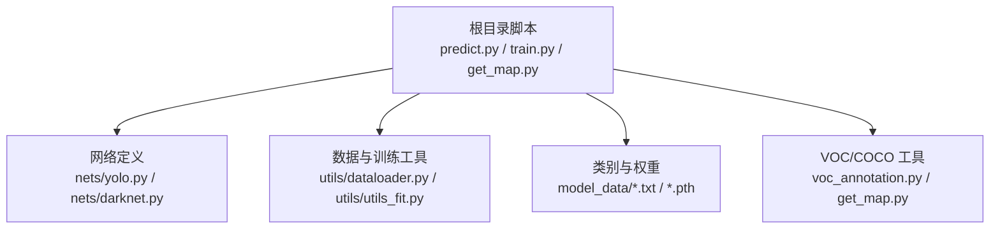
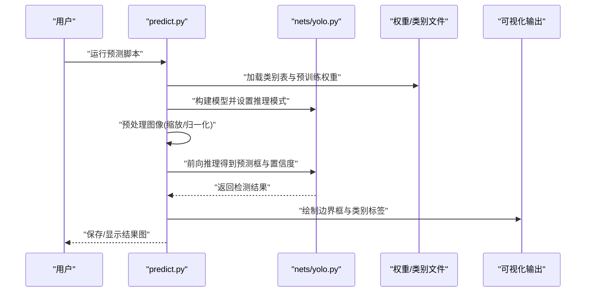
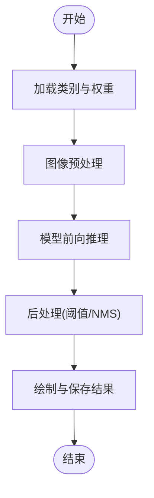
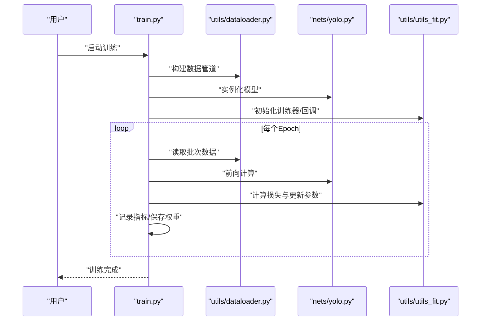
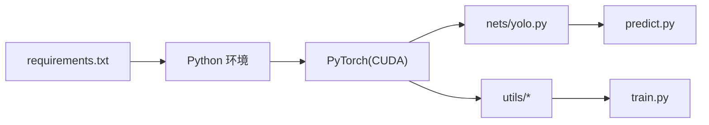

# 快速开始

<cite>
**本文引用的文件**   
- [README.md](file://README.md)
- [requirements.txt](file://requirements.txt)
- [predict.py](file://predict.py)
- [train.py](file://train.py)
- [yolo.py](file://yolo.py)
- [nets/yolo.py](file://nets/yolo.py)
- [nets/darknet.py](file://nets/darknet.py)
- [utils/dataloader.py](file://utils/dataloader.py)
- [utils/utils_fit.py](file://utils/utils_fit.py)
- [voc_annotation.py](file://voc_annotation.py)
- [get_map.py](file://get_map.py)
- [model_data/coco_classes.txt](file://model_data/coco_classes.txt)
- [model_data/voc_classes.txt](file://model_data/voc_classes.txt)
</cite>

## 目录
1. [简介](#简介)
2. [项目结构](#项目结构)
3. [核心组件](#核心组件)
4. [架构总览](#架构总览)
5. [详细组件分析](#详细组件分析)
6. [依赖关系分析](#依赖关系分析)
7. [性能与硬件建议](#性能与硬件建议)
8. [故障排除指南](#故障排除指南)
9. [结论](#结论)
10. [附录：常用命令速查](#附录常用命令速查)

## 简介
本指南面向初次接触 TogetherNet 的用户，目标是在 30 分钟内完成环境搭建、使用预训练模型进行单张图片预测，并跑通一个最小化的训练流程。TogetherNet 基于 YOLO 系列目标检测框架，提供数据加载、训练、推理与 mAP 评估等完整能力，支持 COCO/VOC 等常见数据集格式。

## 项目结构
仓库采用“功能分层 + 工具复用”的组织方式：
- 根目录脚本：入口与任务脚本（预测、训练、mAP 计算、标注转换等）
- nets：网络结构与训练逻辑
- utils：数据加载、训练辅助、边界框处理、可视化等工具
- model_data：类别名与权重存放
- VOCdevkit/RTTStest：示例数据与测试集

图表来源
- [predict.py:1-50](file://predict.py#L1-L50)
- [train.py:1-50](file://train.py#L1-L50)
- [nets/yolo.py:1-50](file://nets/yolo.py#L1-L50)
- [utils/dataloader.py:1-50](file://utils/dataloader.py#L1-L50)
- [utils/utils_fit.py:1-50](file://utils/utils_fit.py#L1-L50)

章节来源
- [README.md:1-100](file://README.md#L1-L100)

## 核心组件
- 推理入口 predict.py：加载预训练权重与类别表，对单张图像进行前向推理，输出检测结果与可视化结果。
- 训练入口 train.py：读取配置与数据路径，构建 DataLoader 与模型，执行训练循环与日志记录。
- 网络模块 nets/yolo.py、nets/darknet.py：YOLO 主干与检测头实现。
- 数据与训练工具 utils/dataloader.py、utils/utils_fit.py：数据管道、损失计算、训练回调等。
- 标注与评测 voc_annotation.py、get_map.py：VOC 标注转换与 mAP 计算。

章节来源
- [predict.py:1-120](file://predict.py#L1-L120)
- [train.py:1-120](file://train.py#L1-L120)
- [nets/yolo.py:1-120](file://nets/yolo.py#L1-L120)
- [nets/darknet.py:1-120](file://nets/darknet.py#L1-L120)
- [utils/dataloader.py:1-120](file://utils/dataloader.py#L1-L120)
- [utils/utils_fit.py:1-120](file://utils/utils_fit.py#L1-L120)
- [voc_annotation.py:1-120](file://voc_annotation.py#L1-L120)
- [get_map.py:1-120](file://get_map.py#L1-L120)

## 架构总览
下图展示了从输入到输出的端到端流程，以及训练时的关键交互。

图表来源
- [predict.py:1-120](file://predict.py#L1-L120)
- [nets/yolo.py:1-120](file://nets/yolo.py#L1-L120)

## 详细组件分析

### 推理流程（predict.py）
- 主要职责
  - 解析命令行参数（图像路径、权重路径、类别表、阈值等）
  - 加载类别名称与预训练权重
  - 图像预处理（尺寸调整、通道顺序、归一化）
  - 调用模型进行推理，后处理（NMS、阈值过滤）
  - 可视化并保存结果
- 关键依赖
  - 网络定义：nets/yolo.py
  - 类别文件：model_data/*.txt
  - 权重文件：由参数指定或默认路径
- 典型用法
  - 单图预测：通过命令行传入图片路径与权重路径
  - 自定义阈值：通过参数控制置信度与 IoU 阈值
  - 输出位置：默认保存在 img_out 或指定目录

图表来源
- [predict.py:1-120](file://predict.py#L1-L120)

章节来源
- [predict.py:1-120](file://predict.py#L1-L120)
- [model_data/coco_classes.txt:1-20](file://model_data/coco_classes.txt#L1-L20)
- [model_data/voc_classes.txt:1-20](file://model_data/voc_classes.txt#L1-L20)

### 训练流程（train.py）
- 主要职责
  - 解析训练参数（数据集路径、batch size、学习率、epoch、设备选择等）
  - 初始化模型与优化器
  - 构建 DataLoader 与数据增强
  - 训练循环：前向、损失计算、反向传播、验证与保存
  - 日志与可视化（可选）
- 关键依赖
  - 数据加载：utils/dataloader.py
  - 训练辅助：utils/utils_fit.py
  - 网络定义：nets/yolo.py
- 典型用法
  - 首次训练：准备 VOC/COCO 数据，运行训练脚本
  - 继续训练：指定上次训练的权重路径
  - 多卡训练：根据环境配置并行策略

图表来源
- [train.py:1-120](file://train.py#L1-L120)
- [utils/dataloader.py:1-120](file://utils/dataloader.py#L1-L120)
- [nets/yolo.py:1-120](file://nets/yolo.py#L1-L120)
- [utils/utils_fit.py:1-120](file://utils/utils_fit.py#L1-L120)

章节来源
- [train.py:1-120](file://train.py#L1-L120)
- [utils/dataloader.py:1-120](file://utils/dataloader.py#L1-L120)
- [utils/utils_fit.py:1-120](file://utils/utils_fit.py#L1-L120)
- [nets/yolo.py:1-120](file://nets/yolo.py#L1-L120)

### 数据与标注（voc_annotation.py）
- 作用：将原始 VOC 格式转换为训练所需的 XML/JSON 或内部格式
- 关键点：类别映射、边界框坐标规范、划分训练/验证集
- 适用场景：从零开始准备 VOC 风格数据集

章节来源
- [voc_annotation.py:1-120](file://voc_annotation.py#L1-L120)

### mAP 评估（get_map.py）
- 作用：在验证集上计算 mAP，用于衡量检测精度
- 输入：预测结果与真实标注
- 输出：各类别 AP 与总体 mAP

章节来源
- [get_map.py:1-120](file://get_map.py#L1-L120)

## 依赖关系分析
- 外部依赖
  - Python 包：见 requirements.txt
  - CUDA/GPU：若启用 GPU 加速，需安装对应版本的 PyTorch CUDA 版本
- 内部依赖
  - predict.py 依赖 nets/yolo.py、model_data/*.txt
  - train.py 依赖 utils/dataloader.py、utils/utils_fit.py、nets/yolo.py
  - voc_annotation.py 与 get_map.py 为数据与评测工具

图表来源
- [requirements.txt:1-50](file://requirements.txt#L1-L50)
- [nets/yolo.py:1-50](file://nets/yolo.py#L1-L50)
- [utils/dataloader.py:1-50](file://utils/dataloader.py#L1-L50)
- [utils/utils_fit.py:1-50](file://utils/utils_fit.py#L1-L50)
- [predict.py:1-50](file://predict.py#L1-L50)
- [train.py:1-50](file://train.py#L1-L50)

章节来源
- [requirements.txt:1-50](file://requirements.txt#L1-L50)

## 性能与硬件建议
- CPU 推理：适合小图与低并发；速度较慢
- GPU 推理：推荐 NVIDIA GPU + CUDA 驱动；显著提升吞吐
- 显存占用：与输入分辨率、batch size、模型大小相关；可调节以适配显存
- 数据 I/O：建议使用 SSD 与多线程数据加载

[本节为通用建议，不直接分析具体文件]

## 故障排除指南
- 找不到权重或类别文件
  - 检查权重路径与类别表路径是否正确
  - 确认 model_data 目录下存在对应类别文件
- CUDA 不可用或版本不匹配
  - 确认已安装与 PyTorch 匹配的 CUDA 驱动
  - 使用 pip 安装带 CUDA 的 PyTorch 版本
- 内存不足
  - 降低 batch size 或输入分辨率
  - 关闭不必要的进程
- 数据格式错误
  - 使用 voc_annotation.py 重新生成标注
  - 检查边界框坐标范围与类别 ID 映射

章节来源
- [predict.py:1-120](file://predict.py#L1-L120)
- [train.py:1-120](file://train.py#L1-L120)
- [voc_annotation.py:1-120](file://voc_annotation.py#L1-L120)

## 结论
通过本指南，你可以在 30 分钟内完成 TogetherNet 的环境搭建、单图推理与最小化训练流程。建议先使用官方提供的预训练权重与示例数据验证环境，再逐步替换为自己的数据与参数。

[本节为总结性内容，不直接分析具体文件]

## 附录：常用命令速查
- 安装依赖
  - 使用 requirements.txt 安装所需 Python 包
- 单图预测
  - 通过 predict.py 传入图片路径、权重路径与类别表路径
- 开始训练
  - 通过 train.py 配置数据集路径、batch size、学习率等参数
- 计算 mAP
  - 使用 get_map.py 在验证集上评估

章节来源
- [requirements.txt:1-50](file://requirements.txt#L1-L50)
- [predict.py:1-120](file://predict.py#L1-L120)
- [train.py:1-120](file://train.py#L1-L120)
- [get_map.py:1-120](file://get_map.py#L1-L120)