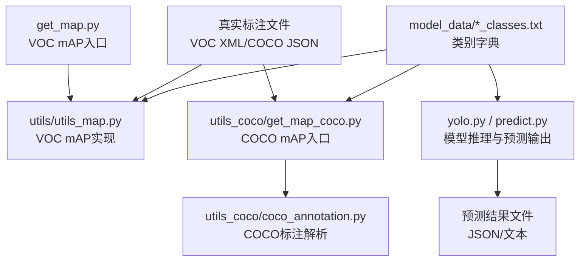
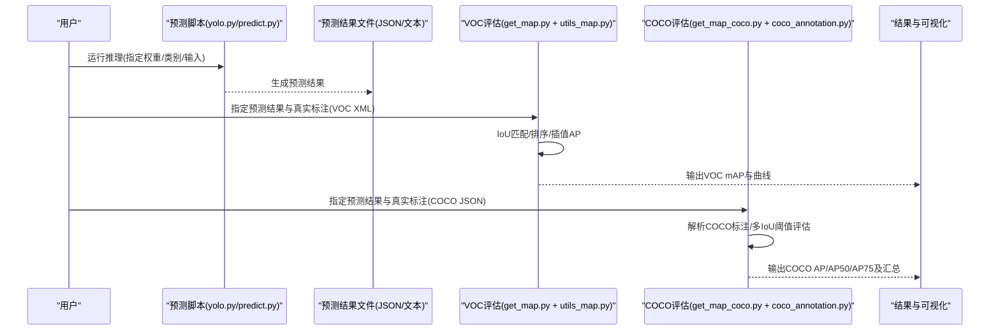
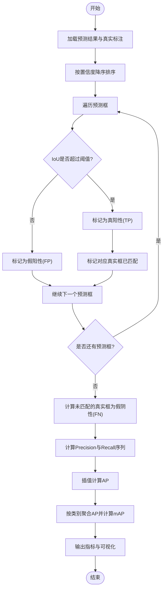
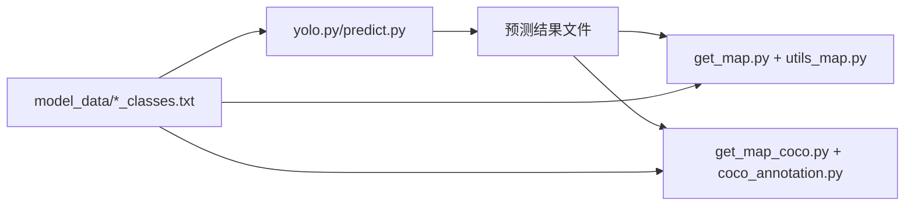

# 性能评估

<cite>
**本文引用的文件**   
- [README.md](file://README.md)
- [get_map.py](file://get_map.py)
- [utils/utils_map.py](file://utils/utils_map.py)
- [utils_coco/get_map_coco.py](file://utils_coco/get_map_coco.py)
- [utils_coco/coco_annotation.py](file://utils_coco/coco_annotation.py)
- [yolo.py](file://yolo.py)
- [predict.py](file://predict.py)
- [nets/yolo.py](file://nets/yolo.py)
- [model_data/rtts_classes.txt](file://model_data/rtts_classes.txt)
- [model_data/voc_classes.txt](file://model_data/voc_classes.txt)
- [model_data/coco_classes.txt](file://model_data/coco_classes.txt)
</cite>

## 目录
1. [简介](#简介)
2. [项目结构](#项目结构)
3. [核心组件](#核心组件)
4. [架构总览](#架构总览)
5. [详细组件分析](#详细组件分析)
6. [依赖关系分析](#依赖关系分析)
7. [性能考量](#性能考量)
8. [故障排查指南](#故障排查指南)
9. [结论](#结论)
10. [附录](#附录)

## 简介
本文件面向TogetherNet项目的性能评估，重点围绕mAP（mean Average Precision）计算原理、COCO与VOC评估标准、预测结果与真实标注的格式要求、精度-召回曲线绘制与分析、可视化与报告生成、模型对比与版本迭代评估方法，以及常见问题诊断与解决方案进行系统化说明。文档旨在帮助读者在不深入源码细节的前提下，也能正确完成评估并解读结果。

## 项目结构
本项目在评估相关代码上采用分层组织：
- 顶层入口脚本：提供一键式mAP计算流程与参数配置
- VOC风格评估工具：基于传统PASCAL VOC标准的mAP计算与可视化
- COCO风格评估工具：遵循COCO官方评测协议，支持多IoU阈值与类别聚合
- 模型推理与预测：用于生成符合要求的预测结果文件
- 类别字典：存放不同数据集的类别名称映射

图表来源
- [get_map.py:1-200](file://get_map.py#L1-L200)
- [utils/utils_map.py:1-300](file://utils/utils_map.py#L1-L300)
- [utils_coco/get_map_coco.py:1-200](file://utils_coco/get_map_coco.py#L1-L200)
- [utils_coco/coco_annotation.py:1-200](file://utils_coco/coco_annotation.py#L1-L200)
- [yolo.py:1-200](file://yolo.py#L1-L200)
- [predict.py:1-200](file://predict.py#L1-L200)
- [model_data/rtts_classes.txt](file://model_data/rtts_classes.txt)
- [model_data/voc_classes.txt](file://model_data/voc_classes.txt)
- [model_data/coco_classes.txt](file://model_data/coco_classes.txt)

章节来源
- [README.md:1-200](file://README.md#L1-L200)
- [get_map.py:1-200](file://get_map.py#L1-L200)
- [utils/utils_map.py:1-300](file://utils/utils_map.py#L1-L300)
- [utils_coco/get_map_coco.py:1-200](file://utils_coco/get_map_coco.py#L1-L200)
- [utils_coco/coco_annotation.py:1-200](file://utils_coco/coco_annotation.py#L1-L200)
- [yolo.py:1-200](file://yolo.py#L1-L200)
- [predict.py:1-200](file://predict.py#L1-L200)
- [model_data/rtts_classes.txt](file://model_data/rtts_classes.txt)
- [model_data/voc_classes.txt](file://model_data/voc_classes.txt)
- [model_data/coco_classes.txt](file://model_data/coco_classes.txt)

## 核心组件
- VOC风格mAP评估
  - 入口脚本：负责读取预测结果与真实标注，调用内部工具计算AP/mAP，并输出统计与可视化
  - 工具模块：实现IoU匹配、排序、插值AP计算、类别聚合与绘图
- COCO风格mAP评估
  - 入口脚本：遵循COCO评测协议，支持多IoU阈值（如0.50~0.95步进）、不同面积区间与类别聚合
  - 标注解析：将COCO JSON转换为内部结构，供评估器使用
- 模型推理与预测
  - 推理脚本：加载权重与类别字典，对测试集进行前向推理，输出统一格式的预测结果文件
  - 预测格式：包含图像ID、类别索引或名称、置信度、边界框坐标等字段
- 类别字典
  - 为VOC、COCO与RTTS等不同数据集提供类别名称到索引的映射，确保评估时类别一致性

章节来源
- [get_map.py:1-200](file://get_map.py#L1-L200)
- [utils/utils_map.py:1-300](file://utils/utils_map.py#L1-L300)
- [utils_coco/get_map_coco.py:1-200](file://utils_coco/get_map_coco.py#L1-L200)
- [utils_coco/coco_annotation.py:1-200](file://utils_coco/coco_annotation.py#L1-L200)
- [yolo.py:1-200](file://yolo.py#L1-L200)
- [predict.py:1-200](file://predict.py#L1-L200)
- [model_data/rtts_classes.txt](file://model_data/rtts_classes.txt)
- [model_data/voc_classes.txt](file://model_data/voc_classes.txt)
- [model_data/coco_classes.txt](file://model_data/coco_classes.txt)

## 架构总览
下图展示了从“模型推理”到“评估指标计算与可视化”的整体流程，涵盖VOC与COCO两条路径。

图表来源
- [yolo.py:1-200](file://yolo.py#L1-L200)
- [predict.py:1-200](file://predict.py#L1-L200)
- [get_map.py:1-200](file://get_map.py#L1-L200)
- [utils/utils_map.py:1-300](file://utils/utils_map.py#L1-L300)
- [utils_coco/get_map_coco.py:1-200](file://utils_coco/get_map_coco.py#L1-L200)
- [utils_coco/coco_annotation.py:1-200](file://utils_coco/coco_annotation.py#L1-L200)

## 详细组件分析

### mAP计算原理与指标含义
- 基本概念
  - 精确率（Precision）：在所有被预测为正样本中，真正例的比例
  - 召回率（Recall）：在所有真实正样本中，被正确预测出的比例
  - 平均精度（AP）：对某一类别的精度-召回曲线下面积，反映该类别在不同置信度阈值下的综合表现
  - 平均精度均值（mAP）：所有类别AP的平均值，衡量整体检测性能
- 关键处理步骤
  - 置信度阈值扫描：对每个类别按置信度从高到低排序，逐步降低阈值，累计TP/FP/FN
  - IoU判定：预测框与真实框的交并比超过阈值即视为一次正确匹配（VOC常用0.5；COCO支持多阈值）
  - 去重策略：每帧内每个真实目标仅能匹配一个最高置信度的预测，避免重复计数
  - 插值AP：对召回率轴进行标准化插值，保证不同数量样本下AP的可比性
- 指标差异
  - VOC mAP：通常固定IoU=0.5，单阈值评估
  - COCO AP：多IoU阈值（如0.50~0.95步进），并区分不同面积区间（小/中/大目标）与类别聚合

章节来源
- [utils/utils_map.py:1-300](file://utils/utils_map.py#L1-L300)
- [utils_coco/get_map_coco.py:1-200](file://utils_coco/get_map_coco.py#L1-L200)
- [utils_coco/coco_annotation.py:1-200](file://utils_coco/coco_annotation.py#L1-L200)

### VOC风格mAP评估工具使用
- 输入准备
  - 预测结果：需包含图像标识、类别、置信度、边界框坐标等字段，格式由评估脚本约定
  - 真实标注：VOC风格的XML文件，包含图像尺寸与各类别目标框信息
  - 类别字典：与训练阶段一致的类别顺序与名称
- 执行流程
  - 运行VOC评估入口脚本，指定预测结果路径、真实标注路径与类别字典
  - 工具内部完成IoU匹配、排序、插值AP计算，并按类别与总体输出mAP
  - 可选：生成精度-召回曲线图与统计表格
- 注意事项
  - 类别顺序必须与训练一致
  - 边界框坐标格式需与脚本约定一致（例如归一化或像素坐标）
  - 若某类别无预测或无真实目标，AP可能为0或未定义，需在报告中明确

章节来源
- [get_map.py:1-200](file://get_map.py#L1-L200)
- [utils/utils_map.py:1-300](file://utils/utils_map.py#L1-L300)
- [model_data/voc_classes.txt](file://model_data/voc_classes.txt)

### COCO风格mAP评估工具使用
- 输入准备
  - 预测结果：遵循COCO提交格式（包含image_id、category_id、score、bbox等字段）
  - 真实标注：COCO JSON格式，包含annotations、categories、images等段
  - 类别字典：与COCO类别一致
- 执行流程
  - 运行COCO评估入口脚本，指定预测结果与真实标注路径
  - 工具解析COCO标注，按多IoU阈值（默认0.50~0.95步进）分别计算AP，并汇总得到mAP
  - 可输出细分指标：AP@0.50、AP@0.75、小/中/大目标AP、各类别AP等
- 注意事项
  - 类别ID与名称需与COCO标准一致
  - bbox格式通常为[x, y, width, height]且坐标体系需与标注一致
  - 多IoU阈值会显著影响mAP，建议同时报告AP50与AP75以辅助分析

章节来源
- [utils_coco/get_map_coco.py:1-200](file://utils_coco/get_map_coco.py#L1-L200)
- [utils_coco/coco_annotation.py:1-200](file://utils_coco/coco_annotation.py#L1-L200)
- [model_data/coco_classes.txt](file://model_data/coco_classes.txt)

### 预测结果格式要求与生成
- 通用字段
  - 图像标识：唯一ID，便于与真实标注对齐
  - 类别：类别索引或名称，需与类别字典一致
  - 置信度：预测得分，用于排序与阈值扫描
  - 边界框：左上角坐标与宽高或中心点与宽高，需与评估脚本约定一致
- 生成方式
  - 通过推理脚本对测试集进行批量预测，输出统一格式的预测结果文件
  - 确保类别顺序与训练阶段一致，避免类别错位导致AP异常
- 验证建议
  - 抽样检查若干图像的预测框与置信度分布
  - 确认预测结果覆盖所有测试图像，避免遗漏导致的召回率偏差

章节来源
- [yolo.py:1-200](file://yolo.py#L1-L200)
- [predict.py:1-200](file://predict.py#L1-L200)
- [model_data/rtts_classes.txt](file://model_data/rtts_classes.txt)
- [model_data/voc_classes.txt](file://model_data/voc_classes.txt)
- [model_data/coco_classes.txt](file://model_data/coco_classes.txt)

### 精度-召回曲线绘制与分析
- 绘制方法
  - 在VOC评估流程中，工具会根据排序后的预测结果逐点计算Precision与Recall，并绘制曲线
  - 在COCO评估流程中，可在多IoU阈值下分别绘制曲线，观察严格阈值下的性能变化
- 分析方法
  - 曲线形状：越靠近右上角越好，表示高精确率与高召回率并存
  - 拐点位置：反映置信度阈值选择对性能的权衡
  - 类别差异：某些类别曲线较低，提示数据不平衡或特征不显著
- 可视化输出
  - 保存曲线图为PNG/SVG，便于报告与论文展示
  - 结合表格输出AP与mAP，形成完整评估报告

章节来源
- [utils/utils_map.py:1-300](file://utils/utils_map.py#L1-L300)
- [utils_coco/get_map_coco.py:1-200](file://utils_coco/get_map_coco.py#L1-L200)

### COCO数据集评估标准的实现要点
- IoU阈值变化
  - 默认多阈值范围：0.50~0.95，步长0.05，最终mAP为各阈值AP的平均
  - 可单独查看AP@0.50与AP@0.75，前者宽松、后者严格
- 类别评估方法
  - 按类别分别计算AP，再对所有类别求平均得到mAP
  - 支持细粒度分析：小/中/大目标AP，有助于定位尺度问题
- 面积区间
  - 小目标（面积较小）、中目标、大目标分别评估，反映模型对不同尺度的鲁棒性

章节来源
- [utils_coco/get_map_coco.py:1-200](file://utils_coco/get_map_coco.py#L1-L200)
- [utils_coco/coco_annotation.py:1-200](file://utils_coco/coco_annotation.py#L1-L200)

### 评估结果的可视化工具使用指南
- 生成统计图表
  - 在VOC评估中，自动输出各类别的AP与mAP，并绘制精度-召回曲线
  - 在COCO评估中，输出AP、AP50、AP75、小/中/大目标AP等指标，并可按类别导出曲线
- 生成性能报告
  - 将数值指标与曲线图整合为PDF/HTML报告，便于团队评审与归档
  - 记录评估环境（数据集版本、类别字典、IoU阈值设置）以保证可复现性

章节来源
- [get_map.py:1-200](file://get_map.py#L1-L200)
- [utils/utils_map.py:1-300](file://utils/utils_map.py#L1-L300)
- [utils_coco/get_map_coco.py:1-200](file://utils_coco/get_map_coco.py#L1-L200)

### 模型性能对比分析与版本迭代评估
- 对比维度
  - 指标对比：mAP、AP50、AP75、小/中/大目标AP
  - 曲线对比：同一类别在不同版本的精度-召回曲线叠加，直观观察提升或退化
  - 错误模式：混淆矩阵或误检/漏检样例分析
- 版本迭代方法
  - 固定数据集与评估协议，仅变更模型权重或网络结构
  - 记录每次迭代的超参数与训练日志，建立可追溯的评估档案
  - 使用自动化脚本批量生成报告，减少人工误差

章节来源
- [get_map.py:1-200](file://get_map.py#L1-L200)
- [utils/utils_map.py:1-300](file://utils/utils_map.py#L1-L300)
- [utils_coco/get_map_coco.py:1-200](file://utils_coco/get_map_coco.py#L1-L200)

### 复杂逻辑流程图：IoU匹配与AP计算

图表来源
- [utils/utils_map.py:1-300](file://utils/utils_map.py#L1-L300)

## 依赖关系分析
- 模块耦合
  - 预测脚本与评估脚本通过统一的预测结果文件格式解耦
  - VOC与COCO评估工具各自独立，但共享类别字典与坐标规范
- 外部依赖
  - 数据处理库（如JSON/XML解析）
  - 可视化库（用于绘制曲线与生成报告）
- 接口契约
  - 预测结果字段名与类型需严格一致
  - 类别顺序与ID映射需与训练阶段保持一致

图表来源
- [yolo.py:1-200](file://yolo.py#L1-L200)
- [predict.py:1-200](file://predict.py#L1-L200)
- [get_map.py:1-200](file://get_map.py#L1-L200)
- [utils/utils_map.py:1-300](file://utils/utils_map.py#L1-L300)
- [utils_coco/get_map_coco.py:1-200](file://utils_coco/get_map_coco.py#L1-L200)
- [utils_coco/coco_annotation.py:1-200](file://utils_coco/coco_annotation.py#L1-L200)
- [model_data/rtts_classes.txt](file://model_data/rtts_classes.txt)
- [model_data/voc_classes.txt](file://model_data/voc_classes.txt)
- [model_data/coco_classes.txt](file://model_data/coco_classes.txt)

章节来源
- [yolo.py:1-200](file://yolo.py#L1-L200)
- [predict.py:1-200](file://predict.py#L1-L200)
- [get_map.py:1-200](file://get_map.py#L1-L200)
- [utils/utils_map.py:1-300](file://utils/utils_map.py#L1-L300)
- [utils_coco/get_map_coco.py:1-200](file://utils_coco/get_map_coco.py#L1-L200)
- [utils_coco/coco_annotation.py:1-200](file://utils_coco/coco_annotation.py#L1-L200)
- [model_data/rtts_classes.txt](file://model_data/rtts_classes.txt)
- [model_data/voc_classes.txt](file://model_data/voc_classes.txt)
- [model_data/coco_classes.txt](file://model_data/coco_classes.txt)

## 性能考量
- 时间复杂度
  - 排序操作主导：O(N log N)，其中N为预测框总数
  - IoU匹配：最坏情况O(N×M)，M为真实框数，可通过空间索引优化
- 内存占用
  - 大规模数据集下，建议分批处理图像，避免一次性加载全部预测与标注
- 数值稳定性
  - 插值AP时对召回率轴进行标准化，避免稀疏采样导致的波动
- 并行与缓存
  - 可对类别并行计算AP，提升吞吐
  - 缓存类别字典与图像元数据，减少重复IO

[本节为通用指导，无需特定文件引用]

## 故障排查指南
- 常见错误
  - 类别不一致：预测类别与类别字典顺序不符，导致AP异常或为0
  - 坐标格式错误：边界框坐标体系或单位不一致，IoU计算失败
  - 缺失图像或标注：部分图像无预测或无真实标注，影响召回率与mAP
  - 置信度全低或全高：阈值扫描失效，曲线退化
- 诊断步骤
  - 检查预测结果字段完整性与类型
  - 抽样可视化预测框，确认坐标与类别正确
  - 核对类别字典与训练阶段一致
  - 调整置信度阈值，观察曲线变化
- 解决方案
  - 修正预测输出格式与类别映射
  - 补充缺失的标注或预测
  - 重新训练或调参以提升置信度分布

章节来源
- [get_map.py:1-200](file://get_map.py#L1-L200)
- [utils/utils_map.py:1-300](file://utils/utils_map.py#L1-L300)
- [utils_coco/get_map_coco.py:1-200](file://utils_coco/get_map_coco.py#L1-L200)
- [yolo.py:1-200](file://yolo.py#L1-L200)
- [predict.py:1-200](file://predict.py#L1-L200)

## 结论
TogetherNet提供了完善的VOC与COCO风格mAP评估工具链，支持从预测结果生成、指标计算到可视化报告的完整流程。通过理解mAP计算原理、掌握预测与标注格式要求、合理选择IoU阈值与类别聚合方式，并结合精度-召回曲线进行深入分析，可以有效评估与对比不同模型版本的性能。建议在迭代过程中保持评估协议一致，形成可复现的评估档案，以便持续改进模型质量。

[本节为总结性内容，无需特定文件引用]

## 附录
- 术语表
  - mAP：平均精度均值
  - AP：平均精度
  - IoU：交并比
  - TP/FP/FN：真阳性/假阳性/假阴性
- 参考路径
  - VOC评估入口：[get_map.py](file://get_map.py)
  - VOC评估工具：[utils/utils_map.py](file://utils/utils_map.py)
  - COCO评估入口：[utils_coco/get_map_coco.py](file://utils_coco/get_map_coco.py)
  - COCO标注解析：[utils_coco/coco_annotation.py](file://utils_coco/coco_annotation.py)
  - 推理与预测：[yolo.py](file://yolo.py)、[predict.py](file://predict.py)
  - 类别字典：[model_data/rtts_classes.txt](file://model_data/rtts_classes.txt)、[model_data/voc_classes.txt](file://model_data/voc_classes.txt)、[model_data/coco_classes.txt](file://model_data/coco_classes.txt)