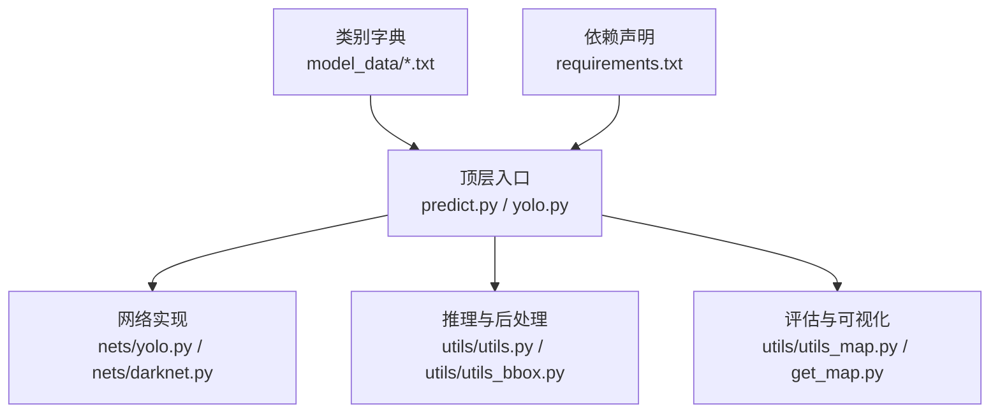
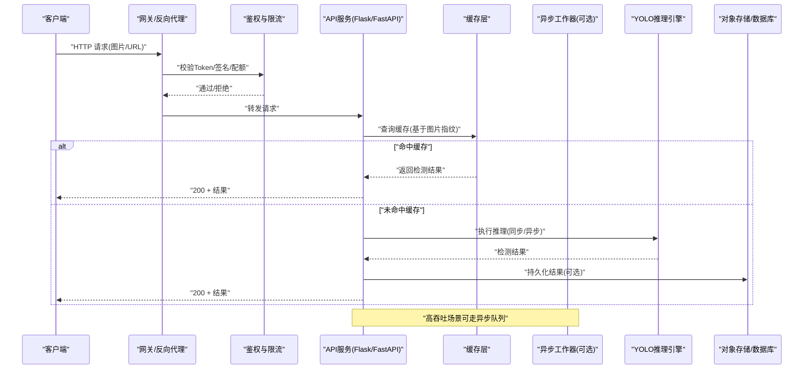
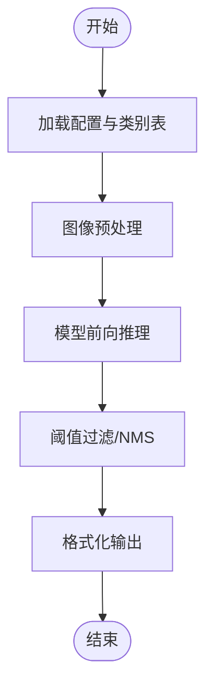
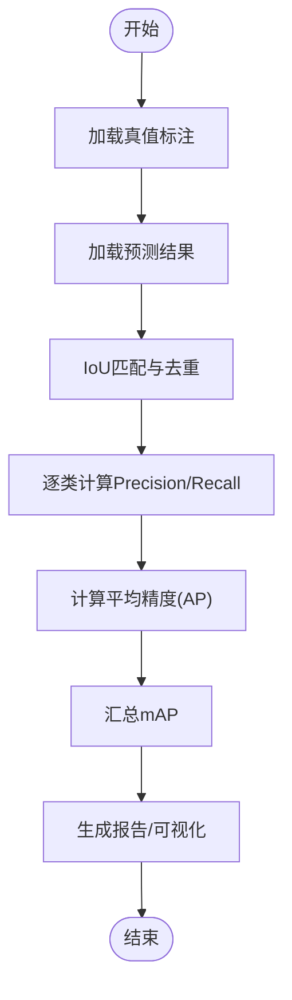
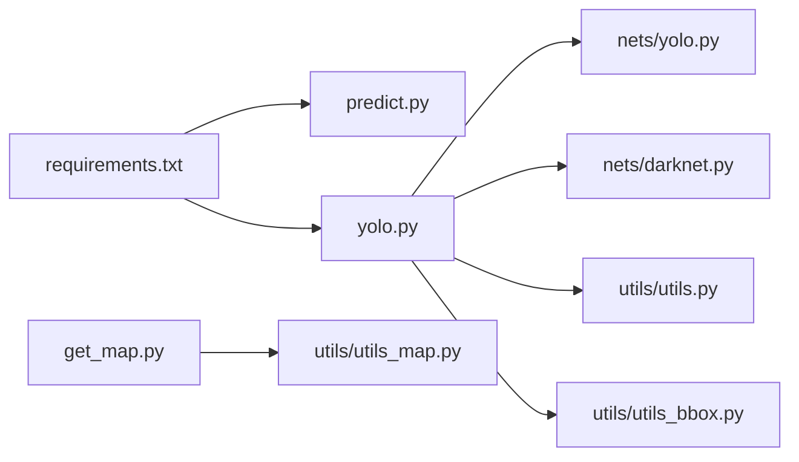

# API服务集成

<cite>
**本文引用的文件**   
- [README.md](file://README.md)
- [requirements.txt](file://requirements.txt)
- [yolo.py](file://yolo.py)
- [predict.py](file://predict.py)
- [nets/yolo.py](file://nets/yolo.py)
- [nets/darknet.py](file://nets/darknet.py)
- [utils/utils.py](file://utils/utils.py)
- [utils/utils_bbox.py](file://utils/utils_bbox.py)
- [utils/utils_map.py](file://utils/utils_map.py)
- [get_map.py](file://get_map.py)
- [voc_annotation.py](file://voc_annotation.py)
</cite>

## 目录
1. [简介](#简介)
2. [项目结构](#项目结构)
3. [核心组件](#核心组件)
4. [架构总览](#架构总览)
5. [详细组件分析](#详细组件分析)
6. [依赖分析](#依赖分析)
7. [性能考虑](#性能考虑)
8. [故障排查指南](#故障排查指南)
9. [结论](#结论)
10. [附录](#附录)

## 简介
本指南面向TogetherNet项目的API服务集成，目标是将现有YOLO目标检测能力封装为RESTful API（Flask或FastAPI），并提供完整的工程化方案：包括接口设计、错误码与版本管理、异步处理、连接池、负载均衡、安全机制（认证/授权/限流）、性能优化（缓存/预计算/并发）、微服务集成（消息队列/服务发现/熔断降级）以及监控日志最佳实践。文档在保持技术深度的同时，尽量以循序渐进的方式帮助读者快速上手并落地生产环境。

## 项目结构
TogetherNet采用“模型+工具”的模块化组织方式：
- 顶层脚本负责训练、预测、评估等入口流程
- nets包含网络结构与训练逻辑
- utils提供数据加载、后处理、指标计算等通用工具
- model_data存放类别标签等静态资源
- VOCdevkit、RTTStest等为数据集与测试样例

图表来源
- [predict.py:1-200](file://predict.py#L1-L200)
- [yolo.py:1-200](file://yolo.py#L1-L200)
- [nets/yolo.py:1-200](file://nets/yolo.py#L1-L200)
- [nets/darknet.py:1-200](file://nets/darknet.py#L1-L200)
- [utils/utils.py:1-200](file://utils/utils.py#L1-L200)
- [utils/utils_bbox.py:1-200](file://utils/utils_bbox.py#1-L200)
- [utils/utils_map.py:1-200](file://utils/utils_map.py#L1-L200)
- [get_map.py:1-200](file://get_map.py#L1-L200)
- [requirements.txt:1-200](file://requirements.txt#L1-L200)

章节来源
- [README.md:1-200](file://README.md#L1-L200)
- [requirements.txt:1-200](file://requirements.txt#L1-L200)
- [yolo.py:1-200](file://yolo.py#L1-L200)
- [predict.py:1-200](file://predict.py#L1-L200)

## 核心组件
- 模型与推理
  - YOLO网络定义与Darknet骨干：用于前向推理与特征提取
  - 预测主流程：图像预处理、模型推理、NMS后处理、结果输出
- 工具与评估
  - 坐标变换、边界框匹配、mAP计算与可视化
- 数据与配置
  - 类别字典、配置文件、权重路径等

章节来源
- [nets/yolo.py:1-200](file://nets/yolo.py#L1-L200)
- [nets/darknet.py:1-200](file://nets/darknet.py#L1-L200)
- [yolo.py:1-200](file://yolo.py#L1-L200)
- [predict.py:1-200](file://predict.py#L1-L200)
- [utils/utils_bbox.py:1-200](file://utils/utils_bbox.py#L1-L200)
- [utils/utils_map.py:1-200](file://utils/utils_map.py#L1-L200)

## 架构总览
下图展示从客户端请求到模型推理与返回结果的端到端流程，并标注了可落地的扩展点（如鉴权、限流、缓存、异步任务、消息队列）。

图表来源
- [predict.py:1-200](file://predict.py#L1-L200)
- [yolo.py:1-200](file://yolo.py#L1-L200)
- [nets/yolo.py:1-200](file://nets/yolo.py#L1-L200)
- [utils/utils_bbox.py:1-200](file://utils/utils_bbox.py#L1-L200)

## 详细组件分析

### 组件A：YOLO推理管线
- 职责
  - 读取输入图像并进行标准化、缩放、通道转换
  - 调用Darknet/YOLO进行前向推理
  - 执行置信度阈值过滤与NMS
  - 输出边界框、类别、分数及可视化结果
- 关键数据结构
  - 输入：图像张量/字节流、模型配置、类别表
  - 中间：特征图、候选框、得分向量
  - 输出：规范化后的边界框、类别索引、置信度
- 复杂度与优化
  - 时间复杂度主要受模型规模与输入分辨率影响；可通过半精度、批处理、GPU内存复用降低延迟
  - 空间复杂度由模型权重与中间激活决定；建议按需加载权重与共享会话

图表来源
- [yolo.py:1-200](file://yolo.py#L1-L200)
- [nets/yolo.py:1-200](file://nets/yolo.py#L1-L200)
- [nets/darknet.py:1-200](file://nets/darknet.py#L1-L200)
- [utils/utils_bbox.py:1-200](file://utils/utils_bbox.py#L1-L200)

章节来源
- [yolo.py:1-200](file://yolo.py#L1-L200)
- [predict.py:1-200](file://predict.py#L1-L200)
- [nets/yolo.py:1-200](file://nets/yolo.py#L1-L200)
- [nets/darknet.py:1-200](file://nets/darknet.py#L1-L200)
- [utils/utils_bbox.py:1-200](file://utils/utils_bbox.py#L1-L200)

### 组件B：评估与指标
- 职责
  - 计算mAP、绘制PR曲线、生成报告
- 关键点
  - IoU阈值扫描、类别对齐、重复检测剔除
  - 与真实标注的匹配策略

图表来源
- [utils/utils_map.py:1-200](file://utils/utils_map.py#L1-L200)
- [get_map.py:1-200](file://get_map.py#L1-L200)

章节来源
- [utils/utils_map.py:1-200](file://utils/utils_map.py#L1-L200)
- [get_map.py:1-200](file://get_map.py#L1-L200)

### 组件C：数据与标注工具
- 职责
  - VOC格式标注解析、训练集划分、数据增强准备
- 关键点
  - 路径映射、类别ID对齐、异常样本清洗

章节来源
- [voc_annotation.py:1-200](file://voc_annotation.py#L1-L200)

## 依赖分析
- 外部依赖
  - 深度学习框架与图像处理库（见requirements.txt）
  - Web框架（Flask或FastAPI，按选型引入）
- 内部耦合
  - predict/yolo入口依赖nets与utils模块
  - utils_bbox与utils_map分别承担后处理与评估职责，低耦合便于替换

图表来源
- [requirements.txt:1-200](file://requirements.txt#L1-L200)
- [predict.py:1-200](file://predict.py#L1-L200)
- [yolo.py:1-200](file://yolo.py#L1-L200)
- [nets/yolo.py:1-200](file://nets/yolo.py#L1-L200)
- [nets/darknet.py:1-200](file://nets/darknet.py#L1-L200)
- [utils/utils.py:1-200](file://utils/utils.py#L1-L200)
- [utils/utils_bbox.py:1-200](file://utils/utils_bbox.py#L1-L200)
- [utils/utils_map.py:1-200](file://utils/utils_map.py#L1-L200)
- [get_map.py:1-200](file://get_map.py#L1-L200)

章节来源
- [requirements.txt:1-200](file://requirements.txt#L1-L200)

## 性能考虑
- 推理加速
  - 使用半精度/量化、TensorRT/ONNX导出（若可用）
  - 批处理与动态形状裁剪，避免频繁分配内存
- 并发与I/O
  - FastAPI推荐uvicorn多进程+异步IO；Flask配合gunicorn多进程
  - 大文件上传采用分片与流式处理，减少峰值内存
- 缓存与预计算
  - 对相同图片指纹的结果做短期缓存（Redis/Memcached）
  - 对热门类别/场景做离线预计算与热启动
- 连接池与资源
  - GPU上下文复用、模型单例加载
  - 磁盘/对象存储连接池，避免频繁握手

[本节为通用指导，不直接分析具体文件]

## 故障排查指南
- 常见问题定位
  - 模型加载失败：检查权重路径、设备类型、显存占用
  - 推理超时：调整批次大小、分辨率、并发数
  - 结果异常：核对类别表顺序、NMS阈值、置信度阈值
- 日志与指标
  - 记录请求ID、耗时、输入尺寸、GPU利用率
  - 暴露Prometheus指标：QPS、P95/P99延迟、错误率、缓存命中率
- 回滚与降级
  - 灰度发布与蓝绿部署
  - 降级策略：返回空结果或默认阈值放宽，保障可用性

章节来源
- [predict.py:1-200](file://predict.py#L1-L200)
- [yolo.py:1-200](file://yolo.py#L1-L200)

## 结论
通过将TogetherNet的YOLO推理能力封装为RESTful API，并结合鉴权、限流、缓存、异步与监控等工程化手段，可在保证质量的同时显著提升吞吐与稳定性。建议在上线前完成压测与容量规划，逐步引入微服务化与可观测性体系，持续迭代优化。

[本节为总结性内容，不直接分析具体文件]

## 附录

### A. API设计规范（示例）
- 版本管理
  - URL前缀带版本号，如/api/v1/detect
- 请求/响应格式
  - 请求：multipart/form-data或JSON（含图片Base64/URL）
  - 响应：统一包装{code,msg,data}，data包含边界框、类别、分数
- 错误码
  - 业务错误码独立于HTTP状态码，便于前端差异化处理
- 幂等与安全
  - 对写操作引入幂等键；对所有接口启用HTTPS与签名校验

[本节为概念性规范说明，不直接分析具体文件]

### B. Flask与FastAPI实现要点
- Flask
  - 使用蓝图拆分路由；结合gunicorn多进程部署
  - 使用线程池或gevent提升并发
- FastAPI
  - 原生支持异步；使用Pydantic做参数校验
  - 结合uvicorn多进程与GIL释放策略

[本节为概念性实现要点，不直接分析具体文件]

### C. 微服务集成方案
- 消息队列
  - 将大图/批量任务投递至RabbitMQ/Kafka，消费者异步推理
- 服务发现
  - 使用Consul/Eureka注册推理服务实例
- 熔断与降级
  - 基于Sentinel/Hystrix实现熔断、舱壁隔离与快速失败

[本节为概念性架构说明，不直接分析具体文件]

### D. 监控与日志最佳实践
- 指标采集
  - 应用指标：QPS、延迟分布、错误率、GC/内存/GPU指标
  - 业务指标：检测数量、类别分布、缓存命中率
- 日志规范
  - 结构化日志（JSON），包含trace_id、user_id、耗时、输入摘要
- 告警与排障
  - 设置SLO阈值与自动告警；集中日志检索与链路追踪

[本节为概念性运维说明，不直接分析具体文件]