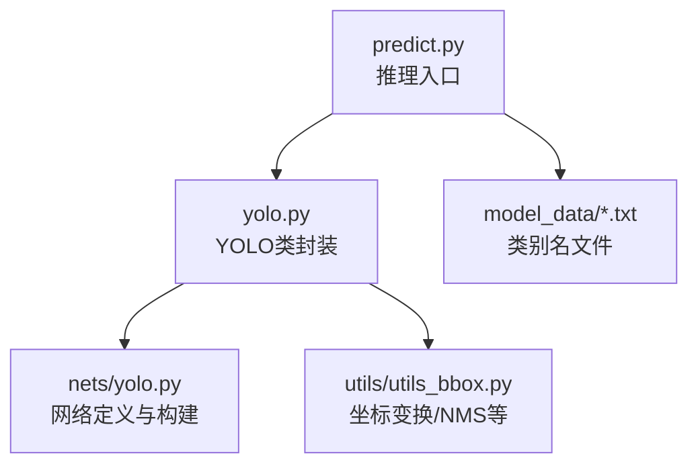
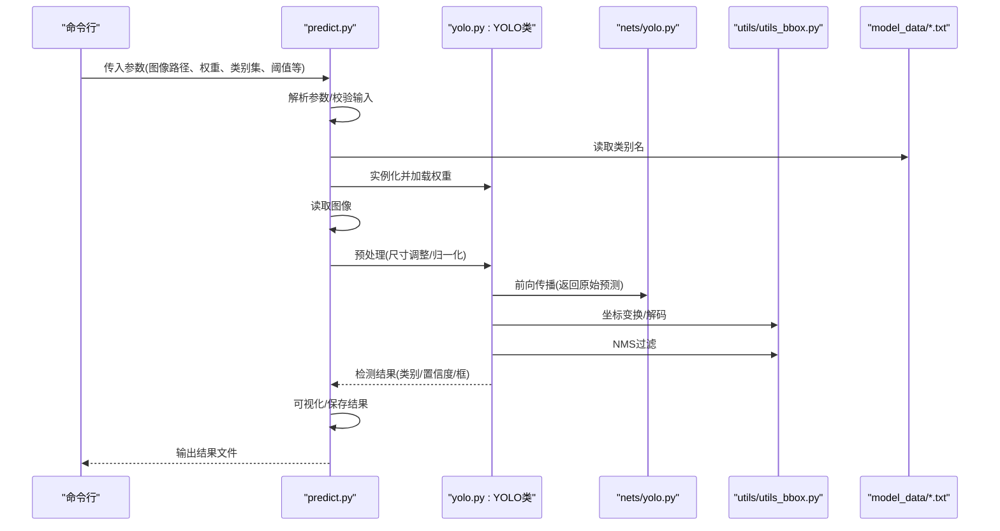
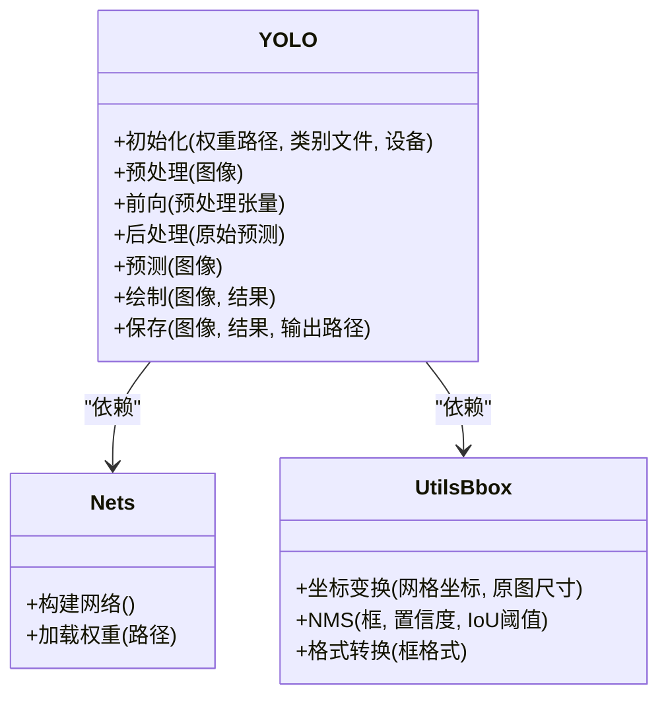
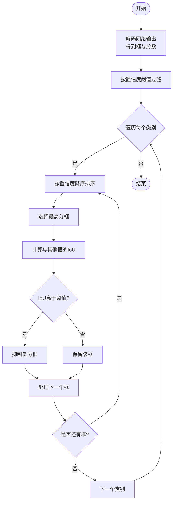
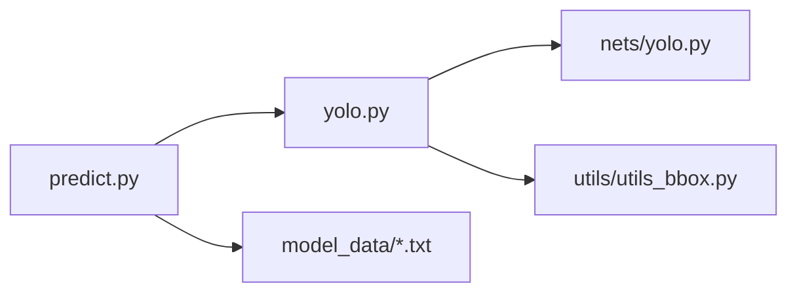

# 单张图片预测

<cite>
**本文引用的文件**   
- [predict.py](file://predict.py)
- [yolo.py](file://yolo.py)
- [nets/yolo.py](file://nets/yolo.py)
- [utils/utils_bbox.py](file://utils/utils_bbox.py)
- [model_data/coco_classes.txt](file://model_data/coco_classes.txt)
- [model_data/voc_classes.txt](file://model_data/voc_classes.txt)
- [model_data/rtts_classes.txt](file://model_data/rtts_classes.txt)
</cite>

## 目录
1. [简介](#简介)
2. [项目结构](#项目结构)
3. [核心组件](#核心组件)
4. [架构总览](#架构总览)
5. [详细组件分析](#详细组件分析)
6. [依赖关系分析](#依赖关系分析)
7. [性能考虑](#性能考虑)
8. [故障排查指南](#故障排查指南)
9. [结论](#结论)
10. [附录](#附录)

## 简介
本文件面向TogetherNet项目的“单张图片预测”场景，聚焦于如何使用脚本进行目标检测推理，并深入解析YOLO类在模型初始化、图像预处理、前向传播与后处理中的关键接口。文档同时解释边界框坐标变换与非极大值抑制（NMS）的实现原理与参数调优建议，并提供完整的调用示例、错误处理方案以及常见问题排查与性能优化建议。

## 项目结构
与单张图片预测直接相关的核心文件包括：
- 推理入口脚本：predict.py
- YOLO模型封装：yolo.py（根目录）
- YOLO网络实现：nets/yolo.py
- 边界框工具：utils/utils_bbox.py
- 类别标签文件：model_data/*.txt

图表来源
- [predict.py](file://predict.py)
- [yolo.py](file://yolo.py)
- [nets/yolo.py](file://nets/yolo.py)
- [utils/utils_bbox.py](file://utils/utils_bbox.py)
- [model_data/coco_classes.txt](file://model_data/coco_classes.txt)
- [model_data/voc_classes.txt](file://model_data/voc_classes.txt)
- [model_data/rtts_classes.txt](file://model_data/rtts_classes.txt)

章节来源
- [predict.py](file://predict.py)
- [yolo.py](file://yolo.py)
- [nets/yolo.py](file://nets/yolo.py)
- [utils/utils_bbox.py](file://utils/utils_bbox.py)
- [model_data/coco_classes.txt](file://model_data/coco_classes.txt)
- [model_data/voc_classes.txt](file://model_data/voc_classes.txt)
- [model_data/rtts_classes.txt](file://model_data/rtts_classes.txt)

## 核心组件
- predict.py：提供命令行参数解析、图像读取、调用YOLO类进行推理、结果可视化与保存。
- yolo.py（根目录）：封装YOLO类的对外API，包含模型加载、预处理、前向推理、后处理（含NMS）、绘制与导出结果等。
- nets/yolo.py：定义YOLO网络结构与权重加载逻辑，供上层封装调用。
- utils/utils_bbox.py：提供边界框坐标变换、格式转换、非极大值抑制等工具函数。
- model_data/*.txt：类别名称文件，用于将类别索引映射为可读的类别名。

章节来源
- [predict.py](file://predict.py)
- [yolo.py](file://yolo.py)
- [nets/yolo.py](file://nets/yolo.py)
- [utils/utils_bbox.py](file://utils/utils_bbox.py)
- [model_data/coco_classes.txt](file://model_data/coco_classes.txt)
- [model_data/voc_classes.txt](file://model_data/voc_classes.txt)
- [model_data/rtts_classes.txt](file://model_data/rtts_classes.txt)

## 架构总览
下图展示了从命令行到最终结果的端到端流程，涵盖输入图像、预处理、模型前向、后处理与输出。

图表来源
- [predict.py](file://predict.py)
- [yolo.py](file://yolo.py)
- [nets/yolo.py](file://nets/yolo.py)
- [utils/utils_bbox.py](file://utils/utils_bbox.py)
- [model_data/coco_classes.txt](file://model_data/coco_classes.txt)
- [model_data/voc_classes.txt](file://model_data/voc_classes.txt)
- [model_data/rtts_classes.txt](file://model_data/rtts_classes.txt)

## 详细组件分析

### 使用 predict.py 进行单张图片预测
- 基本用法
  - 通过命令行指定输入图像路径、模型权重路径、类别配置文件、置信度阈值、IoU阈值、是否保存结果等参数。
  - 支持选择不同数据集对应的类别文件（如COCO/VOC/RTTS）。
- 输入图像格式要求
  - 常见图像格式均可（如JPEG/PNG），但需确保文件可读且路径正确。
  - 若需要特定尺寸或通道顺序，请在预处理阶段确认；通常框架内部会做统一处理。
- 输出结果格式
  - 默认会在输出目录生成带标注框的图片文件，并在控制台打印检测结果摘要。
  - 可选输出JSON/CSV等结构化结果（取决于具体实现）。
- 关键参数说明（以实际脚本为准）
  - 图像路径：必填
  - 权重路径：必填
  - 类别文件：根据任务选择
  - 置信度阈值：过滤低置信度预测
  - IoU阈值：控制NMS强度
  - 输出目录：保存可视化结果
  - 设备选择：CPU/GPU
- 完整调用示例（概念性步骤）
  - 准备图像与权重文件
  - 选择类别文件（如coco_classes.txt）
  - 执行命令，传入必要参数
  - 检查输出图片与日志
- 错误处理与异常
  - 文件不存在或不可读：检查路径权限与格式
  - 权重不匹配：确认权重与类别数一致
  - 内存不足：降低batch或分辨率，或使用CPU
  - 设备不可用：回退至CPU或检查驱动

章节来源
- [predict.py](file://predict.py)
- [model_data/coco_classes.txt](file://model_data/coco_classes.txt)
- [model_data/voc_classes.txt](file://model_data/voc_classes.txt)
- [model_data/rtts_classes.txt](file://model_data/rtts_classes.txt)

### YOLO 类核心接口（yolo.py）
- 模型初始化
  - 加载网络结构（来自nets/yolo.py）与权重文件
  - 配置类别列表（来自model_data/*.txt）
  - 设置设备（GPU/CPU）与精度
- 图像预处理
  - 尺寸调整：将输入图像缩放到模型期望尺寸
  - 归一化：像素值缩放至[0,1]或按均值方差标准化
  - 维度变换：HWC→CHW，必要时添加批次维
- 前向传播
  - 将预处理后的张量送入网络，得到多尺度特征图与预测头输出
- 后处理流程
  - 解码：将网络输出转换为边界框坐标与类别概率
  - 坐标变换：将网格坐标转换为原图坐标
  - 过滤：按置信度阈值筛选候选框
  - NMS：按类别分别进行非极大值抑制，去除重叠框
  - 结果整理：合并保留框、类别、置信度，并按原图尺寸输出
- 可视化与导出
  - 在原图上绘制边界框与类别标签
  - 保存图片或导出结构化结果

图表来源
- [yolo.py](file://yolo.py)
- [nets/yolo.py](file://nets/yolo.py)
- [utils/utils_bbox.py](file://utils/utils_bbox.py)

章节来源
- [yolo.py](file://yolo.py)
- [nets/yolo.py](file://nets/yolo.py)
- [utils/utils_bbox.py](file://utils/utils_bbox.py)

### 边界框坐标变换与NMS实现原理
- 坐标变换
  - 网络输出通常为相对网格的偏移量，需结合锚点或网格位置还原为绝对坐标
  - 将相对坐标映射回原图尺寸，保持宽高比例与裁剪信息
- NMS（非极大值抑制）
  - 对每个类别独立计算IoU，移除高重叠的低置信度框
  - 关键参数：IoU阈值、置信度阈值
  - 调优建议：
    - IoU阈值较低：更严格去重，可能误删邻近目标
    - IoU阈值较高：保留更多重叠框，可能引入重复检测
    - 置信度阈值：提高可提升精度但降低召回

图表来源
- [utils/utils_bbox.py](file://utils/utils_bbox.py)

章节来源
- [utils/utils_bbox.py](file://utils/utils_bbox.py)

### 完整调用示例（API方式）
以下为概念性步骤，展示如何在代码中调用YOLO类完成单张图片预测：
- 导入YOLO类
- 实例化并加载权重与类别文件
- 读取图像并进行预处理
- 调用预测方法获取结果
- 可视化与保存
- 异常处理：捕获IO错误、权重加载失败、设备不可用等异常，给出友好提示与回退策略

章节来源
- [yolo.py](file://yolo.py)
- [predict.py](file://predict.py)

## 依赖关系分析
- 模块耦合
  - predict.py依赖yolo.py提供的YOLO类API
  - yolo.py依赖nets/yolo.py的网络构建与权重加载
  - yolo.py依赖utils/utils_bbox.py的坐标变换与NMS
- 外部资源
  - 类别文件（model_data/*.txt）决定类别映射
  - 权重文件决定模型容量与任务适配

图表来源
- [predict.py](file://predict.py)
- [yolo.py](file://yolo.py)
- [nets/yolo.py](file://nets/yolo.py)
- [utils/utils_bbox.py](file://utils/utils_bbox.py)
- [model_data/coco_classes.txt](file://model_data/coco_classes.txt)
- [model_data/voc_classes.txt](file://model_data/voc_classes.txt)
- [model_data/rtts_classes.txt](file://model_data/rtts_classes.txt)

章节来源
- [predict.py](file://predict.py)
- [yolo.py](file://yolo.py)
- [nets/yolo.py](file://nets/yolo.py)
- [utils/utils_bbox.py](file://utils/utils_bbox.py)
- [model_data/coco_classes.txt](file://model_data/coco_classes.txt)
- [model_data/voc_classes.txt](file://model_data/voc_classes.txt)
- [model_data/rtts_classes.txt](file://model_data/rtts_classes.txt)

## 性能考虑
- 硬件加速
  - 优先使用GPU；若显存不足，可降低输入分辨率或切换CPU
- 预处理优化
  - 批量预处理与缓存可减少重复开销
- 后处理优化
  - 合理设置置信度阈值以减少后续NMS负担
  - 针对密集场景微调IoU阈值平衡召回与重复
- 模型与数据
  - 选择合适尺寸的输入，避免过大导致内存瓶颈
  - 类别数量与权重文件必须匹配

## 故障排查指南
- 无法找到图像或权重文件
  - 检查路径是否正确、是否存在、是否有读取权限
- 类别数不匹配
  - 确认权重与类别文件一致（如COCO/VOC/RTTS）
- 设备不可用
  - 检查CUDA驱动与PyTorch版本；回退至CPU
- 输出为空或结果异常
  - 降低置信度阈值或调整IoU阈值
  - 检查输入图像质量与尺寸
- 内存溢出
  - 减小输入分辨率或关闭不必要的日志与中间变量

章节来源
- [predict.py](file://predict.py)
- [yolo.py](file://yolo.py)
- [utils/utils_bbox.py](file://utils/utils_bbox.py)

## 结论
通过predict.py与yolo.py的配合，TogetherNet提供了便捷的单张图片目标检测能力。理解预处理、前向传播与后处理的关键环节，有助于在实际应用中调优阈值与性能。结合utils/utils_bbox.py的坐标变换与NMS，可实现稳定可靠的检测结果。

## 附录
- 常用类别文件
  - COCO类别：model_data/coco_classes.txt
  - VOC类别：model_data/voc_classes.txt
  - RTTS类别：model_data/rtts_classes.txt
- 参考路径
  - 推理入口：predict.py
  - YOLO封装：yolo.py
  - 网络实现：nets/yolo.py
  - 边界框工具：utils/utils_bbox.py