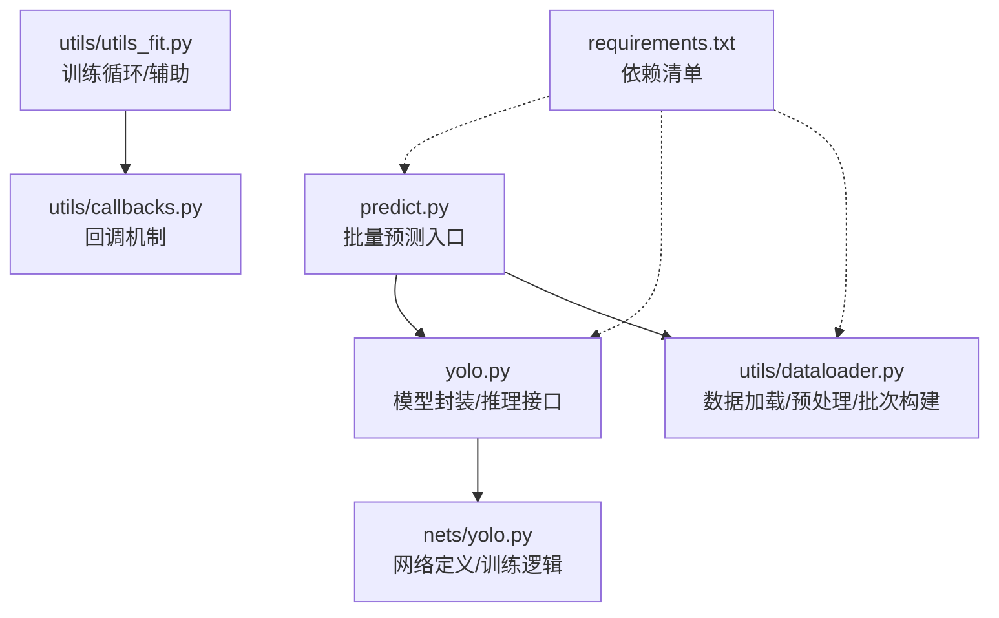
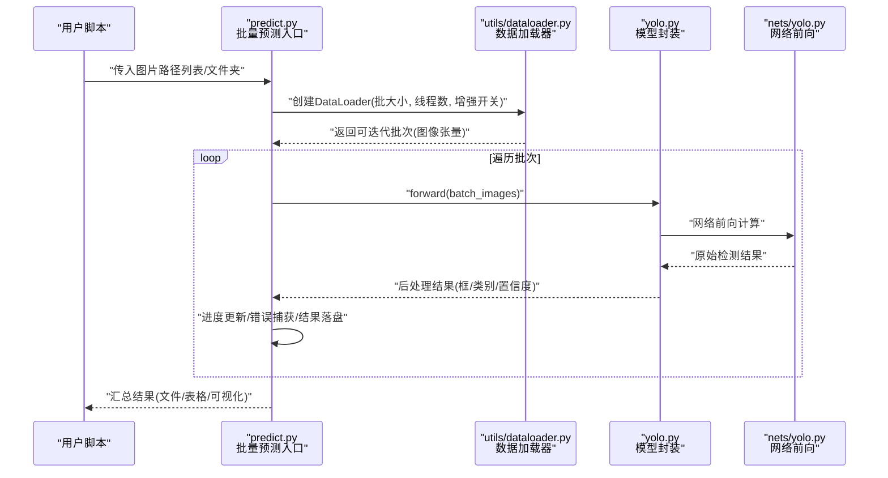
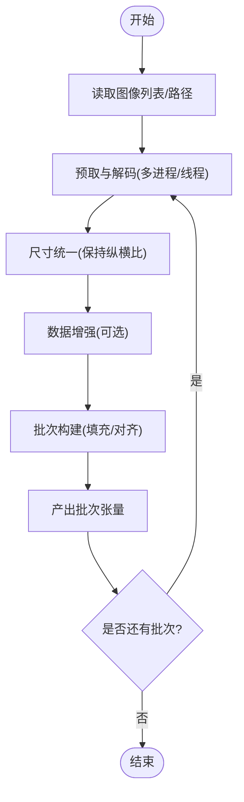
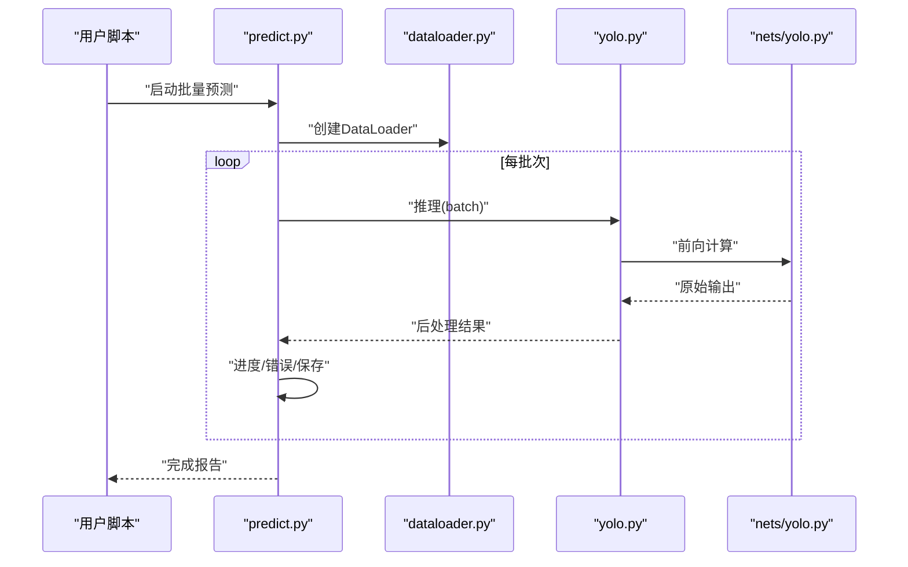
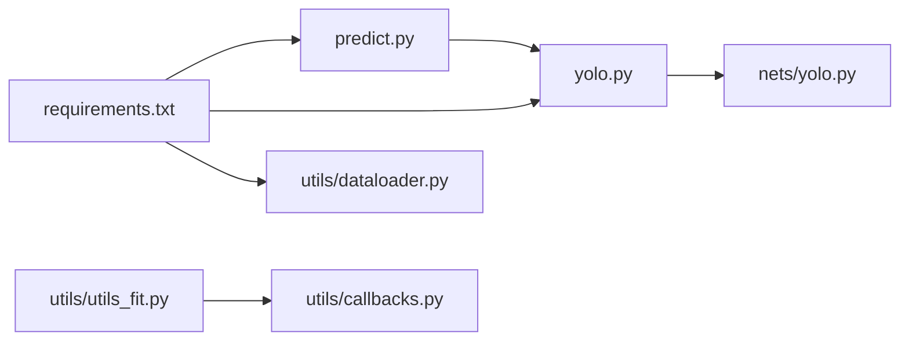

# 批量图片处理

<cite>
**本文引用的文件**   
- [dataloader.py](file://utils/dataloader.py)
- [predict.py](file://predict.py)
- [yolo.py](file://yolo.py)
- [nets/yolo.py](file://nets/yolo.py)
- [utils/utils_fit.py](file://utils/utils_fit.py)
- [utils/callbacks.py](file://utils/callbacks.py)
- [requirements.txt](file://requirements.txt)
</cite>

## 目录
1. [简介](#简介)
2. [项目结构](#项目结构)
3. [核心组件](#核心组件)
4. [架构总览](#架构总览)
5. [详细组件分析](#详细组件分析)
6. [依赖关系分析](#依赖关系分析)
7. [性能考虑](#性能考虑)
8. [故障排查指南](#故障排查指南)
9. [结论](#结论)
10. [附录](#附录)

## 简介
本指南面向TogetherNet项目的批量图片推理与处理，聚焦以下目标：
- 使用数据加载器进行高效的数据预处理与批次构建
- 设计批处理策略与内存管理优化方案
- 提供批量预测的完整流程示例（进度条、错误处理、结果保存）
- 给出GPU内存优化技巧（梯度累积、混合精度、动态批大小）
- 介绍性能基准测试方法与瓶颈分析工具
- 提供大规模数据集的分布式推理思路

## 项目结构
本项目围绕YOLO检测任务组织代码，关键目录与文件如下：
- utils/dataloader.py：数据加载与预处理流水线
- predict.py：单图/批量预测入口
- yolo.py：模型封装与推理接口
- nets/yolo.py：网络定义与训练相关逻辑
- utils/utils_fit.py：训练辅助函数（含训练循环与回调）
- utils/callbacks.py：训练回调（如日志、早停等）
- requirements.txt：依赖声明

图表来源
- [predict.py](file://predict.py)
- [yolo.py](file://yolo.py)
- [nets/yolo.py](file://nets/yolo.py)
- [utils/dataloader.py](file://utils/dataloader.py)
- [utils/utils_fit.py](file://utils/utils_fit.py)
- [utils/callbacks.py](file://utils/callbacks.py)
- [requirements.txt](file://requirements.txt)

章节来源
- [predict.py](file://predict.py)
- [yolo.py](file://yolo.py)
- [nets/yolo.py](file://nets/yolo.py)
- [utils/dataloader.py](file://utils/dataloader.py)
- [utils/utils_fit.py](file://utils/utils_fit.py)
- [utils/callbacks.py](file://utils/callbacks.py)
- [requirements.txt](file://requirements.txt)

## 核心组件
- 数据加载器（utils/dataloader.py）
  - 负责图像读取、尺寸统一、数据增强、批次构建与迭代
  - 支持多进程/多线程加速I/O与预处理
  - 输出张量格式需与模型输入一致（通道顺序、归一化、数据类型）
- 模型封装（yolo.py）
  - 暴露统一的推理接口，内部调用nets/yolo.py的网络前向
  - 支持设备切换（CPU/GPU）、批量输入、后处理（NMS等）
- 网络实现（nets/yolo.py）
  - 定义骨干、颈部、头部结构及训练相关逻辑
  - 提供前向计算与损失计算（用于训练阶段）
- 训练辅助（utils/utils_fit.py）
  - 训练循环、学习率调度、梯度累积、混合精度等训练期能力
- 回调（utils/callbacks.py）
  - 训练过程中的日志、检查点、可视化等扩展点

章节来源
- [utils/dataloader.py](file://utils/dataloader.py)
- [yolo.py](file://yolo.py)
- [nets/yolo.py](file://nets/yolo.py)
- [utils/utils_fit.py](file://utils/utils_fit.py)
- [utils/callbacks.py](file://utils/callbacks.py)

## 架构总览
下图展示从批量预测入口到数据加载、模型推理与结果输出的整体流程。

图表来源
- [predict.py](file://predict.py)
- [utils/dataloader.py](file://utils/dataloader.py)
- [yolo.py](file://yolo.py)
- [nets/yolo.py](file://nets/yolo.py)

## 详细组件分析

### 数据加载器（utils/dataloader.py）
- 功能要点
  - 图像读取：支持常见格式，容错缺失或损坏文件
  - 尺寸统一：Resize/Pad/Crop策略，保持纵横比避免形变
  - 数据增强：翻转、色彩抖动、缩放、MixUp/Mosaic（可选）
  - 批次构建：按固定或动态批大小打包，填充对齐
  - I/O与并行：多进程/多线程预取，减少GPU空闲时间
- 数据结构与复杂度
  - 输入：图像路径/文件名列表；配置项（尺寸、增强、批大小、线程数）
  - 输出：批次张量（B, C, H, W），类型与归一化遵循模型要求
  - 时间复杂度：线性于样本数量；空间复杂度受批大小与图像分辨率影响
- 优化建议
  - 合理设置num_workers，避免过多导致上下文切换开销
  - 对大分辨率图像采用渐进式Resize或分块处理
  - 启用缓存（路径→解码后的图像矩阵）以降低重复I/O
  - 使用共享内存/零拷贝减少进程间传输成本

图表来源
- [utils/dataloader.py](file://utils/dataloader.py)

章节来源
- [utils/dataloader.py](file://utils/dataloader.py)

### 批量预测流程（predict.py + yolo.py）
- 流程说明
  - 初始化模型与权重，选择设备（CPU/GPU）
  - 构造DataLoader并遍历批次
  - 调用模型推理接口，执行后处理（阈值过滤、NMS）
  - 记录进度、捕获异常、保存结果（JSON/CSV/可视化）
- 错误处理
  - 跳过损坏图像并记录日志
  - 对OOM或显存不足进行降级（减小批大小、回退CPU）
  - 断点续跑：基于已处理索引恢复
- 结果保存
  - 结构化输出：图像ID、类别、置信度、边界框坐标
  - 可视化叠加框与标签，便于人工校验

图表来源
- [predict.py](file://predict.py)
- [yolo.py](file://yolo.py)
- [nets/yolo.py](file://nets/yolo.py)
- [utils/dataloader.py](file://utils/dataloader.py)

章节来源
- [predict.py](file://predict.py)
- [yolo.py](file://yolo.py)
- [nets/yolo.py](file://nets/yolo.py)
- [utils/dataloader.py](file://utils/dataloader.py)

### 训练辅助与回调（utils/utils_fit.py + utils/callbacks.py）
- 训练循环
  - 支持梯度累积、学习率预热/余弦衰减、EMA权重平滑
  - 混合精度训练（FP16/BF16）降低显存占用并提升吞吐
- 回调机制
  - 日志记录、指标统计、检查点保存、可视化
  - 可扩展自定义回调（如动态批大小调整、早停）

章节来源
- [utils/utils_fit.py](file://utils/utils_fit.py)
- [utils/callbacks.py](file://utils/callbacks.py)

## 依赖关系分析
- 模块耦合
  - predict.py依赖yolo.py与dataloader.py
  - yolo.py依赖nets/yolo.py
  - utils_fit.py与callbacks.py为训练期支撑
- 外部依赖
  - PyTorch、OpenCV、NumPy、tqdm等（见requirements.txt）

图表来源
- [requirements.txt](file://requirements.txt)
- [predict.py](file://predict.py)
- [yolo.py](file://yolo.py)
- [nets/yolo.py](file://nets/yolo.py)
- [utils/dataloader.py](file://utils/dataloader.py)
- [utils/utils_fit.py](file://utils/utils_fit.py)
- [utils/callbacks.py](file://utils/callbacks.py)

章节来源
- [requirements.txt](file://requirements.txt)
- [predict.py](file://predict.py)
- [yolo.py](file://yolo.py)
- [nets/yolo.py](file://nets/yolo.py)
- [utils/dataloader.py](file://utils/dataloader.py)
- [utils/utils_fit.py](file://utils/utils_fit.py)
- [utils/callbacks.py](file://utils/callbacks.py)

## 性能考虑
- 批处理策略
  - 静态批大小：稳定吞吐，适合长尾分布不严重的场景
  - 动态批大小：根据图像分辨率自适应，最大化GPU利用率
- 内存管理
  - 控制显存峰值：减小批大小、关闭不必要的中间变量、及时释放
  - 梯度累积：在显存受限下模拟更大有效批大小
  - 混合精度：FP16/BF16显著降低显存并提高吞吐
- I/O与预处理
  - 多进程/线程预取，避免GPU等待
  - 图像解码与Resize并行化，必要时使用共享内存
- 监控与分析
  - 使用nvidia-smi、nvprof/nsys、PyTorch Profiler定位瓶颈
  - 记录吞吐（FPS）、延迟（ms/batch）、显存占用曲线

[本节为通用指导，无需特定文件引用]

## 故障排查指南
- 常见问题
  - OOM：降低批大小、启用混合精度、减少图像分辨率或关闭增强
  - 数据损坏：在dataloader中增加容错与重试，记录失败样本
  - 进度卡住：检查num_workers与磁盘IO，适当调小或增大
  - 结果不一致：确认随机种子、增强开关与后处理参数
- 诊断步骤
  - 打印批次形状与数据类型，确保与模型输入一致
  - 逐步禁用增强与多进程，定位问题来源
  - 使用最小复现集验证端到端流程

章节来源
- [utils/dataloader.py](file://utils/dataloader.py)
- [predict.py](file://predict.py)
- [yolo.py](file://yolo.py)

## 结论
通过合理的数据加载与批处理策略、完善的错误处理与结果保存机制，以及GPU内存优化手段，TogetherNet可在大规模图片上实现高效稳定的批量推理。结合性能分析与分布式方案，可进一步拓展至超大规模数据集的处理需求。

[本节为总结性内容，无需特定文件引用]

## 附录
- 批量预测参考流程（以路径为例）
  - 准备图片路径列表或扫描文件夹
  - 初始化模型与设备，创建DataLoader
  - 遍历批次进行推理，保存结果与可视化
  - 生成汇总报告（吞吐、耗时、成功率）
- 分布式推理思路
  - 数据分片：按文件或哈希将数据集切分到多节点
  - 模型复制：每个进程持有独立模型副本
  - 结果汇聚：各节点输出本地结果，最后合并去重与排序
  - 通信与负载均衡：基于队列或文件系统协调，避免热点

[本节为概念性补充，无需特定文件引用]