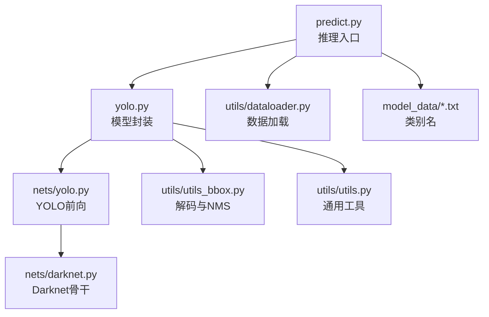
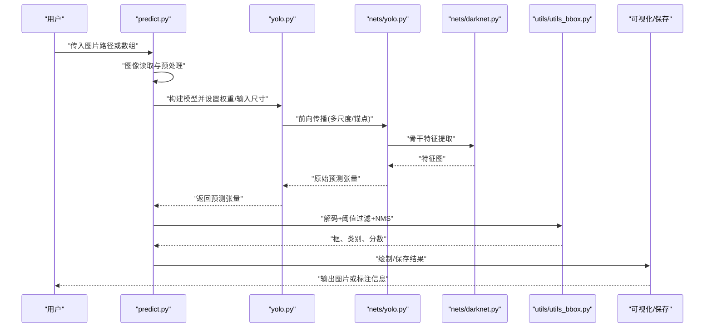
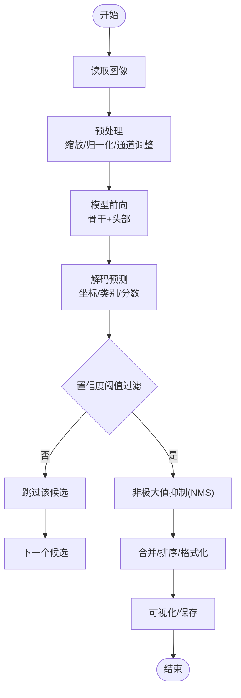
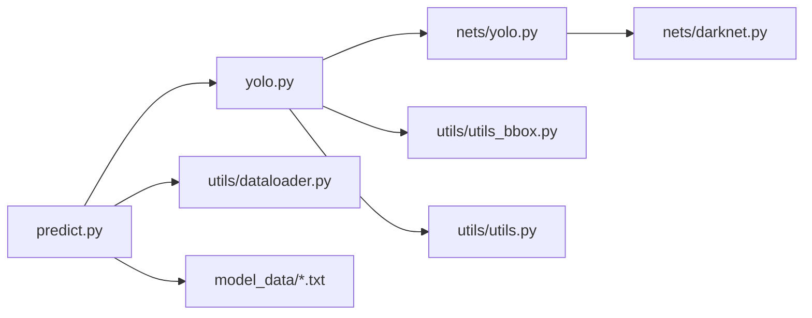

# 推理与部署

<cite>
**本文引用的文件**   
- [README.md](file://README.md)
- [predict.py](file://predict.py)
- [yolo.py](file://yolo.py)
- [nets/yolo.py](file://nets/yolo.py)
- [nets/darknet.py](file://nets/darknet.py)
- [utils/utils_bbox.py](file://utils/utils_bbox.py)
- [utils/utils.py](file://utils/utils.py)
- [utils/dataloader.py](file://utils/dataloader.py)
- [model_data/coco_classes.txt](file://model_data/coco_classes.txt)
- [model_data/rtts_classes.txt](file://model_data/rtts_classes.txt)
- [model_data/voc_classes.txt](file://model_data/voc_classes.txt)
</cite>

## 目录
1. [简介](#简介)
2. [项目结构](#项目结构)
3. [核心组件](#核心组件)
4. [架构总览](#架构总览)
5. [详细组件分析](#详细组件分析)
6. [依赖关系分析](#依赖关系分析)
7. [性能考虑](#性能考虑)
8. [故障排查指南](#故障排查指南)
9. [结论](#结论)
10. [附录](#附录)

## 简介
本指南面向TogetherNet的推理与部署，覆盖从单张图片预测到批量处理、视频流实时检测、模型导出（ONNX/TensorRT）、API服务封装、移动端与嵌入式部署策略，以及性能基准测试与监控指标收集。文档以仓库现有实现为基础，结合工程最佳实践，提供可操作的步骤与优化建议。

## 项目结构
TogetherNet采用模块化组织：网络定义在nets下，工具函数在utils下，训练与评估脚本位于根目录，权重与类别文件在model_data中。推理入口集中在predict.py与yolo.py，YOLO前向逻辑在nets/yolo.py，Darknet骨干在nets/darknet.py，后处理（含NMS）在utils/utils_bbox.py。

图表来源
- [predict.py:1-200](file://predict.py#L1-L200)
- [yolo.py:1-200](file://yolo.py#L1-L200)
- [nets/yolo.py:1-200](file://nets/yolo.py#L1-L200)
- [nets/darknet.py:1-200](file://nets/darknet.py#L1-L200)
- [utils/utils_bbox.py:1-200](file://utils/utils_bbox.py#L1-L200)
- [utils/utils.py:1-200](file://utils/utils.py#L1-200)
- [utils/dataloader.py:1-200](file://utils/dataloader.py#L1-200)
- [model_data/coco_classes.txt](file://model_data/coco_classes.txt)
- [model_data/rtts_classes.txt](file://model_data/rtts_classes.txt)
- [model_data/voc_classes.txt](file://model_data/voc_classes.txt)

章节来源
- [README.md:1-200](file://README.md#L1-L200)
- [predict.py:1-200](file://predict.py#L1-L200)
- [yolo.py:1-200](file://yolo.py#L1-L200)

## 核心组件
- 推理入口与流程编排：predict.py负责图像读取、预处理、调用模型、后处理与可视化输出。
- 模型封装：yolo.py封装权重加载、输入尺寸配置、前向调用与结果组装。
- 网络前向：nets/yolo.py实现YOLO头与前向计算；nets/darknet.py提供骨干特征提取。
- 后处理：utils/utils_bbox.py包含坐标解码、置信度阈值过滤与非极大值抑制（NMS）。
- 工具与数据：utils/utils.py提供通用辅助；utils/dataloader.py用于数据加载与批处理准备。
- 类别映射：model_data下的txt文件提供类别名称映射。

章节来源
- [predict.py:1-200](file://predict.py#L1-L200)
- [yolo.py:1-200](file://yolo.py#L1-L200)
- [nets/yolo.py:1-200](file://nets/yolo.py#L1-L200)
- [nets/darknet.py:1-200](file://nets/darknet.py#L1-L200)
- [utils/utils_bbox.py:1-200](file://utils/utils_bbox.py#L1-L200)
- [utils/utils.py:1-200](file://utils/utils.py#L1-L200)
- [utils/dataloader.py:1-200](file://utils/dataloader.py#L1-L200)
- [model_data/coco_classes.txt](file://model_data/coco_classes.txt)
- [model_data/rtts_classes.txt](file://model_data/rtts_classes.txt)
- [model_data/voc_classes.txt](file://model_data/voc_classes.txt)

## 架构总览
下图展示一次完整推理的数据流：从图像输入到最终检测结果，包括预处理、模型前向、后处理与可视化。

图表来源
- [predict.py:1-200](file://predict.py#L1-L200)
- [yolo.py:1-200](file://yolo.py#L1-L200)
- [nets/yolo.py:1-200](file://nets/yolo.py#L1-L200)
- [nets/darknet.py:1-200](file://nets/darknet.py#L1-L200)
- [utils/utils_bbox.py:1-200](file://utils/utils_bbox.py#L1-L200)

## 详细组件分析

### 单张图片预测流程
- 图像预处理
  - 读取图像并转换为模型期望格式（如归一化、通道顺序、尺寸缩放）。
  - 可选：中心裁剪、填充保持比例、灰度/颜色空间转换。
  - 参考路径：[predict.py:1-200](file://predict.py#L1-L200)、[utils/utils.py:1-200](file://utils/utils.py#L1-L200)。
- 模型前向传播
  - 通过yolo.py加载权重与配置，调用nets/yolo.py进行前向，内部使用nets/darknet.py提取特征。
  - 参考路径：[yolo.py:1-200](file://yolo.py#L1-L200)、[nets/yolo.py:1-200](file://nets/yolo.py#L1-L200)、[nets/darknet.py:1-200](file://nets/darknet.py#L1-L200)。
- 后处理（NMS）
  - 将原始预测解码为边界框与类别概率，应用置信度阈值过滤，再进行NMS去重。
  - 参考路径：[utils/utils_bbox.py:1-200](file://utils/utils_bbox.py#L1-L200)。
- 可视化与输出
  - 根据类别文件（coco/rtts/voc）映射标签，绘制框与文字，保存或显示结果。
  - 参考路径：[model_data/coco_classes.txt](file://model_data/coco_classes.txt)、[model_data/rtts_classes.txt](file://model_data/rtts_classes.txt)、[model_data/voc_classes.txt](file://model_data/voc_classes.txt)。

图表来源
- [predict.py:1-200](file://predict.py#L1-L200)
- [yolo.py:1-200](file://yolo.py#L1-L200)
- [nets/yolo.py:1-200](file://nets/yolo.py#L1-L200)
- [nets/darknet.py:1-200](file://nets/darknet.py#L1-L200)
- [utils/utils_bbox.py:1-200](file://utils/utils_bbox.py#L1-L200)

章节来源
- [predict.py:1-200](file://predict.py#L1-L200)
- [yolo.py:1-200](file://yolo.py#L1-L200)
- [nets/yolo.py:1-200](file://nets/yolo.py#L1-L200)
- [nets/darknet.py:1-200](file://nets/darknet.py#L1-L200)
- [utils/utils_bbox.py:1-200](file://utils/utils_bbox.py#L1-L200)
- [utils/utils.py:1-200](file://utils/utils.py#L1-L200)
- [model_data/coco_classes.txt](file://model_data/coco_classes.txt)
- [model_data/rtts_classes.txt](file://model_data/rtts_classes.txt)
- [model_data/voc_classes.txt](file://model_data/voc_classes.txt)

### 批量图片处理与性能优化
- 批处理实现
  - 使用dataloader对多张图像进行统一预处理与打包，减少Python循环开销。
  - 参考路径：[utils/dataloader.py:1-200](file://utils/dataloader.py#L1-L200)。
- 优化技巧
  - 固定输入尺寸以减少动态形状开销；使用GPU并行；避免频繁内存分配；复用模型实例。
  - 参考路径：[yolo.py:1-200](file://yolo.py#L1-L200)、[utils/utils.py:1-200](file://utils/utils.py#L1-L200)。

章节来源
- [utils/dataloader.py:1-200](file://utils/dataloader.py#L1-L200)
- [yolo.py:1-200](file://yolo.py#L1-L200)
- [utils/utils.py:1-200](file://utils/utils.py#L1-L200)

### 视频流实时检测
- 帧率优化
  - 降低分辨率或跳帧；使用多线程/异步I/O；预分配缓冲区；批处理相邻帧。
- 内存管理
  - 及时释放中间张量；限制队列长度；避免重复拷贝；使用对象池。
- 参考路径
  - 视频读取与帧循环：[predict.py:1-200](file://predict.py#L1-L200)
  - 数据处理与工具：[utils/dataloader.py:1-200](file://utils/dataloader.py#L1-L200)、[utils/utils.py:1-200](file://utils/utils.py#L1-L200)

章节来源
- [predict.py:1-200](file://predict.py#L1-L200)
- [utils/dataloader.py:1-200](file://utils/dataloader.py#L1-L200)
- [utils/utils.py:1-200](file://utils/utils.py#L1-L200)

### 模型导出与格式转换（ONNX/TensorRT）
- ONNX导出
  - 使用框架提供的导出接口，指定输入形状与动态轴（如需），生成.onnx文件。
  - 验证：使用onnxruntime进行推理校验，对比PyTorch输出误差。
- TensorRT优化
  - 基于ONNX构建TensorRT引擎，选择精度（FP32/FP16/INT8），校准数据集用于量化。
  - 部署时加载.engine文件进行推理，注意输入布局与内存对齐。
- 参考路径
  - 模型封装与输入配置：[yolo.py:1-200](file://yolo.py#L1-L200)
  - 网络前向定义：[nets/yolo.py:1-200](file://nets/yolo.py#L1-L200)

章节来源
- [yolo.py:1-200](file://yolo.py#L1-L200)
- [nets/yolo.py:1-200](file://nets/yolo.py#L1-L200)

### API服务封装（Flask/FastAPI）
- RESTful接口设计
  - POST /detect：上传图像，返回JSON（框、类别、分数）与可视化图片。
  - GET /health：健康检查。
- 集成要点
  - 启动时加载模型与权重；请求内仅做轻量预处理与后处理；使用连接池与线程池。
  - 错误处理：输入校验、超时控制、日志记录。
- 参考路径
  - 推理主流程：[predict.py:1-200](file://predict.py#L1-L200)
  - 模型封装：[yolo.py:1-200](file://yolo.py#L1-L200)

章节来源
- [predict.py:1-200](file://predict.py#L1-L200)
- [yolo.py:1-200](file://yolo.py#L1-L200)

### 移动端与嵌入式设备部署
- 策略
  - 模型量化（INT8/FP16）、剪枝（结构化/非结构化）、算子融合、图优化。
  - 目标平台：Android（NNAPI/TFLite）、iOS（Core ML）、Jetson（TensorRT）、ARM（OpenVINO/TVM）。
- 注意事项
  - 输入尺寸与通道顺序一致性；内存占用与延迟权衡；热更新与回滚机制。
- 参考路径
  - 模型与工具：[yolo.py:1-200](file://yolo.py#L1-L200)、[utils/utils.py:1-200](file://utils/utils.py#L1-L200)

章节来源
- [yolo.py:1-200](file://yolo.py#L1-L200)
- [utils/utils.py:1-200](file://utils/utils.py#L1-L200)

### 性能基准测试与监控指标
- 指标
  - 端到端延迟（ms/帧）、吞吐（FPS）、GPU利用率、显存峰值、CPU占用。
- 方法
  - 使用计时器统计每帧耗时；批量压测；A/B对比不同优化策略；采集系统指标（nvidia-smi、perf）。
- 参考路径
  - 推理主流程：[predict.py:1-200](file://predict.py#L1-L200)
  - 数据处理：[utils/dataloader.py:1-200](file://utils/dataloader.py#L1-L200)

章节来源
- [predict.py:1-200](file://predict.py#L1-L200)
- [utils/dataloader.py:1-200](file://utils/dataloader.py#L1-L200)

## 依赖关系分析
TogetherNet的推理链路依赖清晰：predict.py作为入口，调用yolo.py封装的模型，再进入nets/yolo.py与nets/darknet.py完成前向；后处理由utils/utils_bbox.py完成；工具与数据加载分别在utils/utils.py与utils/dataloader.py中。

图表来源
- [predict.py:1-200](file://predict.py#L1-L200)
- [yolo.py:1-200](file://yolo.py#L1-L200)
- [nets/yolo.py:1-200](file://nets/yolo.py#L1-L200)
- [nets/darknet.py:1-200](file://nets/darknet.py#L1-L200)
- [utils/utils_bbox.py:1-200](file://utils/utils_bbox.py#L1-L200)
- [utils/utils.py:1-200](file://utils/utils.py#L1-L200)
- [utils/dataloader.py:1-200](file://utils/dataloader.py#L1-L200)
- [model_data/coco_classes.txt](file://model_data/coco_classes.txt)
- [model_data/rtts_classes.txt](file://model_data/rtts_classes.txt)
- [model_data/voc_classes.txt](file://model_data/voc_classes.txt)

章节来源
- [predict.py:1-200](file://predict.py#L1-L200)
- [yolo.py:1-200](file://yolo.py#L1-L200)
- [nets/yolo.py:1-200](file://nets/yolo.py#L1-L200)
- [nets/darknet.py:1-200](file://nets/darknet.py#L1-L200)
- [utils/utils_bbox.py:1-200](file://utils/utils_bbox.py#L1-L200)
- [utils/utils.py:1-200](file://utils/utils.py#L1-L200)
- [utils/dataloader.py:1-200](file://utils/dataloader.py#L1-L200)
- [model_data/coco_classes.txt](file://model_data/coco_classes.txt)
- [model_data/rtts_classes.txt](file://model_data/rtts_classes.txt)
- [model_data/voc_classes.txt](file://model_data/voc_classes.txt)

## 性能考虑
- 输入尺寸与批大小：增大批大小提升吞吐，但需平衡显存与延迟。
- 预处理流水线：尽量在GPU上执行或减少拷贝；使用向量化操作。
- 后处理优化：NMS参数调优（IoU阈值、置信度阈值）；提前过滤低分候选。
- 缓存与复用：模型实例、会话、缓冲区复用；避免重复解析类别文件。
- 监控与回归：建立基线指标，持续跟踪优化效果。

## 故障排查指南
- 常见错误
  - 输入尺寸不匹配：检查预处理与模型输入配置。
  - 类别索引越界：核对类别文件与模型输出维度。
  - NMS异常：调整IoU阈值与置信度阈值，检查框坐标范围。
- 定位方法
  - 打印关键张量形状与数值范围；分段计时定位瓶颈；启用日志与断点。
- 参考路径
  - 后处理与工具：[utils/utils_bbox.py:1-200](file://utils/utils_bbox.py#L1-L200)、[utils/utils.py:1-200](file://utils/utils.py#L1-L200)
  - 推理入口：[predict.py:1-200](file://predict.py#L1-L200)

章节来源
- [utils/utils_bbox.py:1-200](file://utils/utils_bbox.py#L1-L200)
- [utils/utils.py:1-200](file://utils/utils.py#L1-L200)
- [predict.py:1-200](file://predict.py#L1-L200)

## 结论
TogetherNet的推理链路清晰且模块化，便于扩展与优化。通过合理的预处理、高效的NMS后处理、批处理与视频流优化、模型导出与量化、API服务封装以及移动端/嵌入式部署策略，可在多种场景下获得稳定与高性能的检测结果。建议结合基准测试与监控指标持续迭代优化。

## 附录
- 类别文件说明
  - coco_classes.txt：COCO类别映射。
  - rtts_classes.txt：自定义任务类别映射。
  - voc_classes.txt：VOC类别映射。
- 参考路径
  - [model_data/coco_classes.txt](file://model_data/coco_classes.txt)
  - [model_data/rtts_classes.txt](file://model_data/rtts_classes.txt)
  - [model_data/voc_classes.txt](file://model_data/voc_classes.txt)