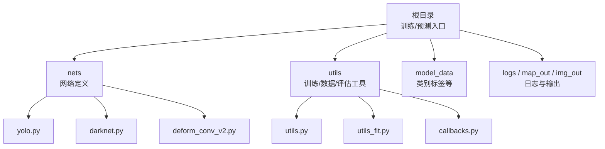
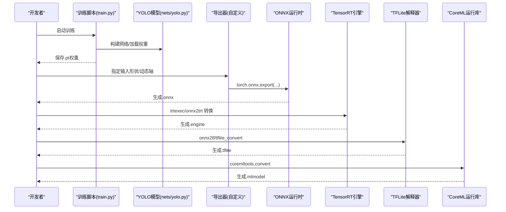
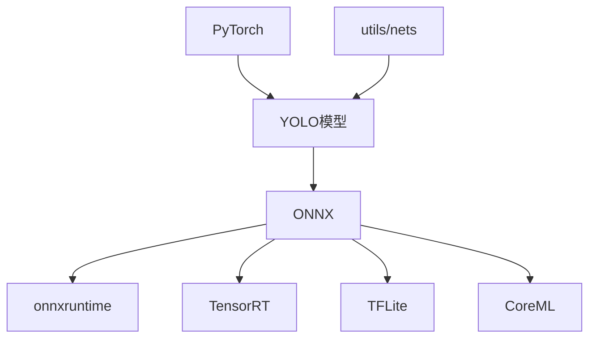

# 模型导出与部署

<cite>
**本文引用的文件**   
- [README.md](file://README.md)
- [requirements.txt](file://requirements.txt)
- [train.py](file://train.py)
- [yolo.py](file://yolo.py)
- [nets/yolo.py](file://nets/yolo.py)
- [nets/darknet.py](file://nets/darknet.py)
- [nets/deform_conv_v2.py](file://nets/deform_conv_v2.py)
- [utils/utils.py](file://utils/utils.py)
- [utils/utils_fit.py](file://utils/utils_fit.py)
- [utils/callbacks.py](file://utils/callbacks.py)
</cite>

## 目录
1. [简介](#简介)
2. [项目结构](#项目结构)
3. [核心组件](#核心组件)
4. [架构总览](#架构总览)
5. [详细组件分析](#详细组件分析)
6. [依赖关系分析](#依赖关系分析)
7. [性能考量](#性能考量)
8. [故障排查指南](#故障排查指南)
9. [结论](#结论)
10. [附录](#附录)

## 简介
本文件面向TogetherNet项目的模型导出与部署，目标是提供从PyTorch训练好的权重到多平台推理的完整路径：包括ONNX、TensorRT、TFLite、CoreML等格式的转换步骤与优化要点；量化（权重量化/激活量化）与量化感知训练（QAT）方法；剪枝与压缩技术；移动端（Android/iOS）与嵌入式设备（树莓派、Jetson Nano）部署实践；以及容器化与服务编排的最佳实践。文档在保持技术深度的同时，尽量以可操作的方式呈现，便于不同背景的读者快速上手。

## 项目结构
TogetherNet采用典型的YOLO系列目标检测工程组织方式：网络定义集中在nets目录，训练与工具函数位于utils目录，根目录包含训练入口、预测脚本与依赖说明。

图表来源
- [README.md:1-200](file://README.md#L1-L200)
- [requirements.txt:1-200](file://requirements.txt#L1-L200)
- [train.py:1-200](file://train.py#L1-L200)
- [yolo.py:1-200](file://yolo.py#L1-L200)
- [nets/yolo.py:1-200](file://nets/yolo.py#L1-L200)
- [nets/darknet.py:1-200](file://nets/darknet.py#L1-L200)
- [nets/deform_conv_v2.py:1-200](file://nets/deform_conv_v2.py#L1-L200)
- [utils/utils.py:1-200](file://utils/utils.py#L1-L200)
- [utils/utils_fit.py:1-200](file://utils/utils_fit.py#L1-L200)
- [utils/callbacks.py:1-200](file://utils/callbacks.py#L1-L200)

章节来源
- [README.md:1-200](file://README.md#L1-L200)
- [requirements.txt:1-200](file://requirements.txt#L1-L200)
- [train.py:1-200](file://train.py#L1-L200)
- [yolo.py:1-200](file://yolo.py#L1-L200)

## 核心组件
- 训练入口与流程控制：负责加载配置、构建数据集、初始化模型、执行训练循环与保存权重。
- YOLO网络实现：基于Darknet骨干与YOLO头，支持Deformable Conv等增强算子。
- 训练辅助工具：损失计算、后处理、可视化回调、指标统计等。

章节来源
- [train.py:1-200](file://train.py#L1-L200)
- [yolo.py:1-200](file://yolo.py#L1-L200)
- [nets/yolo.py:1-200](file://nets/yolo.py#L1-L200)
- [nets/darknet.py:1-200](file://nets/darknet.py#L1-L200)
- [nets/deform_conv_v2.py:1-200](file://nets/deform_conv_v2.py#L1-L200)
- [utils/utils_fit.py:1-200](file://utils/utils_fit.py#L1-L200)
- [utils/callbacks.py:1-200](file://utils/callbacks.py#L1-L200)

## 架构总览
下图展示从训练到导出的端到端流程，涵盖PyTorch权重导出为ONNX，再进一步转换为TensorRT/TFLite/CoreML，并用于各平台推理。

图表来源
- [train.py:1-200](file://train.py#L1-L200)
- [yolo.py:1-200](file://yolo.py#L1-L200)
- [nets/yolo.py:1-200](file://nets/yolo.py#L1-L200)

## 详细组件分析

### 组件A：PyTorch模型导出为ONNX
- 关键步骤
  - 准备模型与权重：确保模型处于eval模式，关闭dropout/batchnorm更新。
  - 定义输入形状：固定或动态维度（如batch、宽高），注意与后续部署框架兼容。
  - 导出设置：opset版本、动态轴、导出后检查（onnx.checker）。
  - 导出后验证：使用onnxruntime进行前向一致性校验。
- 常见优化
  - 算子替换：将不支持的算子替换为等价实现，避免导出失败。
  - 图优化：onnx-simplifier、onnxoptimizer减少冗余节点。
  - 输入归一化：将预处理放入模型内部，简化部署侧逻辑。
- 注意事项
  - Deformable Conv等自定义算子需确保ONNX算子可用或已注册扩展。
  - 动态尺寸会影响某些后端优化效果，建议先固定尺寸验证。

章节来源
- [nets/deform_conv_v2.py:1-200](file://nets/deform_conv_v2.py#L1-L200)
- [nets/yolo.py:1-200](file://nets/yolo.py#L1-L200)
- [yolo.py:1-200](file://yolo.py#L1-L200)

### 组件B：ONNX转TensorRT
- 关键步骤
  - 安装TensorRT与相关Python包。
  - 使用onnx2trt或trtexec将.onnx转为.engine。
  - 选择精度：FP32/FP16/INT8（需校准集）。
- 优化选项
  - FP16加速：在支持的设备上显著提速，精度损失通常可控。
  - INT8量化：需要校准数据集，追求极致吞吐时考虑。
  - 层融合与插件：针对YOLO后处理编写TRT插件可获得更大收益。
- 性能特点
  - 高吞吐低延迟，适合服务器端GPU推理。
  - 对动态shape支持有限，建议固定输入尺寸以获得最佳性能。

章节来源
- [nets/yolo.py:1-200](file://nets/yolo.py#L1-L200)
- [yolo.py:1-200](file://yolo.py#L1-L200)

### 组件C：ONNX转TFLite
- 关键步骤
  - 使用onnx2tf或tflite_convert完成转换。
  - 配置量化策略：全整型、混合精度或仅权重量化。
  - 生成.tflite模型并进行基准测试。
- 优化选项
  - 权重量化（int8）：减小体积，提升CPU/NPU速度。
  - 动态范围量化：无需校准集，但可能精度略降。
  - 算子白名单：确保所有算子在TFLite中受支持。
- 性能特点
  - 跨平台（Android/iOS/Linux），适合边缘与移动端。
  - 对复杂算子支持有限，必要时使用自定义算子。

章节来源
- [nets/yolo.py:1-200](file://nets/yolo.py#L1-L200)
- [yolo.py:1-200](file://yolo.py#L1-L200)

### 组件D：ONNX转CoreML
- 关键步骤
  - 使用coremltools将.onnx转为.mlmodel。
  - 配置ComputePrecision（FP32/FP16）、启用NNFramework或Metal后端。
  - 在iOS/macOS设备上验证推理结果与性能。
- 优化选项
  - 模型压缩与量化：根据设备能力选择合适精度。
  - 输入规格：适配iPhone/iPad典型分辨率，减少内存占用。
- 性能特点
  - 充分利用Apple NPU/GPU，低功耗高能效。
  - 对动态shape支持较弱，建议固定输入。

章节来源
- [nets/yolo.py:1-200](file://nets/yolo.py#L1-L200)
- [yolo.py:1-200](file://yolo.py#L1-L200)

### 组件E：模型量化与量化感知训练（QAT）
- 离线量化（PTQ）
  - 权重量化：对权重张量进行int8量化，减少存储与带宽。
  - 激活量化：对中间特征进行量化，需校准集估计分布。
  - 混合精度：部分层保留FP16/FP32，平衡精度与速度。
- 量化感知训练（QAT）
  - 在训练过程中插入伪量化节点，模拟推理时的量化误差。
  - 学习量化参数（缩放因子、零点），提高量化后精度。
  - 适用于对精度敏感的场景，如小目标检测。
- 实施建议
  - 先做PTQ验证基线，再进行QAT微调。
  - 针对不同后端（TRT/TFLite/CoreML）分别调优量化策略。

章节来源
- [utils/utils_fit.py:1-200](file://utils/utils_fit.py#L1-L200)
- [utils/callbacks.py:1-200](file://utils/callbacks.py#L1-L200)

### 组件F：模型剪枝与压缩
- 结构化剪枝
  - 通道级/滤波器级剪枝，保持卷积结构规整，利于硬件加速。
  - 结合重训练恢复精度。
- 非结构化剪枝
  - 稀疏权重，配合稀疏推理库获得加速，但通用性受限。
- 知识蒸馏
  - 用大模型指导小模型训练，提升小模型精度。
- 压缩与打包
  - 权重压缩（如gzip）、模型格式优化（如ONNX Runtime Graph Optimization）。

章节来源
- [nets/yolo.py:1-200](file://nets/yolo.py#L1-L200)
- [utils/utils_fit.py:1-200](file://utils/utils_fit.py#L1-L200)

### 组件G：移动端部署（Android/iOS）
- Android
  - 使用TFLite或TensorFlow Lite GPU Delegate/NPU Delegate。
  - 集成步骤：添加依赖、加载.tflite、预处理图像、调用推理、后处理NMS。
  - 性能调优：多线程、批处理、内存池、图片尺寸适配。
- iOS
  - 使用Core ML框架加载.mlmodel。
  - 集成步骤：导入模型、构建VNImageRequestOptions、调用Vision框架进行推理。
  - 性能调优：利用Metal后端、减少主线程阻塞、合理缓存。

章节来源
- [yolo.py:1-200](file://yolo.py#L1-L200)
- [utils/utils.py:1-200](file://utils/utils.py#L1-L200)

### 组件H：嵌入式设备部署（树莓派/Jetson Nano）
- 树莓派
  - 推荐TFLite CPU/NPU（若可用）或OpenVINO（Intel平台）。
  - 优化：降低输入分辨率、启用线程并行、使用int8量化。
- Jetson Nano
  - 使用TensorRT或DeepStream进行加速。
  - 优化：FP16/INT8、流水线并行、批量推理。
- 通用建议
  - 固定输入尺寸、裁剪无关区域、减少IO开销。
  - 监控温度与功耗，避免过热降频。

章节来源
- [nets/yolo.py:1-200](file://nets/yolo.py#L1-L200)
- [utils/utils.py:1-200](file://utils/utils.py#L1-L200)

### 组件I：容器化部署与服务编排
- Docker镜像构建
  - 基础镜像：选择轻量且含CUDA/cuDNN或CPU-only镜像。
  - 环境依赖：通过requirements.txt安装Python包。
  - 模型打包：将权重与配置文件一并纳入镜像。
- 服务编排
  - 使用docker-compose管理多实例与资源限制。
  - 暴露REST/gRPC接口，统一请求格式与错误码。
- 最佳实践
  - 多阶段构建减小镜像体积。
  - 健康检查与自动重启。
  - 日志与指标采集（Prometheus/Grafana）。

章节来源
- [requirements.txt:1-200](file://requirements.txt#L1-L200)
- [train.py:1-200](file://train.py#L1-L200)

## 依赖关系分析
TogetherNet的依赖主要集中在PyTorch生态与可选的部署工具链。训练与导出流程依赖以下关键包：
- PyTorch与torchvision：模型构建与训练。
- ONNX与onnxruntime：导出与验证。
- TensorRT：高性能GPU推理。
- TensorFlow/TFLite：移动端与边缘部署。
- coremltools：iOS/macOS部署。
- 其他：numpy、opencv、matplotlib等数据处理与可视化。

图表来源
- [requirements.txt:1-200](file://requirements.txt#L1-L200)
- [nets/yolo.py:1-200](file://nets/yolo.py#L1-L200)
- [yolo.py:1-200](file://yolo.py#L1-L200)

章节来源
- [requirements.txt:1-200](file://requirements.txt#L1-L200)
- [nets/yolo.py:1-200](file://nets/yolo.py#L1-L200)
- [yolo.py:1-200](file://yolo.py#L1-L200)

## 性能考量
- 输入尺寸与分辨率：增大分辨率提升mAP但增加延迟，需权衡业务需求。
- 精度选择：FP16在多数GPU上性价比最高；INT8需校准与回归测试。
- 批处理与并发：服务端适当批处理提升吞吐；移动端谨慎批处理避免卡顿。
- I/O优化：预取图像、异步解码、内存复用。
- 算子支持：优先使用后端原生支持的算子，减少自定义算子带来的开销。

[本节为通用指导，不直接分析具体文件]

## 故障排查指南
- 导出失败
  - 检查ONNX opset版本与算子支持，必要时降级或替换算子。
  - 使用onnx.checker与onnxruntime验证模型完整性。
- 精度下降
  - 对比导出前后推理结果，定位差异较大的层。
  - 调整量化策略（混合精度/校准集大小/步长）。
- 部署崩溃
  - 确认输入形状与数据类型一致。
  - 检查内存占用与线程数，避免OOM。
- 性能不达预期
  - 开启后端优化（如TRT FP16、TFLite Delegate）。
  - 减少不必要的Python层，将预处理下沉至模型内。

章节来源
- [utils/utils.py:1-200](file://utils/utils.py#L1-L200)
- [utils/callbacks.py:1-200](file://utils/callbacks.py#L1-L200)

## 结论
TogetherNet提供了完整的YOLO目标检测训练与推理基础。通过系统化的导出与部署流程，可将PyTorch模型高效迁移至多种后端，覆盖服务器、移动端与嵌入式场景。结合量化、剪枝与压缩技术，可在保证精度的前提下显著降低体积与延迟。容器化与服务编排则有助于规模化部署与运维。

[本节为总结，不直接分析具体文件]

## 附录
- 术语表
  - PTQ：离线量化
  - QAT：量化感知训练
  - NMS：非极大值抑制
  - Delegate：推理后端加速器
- 参考命令（概念性）
  - ONNX导出：torch.onnx.export(...)
  - TensorRT转换：trtexec --onnx=model.onnx --saveEngine=model.engine
  - TFLite转换：onnx2tf model.onnx
  - CoreML转换：coremltools.convert(model="model.onnx")

[本节为补充信息，不直接分析具体文件]