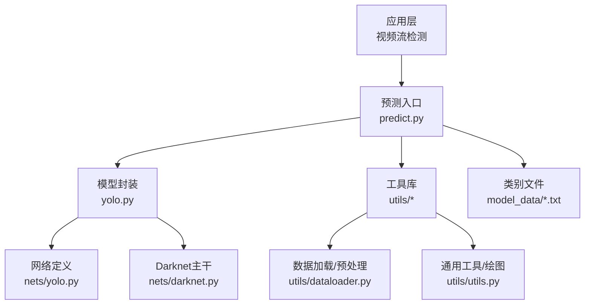
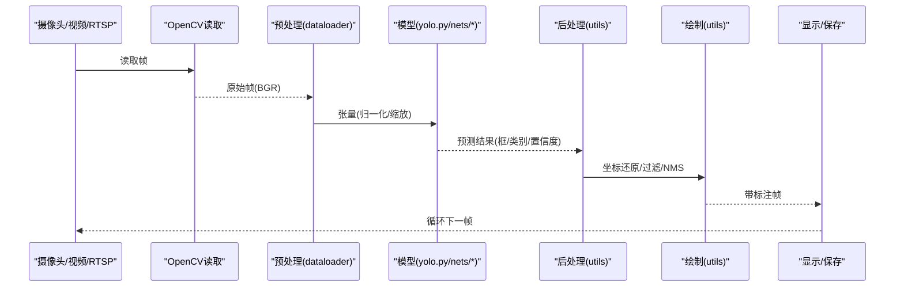
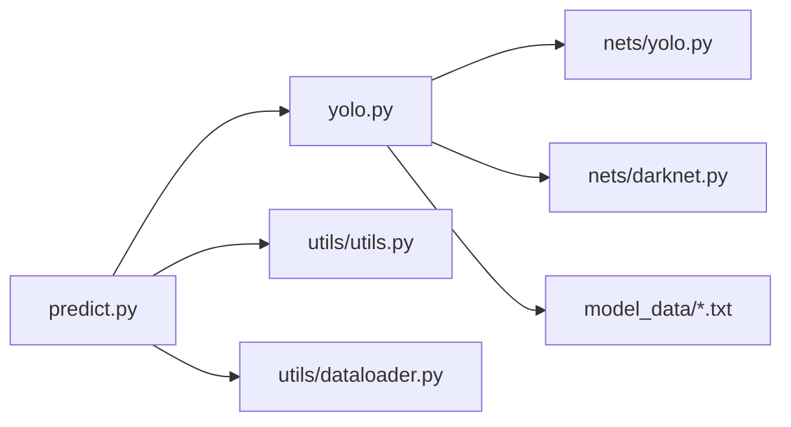

# 视频流实时检测

<cite>
**本文引用的文件**   
- [README.md](file://README.md)
- [yolo.py](file://yolo.py)
- [predict.py](file://predict.py)
- [nets/yolo.py](file://nets/yolo.py)
- [nets/darknet.py](file://nets/darknet.py)
- [utils/utils.py](file://utils/utils.py)
- [utils/dataloader.py](file://utils/dataloader.py)
- [model_data/coco_classes.txt](file://model_data/coco_classes.txt)
</cite>

## 目录
1. [简介](#简介)
2. [项目结构](#项目结构)
3. [核心组件](#核心组件)
4. [架构总览](#架构总览)
5. [详细组件分析](#详细组件分析)
6. [依赖关系分析](#依赖关系分析)
7. [性能考虑](#性能考虑)
8. [故障排查指南](#故障排查指南)
9. [结论](#结论)
10. [附录](#附录)

## 简介
本指南面向TogetherNet项目的视频流实时目标检测实现，聚焦于使用OpenCV读取摄像头或视频文件、进行实时帧检测与可视化，并给出关键优化策略（帧率控制、缓冲区管理、内存泄漏防护）、多路输入支持（本地摄像头、网络摄像头、RTSP）、推理加速与并行处理、编码解码优化、跨硬件部署注意事项，以及监控指标收集与视频质量评估方法。文档在解释总体思路的同时，结合仓库中现有模型与工具模块，提供可落地的工程化建议与参考路径。

## 项目结构
TogetherNet采用“模型定义 + 训练/预测脚本 + 工具库”的分层组织方式：
- 模型与训练：nets目录下包含YOLO主干与训练相关逻辑；yolo_training.py用于训练流程。
- 预测入口：根目录的predict.py提供单图/批量预测能力，便于扩展为视频流处理。
- 工具库：utils下包含数据加载、后处理、绘图等通用函数，可直接复用至视频管线。
- 权重与类别：model_data存放预训练权重与类别标签文件。

图表来源
- [predict.py](file://predict.py)
- [yolo.py](file://yolo.py)
- [nets/yolo.py](file://nets/yolo.py)
- [nets/darknet.py](file://nets/darknet.py)
- [utils/utils.py](file://utils/utils.py)
- [utils/dataloader.py](file://utils/dataloader.py)
- [model_data/coco_classes.txt](file://model_data/coco_classes.txt)

章节来源
- [README.md](file://README.md)

## 核心组件
- 预测入口 predict.py：负责加载模型、执行推理、输出检测结果，是扩展视频流处理的天然入口。
- 模型封装 yolo.py：封装YOLO模型的加载、前向推理与结果解析，供上层调用。
- 网络定义 nets/yolo.py 与 nets/darknet.py：定义YOLO结构与Darknet主干，决定推理计算量与精度权衡。
- 工具库 utils：
  - dataloader.py：图像预处理、尺寸缩放、归一化等，对视频帧预处理至关重要。
  - utils.py：绘图、坐标变换、非极大值抑制等后处理工具，适合直接用于视频可视化。
- 类别文件 model_data/*.txt：提供类别映射，用于标注框文本显示。

章节来源
- [predict.py](file://predict.py)
- [yolo.py](file://yolo.py)
- [nets/yolo.py](file://nets/yolo.py)
- [nets/darknet.py](file://nets/darknet.py)
- [utils/utils.py](file://utils/utils.py)
- [utils/dataloader.py](file://utils/dataloader.py)
- [model_data/coco_classes.txt](file://model_data/coco_classes.txt)

## 架构总览
下图展示从视频源到可视化的端到端流水线，强调实时性关键点：输入解复用、预处理、推理、后处理、绘制与输出。

图表来源
- [predict.py](file://predict.py)
- [yolo.py](file://yolo.py)
- [nets/yolo.py](file://nets/yolo.py)
- [nets/darknet.py](file://nets/darknet.py)
- [utils/utils.py](file://utils/utils.py)
- [utils/dataloader.py](file://utils/dataloader.py)

## 详细组件分析

### 视频输入与解码优化
- 输入类型
  - 本地摄像头：通过设备索引打开，需设置分辨率与缓冲大小。
  - 网络摄像头：使用HTTP URL打开，注意超时与重试。
  - RTSP流：使用rtsp://URL打开，建议启用硬件解码与缓冲队列。
- 解码与缓冲
  - 使用OpenCV的VideoCapture时，合理设置CAP_PROP_BUFFERSIZE以降低延迟。
  - 对于高码率或高分辨率流，优先启用GPU解码（如FFmpeg+CUDA）以减少CPU占用。
- 帧率控制
  - 根据目标FPS动态调整等待时间，避免忙等。
  - 若后端帧率不稳定，可采用丢帧策略保证实时性。

章节来源
- [utils/dataloader.py](file://utils/dataloader.py)
- [utils/utils.py](file://utils/utils.py)

### 预处理与推理
- 预处理
  - 将BGR帧转换为模型所需格式（RGB/灰度），按模型输入尺寸缩放，并进行归一化。
  - 推荐批量化预处理以利用GPU并行。
- 推理
  - 通过yolo.py加载模型权重并执行前向推理。
  - 针对TensorRT/CUDA环境，启用FP16/INT8量化与静态形状缓存。
- 并行
  - 使用多线程或多进程分离“读取-预处理-推理-后处理-绘制”，配合无锁队列减少阻塞。

章节来源
- [yolo.py](file://yolo.py)
- [nets/yolo.py](file://nets/yolo.py)
- [nets/darknet.py](file://nets/darknet.py)
- [utils/dataloader.py](file://utils/dataloader.py)

### 后处理与可视化
- 后处理
  - 坐标还原至原图尺度，依据置信度阈值与IoU阈值进行过滤与非极大值抑制。
  - 合并多尺度或多次推理结果（可选）。
- 可视化
  - 使用utils中的绘图函数在原图上绘制边界框、类别与置信度。
  - 支持叠加FPS、延迟统计等元信息。

章节来源
- [utils/utils.py](file://utils/utils.py)
- [yolo.py](file://yolo.py)

### 输出与存储
- 显示
  - 使用OpenCV窗口显示，注意在多显示器/远程桌面场景下的兼容性。
- 保存
  - 使用VideoWriter写入MP4/H.264，选择合适的编码器与码率，必要时开启硬件编码。
  - 分片保存与断点续写，避免长时间运行导致磁盘压力过大。

章节来源
- [utils/utils.py](file://utils/utils.py)

### 完整视频流检测示例（步骤说明）
以下为端到端步骤，便于快速落地：
- 初始化输入源
  - 选择摄像头索引、网络摄像头URL或RTSP地址。
  - 配置缓冲大小与超时参数。
- 构建处理管线
  - 创建生产者-消费者线程：生产者读取并预处理帧，消费者执行推理与可视化。
  - 使用固定容量队列缓冲帧，防止背压导致卡顿。
- 执行推理与后处理
  - 调用yolo.py进行推理，返回框、类别与置信度。
  - 使用utils进行NMS与坐标还原。
- 可视化与输出
  - 绘制标注与统计信息，显示或写入视频文件。
- 资源管理
  - 异常捕获与优雅退出，释放VideoCapture/Writer与模型句柄。
  - 定期清理中间对象，避免内存增长。

章节来源
- [predict.py](file://predict.py)
- [yolo.py](file://yolo.py)
- [utils/utils.py](file://utils/utils.py)
- [utils/dataloader.py](file://utils/dataloader.py)

### 多摄像头与多路流处理
- 多路并发
  - 每路独立线程与队列，统一调度到共享推理服务（GPU上下文共享）。
  - 动态分配GPU显存，避免OOM。
- 负载均衡
  - 根据各路分辨率与复杂度动态调整采样频率或跳过帧。
- 同步与对齐
  - 如需多路融合，基于时间戳对齐，丢弃过期帧。

章节来源
- [yolo.py](file://yolo.py)
- [utils/utils.py](file://utils/utils.py)

### 网络摄像头与RTSP接入
- 网络摄像头
  - 使用HTTP URL打开，设置超时与重试机制，弱网环境下降级分辨率。
- RTSP
  - 启用TCP传输与缓冲队列，降低抖动影响。
  - 若可用，使用硬件解码器（如FFmpeg CUDA）提升吞吐。

章节来源
- [utils/dataloader.py](file://utils/dataloader.py)

### 实时性优化策略
- 模型轻量化
  - 选择更小的骨干网络或剪枝后的权重，平衡精度与速度。
- 推理加速
  - 使用TensorRT/ONNX Runtime/TensorFlow Lite等后端，启用FP16/INT8。
  - 固定输入形状，预热模型，减少首次推理开销。
- 并行处理
  - 流水线并行：读取、预处理、推理、后处理、绘制分别在不同线程/进程中执行。
  - 批处理：在低延迟要求下适度批处理以提升吞吐。
- 编码解码优化
  - 解码：优先硬件解码，关闭不必要的色彩空间转换。
  - 编码：使用H.264/H.265硬件编码，调整码率与GOP长度。

章节来源
- [nets/yolo.py](file://nets/yolo.py)
- [nets/darknet.py](file://nets/darknet.py)
- [utils/utils.py](file://utils/utils.py)

### 不同硬件平台部署注意事项
- CPU
  - 使用多线程与SIMD优化，限制分辨率与FPS，避免过载。
- NVIDIA GPU
  - 启用CUDA与TensorRT，合理设置batch size与workspace大小。
- Jetson/嵌入式
  - 使用JetPack提供的TensorRT与V4L2硬件编解码，严格控制内存峰值。
- macOS/Intel核显
  - 使用Metal后端或CoreML导出模型，减少CPU负载。

章节来源
- [yolo.py](file://yolo.py)
- [nets/yolo.py](file://nets/yolo.py)

### 监控指标收集与视频质量评估
- 实时指标
  - FPS、端到端延迟、各阶段耗时（预处理/推理/后处理/绘制）。
  - 内存与显存占用、丢帧率、队列长度。
- 质量评估
  - mAP/Precision/Recall/F1：离线评估集上计算。
  - 主观质量：PSNR/SSIM对比原图与处理后图（可选）。
- 采集与上报
  - 使用轻量级日志或Prometheus Exporter暴露指标，便于可视化与告警。

章节来源
- [utils/utils.py](file://utils/utils.py)
- [get_map.py](file://get_map.py)

## 依赖关系分析
下图展示主要模块间的依赖关系，有助于理解扩展点与耦合度。

图表来源
- [predict.py](file://predict.py)
- [yolo.py](file://yolo.py)
- [nets/yolo.py](file://nets/yolo.py)
- [nets/darknet.py](file://nets/darknet.py)
- [utils/utils.py](file://utils/utils.py)
- [utils/dataloader.py](file://utils/dataloader.py)
- [model_data/coco_classes.txt](file://model_data/coco_classes.txt)

章节来源
- [predict.py](file://predict.py)
- [yolo.py](file://yolo.py)
- [nets/yolo.py](file://nets/yolo.py)
- [nets/darknet.py](file://nets/darknet.py)
- [utils/utils.py](file://utils/utils.py)
- [utils/dataloader.py](file://utils/dataloader.py)
- [model_data/coco_classes.txt](file://model_data/coco_classes.txt)

## 性能考虑
- 输入端
  - 降低分辨率、启用硬件解码、合理设置缓冲与超时。
- 模型端
  - 选择轻量模型、量化与算子融合、固定输入形状、预热。
- 管线端
  - 流水线并行、无锁队列、丢帧策略、动态降频。
- 输出端
  - 硬件编码、按需录制、分片存储。
- 资源端
  - 监控内存/显存，及时回收临时对象，避免碎片化。

[本节为通用指导，不直接分析具体文件]

## 故障排查指南
- 无法打开摄像头/RTSP
  - 检查权限、URL格式、网络连通性与超时设置。
  - 尝试切换传输协议（TCP/UDP）与缓冲大小。
- 卡顿与掉帧
  - 降低分辨率或FPS，启用硬件编解码，增加队列容量。
  - 检查CPU/GPU占用，避免其他进程抢占资源。
- 内存泄漏
  - 确保VideoCapture/Writer正确释放，避免循环内重复创建大对象。
  - 使用析构或上下文管理器管理资源生命周期。
- 推理慢
  - 切换到TensorRT/ONNX Runtime，启用FP16/INT8，预热模型。
  - 减少后处理复杂度，合并NMS与过滤逻辑。
- 可视化异常
  - 检查坐标还原与边界框裁剪，避免越界访问。
  - 确认颜色空间与通道顺序一致。

章节来源
- [utils/utils.py](file://utils/utils.py)
- [utils/dataloader.py](file://utils/dataloader.py)
- [yolo.py](file://yolo.py)

## 结论
通过将OpenCV视频输入与TogetherNet的YOLO推理管线结合，可实现稳定高效的实时目标检测。关键在于合理的输入解码、预处理与后处理优化，以及多线程/多进程流水线的并行设计。结合硬件加速与量化技术，可在多种平台上达到良好的实时性与稳定性。建议在工程中引入完善的监控与评估体系，持续跟踪性能与质量指标。

[本节为总结性内容，不直接分析具体文件]

## 附录
- 参考入口与模块
  - 预测入口：predict.py
  - 模型封装：yolo.py
  - 网络定义：nets/yolo.py、nets/darknet.py
  - 工具库：utils/utils.py、utils/dataloader.py
  - 类别文件：model_data/coco_classes.txt

章节来源
- [predict.py](file://predict.py)
- [yolo.py](file://yolo.py)
- [nets/yolo.py](file://nets/yolo.py)
- [nets/darknet.py](file://nets/darknet.py)
- [utils/utils.py](file://utils/utils.py)
- [utils/dataloader.py](file://utils/dataloader.py)
- [model_data/coco_classes.txt](file://model_data/coco_classes.txt)