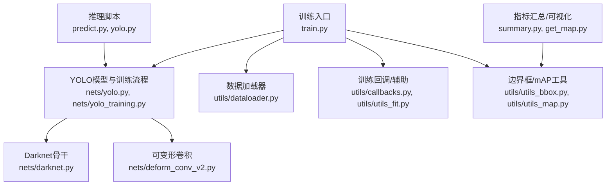
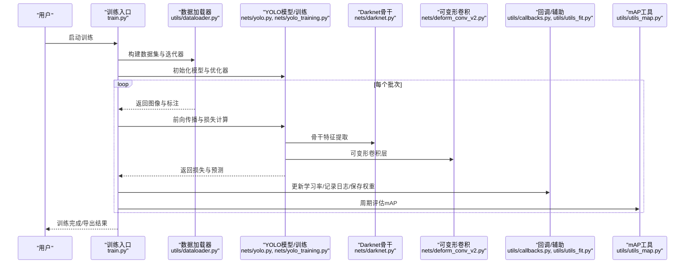
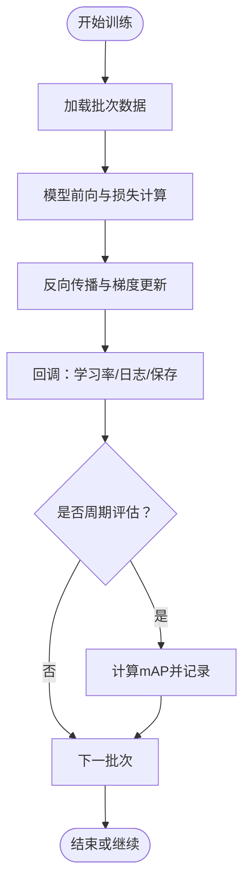
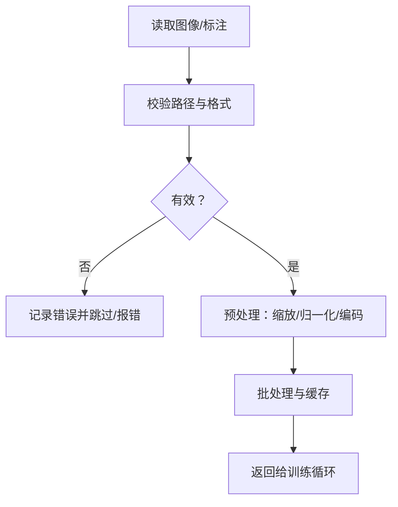
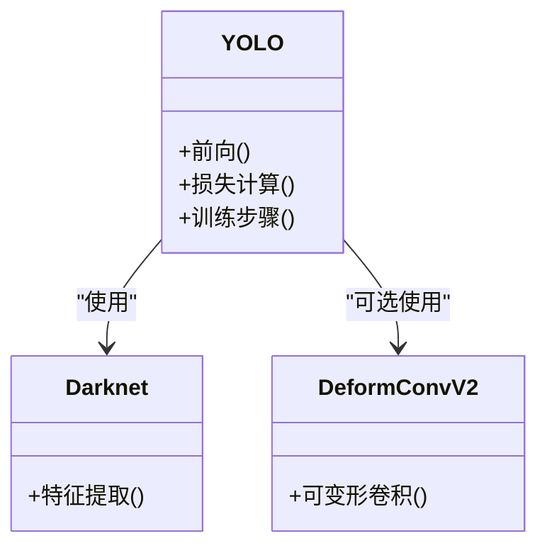
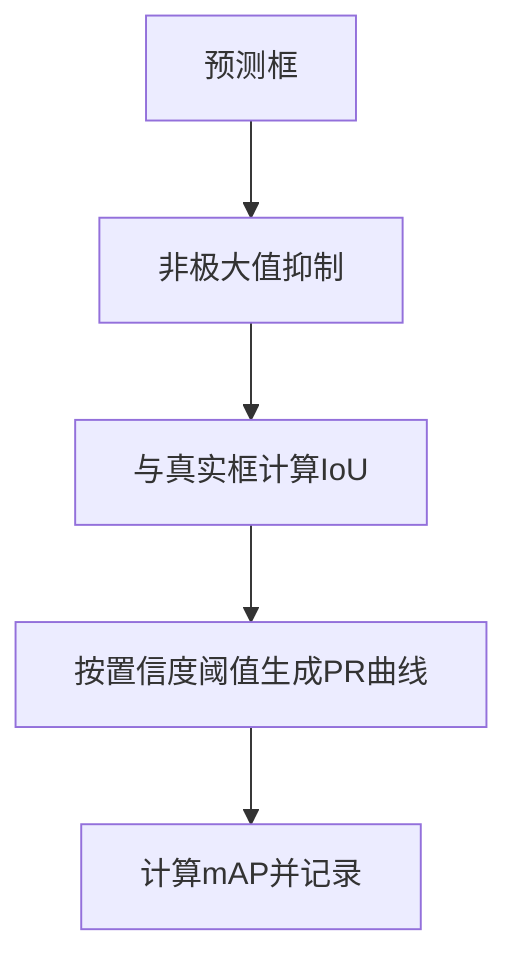
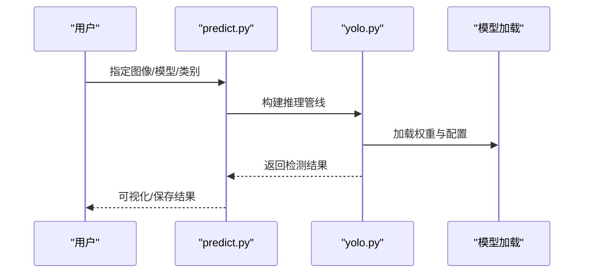

# 故障排除

<cite>
**本文引用的文件**   
- [README.md](file://README.md)
- [requirements.txt](file://requirements.txt)
- [train.py](file://train.py)
- [yolo.py](file://yolo.py)
- [predict.py](file://predict.py)
- [nets/yolo_training.py](file://nets/yolo_training.py)
- [nets/darknet.py](file://nets/darknet.py)
- [nets/deform_conv_v2.py](file://nets/deform_conv_v2.py)
- [utils/utils_fit.py](file://utils/utils_fit.py)
- [utils/callbacks.py](file://utils/callbacks.py)
- [utils/dataloader.py](file://utils/dataloader.py)
- [utils/utils_bbox.py](file://utils/utils_bbox.py)
- [utils/utils_map.py](file://utils/utils_map.py)
- [get_map.py](file://get_map.py)
- [summary.py](file://summary.py)
</cite>

## 目录
1. [简介](#简介)
2. [项目结构](#项目结构)
3. [核心组件](#核心组件)
4. [架构总览](#架构总览)
5. [详细组件分析](#详细组件分析)
6. [依赖与兼容性分析](#依赖与兼容性分析)
7. [性能考虑](#性能考虑)
8. [故障排除指南](#故障排除指南)
9. [结论](#结论)
10. [附录](#附录)

## 简介
本指南面向TogetherNet项目的开发与部署人员，聚焦于环境配置、依赖冲突、CUDA/驱动版本兼容、训练阶段常见错误（梯度爆炸、过拟合、收敛缓慢）、推理阶段常见问题（显存不足、形状不匹配、性能瓶颈）的诊断与解决策略。同时提供调试技巧、日志分析、性能剖析与内存泄漏检测建议，并给出问题报告模板与信息收集清单，帮助快速定位和解决问题。

## 项目结构
TogetherNet采用模块化组织：网络定义与训练逻辑位于nets目录，数据加载与工具函数位于utils目录，入口脚本包括训练、预测、评估与可视化等。关键路径如下：
- 训练入口：train.py
- 模型与训练流程：nets/yolo.py、nets/yolo_training.py
- 骨干网络：nets/darknet.py
- 可变形卷积实现：nets/deform_conv_v2.py
- 数据加载与预处理：utils/dataloader.py
- 训练回调与辅助：utils/callbacks.py、utils/utils_fit.py
- 边界框与mAP计算：utils/utils_bbox.py、utils/utils_map.py
- 推理脚本：predict.py、yolo.py
- 指标汇总与可视化：summary.py、get_map.py
- 依赖与环境：requirements.txt、README.md

图表来源
- [train.py](file://train.py)
- [yolo.py](file://yolo.py)
- [nets/yolo_training.py](file://nets/yolo_training.py)
- [nets/darknet.py](file://nets/darknet.py)
- [nets/deform_conv_v2.py](file://nets/deform_conv_v2.py)
- [utils/dataloader.py](file://utils/dataloader.py)
- [utils/callbacks.py](file://utils/callbacks.py)
- [utils/utils_fit.py](file://utils/utils_fit.py)
- [utils/utils_bbox.py](file://utils/utils_bbox.py)
- [utils/utils_map.py](file://utils/utils_map.py)
- [predict.py](file://predict.py)
- [summary.py](file://summary.py)
- [get_map.py](file://get_map.py)

章节来源
- [README.md](file://README.md)
- [requirements.txt](file://requirements.txt)
- [train.py](file://train.py)
- [yolo.py](file://yolo.py)
- [predict.py](file://predict.py)
- [nets/yolo_training.py](file://nets/yolo_training.py)
- [nets/darknet.py](file://nets/darknet.py)
- [nets/deform_conv_v2.py](file://nets/deform_conv_v2.py)
- [utils/dataloader.py](file://utils/dataloader.py)
- [utils/callbacks.py](file://utils/callbacks.py)
- [utils/utils_fit.py](file://utils/utils_fit.py)
- [utils/utils_bbox.py](file://utils/utils_bbox.py)
- [utils/utils_map.py](file://utils/utils_map.py)
- [summary.py](file://summary.py)
- [get_map.py](file://get_map.py)

## 核心组件
- 训练入口与流程控制：负责解析参数、构建数据集、初始化模型与优化器、执行训练循环与验证、保存权重与日志。
- YOLO模型与训练：包含模型前向、损失计算、标签分配与训练步骤封装。
- Darknet骨干：提供特征提取主干，影响感受野与表达能力。
- 可变形卷积：增强形变目标检测能力，需关注算子可用性与数值稳定性。
- 数据加载与预处理：图像读取、缩放、归一化、标注解析与批处理。
- 训练回调与辅助：学习率调度、早停、日志记录、指标统计与可视化。
- 边界框与mAP：NMS、IoU计算、PR曲线与mAP评估。
- 推理脚本：单图/批量推理、结果后处理与可视化输出。
- 指标汇总与可视化：训练过程指标聚合与绘图。

章节来源
- [train.py](file://train.py)
- [nets/yolo_training.py](file://nets/yolo_training.py)
- [nets/yolo.py](file://yolo.py)
- [nets/darknet.py](file://nets/darknet.py)
- [nets/deform_conv_v2.py](file://nets/deform_conv_v2.py)
- [utils/dataloader.py](file://utils/dataloader.py)
- [utils/callbacks.py](file://utils/callbacks.py)
- [utils/utils_fit.py](file://utils/utils_fit.py)
- [utils/utils_bbox.py](file://utils/utils_bbox.py)
- [utils/utils_map.py](file://utils/utils_map.py)
- [predict.py](file://predict.py)
- [summary.py](file://summary.py)

## 架构总览
下图展示训练与推理的关键调用关系与数据流，便于定位异常发生位置。

图表来源
- [train.py](file://train.py)
- [utils/dataloader.py](file://utils/dataloader.py)
- [nets/yolo.py](file://yolo.py)
- [nets/yolo_training.py](file://nets/yolo_training.py)
- [nets/darknet.py](file://nets/darknet.py)
- [nets/deform_conv_v2.py](file://nets/deform_conv_v2.py)
- [utils/callbacks.py](file://utils/callbacks.py)
- [utils/utils_fit.py](file://utils/utils_fit.py)
- [utils/utils_map.py](file://utils/utils_map.py)

## 详细组件分析

### 训练流程与回调
- 训练循环通常包含：数据迭代、前向计算、损失反传、优化器更新、指标统计与权重保存。
- 回调模块负责学习率调度、早停、日志写入、TensorBoard或本地图表生成。
- 常见问题：
  - 学习率过大导致损失震荡或NaN；过小导致收敛缓慢。
  - 早停条件过于敏感导致提前终止。
  - 日志缺失或路径权限问题导致无法保存。

图表来源
- [train.py](file://train.py)
- [utils/callbacks.py](file://utils/callbacks.py)
- [utils/utils_fit.py](file://utils/utils_fit.py)
- [utils/utils_map.py](file://utils/utils_map.py)

章节来源
- [train.py](file://train.py)
- [utils/callbacks.py](file://utils/callbacks.py)
- [utils/utils_fit.py](file://utils/utils_fit.py)
- [utils/utils_map.py](file://utils/utils_map.py)

### 数据加载与预处理
- 负责图像读取、尺寸调整、归一化、标注格式转换与批处理。
- 常见问题：
  - 路径错误或权限不足导致读取失败。
  - 标注文件格式不一致或类别索引越界。
  - 多进程加载引发内存峰值或死锁。

图表来源
- [utils/dataloader.py](file://utils/dataloader.py)

章节来源
- [utils/dataloader.py](file://utils/dataloader.py)

### 模型与骨干网络
- YOLO模型整合Darknet骨干与检测头，支持可变形卷积以增强形变目标表征。
- 常见问题：
  - 输入尺寸与锚点/网格不匹配导致形状错误。
  - 可变形卷积算子不可用或精度不稳定。
  - 权重加载失败或类别数不一致。

图表来源
- [nets/yolo.py](file://yolo.py)
- [nets/darknet.py](file://nets/darknet.py)
- [nets/deform_conv_v2.py](file://nets/deform_conv_v2.py)

章节来源
- [nets/yolo.py](file://yolo.py)
- [nets/darknet.py](file://nets/darknet.py)
- [nets/deform_conv_v2.py](file://nets/deform_conv_v2.py)

### 边界框与mAP评估
- 提供NMS、IoU计算、阈值扫描与PR曲线绘制，用于训练期验证与最终评估。
- 常见问题：
  - NMS阈值设置不当导致漏检或误检。
  - 类别映射不一致导致mAP为0或异常。
  - 评估集划分不合理导致指标失真。

图表来源
- [utils/utils_bbox.py](file://utils/utils_bbox.py)
- [utils/utils_map.py](file://utils/utils_map.py)

章节来源
- [utils/utils_bbox.py](file://utils/utils_bbox.py)
- [utils/utils_map.py](file://utils/utils_map.py)

### 推理脚本
- 负责加载预训练权重、执行前向、后处理（NMS、坐标还原）与可视化输出。
- 常见问题：
  - 输入尺寸与训练不一致导致形状不匹配。
  - 类别配置文件与权重不匹配。
  - 显存不足导致OOM。

图表来源
- [predict.py](file://predict.py)
- [yolo.py](file://yolo.py)

章节来源
- [predict.py](file://predict.py)
- [yolo.py](file://yolo.py)

## 依赖与兼容性分析
- Python与深度学习框架版本需满足requirements.txt要求。
- CUDA/cuDNN版本应与PyTorch/TensorFlow版本匹配，避免算子缺失或性能退化。
- 可变形卷积可能依赖特定扩展或自定义算子，需确认编译与运行时库一致。

章节来源
- [requirements.txt](file://requirements.txt)
- [nets/deform_conv_v2.py](file://nets/deform_conv_v2.py)

## 性能考虑
- 数据加载：合理设置workers与缓存，避免I/O瓶颈。
- 批大小：在显存允许范围内增大以提升吞吐，但注意梯度稳定性。
- 混合精度：启用半精度训练/推理提升速度，注意数值稳定与loss scaling。
- 模型裁剪：移除不必要分支或降低分辨率以减少计算量。
- 评估频率：减少频繁mAP计算对训练速度的影响。

[本节为通用指导，无需具体文件引用]

## 故障排除指南

### 环境与依赖问题
- 症状：导入失败、找不到模块、CUDA不可用。
- 排查步骤：
  - 检查Python与依赖版本是否符合requirements.txt。
  - 验证CUDA/cuDNN与框架版本匹配。
  - 确认可变形卷积扩展已正确安装且与当前CUDA版本兼容。
- 解决方案：
  - 重建虚拟环境并按顺序安装依赖。
  - 升级或降级CUDA/cuDNN至推荐组合。
  - 重新编译自定义算子或切换回标准卷积进行对比测试。

章节来源
- [requirements.txt](file://requirements.txt)
- [nets/deform_conv_v2.py](file://nets/deform_conv_v2.py)

### 训练阶段典型错误

#### 梯度爆炸或NaN损失
- 识别：损失骤增或出现NaN；梯度范数异常大。
- 原因：学习率过大、数值溢出、未做梯度裁剪、数据异常值。
- 解决：
  - 降低学习率或使用更稳健的调度策略。
  - 启用梯度裁剪与混合精度的loss scaling。
  - 清洗数据、检查标注范围与归一化。
  - 逐步缩小批大小观察稳定性。

章节来源
- [train.py](file://train.py)
- [utils/callbacks.py](file://utils/callbacks.py)
- [utils/utils_fit.py](file://utils/utils_fit.py)

#### 过拟合
- 识别：训练损失持续下降而验证指标停滞或下降。
- 原因：模型容量过大、数据不足、正则不足。
- 解决：
  - 增加数据增强与多样性。
  - 引入权重衰减、Dropout或早停。
  - 减小模型复杂度或冻结部分骨干层。

章节来源
- [utils/callbacks.py](file://utils/callbacks.py)
- [utils/utils_map.py](file://utils/utils_map.py)

#### 收敛缓慢
- 识别：损失下降缓慢、mAP长期无提升。
- 原因：学习率过小、数据质量差、评估噪声大。
- 解决：
  - 使用预热与余弦退火等调度。
  - 检查数据标注与类别分布。
  - 调整评估频率与窗口，避免短期波动误导。

章节来源
- [train.py](file://train.py)
- [utils/callbacks.py](file://utils/callbacks.py)

#### 形状不匹配与维度错误
- 识别：前向时报错张量维度不一致。
- 原因：输入尺寸、锚点/网格、类别数与配置不一致。
- 解决：
  - 统一训练与推理的输入尺寸与类别配置。
  - 核对anchor与网格设置是否与数据尺度匹配。
  - 检查权重文件与类别映射一致性。

章节来源
- [nets/yolo.py](file://yolo.py)
- [nets/yolo_training.py](file://nets/yolo_training.py)
- [utils/dataloader.py](file://utils/dataloader.py)

#### 数据加载错误
- 识别：读取失败、索引越界、多进程卡住。
- 原因：路径错误、权限不足、标注格式不一致、workers过多。
- 解决：
  - 校验路径与权限，修复标注格式。
  - 降低workers数量或禁用多进程定位问题。
  - 添加数据校验与异常重试机制。

章节来源
- [utils/dataloader.py](file://utils/dataloader.py)

### 推理阶段常见错误

#### 显存不足（OOM）
- 识别：进程被系统杀死或抛出显存不足错误。
- 原因：批大小过大、输入分辨率过高、模型过大。
- 解决：
  - 减小批大小与输入分辨率。
  - 启用半精度推理与梯度卸载（如适用）。
  - 分批推理或滑动窗口策略。

章节来源
- [predict.py](file://predict.py)
- [yolo.py](file://yolo.py)

#### 形状不匹配
- 识别：推理时维度错误。
- 原因：输入尺寸与训练不一致、类别配置不同。
- 解决：
  - 严格对齐训练与推理的配置与权重。
  - 在推理前对输入进行统一预处理。

章节来源
- [predict.py](file://predict.py)
- [yolo.py](file://yolo.py)

#### 性能瓶颈
- 识别：推理速度慢、CPU占用高。
- 原因：数据I/O慢、后处理复杂、未利用GPU加速。
- 解决：
  - 优化数据加载与预处理流水线。
  - 使用更快的NMS实现或GPU加速版本。
  - 模型量化或剪枝以降低延迟。

章节来源
- [utils/utils_bbox.py](file://utils/utils_bbox.py)
- [utils/utils_map.py](file://utils/utils_map.py)

### 调试技巧与工具
- 日志分析：
  - 开启详细日志级别，记录损失、梯度范数、学习率与指标。
  - 定期轮转日志文件，避免磁盘占满。
- 性能剖析：
  - 使用框架内置profiler或外部工具（如Nsight Systems）定位热点。
  - 分离数据加载、前向、后处理耗时，针对性优化。
- 内存泄漏检测：
  - 监控显存与进程内存增长趋势。
  - 释放中间变量、关闭不必要的缓存与句柄。
  - 在小数据集上复现问题，缩短诊断时间。

章节来源
- [utils/callbacks.py](file://utils/callbacks.py)
- [summary.py](file://summary.py)

### 社区反馈的典型问题与解决方案
- 可变形卷积算子不可用：
  - 现象：运行时报缺少算子或CUDA版本不匹配。
  - 解决：确认CUDA/cuDNN与算子编译版本一致；必要时回退到标准卷积验证。
- 类别文件与权重不匹配：
  - 现象：推理结果为空或mAP为0。
  - 解决：核对类别文件与权重对应的类别数与顺序。
- 多进程数据加载卡死：
  - 现象：训练启动后长时间无进展。
  - 解决：降低workers数量或禁用多进程，逐步恢复定位问题。

章节来源
- [nets/deform_conv_v2.py](file://nets/deform_conv_v2.py)
- [utils/dataloader.py](file://utils/dataloader.py)
- [utils/utils_map.py](file://utils/utils_map.py)

### 性能优化最佳实践
- 数据侧：
  - 使用高效图像解码与缓存，减少重复IO。
  - 动态数据增强与随机裁剪，提高泛化。
- 模型侧：
  - 选择合适的主干与颈部结构，平衡精度与速度。
  - 使用混合精度与梯度累积提升吞吐。
- 训练侧：
  - 合理的warmup与余弦退火学习率策略。
  - 周期性评估与早停结合，避免无效训练。
- 推理侧：
  - 批量推理与流水线并行。
  - 模型量化与部署优化（ONNX/TensorRT等）。

[本节为通用指导，无需具体文件引用]

## 结论
通过系统化地梳理环境、依赖、训练与推理阶段的常见问题及解决策略，并结合日志分析与性能剖析工具，可显著提升TogetherNet项目的开发效率与稳定性。建议在团队内建立统一的调试规范与问题报告模板，确保问题可复现、信息完整、定位迅速。

[本节为总结性内容，无需具体文件引用]

## 附录

### 问题报告模板与信息收集清单
- 基本信息
  - 操作系统与内核版本
  - Python与依赖版本（参考requirements.txt）
  - CUDA/cuDNN与框架版本
  - GPU型号与显存大小
- 复现步骤
  - 命令与参数
  - 数据路径与样本说明
  - 期望行为与实际行为
- 日志与指标
  - 训练/推理日志片段
  - 损失曲线与mAP变化
  - 性能剖析结果（热点函数与耗时）
- 错误信息
  - 完整堆栈跟踪
  - 相关配置文件与权重哈希
- 附加材料
  - 最小可复现示例
  - 数据样例与标注片段
  - 相关issue或讨论链接

章节来源
- [requirements.txt](file://requirements.txt)
- [train.py](file://train.py)
- [predict.py](file://predict.py)
- [summary.py](file://summary.py)
- [get_map.py](file://get_map.py)