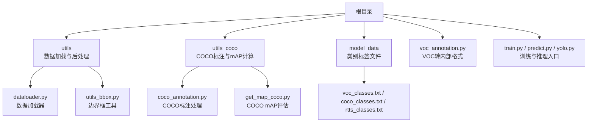
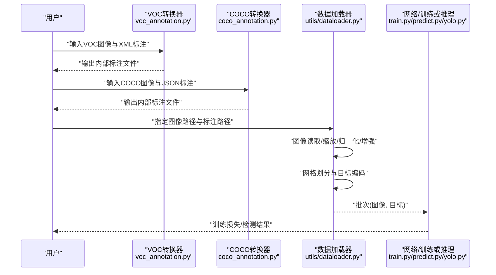
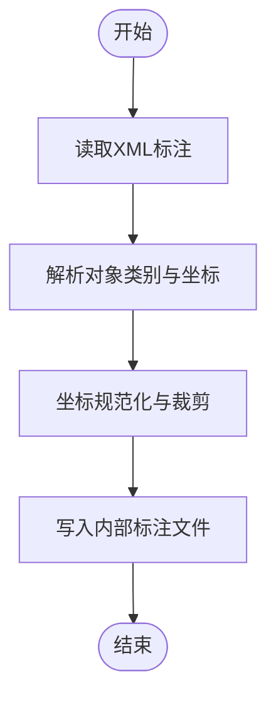
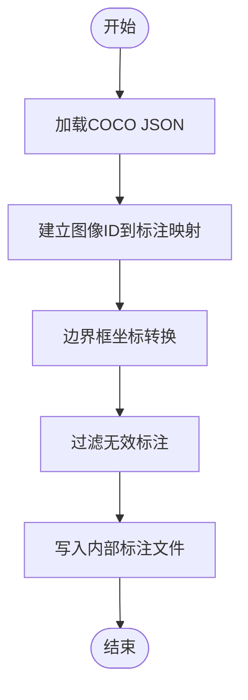
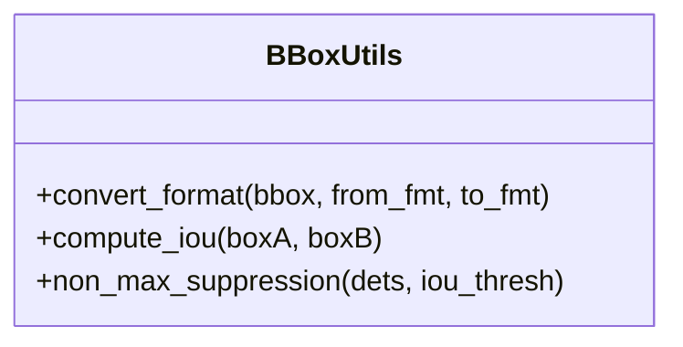
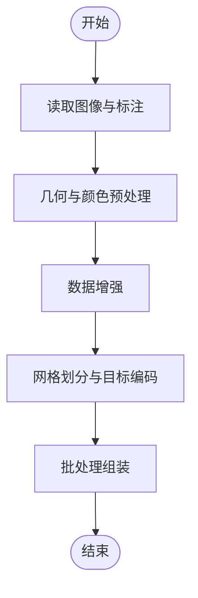
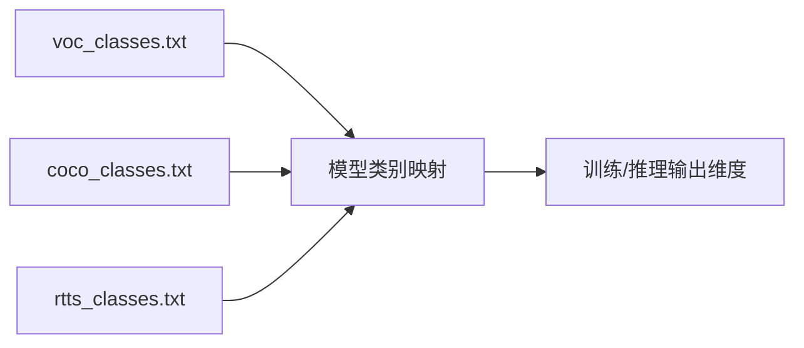
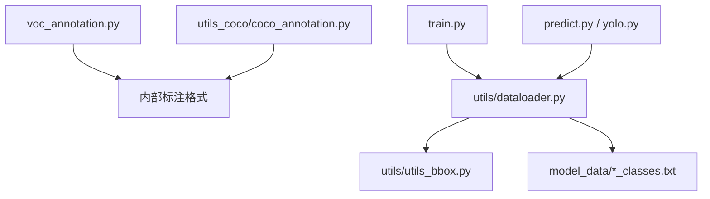

# 数据准备与处理

<cite>
**本文引用的文件**   
- [README.md](file://README.md)
- [train.py](file://train.py)
- [predict.py](file://predict.py)
- [yolo.py](file://yolo.py)
- [voc_annotation.py](file://voc_annotation.py)
- [utils/dataloader.py](file://utils/dataloader.py)
- [utils/utils_bbox.py](file://utils/utils_bbox.py)
- [utils_coco/coco_annotation.py](file://utils_coco/coco_annotation.py)
- [utils_coco/get_map_coco.py](file://utils_coco/get_map_coco.py)
- [model_data/voc_classes.txt](file://model_data/voc_classes.txt)
- [model_data/coco_classes.txt](file://model_data/coco_classes.txt)
- [model_data/rtts_classes.txt](file://model_data/rtts_classes.txt)
</cite>

## 目录
1. [简介](#简介)
2. [项目结构](#项目结构)
3. [核心组件](#核心组件)
4. [架构总览](#架构总览)
5. [详细组件分析](#详细组件分析)
6. [依赖关系分析](#依赖关系分析)
7. [性能考虑](#性能考虑)
8. [故障排查指南](#故障排查指南)
9. [结论](#结论)
10. [附录](#附录)

## 简介
本文件面向TogetherNet的数据准备与处理，覆盖VOC与COCO数据集格式转换、XML与JSON解析、边界框坐标转换、自定义数据集制作规范、数据加载器实现原理（图像预处理、增强策略、批处理）、类别标签管理与多类别检测配置，以及数据质量检查与验证工具使用方法。文档以仓库现有实现为依据，提供可操作的步骤与图示，帮助读者快速构建高质量训练与推理数据管线。

## 项目结构
本项目围绕YOLO系列目标检测任务组织数据与代码：
- VOC相关脚本与类名文件位于根目录与model_data下；
- COCO相关标注与评估脚本位于utils_coco；
- 数据加载与后处理逻辑集中在utils；
- 训练入口在train.py，预测入口在predict.py/yolo.py。

图表来源
- [voc_annotation.py:1-200](file://voc_annotation.py#L1-L200)
- [utils/dataloader.py:1-200](file://utils/dataloader.py#L1-L200)
- [utils/utils_bbox.py:1-200](file://utils/utils_bbox.py#L1-L200)
- [utils_coco/coco_annotation.py:1-200](file://utils_coco/coco_annotation.py#L1-L200)
- [utils_coco/get_map_coco.py:1-200](file://utils_coco/get_map_coco.py#L1-L200)
- [train.py:1-200](file://train.py#L1-L200)
- [predict.py:1-200](file://predict.py#L1-L200)
- [yolo.py:1-200](file://yolo.py#L1-L200)
- [model_data/voc_classes.txt:1-200](file://model_data/voc_classes.txt#L1-L200)
- [model_data/coco_classes.txt:1-200](file://model_data/coco_classes.txt#L1-L200)
- [model_data/rtts_classes.txt:1-200](file://model_data/rtts_classes.txt#L1-L200)

章节来源
- [README.md:1-200](file://README.md#L1-L200)

## 核心组件
- VOC数据转换：将PASCAL VOC的XML标注转换为模型可用的内部格式，便于统一数据加载。
- COCO数据转换：将COCO JSON标注解析为内部格式，支持后续训练与评估。
- 数据加载器：负责图像读取、预处理、增强、归一化、网格划分与批处理。
- 边界框工具：提供坐标格式转换、IoU计算、NMS等基础操作。
- 类别管理：通过txt文件维护类别名称与索引映射，支撑多类别检测。

章节来源
- [voc_annotation.py:1-200](file://voc_annotation.py#L1-L200)
- [utils_coco/coco_annotation.py:1-200](file://utils_coco/coco_annotation.py#L1-L200)
- [utils/dataloader.py:1-200](file://utils/dataloader.py#L1-L200)
- [utils/utils_bbox.py:1-200](file://utils/utils_bbox.py#L1-L200)
- [model_data/voc_classes.txt:1-200](file://model_data/voc_classes.txt#L1-L200)
- [model_data/coco_classes.txt:1-200](file://model_data/coco_classes.txt#L1-L200)
- [model_data/rtts_classes.txt:1-200](file://model_data/rtts_classes.txt#L1-L200)

## 架构总览
下图展示了从原始数据到训练/推理的整体流程：VOC XML与COCO JSON分别经各自转换器转为内部格式，再由数据加载器进行预处理与批处理，最终送入网络进行训练或推理。

图表来源
- [voc_annotation.py:1-200](file://voc_annotation.py#L1-L200)
- [utils_coco/coco_annotation.py:1-200](file://utils_coco/coco_annotation.py#L1-L200)
- [utils/dataloader.py:1-200](file://utils/dataloader.py#L1-L200)
- [train.py:1-200](file://train.py#L1-L200)
- [predict.py:1-200](file://predict.py#L1-L200)
- [yolo.py:1-200](file://yolo.py#L1-L200)

## 详细组件分析

### VOC数据转换（XML标注解析）
- 功能要点
  - 遍历VOC Annotations目录下的XML文件；
  - 解析对象类别与边界框坐标；
  - 将坐标转换为模型所需的格式（如中心宽高或左上右下），并记录图像尺寸；
  - 生成内部标注文件，供数据加载器使用。
- 关键流程
  - 读取XML -> 提取对象列表 -> 坐标规范化 -> 写入内部格式。
- 注意事项
  - 确保类别名称与类别文件一致；
  - 处理缺失或异常标注（空框、越界框）。

图表来源
- [voc_annotation.py:1-200](file://voc_annotation.py#L1-L200)

章节来源
- [voc_annotation.py:1-200](file://voc_annotation.py#L1-L200)

### COCO数据转换（JSON标注处理）
- 功能要点
  - 读取COCO JSON标注；
  - 解析images与annotations信息；
  - 将bbox由[x,y,w,h]转换为所需格式；
  - 生成内部标注文件，用于训练与评估。
- 关键流程
  - 加载JSON -> 建立图像ID到标注映射 -> 坐标转换 -> 输出内部格式。
- 注意事项
  - 过滤无效标注（面积过小、超出图像范围）；
  - 类别映射需与类别文件保持一致。

图表来源
- [utils_coco/coco_annotation.py:1-200](file://utils_coco/coco_annotation.py#L1-L200)

章节来源
- [utils_coco/coco_annotation.py:1-200](file://utils_coco/coco_annotation.py#L1-L200)

### 边界框坐标转换与工具
- 功能要点
  - 支持多种坐标格式互转（如左上右下与中心宽高）；
  - 提供IoU计算、非极大值抑制（NMS）等常用操作；
  - 在数据加载与后处理中复用。
- 典型用法
  - 在VOC/COCO转换阶段进行坐标格式统一；
  - 在训练后处理与推理可视化中进行NMS与坐标还原。

图表来源
- [utils/utils_bbox.py:1-200](file://utils/utils_bbox.py#L1-L200)

章节来源
- [utils/utils_bbox.py:1-200](file://utils/utils_bbox.py#L1-L200)

### 数据加载器（图像预处理、增强与批处理）
- 功能要点
  - 图像读取与解码；
  - 几何变换（缩放、填充、随机裁剪等）；
  - 颜色空间与像素值归一化；
  - 数据增强（翻转、旋转、色彩抖动等）；
  - YOLO网格划分与目标编码；
  - 动态批处理与多线程/多进程加载。
- 关键流程
  - 读取图像与标注 -> 预处理与增强 -> 网格划分 -> 构造批次 -> 返回给训练/推理。

图表来源
- [utils/dataloader.py:1-200](file://utils/dataloader.py#L1-L200)

章节来源
- [utils/dataloader.py:1-200](file://utils/dataloader.py#L1-L200)

### 类别标签管理与多类别检测配置
- 类别文件
  - voc_classes.txt、coco_classes.txt、rtts_classes.txt分别对应不同数据集的类别定义；
  - 每行一个类别名称，顺序即类别索引。
- 配置方法
  - 训练/推理前设置类别文件路径；
  - 确保标注中的类别名称与类别文件一致；
  - 新增类别时同步更新类别文件与标注。
- 多类别检测
  - 类别数量变化会影响网络输出维度；
  - 修改类别文件后需重新训练或微调。

图表来源
- [model_data/voc_classes.txt:1-200](file://model_data/voc_classes.txt#L1-L200)
- [model_data/coco_classes.txt:1-200](file://model_data/coco_classes.txt#L1-L200)
- [model_data/rtts_classes.txt:1-200](file://model_data/rtts_classes.txt#L1-L200)

章节来源
- [model_data/voc_classes.txt:1-200](file://model_data/voc_classes.txt#L1-L200)
- [model_data/coco_classes.txt:1-200](file://model_data/coco_classes.txt#L1-L200)
- [model_data/rtts_classes.txt:1-200](file://model_data/rtts_classes.txt#L1-L200)

### 添加新数据集格式支持的步骤
- 步骤概览
  - 设计内部标注格式（建议包含图像路径、类别索引、边界框坐标）；
  - 编写数据转换器（参考voc_annotation.py与coco_annotation.py）；
  - 在数据加载器中注册新格式的路径解析与读取逻辑；
  - 更新类别文件与配置文件；
  - 运行数据质量检查与可视化验证。
- 参考位置
  - VOC转换示例：[voc_annotation.py:1-200](file://voc_annotation.py#L1-L200)
  - COCO转换示例：[utils_coco/coco_annotation.py:1-200](file://utils_coco/coco_annotation.py#L1-L200)
  - 数据加载器扩展点：[utils/dataloader.py:1-200](file://utils/dataloader.py#L1-L200)

章节来源
- [voc_annotation.py:1-200](file://voc_annotation.py#L1-L200)
- [utils_coco/coco_annotation.py:1-200](file://utils_coco/coco_annotation.py#L1-L200)
- [utils/dataloader.py:1-200](file://utils/dataloader.py#L1-L200)

### 数据质量检查与验证工具
- 统计与可视化
  - 利用COCO mAP评估脚本辅助检查标注完整性与分布：[utils_coco/get_map_coco.py:1-200](file://utils_coco/get_map_coco.py#L1-L200)
  - 在训练/推理过程中观察损失曲线与结果图，定位异常样本。
- 常见问题定位
  - 类别不匹配：核对类别文件与标注类别名称；
  - 坐标越界：检查坐标转换与裁剪逻辑；
  - 标注缺失：确认XML/JSON字段完整。

章节来源
- [utils_coco/get_map_coco.py:1-200](file://utils_coco/get_map_coco.py#L1-L200)

## 依赖关系分析
- 模块耦合
  - 数据转换器（VOC/COCO）独立于加载器，输出内部格式；
  - 加载器依赖边界框工具进行坐标处理；
  - 训练/推理入口依赖加载器与类别文件。
- 外部依赖
  - 图像处理库（如OpenCV/PIL）；
  - 数值计算库（NumPy）；
  - 可选：COCO API用于评估。

图表来源
- [voc_annotation.py:1-200](file://voc_annotation.py#L1-L200)
- [utils_coco/coco_annotation.py:1-200](file://utils_coco/coco_annotation.py#L1-L200)
- [utils/dataloader.py:1-200](file://utils/dataloader.py#L1-L200)
- [utils/utils_bbox.py:1-200](file://utils/utils_bbox.py#L1-L200)
- [train.py:1-200](file://train.py#L1-L200)
- [predict.py:1-200](file://predict.py#L1-L200)
- [yolo.py:1-200](file://yolo.py#L1-L200)
- [model_data/voc_classes.txt:1-200](file://model_data/voc_classes.txt#L1-L200)
- [model_data/coco_classes.txt:1-200](file://model_data/coco_classes.txt#L1-L200)
- [model_data/rtts_classes.txt:1-200](file://model_data/rtts_classes.txt#L1-L200)

章节来源
- [train.py:1-200](file://train.py#L1-L200)
- [predict.py:1-200](file://predict.py#L1-L200)
- [yolo.py:1-200](file://yolo.py#L1-L200)

## 性能考虑
- 数据I/O优化
  - 使用多进程/线程并行读取图像与标注；
  - 预缓存高频访问的元数据（如图像尺寸、类别映射）。
- 预处理与增强
  - 避免重复计算，尽量向量化操作；
  - 合理选择增强强度，平衡多样性与噪声。
- 批处理
  - 根据GPU显存调整batch size；
  - 对变长序列采用padding或分桶策略减少内存浪费。

## 故障排查指南
- 常见错误
  - 类别索引越界：检查类别文件与标注类别一致性；
  - 坐标格式不一致：统一转换函数并确保前后端一致；
  - 标注缺失或损坏：在转换阶段增加健壮性校验。
- 定位方法
  - 打印中间结果（如网格划分后的目标张量形状）；
  - 使用mAP评估脚本快速发现标注问题；
  - 可视化部分检测结果辅助定位。

章节来源
- [utils_coco/get_map_coco.py:1-200](file://utils_coco/get_map_coco.py#L1-L200)

## 结论
TogetherNet的数据管线以“转换-加载-训练/推理”为主线，VOC与COCO分别通过专用转换器产出内部格式，数据加载器完成预处理、增强与批处理，边界框工具提供通用坐标与IoU/NMS能力。通过严格的类别管理与质量检查，可稳定支持多类别检测任务。新增数据集格式时，遵循现有模式即可快速集成。

## 附录
- 推荐标注工具
  - LabelImg、CVAT、Roboflow等，支持导出VOC XML或COCO JSON；
- 目录结构建议
  - images：存放图像文件；
  - Annotations（VOC）或annotations（COCO）：存放对应标注；
  - model_data：存放类别文件；
  - utils与utils_coco：数据处理与评估脚本。
- 实用命令参考
  - 运行VOC转换：执行voc_annotation.py；
  - 运行COCO转换：执行utils_coco/coco_annotation.py；
  - 启动训练：执行train.py；
  - 执行推理：执行predict.py或yolo.py。