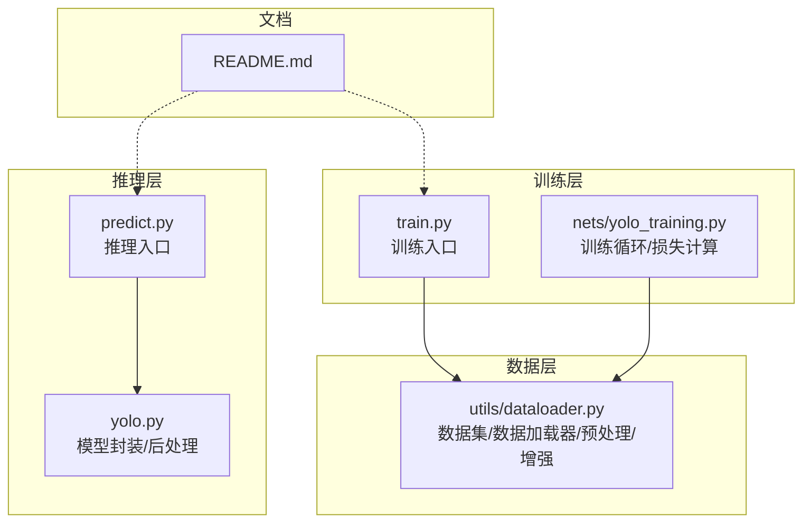
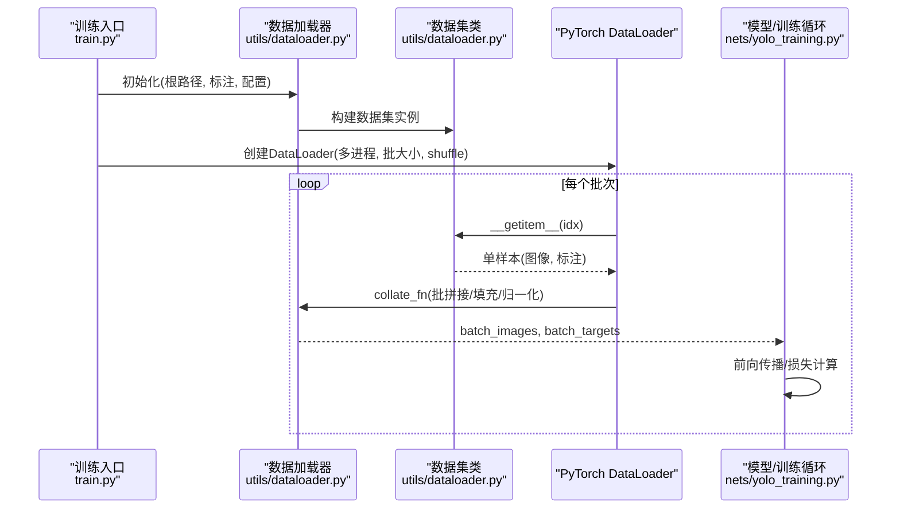
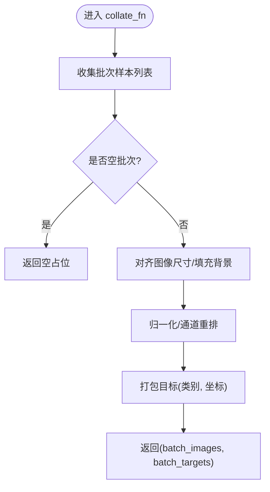
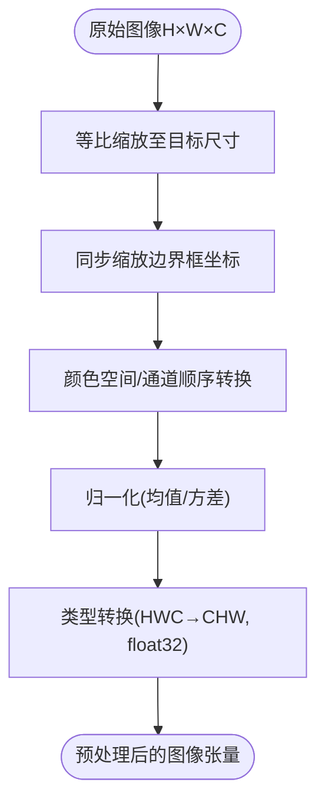
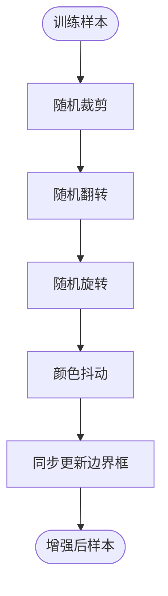
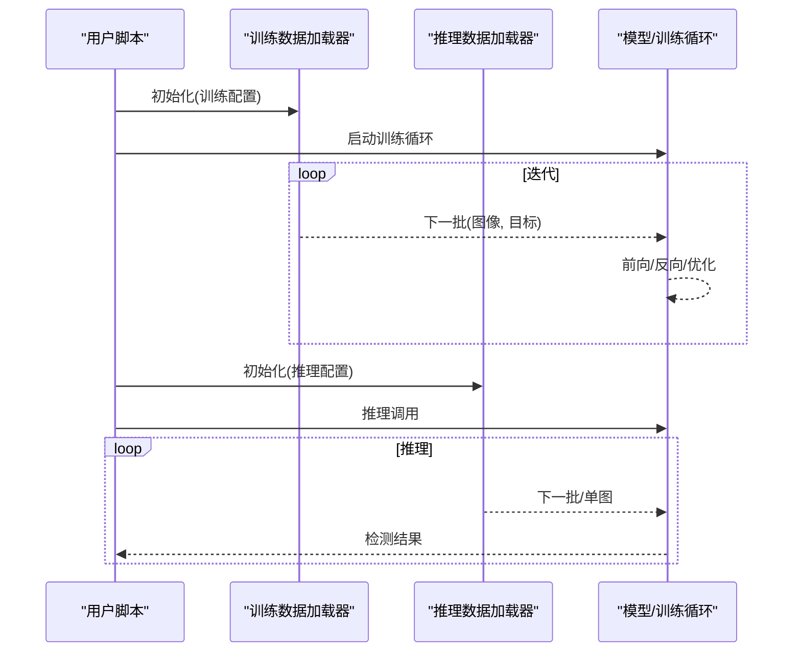
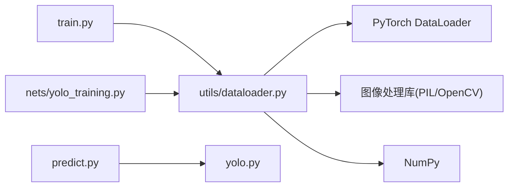

# 数据加载器与预处理

<cite>
**本文引用的文件**   
- [utils/dataloader.py](file://utils/dataloader.py)
- [train.py](file://train.py)
- [predict.py](file://predict.py)
- [yolo.py](file://yolo.py)
- [nets/yolo_training.py](file://nets/yolo_training.py)
- [README.md](file://README.md)
</cite>

## 目录
1. [简介](#简介)
2. [项目结构](#项目结构)
3. [核心组件](#核心组件)
4. [架构总览](#架构总览)
5. [详细组件分析](#详细组件分析)
6. [依赖关系分析](#依赖关系分析)
7. [性能考虑](#性能考虑)
8. [故障排查指南](#故障排查指南)
9. [结论](#结论)
10. [附录](#附录)

## 简介
本文件面向TogetherNet项目的数据加载与预处理子系统，重点围绕 utils/dataloader.py 模块展开，系统阐述：
- PyTorch DataLoader 的定制方式与批处理机制
- 图像预处理的完整流程（尺寸调整、归一化、颜色空间转换等）
- 数据增强策略（随机裁剪、翻转、旋转、颜色抖动等）的实现与应用
- 性能优化建议（多线程加载、内存管理、GPU加速配置）
- 自定义增强的扩展方法
- 调试与监控工具的使用
- 训练与推理场景下的实际使用示例（以路径引用代替代码片段）

## 项目结构
本项目采用“功能分层 + 工具复用”的组织方式。与数据加载和预处理相关的核心位置如下：
- 数据加载与预处理：utils/dataloader.py
- 训练入口与训练循环：train.py、nets/yolo_training.py
- 推理入口与模型封装：predict.py、yolo.py
- 项目说明与依赖：README.md

图表来源
- [utils/dataloader.py](file://utils/dataloader.py)
- [train.py](file://train.py)
- [nets/yolo_training.py](file://nets/yolo_training.py)
- [predict.py](file://predict.py)
- [yolo.py](file://yolo.py)
- [README.md](file://README.md)

章节来源
- [README.md](file://README.md)

## 核心组件
- 数据集类：负责解析标注与图像路径，提供样本索引访问与单条样本的读取与基础预处理。
- 数据加载器：基于 PyTorch DataLoader 的封装，实现多进程数据读取、批拼接、标签对齐与格式统一。
- 预处理流水线：包含尺寸缩放、边界框坐标同步变换、归一化、通道顺序与数据类型转换等。
- 数据增强：在训练阶段可选启用，包括几何变换（裁剪、翻转、旋转）、颜色扰动（亮度、对比度、饱和度、色调）等。
- 批处理与打包：将变长或不同尺寸的样本进行填充/网格化，并生成网络输入张量与目标张量。

章节来源
- [utils/dataloader.py](file://utils/dataloader.py)

## 架构总览
下图展示了从训练/推理入口到数据加载器的调用链路与数据流向。

图表来源
- [train.py](file://train.py)
- [utils/dataloader.py](file://utils/dataloader.py)
- [nets/yolo_training.py](file://nets/yolo_training.py)

## 详细组件分析

### 数据加载器与批处理机制
- 多进程并行读取：通过 DataLoader 的 num_workers 参数开启子进程，降低磁盘I/O瓶颈。
- 动态批拼接：collate_fn 中根据当前批次内样本的尺寸或目标数量进行填充/网格化，保证同批次形状一致。
- 标签对齐：对边界框坐标按图像缩放比例进行同步变换，确保与图像像素坐标系一致。
- 类型与设备：输出张量的 dtype 与通道顺序在网络输入要求下完成转换；设备放置由上层控制。

图表来源
- [utils/dataloader.py](file://utils/dataloader.py)

章节来源
- [utils/dataloader.py](file://utils/dataloader.py)

### 图像预处理流程
- 尺寸调整：将输入图像缩放到网络期望尺寸，同时按比例缩放边界框坐标，保持标注一致性。
- 颜色空间与通道顺序：根据模型需求进行 RGB/BGR 转换与通道重排（如 HWC→CHW）。
- 归一化：按均值与标准差进行标准化，提升训练稳定性与收敛速度。
- 数据类型：转换为浮点张量，必要时进行数值范围映射。

图表来源
- [utils/dataloader.py](file://utils/dataloader.py)

章节来源
- [utils/dataloader.py](file://utils/dataloader.py)

### 数据增强策略
- 几何增强：随机裁剪、水平/垂直翻转、随机旋转等，改变目标位置与外观分布，提高泛化能力。
- 颜色增强：亮度、对比度、饱和度、色调抖动，模拟光照变化与环境差异。
- 组合策略：在训练阶段按概率或固定顺序应用多个增强操作；推理阶段通常关闭增强以保证确定性。
- 标注一致性：所有几何变换需同步更新边界框坐标与可见性，避免越界与无效框。

图表来源
- [utils/dataloader.py](file://utils/dataloader.py)

章节来源
- [utils/dataloader.py](file://utils/dataloader.py)

### 训练与推理中的使用方式
- 训练流程：在训练入口中构造数据集与 DataLoader，传入训练循环；每步从 DataLoader 取批数据送入模型。
- 推理流程：在推理入口中按需构造轻量级数据加载器（可关闭增强与多进程），逐批或单图预测。
- 关键配置项：batch_size、num_workers、shuffle、drop_last、pin_memory 等，依据硬件与数据集规模调优。

图表来源
- [train.py](file://train.py)
- [predict.py](file://predict.py)
- [yolo.py](file://yolo.py)
- [nets/yolo_training.py](file://nets/yolo_training.py)

章节来源
- [train.py](file://train.py)
- [predict.py](file://predict.py)
- [yolo.py](file://yolo.py)
- [nets/yolo_training.py](file://nets/yolo_training.py)

## 依赖关系分析
- 内部依赖：数据加载器主要依赖 PyTorch 的数据集与 DataLoader API；训练/推理入口依赖该模块提供的批数据接口。
- 外部依赖：图像处理库（如 PIL/OpenCV）用于读图与几何/颜色变换；NumPy 用于数组操作。
- 耦合与内聚：数据加载器将“读取-预处理-增强-批打包”集中实现，内聚度高；与训练/推理解耦，便于替换与测试。

图表来源
- [utils/dataloader.py](file://utils/dataloader.py)
- [train.py](file://train.py)
- [nets/yolo_training.py](file://nets/yolo_training.py)
- [predict.py](file://predict.py)
- [yolo.py](file://yolo.py)

章节来源
- [utils/dataloader.py](file://utils/dataloader.py)
- [train.py](file://train.py)
- [nets/yolo_training.py](file://nets/yolo_training.py)
- [predict.py](file://predict.py)
- [yolo.py](file://yolo.py)

## 性能考虑
- 多线程/多进程加载：合理设置 num_workers，避免过多导致上下文切换开销过大；Windows 下注意 spawn 启动方式。
- 内存管理：使用 pin_memory 加速 CPU→GPU 传输；适当增大 batch_size 以提升吞吐，但需关注显存占用。
- I/O 优化：将数据集置于 SSD；若数据量大，考虑缓存常用图像或使用 LMDB/HDF5 等存储格式。
- 预处理卸载：将耗时预处理放在 DataLoader 子进程中，主进程仅做批打包与调度。
- GPU 加速：确保输出为连续内存布局；减少不必要的拷贝与类型转换；利用 torch.utils.data.DataLoader 的 prefetch 特性。
- 监控与诊断：记录 DataLoader 的耗时统计（如每批获取时间、队列长度），定位瓶颈。

[本节为通用指导，不直接分析具体文件]

## 故障排查指南
- 常见错误
  - 维度不匹配：检查尺寸缩放与边界框同步逻辑，确认 CHW/HWC 与 dtype 是否符合模型输入要求。
  - 标注越界：裁剪/旋转后需裁剪掉越界的框，并过滤空框。
  - 多进程崩溃：检查数据路径权限、图像损坏、PIL/OpenCV 版本兼容性。
  - 显存溢出：减小 batch_size 或分辨率，或启用梯度累积。
- 调试技巧
  - 单样本可视化：打印/保存某一批次的图像与叠加的边界框，验证预处理与增强效果。
  - 断点与日志：在 collate_fn 与 __getitem__ 处添加日志，观察输入输出形状与异常值。
  - 最小复现：构造极小数据集与最小 batch，快速定位问题。
- 监控指标
  - DataLoader 吞吐（样本/秒）、平均批耗时、CPU/GPU 利用率、队列积压情况。

章节来源
- [utils/dataloader.py](file://utils/dataloader.py)

## 结论
TogetherNet 的数据加载与预处理模块通过清晰的职责划分与模块化设计，实现了高效、可扩展的训练与推理数据管道。借助多进程加载、合理的预处理流水线与灵活的数据增强策略，可在保证质量的同时显著提升训练效率。结合本文的性能优化与调试建议，开发者可快速定位问题并持续改进数据管道的稳定性与吞吐。

[本节为总结性内容，不直接分析具体文件]

## 附录

### 自定义数据增强的扩展指南
- 步骤概览
  - 新增增强函数：定义接受图像与标注的纯函数，返回变换后的结果。
  - 集成到预处理流水线：在训练分支中按概率或条件调用新增强。
  - 标注一致性校验：确保几何变换后边界框坐标正确更新与越界处理。
  - 单元测试：构造典型样本验证增强前后形状、类型与标注有效性。
- 注意事项
  - 保持函数无副作用，便于多进程安全执行。
  - 控制随机种子，保证可复现实验。
  - 避免过度增强导致标注失真或目标过小。

[本节为概念性指导，不直接分析具体文件]

### 实际使用示例（路径引用）
- 训练配置与启动
  - 参考：[train.py](file://train.py)
- 推理配置与调用
  - 参考：[predict.py](file://predict.py)、[yolo.py](file://yolo.py)
- 数据加载器与预处理实现
  - 参考：[utils/dataloader.py](file://utils/dataloader.py)
- 训练循环与损失计算
  - 参考：[nets/yolo_training.py](file://nets/yolo_training.py)

章节来源
- [train.py](file://train.py)
- [predict.py](file://predict.py)
- [yolo.py](file://yolo.py)
- [utils/dataloader.py](file://utils/dataloader.py)
- [nets/yolo_training.py](file://nets/yolo_training.py)