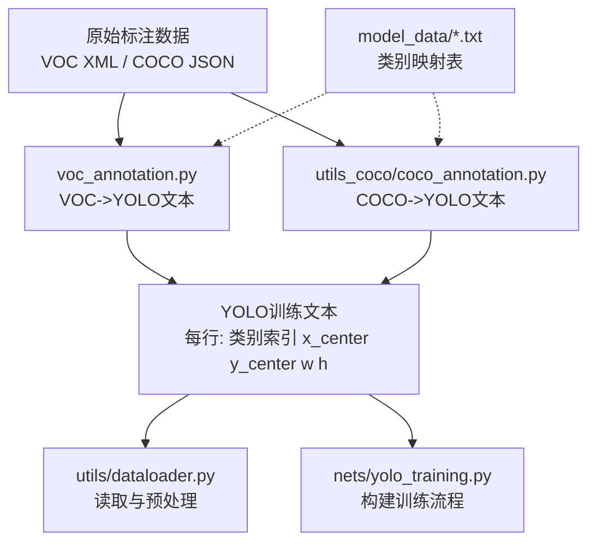
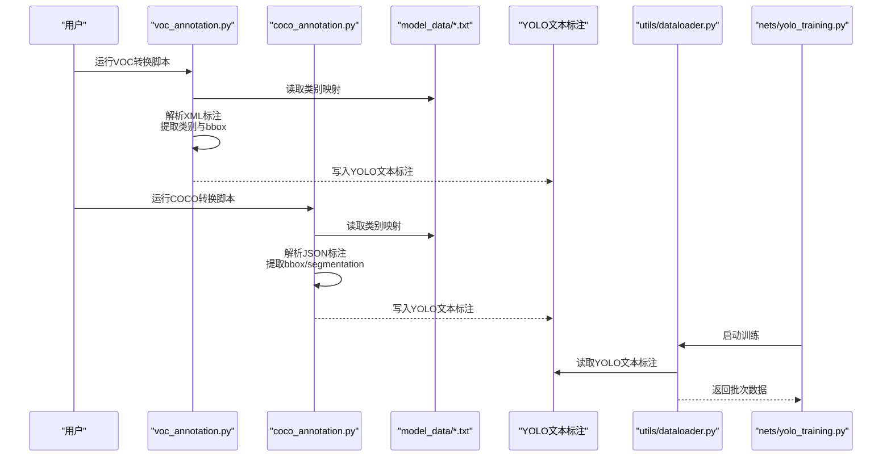
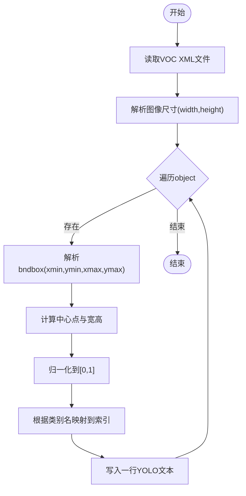
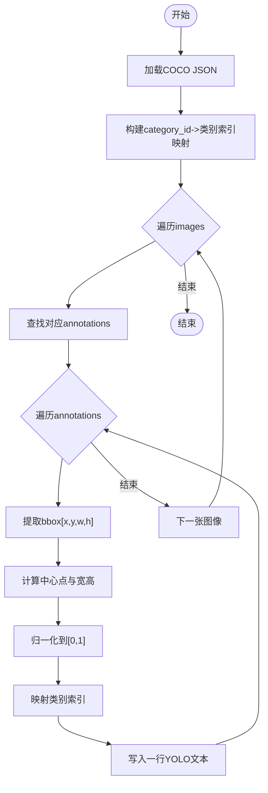
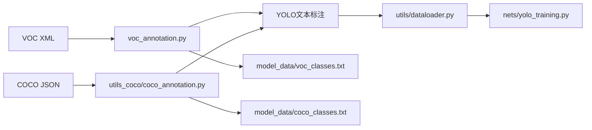

# 数据集格式与转换

<cite>
**本文引用的文件**
- [voc_annotation.py](file://voc_annotation.py)
- [coco_annotation.py](file://utils_coco/coco_annotation.py)
- [dataloader.py](file://utils/dataloader.py)
- [yolo_training.py](file://nets/yolo_training.py)
- [get_map_coco.py](file://utils_coco/get_map_coco.py)
- [model_data/voc_classes.txt](file://model_data/voc_classes.txt)
- [model_data/coco_classes.txt](file://model_data/coco_classes.txt)
</cite>

## 目录
1. [简介](#简介)
2. [项目结构](#项目结构)
3. [核心组件](#核心组件)
4. [架构总览](#架构总览)
5. [详细组件分析](#详细组件分析)
6. [依赖关系分析](#依赖关系分析)
7. [性能考虑](#性能考虑)
8. [故障排查指南](#故障排查指南)
9. [结论](#结论)
10. [附录](#附录)

## 简介
本文件面向TogetherNet项目的数据准备阶段，系统性说明VOC与COCO两种标准数据集的标注规范与结构，并深入解析项目中用于将原始标注转换为YOLO训练所需格式的脚本：voc_annotation.py与coco_annotation.py。文档涵盖XML/JSON标注元素定义、边界框坐标表示、实例分割数据处理、类别映射策略、命令行使用示例以及常见问题诊断与修复方法，帮助读者快速完成从原始标注到模型可接受格式的端到端转换。

## 项目结构
本项目中与数据集格式和转换相关的核心位置如下：
- VOC转换入口：voc_annotation.py
- COCO转换入口：utils_coco/coco_annotation.py
- YOLO训练数据加载：utils/dataloader.py、nets/yolo_training.py
- COCO mAP评估（参考）：utils_coco/get_map_coco.py
- 类别列表：model_data/voc_classes.txt、model_data/coco_classes.txt

图表来源
- [voc_annotation.py](file://voc_annotation.py)
- [coco_annotation.py](file://utils_coco/coco_annotation.py)
- [dataloader.py](file://utils/dataloader.py)
- [yolo_training.py](file://nets/yolo_training.py)
- [model_data/voc_classes.txt](file://model_data/voc_classes.txt)
- [model_data/coco_classes.txt](file://model_data/coco_classes.txt)

章节来源
- [voc_annotation.py](file://voc_annotation.py)
- [coco_annotation.py](file://utils_coco/coco_annotation.py)
- [dataloader.py](file://utils/dataloader.py)
- [yolo_training.py](file://nets/yolo_training.py)
- [model_data/voc_classes.txt](file://model_data/voc_classes.txt)
- [model_data/coco_classes.txt](file://model_data/coco_classes.txt)

## 核心组件
- voc_annotation.py：负责解析VOC风格的XML标注，提取目标类别与边界框，生成YOLO所需的文本标注文件，并输出图像路径清单等辅助文件。
- utils_coco/coco_annotation.py：负责解析COCO风格的JSON标注，支持实例分割数据的提取与处理，进行类别映射，生成YOLO所需的文本标注文件。
- utils/dataloader.py：在训练时读取YOLO文本标注，进行归一化、增强与批处理，供网络训练使用。
- nets/yolo_training.py：整合数据加载与训练流程，驱动模型学习。
- model_data/*.txt：维护类别名称与索引的映射关系，确保不同数据集与模型之间的一致性。

章节来源
- [voc_annotation.py](file://voc_annotation.py)
- [coco_annotation.py](file://utils_coco/coco_annotation.py)
- [dataloader.py](file://utils/dataloader.py)
- [yolo_training.py](file://nets/yolo_training.py)
- [model_data/voc_classes.txt](file://model_data/voc_classes.txt)
- [model_data/coco_classes.txt](file://model_data/coco_classes.txt)

## 架构总览
下图展示了从原始标注到YOLO训练文本的整体流程，包括VOC与COCO两条分支，以及类别映射与数据加载环节。

图表来源
- [voc_annotation.py](file://voc_annotation.py)
- [coco_annotation.py](file://utils_coco/coco_annotation.py)
- [dataloader.py](file://utils/dataloader.py)
- [yolo_training.py](file://nets/yolo_training.py)
- [model_data/voc_classes.txt](file://model_data/voc_classes.txt)
- [model_data/coco_classes.txt](file://model_data/coco_classes.txt)

## 详细组件分析

### VOC标注格式与转换（voc_annotation.py）
- VOC XML标注关键元素
  - annotation：根节点，包含一个图像的完整标注信息。
  - folder、filename、path：图像目录、文件名与路径信息。
  - source：数据来源（database、annotation、image等）。
  - size：图像尺寸（width、height、depth）。
  - object：单个目标对象，包含name（类别）、pose、truncated、occluded、difficult等属性。
  - bndbox：边界框，包含xmin、ymin、xmax、ymax四个角点像素坐标。
- 坐标体系与转换
  - VOC采用左上角为原点的像素坐标；YOLO采用中心点归一化坐标（x_center, y_center, width, height），值域[0,1]，相对于图像宽高。
  - 转换步骤：从bndbox计算中心点与宽高，再除以图像宽高得到归一化坐标。
- 类别映射
  - 通过model_data/voc_classes.txt建立类别名到索引的映射，确保YOLO文本中的类别为整数索引。
- 输出格式
  - 每个图像对应一个YOLO文本文件，每行代表一个目标：类别索引 x_center y_center w h。
  - 同时可能输出图像路径清单，便于后续训练或验证集划分。
- 典型命令行用法
  - 指定VOC根目录、类别列表、输出目录后执行脚本，自动生成YOLO文本标注与路径清单。
  - 示例命令请参考脚本帮助或README中提供的调用方式。

图表来源
- [voc_annotation.py](file://voc_annotation.py)
- [model_data/voc_classes.txt](file://model_data/voc_classes.txt)

章节来源
- [voc_annotation.py](file://voc_annotation.py)
- [model_data/voc_classes.txt](file://model_data/voc_classes.txt)

### COCO标注格式与转换（utils_coco/coco_annotation.py）
- COCO JSON组织方式
  - images：图像元信息（id、file_name、width、height等）。
  - annotations：目标标注集合，每个条目包含id、image_id、category_id、bbox、area、iscrowd等字段。
  - categories：类别定义（id、name、supercategory）。
  - segmentation：可选的实例分割多边形或RLE编码，按annotation顺序与images对齐。
- 边界框坐标表示
  - COCO bbox为[x, y, width, height]，原点位于左上角，单位为像素。
  - 转换为YOLO时需先计算中心点，再进行归一化。
- 实例分割数据处理
  - 若需要保留分割信息，可从segmentation字段提取多边形顶点，并进行必要的几何变换与归一化。
  - 通常YOLOv8-seg等任务会要求将多边形顶点归一化并按特定格式输出；本项目可根据需求扩展。
- 类别映射
  - 通过model_data/coco_classes.txt建立category_id到类别索引的映射，确保YOLO文本中的类别为连续整数索引。
- 输出格式
  - 与VOC一致，生成YOLO文本标注文件，每行包含类别索引与归一化后的中心点及宽高。
  - 如需分割任务，可在同一目录下生成对应的多边形顶点文件（视具体实现而定）。
- 典型命令行用法
  - 指定COCO JSON路径、类别列表、输出目录后执行脚本，自动生成YOLO文本标注。
  - 示例命令请参考脚本帮助或README中提供的调用方式。

图表来源
- [coco_annotation.py](file://utils_coco/coco_annotation.py)
- [model_data/coco_classes.txt](file://model_data/coco_classes.txt)

章节来源
- [coco_annotation.py](file://utils_coco/coco_annotation.py)
- [model_data/coco_classes.txt](file://model_data/coco_classes.txt)

### 数据加载与训练集成（dataloader.py与yolo_training.py）
- dataloader.py负责读取YOLO文本标注，进行图像读取、尺寸缩放、归一化、数据增强与批处理，形成模型输入张量。
- yolo_training.py整合数据加载器与训练循环，驱动模型优化。
- 两者共同保证从标注到训练的无缝衔接。

章节来源
- [dataloader.py](file://utils/dataloader.py)
- [yolo_training.py](file://nets/yolo_training.py)

## 依赖关系分析
- voc_annotation.py与coco_annotation.py均依赖类别映射文件（model_data/*.txt），以确保类别索引一致。
- 生成的YOLO文本标注被dataloader.py读取，作为训练输入。
- get_map_coco.py可作为COCO评估的参考，展示如何基于COCO格式进行mAP计算（与本转换流程互补）。

图表来源
- [voc_annotation.py](file://voc_annotation.py)
- [coco_annotation.py](file://utils_coco/coco_annotation.py)
- [dataloader.py](file://utils/dataloader.py)
- [yolo_training.py](file://nets/yolo_training.py)
- [model_data/voc_classes.txt](file://model_data/voc_classes.txt)
- [model_data/coco_classes.txt](file://model_data/coco_classes.txt)

章节来源
- [voc_annotation.py](file://voc_annotation.py)
- [coco_annotation.py](file://utils_coco/coco_annotation.py)
- [dataloader.py](file://utils/dataloader.py)
- [yolo_training.py](file://nets/yolo_training.py)
- [model_data/voc_classes.txt](file://model_data/voc_classes.txt)
- [model_data/coco_classes.txt](file://model_data/coco_classes.txt)

## 性能考虑
- 批量处理：对大量XML/JSON文件进行解析时，建议启用并行或分块处理以减少I/O等待时间。
- 内存占用：避免一次性加载整个COCO JSON到内存，可采用流式读取或按需访问images/annotations。
- I/O优化：写入YOLO文本时使用缓冲写入，减少频繁磁盘操作。
- 类别映射缓存：将类别映射表预加载为字典，提高查找效率。
- 图像尺寸校验：在转换前检查图像尺寸与标注一致性，避免异常导致重复计算。

## 故障排查指南
- 找不到类别映射文件
  - 现象：脚本报错无法读取model_data/voc_classes.txt或model_data/coco_classes.txt。
  - 解决：确认类别文件路径正确且包含所有使用的类别名称。
- XML/JSON解析错误
  - 现象：XML标签缺失或JSON结构不符合预期。
  - 解决：检查VOC XML是否包含完整的annotation、object、bndbox；检查COCO JSON是否包含images、annotations、categories。
- 边界框越界或无效
  - 现象：xmin>xmax或ymin>ymax，或宽高为负数。
  - 解决：在转换前过滤非法标注，或在脚本中加入合法性校验与日志记录。
- 类别索引不匹配
  - 现象：YOLO文本中的类别索引超出范围。
  - 解决：核对类别映射表与标注中的类别名是否一致，确保索引从0开始且连续。
- 归一化坐标异常
  - 现象：x_center、y_center、w、h不在[0,1]范围内。
  - 解决：检查图像尺寸读取是否正确，确保归一化时除数为非零。
- 实例分割数据缺失
  - 现象：COCO JSON中缺少segmentation字段。
  - 解决：仅处理bbox任务时可忽略；如需分割，请补充segmentation数据或调整脚本逻辑。

章节来源
- [voc_annotation.py](file://voc_annotation.py)
- [coco_annotation.py](file://utils_coco/coco_annotation.py)
- [dataloader.py](file://utils/dataloader.py)
- [yolo_training.py](file://nets/yolo_training.py)

## 结论
通过对VOC与COCO标注规范的梳理与转换脚本的分析，TogetherNet提供了从原始标注到YOLO训练文本的完整链路。遵循本文档的格式说明、坐标约定与类别映射策略，并结合命令行示例与故障排查指南，用户可以高效地完成数据集准备与模型训练。

## 附录
- VOC XML元素速查
  - annotation：根节点
  - folder、filename、path：图像路径信息
  - source：数据来源
  - size：图像尺寸
  - object：目标对象
  - bndbox：边界框坐标
- COCO JSON关键字段
  - images：图像元信息
  - annotations：目标标注
  - categories：类别定义
  - segmentation：实例分割（可选）
- 命令行使用提示
  - VOC转换：指定VOC根目录、类别列表、输出目录后运行voc_annotation.py。
  - COCO转换：指定COCO JSON路径、类别列表、输出目录后运行utils_coco/coco_annotation.py。
  - 具体参数与示例请参考各脚本的帮助信息或项目README。