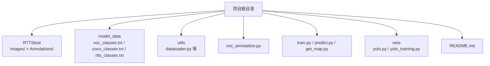
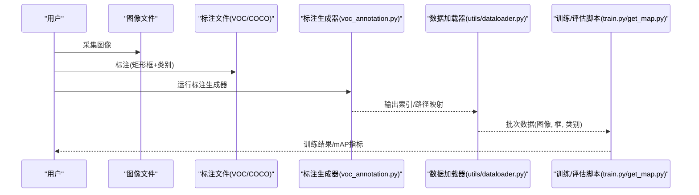
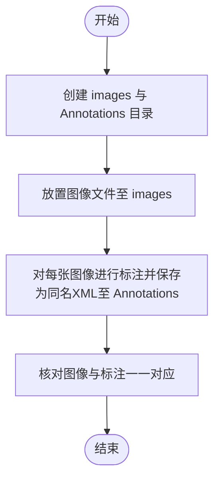
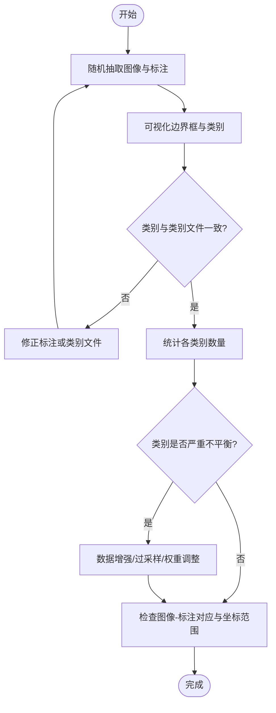
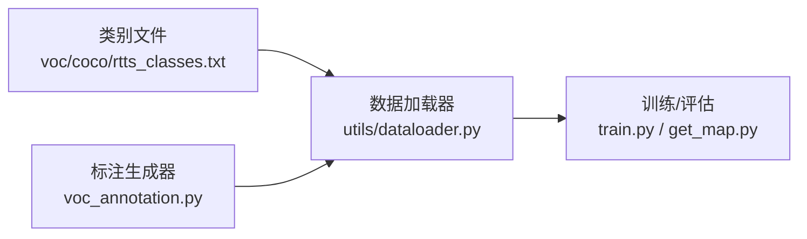

# 自定义数据集制作

<cite>
**本文引用的文件**   
- [README.md](file://README.md)
- [voc_annotation.py](file://voc_annotation.py)
- [utils/dataloader.py](file://utils/dataloader.py)
- [model_data/voc_classes.txt](file://model_data/voc_classes.txt)
- [model_data/coco_classes.txt](file://model_data/coco_classes.txt)
- [model_data/rtts_classes.txt](file://model_data/rtts_classes.txt)
- [RTTStest/Annotations/000001.xml](file://RTTStest/Annotations/000001.xml)
- [RTTStest/images/000001.jpg](file://RTTStest/images/000001.jpg)
</cite>

## 目录
1. [简介](#简介)
2. [项目结构](#项目结构)
3. [核心组件](#核心组件)
4. [架构总览](#架构总览)
5. [详细组件分析](#详细组件分析)
6. [依赖关系分析](#依赖关系分析)
7. [性能考虑](#性能考虑)
8. [故障排查指南](#故障排查指南)
9. [结论](#结论)
10. [附录](#附录)

## 简介
本指南面向TogetherNet项目的用户，提供从零开始构建自定义目标检测数据集的完整流程。内容涵盖数据采集方法、标注工具推荐、目录与文件格式规范、类别标签管理机制（voc_classes.txt、coco_classes.txt、rtts_classes.txt）、多类别检测配置示例、数据质量检查最佳实践，以及一个端到端的项目案例，帮助读者快速搭建高质量的数据集并投入训练与评估。

## 项目结构
TogetherNet采用“图像+标注”分离的组织方式，并提供VOC与COCO两套主流格式的支持。根目录下包含训练脚本、预测脚本、评估脚本与工具模块；模型类别文件集中存放于model_data目录；示例数据位于RTTStest目录，便于理解VOC格式的XML标注与图像对应关系。

图表来源
- [README.md:1-200](file://README.md#L1-L200)
- [voc_annotation.py:1-200](file://voc_annotation.py#L1-L200)
- [utils/dataloader.py:1-200](file://utils/dataloader.py#L1-L200)
- [model_data/voc_classes.txt:1-200](file://model_data/voc_classes.txt#L1-L200)
- [model_data/coco_classes.txt:1-200](file://model_data/coco_classes.txt#L1-L200)
- [model_data/rtts_classes.txt:1-200](file://model_data/rtts_classes.txt#L1-L200)

章节来源
- [README.md:1-200](file://README.md#L1-L200)

## 核心组件
- 数据加载器：负责读取图像与标注，解析坐标与类别，并进行必要的预处理与批处理。
- VOC标注生成器：将VOC XML标注转换为训练所需的索引与路径映射，供数据加载器使用。
- 类别文件：集中管理类别名称列表，确保训练、推理与可视化的一致性。
- 训练与评估脚本：基于上述组件完成模型训练与mAP评估。

章节来源
- [utils/dataloader.py:1-200](file://utils/dataloader.py#L1-L200)
- [voc_annotation.py:1-200](file://voc_annotation.py#L1-L200)
- [model_data/voc_classes.txt:1-200](file://model_data/voc_classes.txt#L1-L200)
- [model_data/coco_classes.txt:1-200](file://model_data/coco_classes.txt#L1-L200)
- [model_data/rtts_classes.txt:1-200](file://model_data/rtts_classes.txt#L1-L200)

## 架构总览
下图展示了从原始图像到训练数据的整体流程：采集图像、进行标注（VOC或COCO）、通过标注生成器建立索引、由数据加载器读取并送入训练管线。

图表来源
- [voc_annotation.py:1-200](file://voc_annotation.py#L1-L200)
- [utils/dataloader.py:1-200](file://utils/dataloader.py#L1-L200)
- [train.py:1-200](file://train.py#L1-L200)
- [get_map.py:1-200](file://get_map.py#L1-L200)

## 详细组件分析

### 数据采集方法与工具
- 采集建议
  - 覆盖不同光照、角度、尺度与背景，保证类别多样性与场景代表性。
  - 分辨率建议统一为常见尺寸（如640×640或更高），避免极端长宽比。
  - 保留原始图像命名规则，便于后续溯源与版本管理。
- 标注工具推荐
  - LabelImg：轻量级桌面工具，适合小规模VOC格式标注。
  - CVAT：在线协作平台，支持批量标注、审核与导出多种格式（含VOC）。
  - 其他可选：Roboflow、Label Studio等，根据团队需求选择。

章节来源
- [README.md:1-200](file://README.md#L1-L200)

### 目录结构与文件组织规范
- 图像目录
  - images：存放所有原始图像文件，建议使用稳定且唯一的文件名（如000001.jpg）。
- 标注目录
  - Annotations：存放VOC格式的XML标注文件，文件名需与图像一一对应（如000001.xml）。
- 示例参考
  - RTTStest/images/000001.jpg
  - RTTStest/Annotations/000001.xml

章节来源
- [RTTStest/images/000001.jpg:1-200](file://RTTStest/images/000001.jpg#L1-L200)
- [RTTStest/Annotations/000001.xml:1-200](file://RTTStest/Annotations/000001.xml#L1-L200)

### 类别标签文件管理机制
- 文件位置
  - model_data/voc_classes.txt
  - model_data/coco_classes.txt
  - model_data/rtts_classes.txt
- 格式要求
  - 每行一个类别名称，顺序即为类别ID（从0开始）。
  - 类别名称需与标注中的类别字段严格一致（大小写敏感）。
- 修改方法
  - 新增类别：在对应文件中追加新类别名。
  - 删除类别：移除对应行并确保标注中不再出现该类别。
  - 重排类别：调整行序会改变类别ID，需同步更新标注或训练配置。
- 注意事项
  - 若同时使用VOC与COCO，请分别维护对应的类别文件，避免混淆。
  - 训练前务必确认类别文件与标注一致，防止索引越界或漏检。

章节来源
- [model_data/voc_classes.txt:1-200](file://model_data/voc_classes.txt#L1-L200)
- [model_data/coco_classes.txt:1-200](file://model_data/coco_classes.txt#L1-L200)
- [model_data/rtts_classes.txt:1-200](file://model_data/rtts_classes.txt#L1-L200)

### 多类别检测配置示例
- 步骤概览
  - 在对应类别文件中添加新类别名称。
  - 确保标注文件中每个目标的类别字段与类别文件一致。
  - 运行标注生成器以重建索引与路径映射。
  - 启动训练或评估脚本，验证新增类别的检测效果。
- 关键要点
  - 类别数量增加时，适当调整学习率与训练轮数以收敛。
  - 对于小样本类别，可采用数据增强或迁移学习策略提升鲁棒性。

章节来源
- [voc_annotation.py:1-200](file://voc_annotation.py#L1-L200)
- [utils/dataloader.py:1-200](file://utils/dataloader.py#L1-L200)
- [train.py:1-200](file://train.py#L1-L200)

### 数据质量检查最佳实践
- 标注准确性验证
  - 随机抽样可视化：绘制边界框与类别，人工复核误标与漏标。
  - 一致性检查：确保XML中的类别字符串与类别文件完全匹配。
- 类别平衡性分析
  - 统计各类别样本数，识别长尾分布问题。
  - 针对少数类采取过采样、数据增强或损失权重调整。
- 数据完整性检查
  - 图像与标注一一对应：缺失任一都会导致训练中断。
  - 坐标范围校验：确保归一化后的坐标在[0,1]范围内（取决于实现）。
  - 空标注处理：允许存在无目标的图像，但需保证路径有效。

章节来源
- [utils/dataloader.py:1-200](file://utils/dataloader.py#L1-L200)
- [RTTStest/Annotations/000001.xml:1-200](file://RTTStest/Annotations/000001.xml#L1-L200)

### 端到端项目案例：从零构建自定义数据集
- 场景设定
  - 目标：构建“道路标志检测”数据集，包含限速、禁止停车、注意行人三类。
- 步骤
  - 采集图像：在不同城市与天气条件下拍摄，覆盖远近景与遮挡情况。
  - 标注：使用CVAT或LabelImg标注矩形框与类别，导出VOC格式。
  - 目录组织：将图像放入images，XML放入Annotations，保持同名对应。
  - 类别文件：在voc_classes.txt中添加“限速”“禁止停车”“注意行人”。
  - 生成索引：运行voc_annotation.py以建立训练所需索引。
  - 训练与评估：执行train.py进行训练，使用get_map.py评估mAP。
  - 迭代优化：根据mAP结果补充难例与弱项类别数据。

章节来源
- [voc_annotation.py:1-200](file://voc_annotation.py#L1-L200)
- [utils/dataloader.py:1-200](file://utils/dataloader.py#L1-L200)
- [train.py:1-200](file://train.py#L1-L200)
- [get_map.py:1-200](file://get_map.py#L1-L200)
- [model_data/voc_classes.txt:1-200](file://model_data/voc_classes.txt#L1-L200)

## 依赖关系分析
- 组件耦合
  - voc_annotation.py 与 utils/dataloader.py 紧密耦合：前者产出索引，后者消费索引。
  - 类别文件被数据加载器与训练脚本共同引用，需保持一致。
- 外部依赖
  - 标注工具（LabelImg/CVAT）与数据集格式（VOC/COCO）为外部输入契约。
- 潜在风险
  - 类别文件与标注不一致会导致索引错误或训练失败。
  - 图像与标注缺失或不匹配会引发数据加载异常。

图表来源
- [voc_annotation.py:1-200](file://voc_annotation.py#L1-L200)
- [utils/dataloader.py:1-200](file://utils/dataloader.py#L1-L200)
- [model_data/voc_classes.txt:1-200](file://model_data/voc_classes.txt#L1-L200)
- [model_data/coco_classes.txt:1-200](file://model_data/coco_classes.txt#L1-L200)
- [model_data/rtts_classes.txt:1-200](file://model_data/rtts_classes.txt#L1-L200)
- [train.py:1-200](file://train.py#L1-L200)
- [get_map.py:1-200](file://get_map.py#L1-L200)

章节来源
- [voc_annotation.py:1-200](file://voc_annotation.py#L1-L200)
- [utils/dataloader.py:1-200](file://utils/dataloader.py#L1-L200)
- [train.py:1-200](file://train.py#L1-L200)
- [get_map.py:1-200](file://get_map.py#L1-L200)

## 性能考虑
- 数据规模与类别数量
  - 类别越多，训练时间越长；建议分批引入新类别并逐步扩大数据集。
- 数据增强
  - 合理应用Mosaic、MixUp、随机裁剪与色彩抖动，提升泛化能力。
- I/O瓶颈
  - 使用并行数据加载与缓存机制，减少磁盘I/O延迟。
- 内存占用
  - 控制批次大小与图像分辨率，避免显存溢出。

## 故障排查指南
- 常见问题
  - 类别索引越界：检查类别文件与标注类别是否一致。
  - 图像缺失或路径错误：核对images与Annotations的一一对应关系。
  - 标注坐标异常：确认坐标归一化范围与实现约定一致。
- 定位方法
  - 启用日志输出，查看数据加载阶段的具体报错信息。
  - 抽样可视化边界框，快速发现标注错误。
  - 统计类别频率，识别长尾分布导致的评估偏差。

章节来源
- [utils/dataloader.py:1-200](file://utils/dataloader.py#L1-L200)
- [RTTStest/Annotations/000001.xml:1-200](file://RTTStest/Annotations/000001.xml#L1-L200)

## 结论
通过规范的目录组织、严格的类别管理与完善的质量检查流程，TogetherNet能够高效地支持自定义数据集的构建与迭代。结合数据增强与合理的训练策略，可在多类别检测任务上取得稳定且可复现的性能提升。

## 附录
- 术语说明
  - VOC：一种广泛使用的目标检测标注格式，以XML描述图像与边界框。
  - COCO：另一种主流标注格式，常用于大规模检测与分割任务。
- 参考资源
  - 官方文档与社区教程，了解VOC与COCO格式细节与最佳实践。