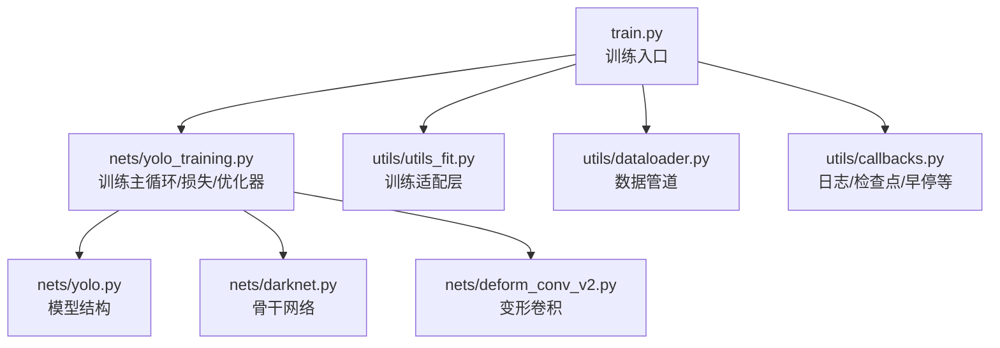
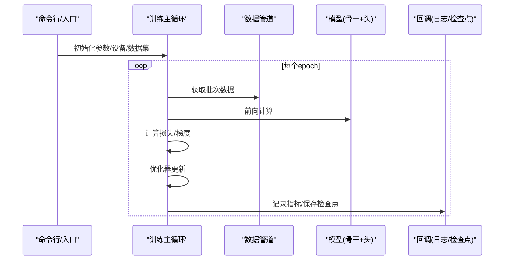
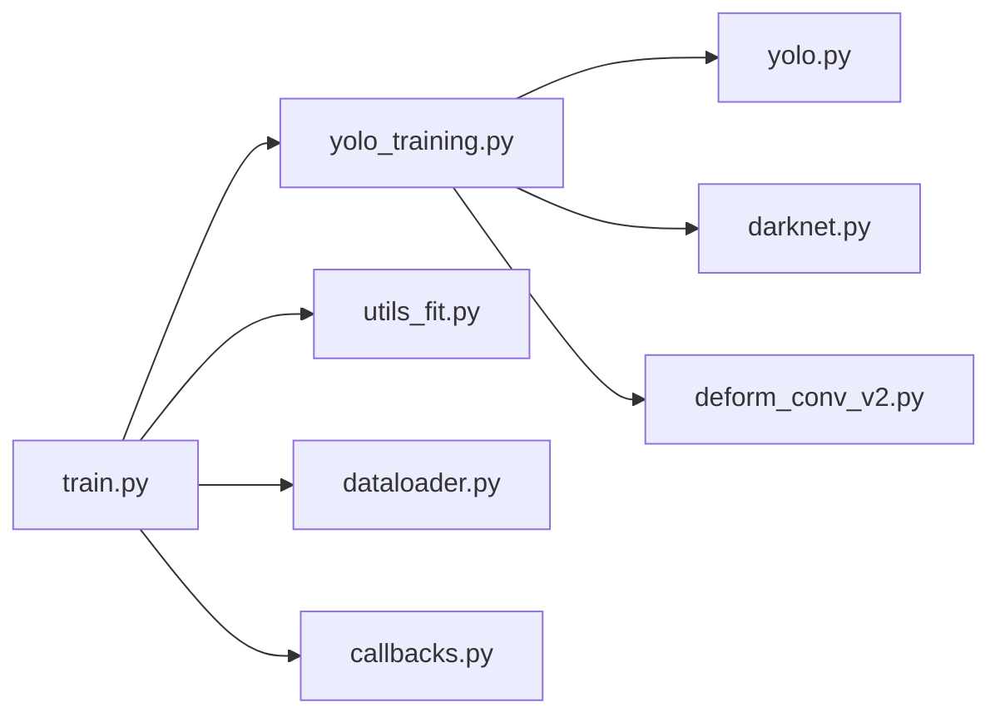

# 分布式训练

<cite>
**本文引用的文件**   
- [train.py](file://train.py)
- [yolo_training.py](file://nets/yolo_training.py)
- [utils_fit.py](file://utils/utils_fit.py)
- [dataloader.py](file://utils/dataloader.py)
- [callbacks.py](file://utils/callbacks.py)
- [README.md](file://README.md)
</cite>

## 目录
1. [简介](#简介)
2. [项目结构](#项目结构)
3. [核心组件](#核心组件)
4. [架构总览](#架构总览)
5. [详细组件分析](#详细组件分析)
6. [依赖关系分析](#依赖关系分析)
7. [性能考虑](#性能考虑)
8. [故障排查指南](#故障排查指南)
9. [结论](#结论)
10. [附录](#附录)

## 简介
本指南面向在现有YOLO目标检测代码库上实现与优化分布式训练的工程实践，重点覆盖：
- 多GPU数据并行原理与配置方法
- 通信开销优化与负载均衡策略
- 单机多卡与多机多卡的配置模板
- 常见问题定位与解决方案（梯度同步、显存管理、网络通信）
- 性能基准测试与调优建议

说明：当前仓库未内置分布式训练入口。本文基于现有训练流程与工具链，给出可落地的改造路径与最佳实践，确保在不破坏原有单卡训练逻辑的前提下平滑扩展至分布式场景。

## 项目结构
仓库采用“模型+训练+工具”的模块化组织方式：
- nets：模型定义与训练主循环
- utils：数据加载、训练辅助、回调、评估等工具
- 根目录脚本：训练入口、预测、可视化、指标计算等

图表来源
- [train.py](file://train.py)
- [yolo_training.py](file://nets/yolo_training.py)
- [utils_fit.py](file://utils/utils_fit.py)
- [dataloader.py](file://utils/dataloader.py)
- [callbacks.py](file://utils/callbacks.py)
- [yolo.py](file://nets/yolo.py)
- [darknet.py](file://nets/darknet.py)
- [deform_conv_v2.py](file://nets/deform_conv_v2.py)

章节来源
- [README.md](file://README.md)

## 核心组件
- 训练入口与参数解析：负责读取配置文件、构建数据集与模型、启动训练循环。
- 训练主循环：封装前向、损失计算、反向传播、优化器更新、日志记录与检查点保存。
- 数据管道：图像预处理、增强、批采样与多进程加载。
- 回调系统：学习率调度、TensorBoard/CSV日志、模型检查点、早停等。
- 模型模块：DarkNet骨干、YOLO头、可选变形卷积。

章节来源
- [train.py](file://train.py)
- [yolo_training.py](file://nets/yolo_training.py)
- [utils_fit.py](file://utils/utils_fit.py)
- [dataloader.py](file://utils/dataloader.py)
- [callbacks.py](file://utils/callbacks.py)

## 架构总览
下图展示从训练入口到模型与数据管道的调用关系，便于理解分布式改造的关键接入点。

图表来源
- [train.py](file://train.py)
- [yolo_training.py](file://nets/yolo_training.py)
- [utils_fit.py](file://utils/utils_fit.py)
- [dataloader.py](file://utils/dataloader.py)
- [callbacks.py](file://utils/callbacks.py)

## 详细组件分析

### 训练入口与分布式改造要点
- 设备与环境
  - 将设备选择抽象为“本地rank/world_size”模式，便于后续接入多进程分布式。
  - 支持通过环境变量或命令行参数设置进程数、端口、后端类型。
- 数据并行策略
  - 推荐数据并行（DDP）：每进程持有完整模型副本，仅对batch进行切分；避免跨进程复制大权重。
  - 若需模型并行（张量/流水线），应在模型拆分处引入通信原语，但YOLO通常以数据并行为主。
- 数据加载
  - 使用多进程数据加载时，注意随机种子固定与worker进程隔离，避免重复样本。
  - 对于多机环境，建议使用共享文件系统或对象存储作为数据源。
- 检查点与恢复
  - 仅主进程写入检查点，其他进程只读；或使用分布式锁/统一命名空间。
- 日志与监控
  - 仅主进程写TensorBoard/CSV；其余进程关闭冗余输出。

章节来源
- [train.py](file://train.py)
- [yolo_training.py](file://nets/yolo_training.py)
- [utils_fit.py](file://utils/utils_fit.py)

### 训练主循环与梯度同步
- 标准流程
  - 前向→损失→反向→优化器更新→指标统计→回调。
- 分布式梯度同步
  - 使用分布式包提供的梯度同步接口，在每个step后对所有GPU梯度进行AllReduce。
  - 注意梯度缩放（混合精度）、梯度裁剪与稀疏梯度处理。
- 学习率与批量大小
  - 线性缩放规则：全局batch增大N倍时，学习率近似乘以N；配合warmup更稳定。
- 数值稳定性
  - 启用梯度累积可在显存受限下模拟更大batch；结合梯度同步保证一致性。

章节来源
- [yolo_training.py](file://nets/yolo_training.py)
- [utils_fit.py](file://utils/utils_fit.py)

### 数据管道与负载均衡
- 多进程加载
  - 合理设置worker数量，避免CPU瓶颈；I/O密集型任务可适当增加worker。
- 数据打乱与去重
  - 使用确定性打乱策略，确保不同rank之间样本不重叠。
- 动态批大小
  - 按图像尺寸分组或动态批大小，减少padding带来的无效计算。
- 缓存与预取
  - 对常用特征或标签进行内存/磁盘缓存，降低I/O抖动。

章节来源
- [dataloader.py](file://utils/dataloader.py)

### 回调系统与分布式日志
- 检查点
  - 仅主进程保存；支持断点续训与自动清理旧检查点。
- 指标记录
  - 主进程聚合各步指标并写入日志；其他进程跳过IO。
- 学习率调度
  - 余弦退火/阶梯式/Warmup组合，提升收敛稳定性。

章节来源
- [callbacks.py](file://utils/callbacks.py)

### 模型与算子
- DarkNet骨干与YOLO头
  - 保持模型结构不变，优先通过数据并行获得加速。
- 变形卷积
  - 关注其通信与显存占用特性，必要时调整通道数或替换为等效算子。

章节来源
- [yolo.py](file://nets/yolo.py)
- [darknet.py](file://nets/darknet.py)
- [deform_conv_v2.py](file://nets/deform_conv_v2.py)

## 依赖关系分析
- 模块耦合
  - 训练入口依赖训练主循环与数据管道；训练主循环依赖模型与回调。
- 外部依赖
  - 深度学习框架（如PyTorch/TensorFlow/JAX）及其分布式后端（如NCCL/RDMA）。
- 潜在环依赖
  - 当前结构清晰，未见明显循环依赖；新增分布式适配层时应避免直接修改核心训练循环。

图表来源
- [train.py](file://train.py)
- [yolo_training.py](file://nets/yolo_training.py)
- [utils_fit.py](file://utils/utils_fit.py)
- [dataloader.py](file://utils/dataloader.py)
- [callbacks.py](file://utils/callbacks.py)
- [yolo.py](file://nets/yolo.py)
- [darknet.py](file://nets/darknet.py)
- [deform_conv_v2.py](file://nets/deform_conv_v2.py)

## 性能考虑
- 通信优化
  - 使用高性能后端（如NCCL）；开启梯度压缩/稀疏化（谨慎评估精度影响）。
  - 合并小梯度或减少同步频率（梯度累积）以降低通信次数。
- 计算与I/O平衡
  - 调整batch size与worker数，使GPU利用率>80%且CPU无瓶颈。
  - 使用混合精度训练（FP16/BF16）提升吞吐。
- 负载均衡
  - 多机环境下尽量均衡节点算力与网络带宽；避免热点节点。
- 监控与诊断
  - 采集GPU利用率、显存峰值、通信耗时、I/O等待时间，定位瓶颈。

[本节为通用指导，无需源码引用]

## 故障排查指南
- 常见错误
  - 端口冲突：分布式初始化失败，检查端口占用与防火墙。
  - NCCL错误：驱动/内核版本不匹配，升级CUDA/驱动或切换后端。
  - 显存不足：减小batch size、启用梯度累积、关闭不必要的日志。
  - 数据不一致：随机种子未固定、多进程数据重复。
- 定位步骤
  - 缩小规模验证：先单机双卡复现问题，再扩展到多机。
  - 打印关键信息：rank、world_size、设备拓扑、通信后端。
  - 逐步剥离：禁用数据增强/复杂算子，确认是否为算子兼容性问题。
- 回滚策略
  - 保留最近稳定检查点；断点续训快速回归基线。

章节来源
- [train.py](file://train.py)
- [yolo_training.py](file://nets/yolo_training.py)
- [utils_fit.py](file://utils/utils_fit.py)
- [callbacks.py](file://utils/callbacks.py)

## 结论
- 对于YOLO类目标检测任务，数据并行是首选方案，能显著缩短训练时间且改动最小。
- 通过合理的通信优化、I/O与计算配比、以及稳健的检查点与日志策略，可在多机多卡环境下获得稳定高效的训练体验。
- 建议在正式大规模训练前完成小规模基准测试与压力测试，建立性能基线与回归阈值。

[本节为总结性内容，无需源码引用]

## 附录

### 配置模板与运行示例

- 单机多卡（数据并行）
  - 思路：使用分布式启动器创建多个进程，每个进程绑定一个GPU，执行相同训练逻辑。
  - 关键点：设置rank/world_size、设备映射、NCCL后端、仅主进程写日志与检查点。
  - 参考位置：训练入口与训练主循环的参数解析与设备分配。

- 多机多卡（数据并行）
  - 思路：在各节点分别启动相同命令，指定各自rank与master地址/端口。
  - 关键点：统一随机种子、共享数据路径、稳定的网络拓扑与带宽。
  - 参考位置：训练入口的环境变量与命令行参数解析。

- 超参与批量大小
  - 线性缩放学习率：全局batch扩大N倍，学习率约乘以N，并配合warmup。
  - 显存受限：减小batch size或启用梯度累积，同时监控梯度范数。

- 数据管道建议
  - worker数量=CPU核数/2~1；开启持久化缓存；按尺寸分组减少padding。

- 监控与基准
  - 指标：吞吐（samples/s）、GPU利用率、显存峰值、通信耗时占比。
  - 基线：单机单卡/双卡/四卡对比，观察加速比与线性度。

章节来源
- [train.py](file://train.py)
- [yolo_training.py](file://nets/yolo_training.py)
- [utils_fit.py](file://utils/utils_fit.py)
- [dataloader.py](file://utils/dataloader.py)
- [callbacks.py](file://utils/callbacks.py)