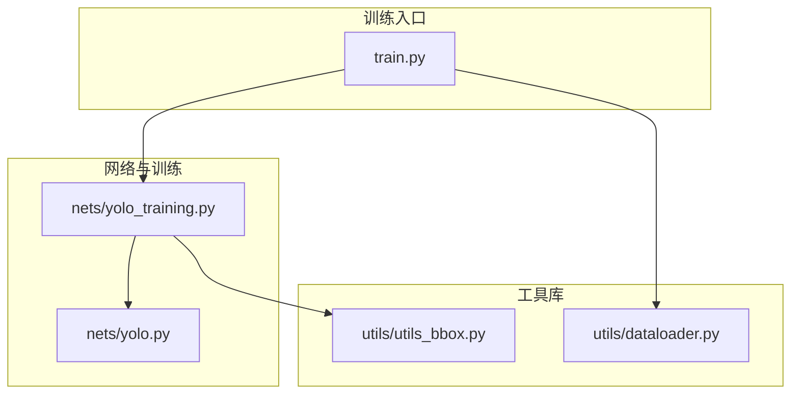
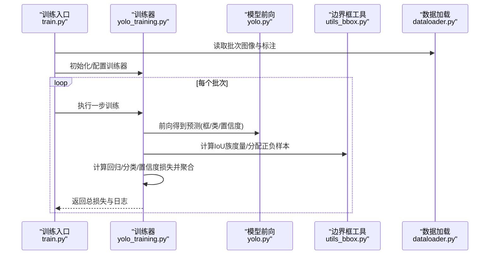
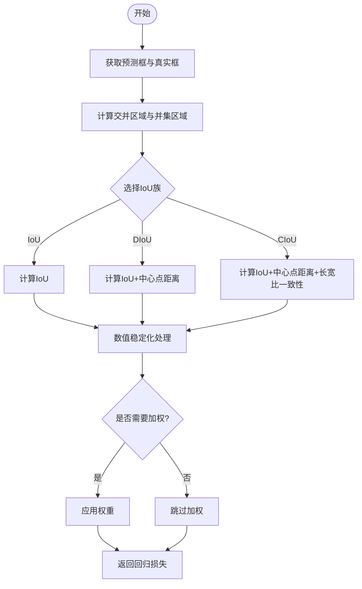
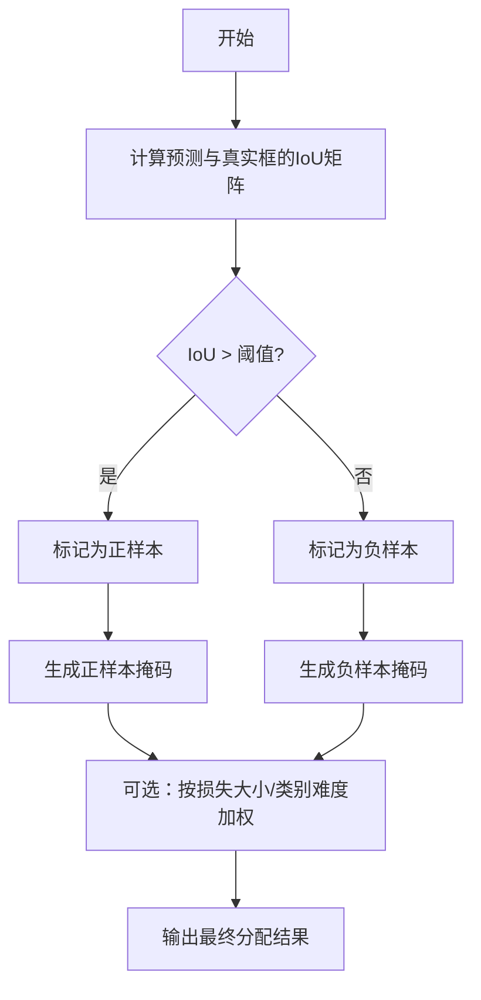
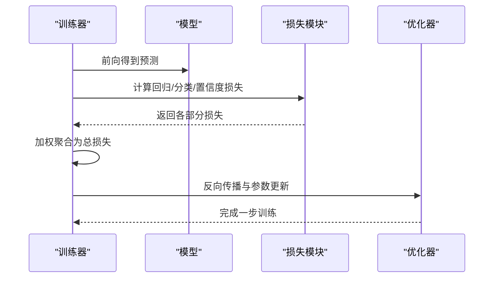
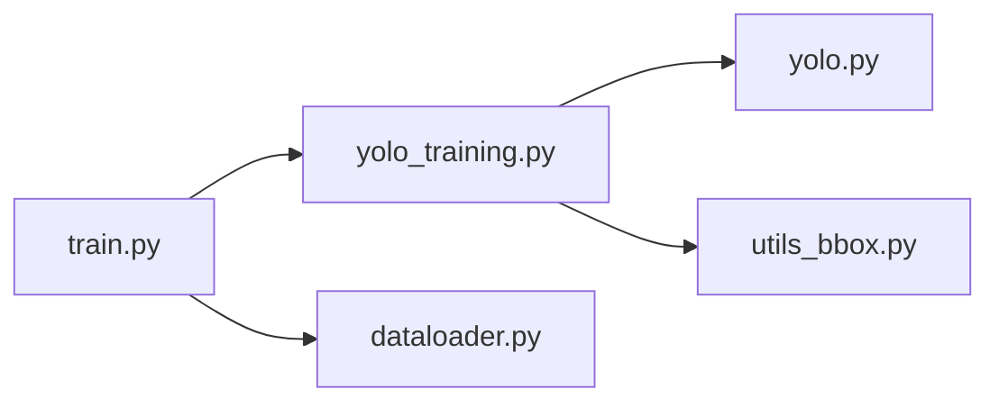

# 损失函数设计

<cite>
**本文引用的文件**   
- [yolo_training.py](file://nets/yolo_training.py)
- [yolo.py](file://nets/yolo.py)
- [utils_bbox.py](file://utils/utils_bbox.py)
- [dataloader.py](file://utils/dataloader.py)
- [train.py](file://train.py)
</cite>

## 目录
1. [简介](#简介)
2. [项目结构](#项目结构)
3. [核心组件](#核心组件)
4. [架构总览](#架构总览)
5. [详细组件分析](#详细组件分析)
6. [依赖关系分析](#依赖关系分析)
7. [性能考虑](#性能考虑)
8. [故障排查指南](#故障排查指南)
9. [结论](#结论)
10. [附录](#附录)

## 简介
本技术文档聚焦于YOLO目标检测的损失函数设计与实现，涵盖边界框回归损失、分类损失与置信度损失的数学原理与代码落地；系统梳理IoU、CIoU、DIoU等版本差异与适用场景；解释正负样本分配策略与难例挖掘机制；并提供可视化与调试方法、自定义扩展指南以及性能优化建议。目标是帮助读者在理解理论的同时，快速定位并改进工程实现。

## 项目结构
本项目采用“网络定义 + 训练流程 + 工具库”的分层组织方式：
- nets：模型结构与训练主循环（含损失计算）
- utils：数据加载、边界框工具、评估指标等
- 根目录脚本：训练入口、预测、mAP计算等

图表来源
- [train.py](file://train.py)
- [yolo.py](file://nets/yolo.py)
- [yolo_training.py](file://nets/yolo_training.py)
- [utils_bbox.py](file://utils/utils_bbox.py)
- [dataloader.py](file://utils/dataloader.py)

章节来源
- [train.py](file://train.py)
- [yolo.py](file://nets/yolo.py)
- [yolo_training.py](file://nets/yolo_training.py)
- [utils_bbox.py](file://utils/utils_bbox.py)
- [dataloader.py](file://utils/dataloader.py)

## 核心组件
- 训练主循环与损失聚合：负责将边界框回归、分类与置信度三部分损失组合为总损失，并在训练过程中进行梯度更新。
- 边界框回归损失：支持多种IoU族损失（如IoU/CIoU/DIoU），用于优化预测框与真实框的几何一致性。
- 分类损失：针对多类别的分类任务，通常采用对数似然或交叉熵形式。
- 置信度损失：衡量前景/背景判定质量，常以二分类交叉熵形式出现。
- 正负样本分配与难例挖掘：决定哪些预测框参与回归/分类/置信度学习，以及是否引入难例权重或采样策略。
- IoU族工具：提供不同IoU变体的计算与数值稳定处理。

章节来源
- [yolo_training.py](file://nets/yolo_training.py)
- [utils_bbox.py](file://utils/utils_bbox.py)

## 架构总览
下图展示了从训练入口到损失计算的调用链路与数据流向。

图表来源
- [train.py](file://train.py)
- [yolo_training.py](file://nets/yolo_training.py)
- [yolo.py](file://nets/yolo.py)
- [utils_bbox.py](file://utils/utils_bbox.py)
- [dataloader.py](file://utils/dataloader.py)

## 详细组件分析

### 边界框回归损失（IoU族）
- 数学要点
  - IoU：预测框与真实框交集面积与并集面积之比，强调重叠程度。
  - DIoU：在IoU基础上加入中心点距离惩罚，加速收敛并提升小目标稳定性。
  - CIoU：在DIoU基础上进一步引入长宽比一致性项，兼顾尺度与形状对齐。
- 实现要点
  - 坐标归一化与数值稳定：避免除零与溢出，保证梯度稳定。
  - 维度广播与批量并行：利用张量广播一次性计算所有预测框与候选真实框的IoU族度量。
  - 可选加权：根据目标尺寸、难度或置信度动态调整权重。
- 适用场景
  - IoU：通用场景，简单直观。
  - DIoU：对小目标与遮挡更稳健。
  - CIoU：对长宽比敏感的目标（如细长物体）表现更佳。

图表来源
- [utils_bbox.py](file://utils/utils_bbox.py)
- [yolo_training.py](file://nets/yolo_training.py)

章节来源
- [utils_bbox.py](file://utils/utils_bbox.py)
- [yolo_training.py](file://nets/yolo_training.py)

### 分类损失
- 数学要点
  - 多类别分类常用交叉熵或对数似然形式，对正确类别概率取负对数并求平均/求和。
  - 可结合标签平滑或焦点损失缓解类别不平衡。
- 实现要点
  - 概率校准：确保输出经softmax/sigmoid后处于有效区间。
  - 掩码与忽略：按正负样本分配结果屏蔽不参与学习的预测。
  - 数值稳定：对log输入加极小值防止NaN。
- 适用场景
  - 标准多分类：常规数据集。
  - 类别不平衡：配合重加权或焦点损失。

章节来源
- [yolo_training.py](file://nets/yolo_training.py)

### 置信度损失
- 数学要点
  - 前景/背景二分类，通常使用二元交叉熵。
  - 可与分类损失共享掩码逻辑，仅对正样本或特定阈值内的样本计算。
- 实现要点
  - 阈值控制：通过置信度阈值筛选参与训练的样本。
  - 平衡正负样本：可采用Focal Loss思想降低易分样本影响。
- 适用场景
  - 目标存在性判断，尤其在密集场景下抑制误检。

章节来源
- [yolo_training.py](file://nets/yolo_training.py)

### 正负样本分配与难例挖掘
- 分配策略
  - 基于IoU阈值：与真实框IoU超过阈值的预测视为正样本，低于阈值的视为负样本。
  - 逐锚/逐格匹配：在每个网格或锚点上选择最佳匹配的真实框。
  - 动态分配：随训练阶段自适应调整阈值或数量。
- 难例挖掘
  - 基于损失大小：优先对高损失样本赋予更大权重。
  - 基于置信度：对低置信但接近阈值的样本加强监督。
  - 基于类别难度：对稀有类别或困难实例进行重加权。
- 实现要点
  - 掩码生成：构造正负样本掩码，屏蔽不参与学习的预测。
  - 数值稳定：避免极端权重导致梯度爆炸。
  - 批内均衡：确保每批次正负样本比例合理。

图表来源
- [yolo_training.py](file://nets/yolo_training.py)
- [utils_bbox.py](file://utils/utils_bbox.py)

章节来源
- [yolo_training.py](file://nets/yolo_training.py)
- [utils_bbox.py](file://utils/utils_bbox.py)

### 损失聚合与训练步
- 总损失构成
  - 总损失 = 回归损失 + 分类损失 + 置信度损失
  - 各部分可按超参进行加权，平衡不同任务的重要性。
- 训练步流程
  - 前向传播得到预测
  - 依据分配策略计算各部分损失
  - 反向传播更新参数
  - 记录日志与监控指标

图表来源
- [yolo_training.py](file://nets/yolo_training.py)
- [yolo.py](file://nets/yolo.py)

章节来源
- [yolo_training.py](file://nets/yolo_training.py)
- [yolo.py](file://nets/yolo.py)

## 依赖关系分析
- 训练入口依赖训练器与数据加载器
- 训练器依赖模型前向与边界框工具
- 边界框工具被训练器直接调用以计算IoU族度量与分配策略

图表来源
- [train.py](file://train.py)
- [yolo_training.py](file://nets/yolo_training.py)
- [yolo.py](file://nets/yolo.py)
- [utils_bbox.py](file://utils/utils_bbox.py)
- [dataloader.py](file://utils/dataloader.py)

章节来源
- [train.py](file://train.py)
- [yolo_training.py](file://nets/yolo_training.py)
- [yolo.py](file://nets/yolo.py)
- [utils_bbox.py](file://utils/utils_bbox.py)
- [dataloader.py](file://utils/dataloader.py)

## 性能考虑
- 向量化与广播：尽量使用张量运算替代循环，减少Python层开销。
- 内存复用：避免中间变量重复创建，及时释放大张量引用。
- 数值稳定：在log、sqrt、除法前后添加保护项，防止NaN/Inf。
- 混合精度：在支持的设备上启用半精度训练以提升吞吐。
- 早停与验证：定期评估mAP，避免过拟合导致的损失下降但指标退化。

[本节为通用指导，不直接分析具体文件]

## 故障排查指南
- 损失为NaN/Inf
  - 检查log/sqrt/除法的数值保护是否生效
  - 确认标签与掩码是否正确，避免空集参与计算
- 收敛缓慢或不收敛
  - 调整学习率与权重衰减
  - 检查正负样本比例是否失衡
  - 尝试更换IoU族（如从IoU切换到CIoU）
- mAP不升反降
  - 核对数据标注与预处理一致性
  - 观察各部分损失占比，必要时调整权重
- 显存不足
  - 减小批次大小或分辨率
  - 关闭不必要的日志与中间张量保存

章节来源
- [yolo_training.py](file://nets/yolo_training.py)
- [utils_bbox.py](file://utils/utils_bbox.py)

## 结论
本仓库的YOLO损失体系围绕IoU族回归、分类与置信度三大部分构建，并通过灵活的分配策略与难例挖掘机制提升鲁棒性与精度。实践中应结合数据特性选择合适的IoU变体与权重配比，辅以严格的数值稳定与性能优化，以获得稳定的训练曲线与更高的mAP。

[本节为总结性内容，不直接分析具体文件]

## 附录

### 可视化与调试方法
- 损失曲线
  - 分别绘制回归、分类、置信度与总损失曲线，观察各部分变化趋势。
- 正负样本分布
  - 统计每批次正负样本数量与比例，确保均衡。
- IoU分布直方图
  - 绘制正样本与真实框的IoU分布，辅助调整阈值。
- 预测框可视化
  - 在测试图上叠加预测框与真实框，直观评估回归质量。

[本节为概念性内容，不直接分析具体文件]

### 自定义损失函数扩展指南
- 替换边界框回归损失
  - 在边界框工具中新增IoU族变体，保持接口一致（输入预测与真实框，输出标量损失）。
  - 在训练器中切换损失类型并调整权重。
- 引入新的难例挖掘
  - 基于当前损失或置信度动态计算样本权重，注入到损失聚合之前。
- 统一数值稳定
  - 为新损失添加epsilon保护与梯度裁剪，确保训练稳定。

章节来源
- [utils_bbox.py](file://utils/utils_bbox.py)
- [yolo_training.py](file://nets/yolo_training.py)