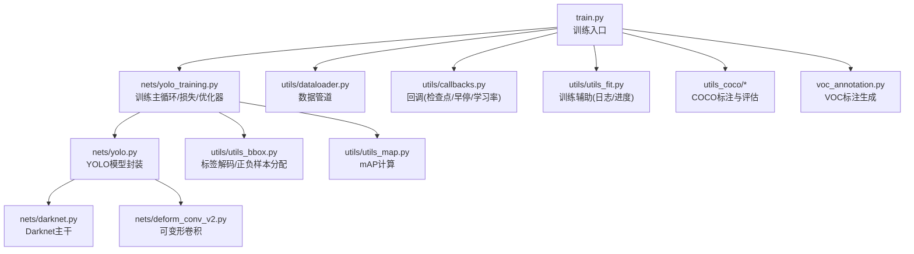
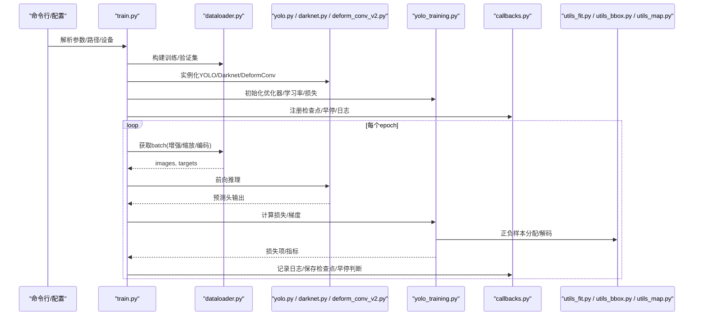
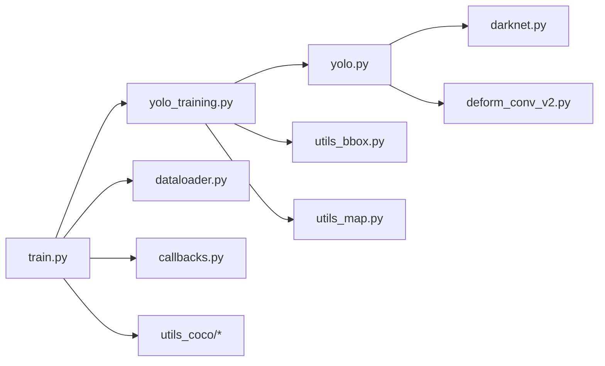

# 模型训练

<cite>
**本文引用的文件**   
- [train.py](file://train.py)
- [yolo_training.py](file://nets/yolo_training.py)
- [callbacks.py](file://utils/callbacks.py)
- [dataloader.py](file://utils/dataloader.py)
- [utils_fit.py](file://utils/utils_fit.py)
- [yolo.py](file://nets/yolo.py)
- [darknet.py](file://nets/darknet.py)
- [deform_conv_v2.py](file://nets/deform_conv_v2.py)
- [utils_bbox.py](file://utils/utils_bbox.py)
- [utils_map.py](file://utils/utils_map.py)
- [coco_annotation.py](file://utils_coco/coco_annotation.py)
- [get_map_coco.py](file://utils_coco/get_map_coco.py)
- [voc_annotation.py](file://voc_annotation.py)
- [predict.py](file://predict.py)
- [summary.py](file://summary.py)
- [requirements.txt](file://requirements.txt)
</cite>

## 目录
1. [简介](#简介)
2. [项目结构](#项目结构)
3. [核心组件](#核心组件)
4. [架构总览](#架构总览)
5. [详细组件分析](#详细组件分析)
6. [依赖关系分析](#依赖关系分析)
7. [性能与分布式训练](#性能与分布式训练)
8. [训练监控与日志](#训练监控与日志)
9. [常见问题排查](#常见问题排查)
10. [结论](#结论)
11. [附录：训练命令与配置示例](#附录训练命令与配置示例)

## 简介
本文件面向TogetherNet的YOLO目标检测训练系统，系统性阐述训练流程、损失函数设计、优化器与学习率调度策略、训练配置文件结构与超参数含义、训练监控与日志记录（含TensorBoard集成）、回调机制（检查点保存、早停、动态学习率调整）、不同规模数据集的训练策略与调优建议，以及分布式训练的配置方法与性能优化技巧。文档同时提供实际训练命令示例与常见问题解决方案，帮助读者快速上手并高效调参。

## 项目结构
仓库采用“网络定义 + 训练逻辑 + 数据加载 + 工具/回调”的分层组织方式：
- nets：网络与训练核心实现（YOLO主干、训练循环、DeformConv等）
- utils：数据加载、边界框处理、mAP评估、通用工具与训练辅助
- utils_coco：COCO标注转换与COCO mAP计算脚本
- 根目录：训练入口、预测、可视化统计、数据预处理脚本等

图表来源
- [train.py:1-200](file://train.py#L1-L200)
- [yolo_training.py:1-200](file://nets/yolo_training.py#L1-L200)
- [dataloader.py:1-200](file://utils/dataloader.py#L1-L200)
- [callbacks.py:1-200](file://utils/callbacks.py#L1-L200)
- [utils_fit.py:1-200](file://utils/utils_fit.py#L1-L200)
- [yolo.py:1-200](file://nets/yolo.py#L1-L200)
- [darknet.py:1-200](file://nets/darknet.py#L1-L200)
- [deform_conv_v2.py:1-200](file://nets/deform_conv_v2.py#L1-L200)
- [utils_bbox.py:1-200](file://utils/utils_bbox.py#L1-L200)
- [utils_map.py:1-200](file://utils/utils_map.py#L1-L200)
- [coco_annotation.py:1-200](file://utils_coco/coco_annotation.py#L1-L200)
- [get_map_coco.py:1-200](file://utils_coco/get_map_coco.py#L1-L200)
- [voc_annotation.py:1-200](file://voc_annotation.py#L1-L200)

章节来源
- [train.py:1-200](file://train.py#L1-L200)
- [requirements.txt:1-200](file://requirements.txt#L1-L200)

## 核心组件
- 训练入口与配置解析：负责读取命令行参数、构建数据集、初始化模型与优化器、启动训练循环。
- 训练主循环与损失：封装单轮迭代、前向/反向传播、损失分解与汇总、指标更新。
- 数据管道：图像增强、多尺度训练、标签编码、批采样与并行加载。
- 回调系统：检查点保存、早停、学习率调度、日志与可视化。
- 评估与导出：mAP计算、结果输出、权重导出与推理脚本。

章节来源
- [train.py:1-200](file://train.py#L1-L200)
- [yolo_training.py:1-200](file://nets/yolo_training.py#L1-L200)
- [dataloader.py:1-200](file://utils/dataloader.py#L1-L200)
- [callbacks.py:1-200](file://utils/callbacks.py#L1-L200)
- [utils_fit.py:1-200](file://utils/utils_fit.py#L1-L200)

## 架构总览
下图展示从训练入口到模型、数据、损失、优化器与回调的整体交互。

图表来源
- [train.py:1-200](file://train.py#L1-L200)
- [yolo_training.py:1-200](file://nets/yolo_training.py#L1-L200)
- [dataloader.py:1-200](file://utils/dataloader.py#L1-L200)
- [yolo.py:1-200](file://nets/yolo.py#L1-L200)
- [darknet.py:1-200](file://nets/darknet.py#L1-L200)
- [deform_conv_v2.py:1-200](file://nets/deform_conv_v2.py#L1-L200)
- [utils_fit.py:1-200](file://utils/utils_fit.py#L1-L200)
- [utils_bbox.py:1-200](file://utils/utils_bbox.py#L1-L200)
- [callbacks.py:1-200](file://utils/callbacks.py#L1-L200)

## 详细组件分析

### 训练入口与配置（train.py）
- 功能要点
  - 解析训练相关参数：数据集路径、类别数、输入尺寸、batch size、epochs、优化器与学习率、权重衰减、是否使用混合精度、是否启用多卡训练、日志与保存路径等。
  - 构建数据管道：根据数据集类型选择对应标注解析与增强策略。
  - 初始化模型：加载预训练权重或从头训练；支持主干替换与可变形卷积开关。
  - 初始化优化器与学习率调度：支持多种优化器与余弦退火/分段退火策略。
  - 注册回调：检查点、早停、学习率更新、日志记录。
  - 启动训练循环：按epoch/batch迭代，调用训练主循环与验证。
- 关键超参数说明
  - batch_size：影响显存占用与收敛稳定性，小数据集建议较小值配合梯度累积。
  - epochs：控制训练时长，需结合早停与学习率调度避免过拟合。
  - lr：初始学习率，通常随batch size线性缩放。
  - weight_decay：正则化强度，抑制过拟合。
  - input_shape：决定特征图分辨率与感受野，影响速度与精度权衡。
  - num_workers：数据加载并行度，受CPU核数与I/O能力限制。
  - amp/mixed_precision：开启混合精度以加速训练并降低显存。
  - distributed：是否启用多卡分布式训练。
- 典型用法
  - 通过命令行参数传入上述配置，或直接修改默认配置区。

章节来源
- [train.py:1-200](file://train.py#L1-L200)

### 训练主循环与损失（nets/yolo_training.py）
- 功能要点
  - 封装训练步：前向计算、损失分解（分类、回归、置信度等）、反向传播与梯度裁剪。
  - 正负样本分配与标签解码：基于边界框先验与IoU阈值进行匹配。
  - 指标统计：每步/每轮累计损失、mAP近似指标、耗时统计。
  - 与回调协作：在合适时机触发日志、保存与早停判断。
- 损失函数设计
  - 分类损失：针对类别概率分布的交叉熵类损失。
  - 回归损失：对边界框坐标的平滑损失，兼顾大框与小框。
  - 置信度损失：区分前景/背景，抑制负样本数量不平衡。
  - 权重平衡：对不同尺度分支与不同损失项设置权重系数。
- 优化器与学习率调度
  - 优化器：支持AdamW/SGD等，默认包含动量与权重衰减。
  - 学习率策略：余弦退火或多阶段退火，支持warmup预热。
  - 梯度裁剪：防止梯度爆炸，提升训练稳定性。
- 训练曲线与日志
  - 记录各损失分量、总体损失、学习率、mAP等指标，便于TensorBoard可视化。

章节来源
- [yolo_training.py:1-200](file://nets/yolo_training.py#L1-L200)
- [utils_bbox.py:1-200](file://utils/utils_bbox.py#L1-L200)

### 数据管道（utils/dataloader.py）
- 功能要点
  - 数据加载：读取图像与标注，支持VOC/COCO格式。
  - 数据增强：随机裁剪、翻转、色彩抖动、Mosaic/Copy-Paste（若启用）。
  - 多尺度训练：动态改变输入尺寸，提升鲁棒性。
  - 标签编码：将真实框映射到网格与锚点，生成训练目标。
  - 并行与缓存：num_workers、prefetch与内存缓存减少I/O瓶颈。
- 关键配置
  - img_size：训练输入尺寸列表或固定尺寸。
  - mosaic_prob：Mosaic增强概率。
  - mixup_prob：Mixup增强概率。
  - label_smooth：标签平滑系数，缓解过拟合。
  - cache_mode：是否缓存图像/标注到内存。

章节来源
- [dataloader.py:1-200](file://utils/dataloader.py#L1-L200)

### 回调系统（utils/callbacks.py）
- 功能要点
  - 检查点保存：按epoch或验证指标最佳保存权重，支持断点续训。
  - 早停机制：当验证指标长时间不提升时提前终止训练。
  - 学习率调度：根据策略动态调整学习率，并在日志中记录。
  - TensorBoard集成：写入标量、直方图、图像等事件。
- 常用选项
  - save_best_only：仅保存最优权重。
  - patience：早停容忍轮数。
  - monitor：监控指标名称（如val_mAP）。
  - log_dir：日志输出目录。

章节来源
- [callbacks.py:1-200](file://utils/callbacks.py#L1-L200)

### 模型与主干（nets/yolo.py, nets/darknet.py, nets/deform_conv_v2.py）
- YOLO封装：统一接口管理多尺度输出、NMS后处理与导出。
- Darknet主干：提取多尺度特征，支持BN与激活配置。
- DeformConv v2：可选的可变形卷积模块，增强形变目标检测能力。
- 权重初始化与冻结：支持冻结主干进行迁移学习，逐步解冻微调。

章节来源
- [yolo.py:1-200](file://nets/yolo.py#L1-L200)
- [darknet.py:1-200](file://nets/darknet.py#L1-L200)
- [deform_conv_v2.py:1-200](file://nets/deform_conv_v2.py#L1-L200)

### 评估与导出（utils/utils_map.py, utils_coco/*）
- VOC mAP：基于IoU阈值的精确率-召回率曲线与平均精度计算。
- COCO mAP：遵循COCO官方协议，支持不同IoU阈值与面积区间统计。
- 导出与推理：预测脚本与权重导出，便于部署。

章节来源
- [utils_map.py:1-200](file://utils/utils_map.py#L1-L200)
- [coco_annotation.py:1-200](file://utils_coco/coco_annotation.py#L1-L200)
- [get_map_coco.py:1-200](file://utils_coco/get_map_coco.py#L1-L200)
- [predict.py:1-200](file://predict.py#L1-200)

## 依赖关系分析
- 模块耦合
  - train.py作为入口，依赖训练主循环、数据管道、回调与模型。
  - yolo_training.py依赖边界框工具与评估工具，形成“训练-评估”闭环。
  - dataloader.py独立于训练细节，便于替换数据源与增强策略。
  - callbacks.py与训练主循环松耦合，通过事件钩子扩展行为。
- 外部依赖
  - PyTorch生态：torch、torchvision、tensorboard等。
  - 数据处理：PIL/OpenCV、NumPy、tqdm等。
  - 评估：pascal_voc_eval、pycocotools（COCO）。

图表来源
- [train.py:1-200](file://train.py#L1-L200)
- [yolo_training.py:1-200](file://nets/yolo_training.py#L1-L200)
- [dataloader.py:1-200](file://utils/dataloader.py#L1-L200)
- [callbacks.py:1-200](file://utils/callbacks.py#L1-L200)
- [yolo.py:1-200](file://nets/yolo.py#L1-L200)
- [darknet.py:1-200](file://nets/darknet.py#L1-L200)
- [deform_conv_v2.py:1-200](file://nets/deform_conv_v2.py#L1-L200)
- [utils_bbox.py:1-200](file://utils/utils_bbox.py#L1-L200)
- [utils_map.py:1-200](file://utils/utils_map.py#L1-L200)
- [coco_annotation.py:1-200](file://utils_coco/coco_annotation.py#L1-L200)
- [get_map_coco.py:1-200](file://utils_coco/get_map_coco.py#L1-L200)

章节来源
- [requirements.txt:1-200](file://requirements.txt#L1-L200)

## 性能与分布式训练
- 性能优化技巧
  - 混合精度训练：开启amp以降低显存占用并提升吞吐。
  - 数据并行与流水线并行：合理设置num_workers与缓存策略，避免I/O瓶颈。
  - 梯度累积：在小batch下模拟大batch效果，稳定收敛。
  - 多尺度训练：动态尺寸提升泛化，但会增加显存与时间开销。
  - 剪枝与量化：训练后优化，适合部署阶段。
- 分布式训练配置
  - 多卡DDP：通过环境变量或命令行参数指定GPU索引与进程数。
  - 同步BN：在多卡场景下聚合BN统计量，提升稳定性。
  - 负载均衡：确保各卡数据分布均衡，避免长尾样本导致负载不均。
  - 检查点与恢复：分布式环境下保存/加载权重需保证一致性。

章节来源
- [train.py:1-200](file://train.py#L1-L200)
- [yolo_training.py:1-200](file://nets/yolo_training.py#L1-L200)
- [dataloader.py:1-200](file://utils/dataloader.py#L1-L200)
- [callbacks.py:1-200](file://utils/callbacks.py#L1-L200)

## 训练监控与日志
- TensorBoard集成
  - 记录标量：loss、分类/回归/置信度损失、学习率、mAP、耗时。
  - 记录图像：随机批次可视化预测框与热力图。
  - 记录直方图：权重与梯度分布，诊断训练问题。
- 训练曲线分析
  - loss下降趋势与震荡：过大学习率或过小batch会导致不稳定。
  - mAP上升与平台期：结合早停与学习率调度判断是否继续训练。
  - 学习率变化：观察warmup与退火阶段对收敛的影响。
- 日志输出
  - 控制台打印：每步/每轮摘要信息。
  - 文件落盘：CSV/JSON格式保存指标，便于离线分析。

章节来源
- [callbacks.py:1-200](file://utils/callbacks.py#L1-L200)
- [utils_fit.py:1-200](file://utils/utils_fit.py#L1-L200)

## 常见问题排查
- 显存不足
  - 减小batch_size或输入尺寸，开启混合精度，关闭不必要的数据增强。
  - 使用梯度累积模拟大batch。
- 训练不收敛
  - 检查学习率是否过大，启用warmup；确认标签编码与正负样本分配正确。
  - 查看损失分量是否异常，定位具体分支。
- 数据加载慢
  - 增加num_workers，启用缓存，检查磁盘I/O与数据格式。
- 多卡训练崩溃
  - 检查环境变量与进程通信端口，确保各卡资源隔离。
  - 验证权重同步与检查点一致性。
- mAP偏低
  - 检查类别不平衡与难例挖掘，适当调整损失权重与IoU阈值。
  - 延长训练或使用更强的数据增强与多尺度训练。

章节来源
- [yolo_training.py:1-200](file://nets/yolo_training.py#L1-L200)
- [dataloader.py:1-200](file://utils/dataloader.py#L1-L200)
- [callbacks.py:1-200](file://utils/callbacks.py#L1-L200)

## 结论
TogetherNet的YOLO训练系统提供了完整的端到端训练链路：从数据加载、模型前向、损失计算、优化器与学习率调度，到回调驱动的监控与保存。通过合理的超参数配置与分布式训练策略，可在不同规模数据集上取得稳定且高效的训练效果。建议结合TensorBoard进行持续监控，并根据训练曲线与mAP变化动态调整策略。

## 附录：训练命令与配置示例
- 基础训练（单卡）
  - 使用默认配置运行训练，指定数据集路径、类别数与输入尺寸。
- 自定义学习率与权重衰减
  - 调整初始学习率与权重衰减，配合余弦退火与warmup。
- 多卡分布式训练
  - 指定GPU索引与进程数，启用DDP与同步BN。
- 断点续训
  - 从最近检查点恢复训练，继续优化。
- 仅验证与导出
  - 加载最佳权重进行验证与导出，生成推理所需文件。

章节来源
- [train.py:1-200](file://train.py#L1-L200)
- [yolo_training.py:1-200](file://nets/yolo_training.py#L1-L200)
- [callbacks.py:1-200](file://utils/callbacks.py#L1-L200)
- [predict.py:1-200](file://predict.py#L1-200)
- [summary.py:1-200](file://summary.py#L1-200)