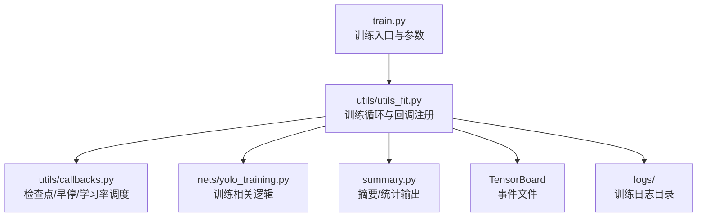
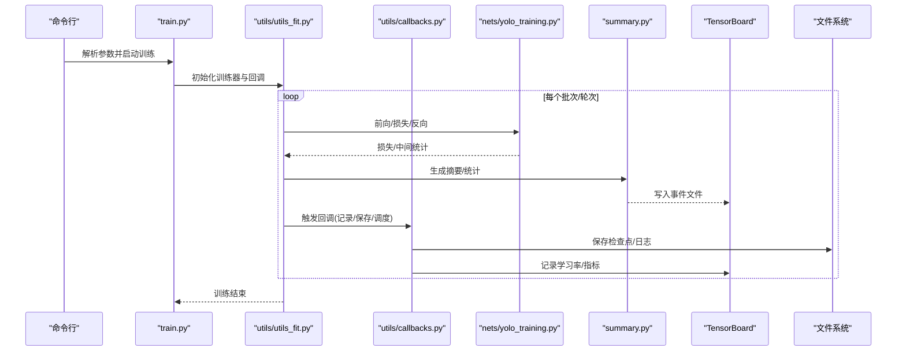
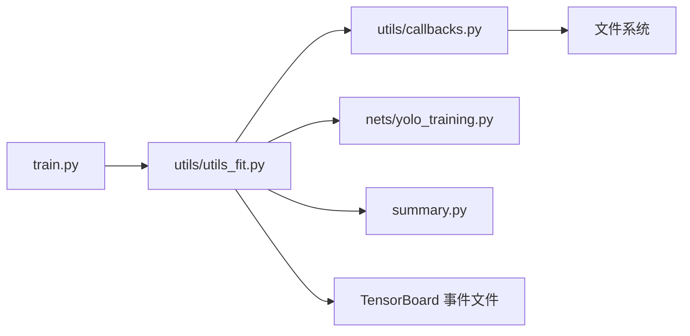

# 训练监控与日志

<cite>
**本文引用的文件**   
- [train.py](file://train.py)
- [utils/callbacks.py](file://utils/callbacks.py)
- [utils/utils_fit.py](file://utils/utils_fit.py)
- [nets/yolo_training.py](file://nets/yolo_training.py)
- [summary.py](file://summary.py)
- [README.md](file://README.md)
</cite>

## 目录
1. [简介](#简介)
2. [项目结构](#项目结构)
3. [核心组件](#核心组件)
4. [架构总览](#架构总览)
5. [详细组件分析](#详细组件分析)
6. [依赖关系分析](#依赖关系分析)
7. [性能考虑](#性能考虑)
8. [故障排查指南](#故障排查指南)
9. [结论](#结论)
10. [附录](#附录)

## 简介
本指南聚焦于该项目的训练监控与日志系统，覆盖以下主题：
- TensorBoard 集成配置与使用：损失曲线、学习率变化、梯度分布等可视化指标
- 训练回调函数：模型检查点保存、早停机制、学习率调度
- 训练过程性能监控：GPU 利用率、内存使用、训练速度等关键指标跟踪
- 日志文件结构与分析方法
- 常见训练问题的诊断技巧

## 项目结构
本项目围绕 YOLO 目标检测任务，训练流程由入口脚本驱动，结合自定义回调与工具模块完成训练、评估与日志记录。与“训练监控与日志”直接相关的核心文件包括：
- 训练入口与参数解析：[train.py](file://train.py)
- 回调函数（检查点、早停、学习率调度等）：[utils/callbacks.py](file://utils/callbacks.py)
- 训练循环与日志/回调注册：[utils/utils_fit.py](file://utils/utils_fit.py)
- 网络训练相关逻辑（含可能的 TensorBoard 钩子）：[nets/yolo_training.py](file://nets/yolo_training.py)
- 摘要/统计输出（可能包含 TensorBoard 或文本摘要）：[summary.py](file://summary.py)
- 项目说明与环境信息：[README.md](file://README.md)

图表来源
- [train.py:1-200](file://train.py#L1-L200)
- [utils/utils_fit.py:1-200](file://utils/utils_fit.py#L1-L200)
- [utils/callbacks.py:1-200](file://utils/callbacks.py#L1-L200)
- [nets/yolo_training.py:1-200](file://nets/yolo_training.py#L1-L200)
- [summary.py:1-200](file://summary.py#L1-L200)

章节来源
- [train.py:1-200](file://train.py#L1-L200)
- [README.md:1-200](file://README.md#L1-L200)

## 核心组件
- 训练入口与参数
  - 负责解析命令行参数（如数据路径、权重、批大小、轮数、是否启用 TensorBoard 等），并启动训练流程。
  - 参考路径：[train.py](file://train.py)

- 训练循环与回调注册
  - 封装训练主循环，按步/轮执行前向、反向、优化器更新，并在合适时机触发回调（记录损失、学习率、保存检查点等）。
  - 参考路径：[utils/utils_fit.py](file://utils/utils_fit.py)

- 回调函数集合
  - 检查点保存：周期性保存最佳/最新权重，支持断点续训。
  - 早停机制：当验证指标长时间不提升时提前终止训练。
  - 学习率调度：按策略调整学习率（如余弦退火、阶梯下降等）。
  - 参考路径：[utils/callbacks.py](file://utils/callbacks.py)

- 训练相关逻辑
  - 提供训练阶段的核心实现，可能包含损失计算、梯度统计、以及 TensorBoard 写入钩子。
  - 参考路径：[nets/yolo_training.py](file://nets/yolo_training.py)

- 摘要/统计输出
  - 生成训练过程中的统计摘要，可能同时写入 TensorBoard 或本地日志文件。
  - 参考路径：[summary.py](file://summary.py)

章节来源
- [train.py:1-200](file://train.py#L1-L200)
- [utils/utils_fit.py:1-200](file://utils/utils_fit.py#L1-L200)
- [utils/callbacks.py:1-200](file://utils/callbacks.py#L1-L200)
- [nets/yolo_training.py:1-200](file://nets/yolo_training.py#L1-L200)
- [summary.py:1-200](file://summary.py#L1-L200)

## 架构总览
下图展示了训练过程中各组件的交互关系，包括训练循环、回调、日志与 TensorBoard 的事件流。

图表来源
- [train.py:1-200](file://train.py#L1-L200)
- [utils/utils_fit.py:1-200](file://utils/utils_fit.py#L1-L200)
- [utils/callbacks.py:1-200](file://utils/callbacks.py#L1-L200)
- [nets/yolo_training.py:1-200](file://nets/yolo_training.py#L1-L200)
- [summary.py:1-200](file://summary.py#L1-L200)

## 详细组件分析

### 训练入口与参数（train.py）
- 功能要点
  - 解析训练相关参数（数据路径、权重、批大小、轮数、是否启用 TensorBoard、日志目录等）。
  - 构建训练器与回调实例，调用训练循环。
- 使用建议
  - 通过命令行开关控制是否启用 TensorBoard 与日志级别。
  - 合理设置批大小与轮数以平衡速度与收敛性。
- 参考路径
  - [train.py](file://train.py)

章节来源
- [train.py:1-200](file://train.py#L1-L200)

### 训练循环与回调注册（utils/utils_fit.py）
- 功能要点
  - 管理训练主循环，按步/轮执行前向、反向、优化器更新。
  - 在关键节点触发回调：记录损失、学习率、保存检查点、早停判断等。
  - 与摘要模块协作，将统计信息写入 TensorBoard 或本地日志。
- 关键流程
  - 初始化：加载数据、模型、优化器、回调、日志目录。
  - 训练循环：每步计算损失、更新参数、记录指标、触发回调。
  - 收尾：保存最终模型、汇总日志。
- 参考路径
  - [utils/utils_fit.py](file://utils/utils_fit.py)

章节来源
- [utils/utils_fit.py:1-200](file://utils/utils_fit.py#L1-L200)

### 回调函数集合（utils/callbacks.py）
- 检查点保存
  - 周期性保存最新权重；根据验证指标保存最佳权重；支持断点续训。
- 早停机制
  - 监控验证指标，若连续若干轮未提升则提前终止训练，避免过拟合。
- 学习率调度
  - 按策略动态调整学习率（如余弦退火、阶梯下降），配合训练进度自动衰减。
- 其他
  - 可记录学习率、指标到 TensorBoard 或日志文件。
- 参考路径
  - [utils/callbacks.py](file://utils/callbacks.py)

章节来源
- [utils/callbacks.py:1-200](file://utils/callbacks.py#L1-L200)

### 训练相关逻辑（nets/yolo_training.py）
- 功能要点
  - 提供训练阶段的核心实现，包括损失计算、梯度统计、可能的 TensorBoard 钩子。
  - 与训练循环协作，返回必要的统计量供回调与摘要模块使用。
- 参考路径
  - [nets/yolo_training.py](file://nets/yolo_training.py)

章节来源
- [nets/yolo_training.py:1-200](file://nets/yolo_training.py#L1-L200)

### 摘要/统计输出（summary.py）
- 功能要点
  - 生成训练过程中的统计摘要，可能同时写入 TensorBoard 事件文件或本地日志。
  - 便于后续分析与复现实验结果。
- 参考路径
  - [summary.py](file://summary.py)

章节来源
- [summary.py:1-200](file://summary.py#L1-L200)

### TensorBoard 集成与可视化
- 集成方式
  - 训练循环或摘要模块在适当时机将标量（损失、学习率）、直方图（梯度分布）、图像（可选）写入事件文件。
  - 事件文件通常位于 logs 目录下，可通过 TensorBoard 指定目录进行查看。
- 常用可视化指标
  - 损失曲线：总损失及各分量随步/轮的变化趋势。
  - 学习率变化：学习率随训练进程的调整轨迹。
  - 梯度分布：梯度的直方图/分布，用于诊断梯度爆炸/消失。
  - 指标曲线：mAP、IoU、召回率等（若实现）。
- 使用方法
  - 启动 TensorBoard 并指向 logs 目录，观察实时更新的可视化面板。
  - 对比不同实验的事件文件以评估超参影响。
- 参考路径
  - [utils/utils_fit.py](file://utils/utils_fit.py)
  - [summary.py](file://summary.py)
  - [nets/yolo_training.py](file://nets/yolo_training.py)

章节来源
- [utils/utils_fit.py:1-200](file://utils/utils_fit.py#L1-L200)
- [summary.py:1-200](file://summary.py#L1-L200)
- [nets/yolo_training.py:1-200](file://nets/yolo_training.py#L1-L200)

### 训练过程性能监控
- GPU 利用率与显存
  - 建议使用系统级工具（如 nvidia-smi、nvtop）监控 GPU 利用率和显存占用。
  - 在训练循环中记录每步耗时，估算吞吐（样本/秒）。
- 训练速度
  - 通过回调或训练循环记录每步/每轮的耗时，绘制训练速度曲线。
- I/O 与数据加载
  - 若出现 GPU 空闲而 CPU 繁忙，需优化数据加载管线（并行读取、缓存、预取）。
- 参考路径
  - [utils/utils_fit.py](file://utils/utils_fit.py)
  - [utils/callbacks.py](file://utils/callbacks.py)

章节来源
- [utils/utils_fit.py:1-200](file://utils/utils_fit.py#L1-L200)
- [utils/callbacks.py:1-200](file://utils/callbacks.py#L1-L200)

### 日志文件结构与分析方法
- 目录结构
  - logs：存放 TensorBoard 事件文件与训练日志。
  - model_data：类别定义与预训练权重等。
  - img_out、map_out：推理与评估输出。
- 日志内容
  - 文本日志：训练进度、损失、学习率、时间戳等。
  - TensorBoard 事件文件：结构化指标，便于可视化与对比。
- 分析方法
  - 使用 TensorBoard 面板观察指标趋势，定位异常波动。
  - 结合文本日志与事件文件交叉验证，确保一致性。
- 参考路径
  - [README.md](file://README.md)

章节来源
- [README.md:1-200](file://README.md#L1-L200)

### 常见训练问题诊断技巧
- 损失不降或震荡
  - 检查学习率是否过大；观察学习率曲线与损失曲线的对应关系。
  - 查看梯度分布直方图，判断是否存在梯度爆炸/消失。
- 过拟合
  - 关注早停机制是否生效；检查验证指标是否长期停滞。
  - 增加正则化或数据增强。
- 训练速度慢
  - 监控 GPU 利用率与显存；优化数据加载与批大小。
- 资源不足
  - 降低批大小或使用混合精度（若支持）；减少日志频率。
- 参考路径
  - [utils/callbacks.py](file://utils/callbacks.py)
  - [utils/utils_fit.py](file://utils/utils_fit.py)
  - [nets/yolo_training.py](file://nets/yolo_training.py)

章节来源
- [utils/callbacks.py:1-200](file://utils/callbacks.py#L1-L200)
- [utils/utils_fit.py:1-200](file://utils/utils_fit.py#L1-L200)
- [nets/yolo_training.py:1-200](file://nets/yolo_training.py#L1-L200)

## 依赖关系分析
训练监控与日志系统的依赖关系如下：
- train.py 作为入口，依赖 utils_fit 的训练循环与 callbacks 的回调集合。
- utils_fit 依赖 nets/yolo_training 的训练逻辑与 summary 的摘要输出。
- callbacks 与文件系统交互，保存检查点与日志。
- TensorBoard 通过事件文件接收来自训练循环与摘要模块的指标。

图表来源
- [train.py:1-200](file://train.py#L1-L200)
- [utils/utils_fit.py:1-200](file://utils/utils_fit.py#L1-L200)
- [utils/callbacks.py:1-200](file://utils/callbacks.py#L1-L200)
- [nets/yolo_training.py:1-200](file://nets/yolo_training.py#L1-L200)
- [summary.py:1-200](file://summary.py#L1-L200)

章节来源
- [train.py:1-200](file://train.py#L1-L200)
- [utils/utils_fit.py:1-200](file://utils/utils_fit.py#L1-L200)
- [utils/callbacks.py:1-200](file://utils/callbacks.py#L1-L200)
- [nets/yolo_training.py:1-200](file://nets/yolo_training.py#L1-L200)
- [summary.py:1-200](file://summary.py#L1-L200)

## 性能考虑
- 批大小与吞吐
  - 增大批大小可提高吞吐，但需关注显存占用与稳定性。
- 日志频率
  - 合理设置日志与 TensorBoard 写入频率，避免 I/O 瓶颈。
- 数据加载
  - 使用并行读取、预取与缓存，减少数据加载延迟。
- 硬件监控
  - 持续监控 GPU 利用率与显存，及时调整参数以避免资源争用。

## 故障排查指南
- 无法启动 TensorBoard
  - 确认事件文件路径正确且存在；检查权限与磁盘空间。
- 指标缺失或不更新
  - 检查训练循环是否正确触发回调与摘要模块；确认写入路径。
- 早停过早触发
  - 调整早停耐心值与监控指标窗口，避免误判。
- 学习率异常
  - 核对调度策略与初始学习率设置；观察学习率曲线是否与预期一致。
- 参考路径
  - [utils/callbacks.py](file://utils/callbacks.py)
  - [utils/utils_fit.py](file://utils/utils_fit.py)
  - [summary.py](file://summary.py)

章节来源
- [utils/callbacks.py:1-200](file://utils/callbacks.py#L1-L200)
- [utils/utils_fit.py:1-200](file://utils/utils_fit.py#L1-L200)
- [summary.py:1-200](file://summary.py#L1-L200)

## 结论
通过合理的训练循环设计、回调机制与 TensorBoard 集成，本项目实现了完善的训练监控与日志体系。借助损失曲线、学习率变化、梯度分布等可视化指标，以及检查点保存、早停机制与学习率调度，可有效提升训练效率与稳定性。配合系统级性能监控与日志分析，能够及时发现并解决训练中的常见问题。

## 附录
- 快速上手
  - 准备数据与权重，运行训练入口脚本，按需开启 TensorBoard。
  - 在 logs 目录查看事件文件，使用 TensorBoard 面板进行可视化分析。
- 参考路径
  - [train.py](file://train.py)
  - [utils/utils_fit.py](file://utils/utils_fit.py)
  - [utils/callbacks.py](file://utils/callbacks.py)
  - [nets/yolo_training.py](file://nets/yolo_training.py)
  - [summary.py](file://summary.py)
  - [README.md](file://README.md)