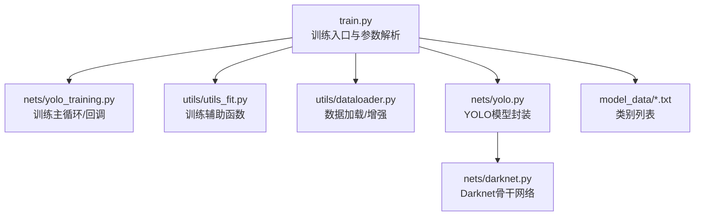
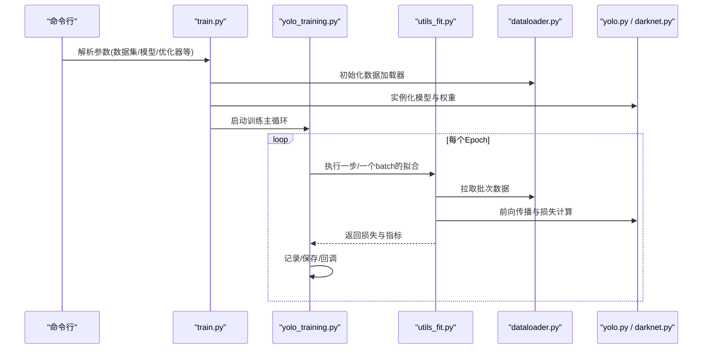
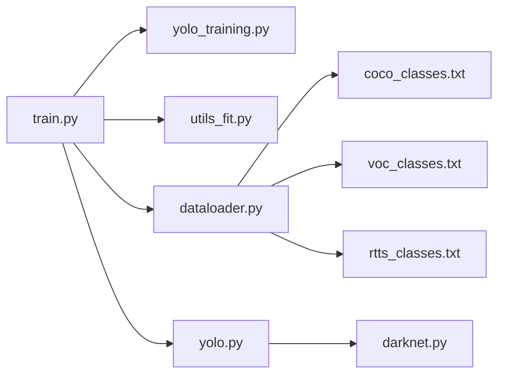

# 训练配置

<cite>
**本文引用的文件**   
- [train.py](file://train.py)
- [nets/yolo_training.py](file://nets/yolo_training.py)
- [utils/utils_fit.py](file://utils/utils_fit.py)
- [utils/dataloader.py](file://utils/dataloader.py)
- [nets/yolo.py](file://nets/yolo.py)
- [nets/darknet.py](file://nets/darknet.py)
- [model_data/coco_classes.txt](file://model_data/coco_classes.txt)
- [model_data/voc_classes.txt](file://model_data/voc_classes.txt)
- [model_data/rtts_classes.txt](file://model_data/rtts_classes.txt)
- [README.md](file://README.md)
</cite>

## 目录
1. [简介](#简介)
2. [项目结构](#项目结构)
3. [核心组件](#核心组件)
4. [架构总览](#架构总览)
5. [详细组件分析](#详细组件分析)
6. [依赖关系分析](#依赖关系分析)
7. [性能与资源调优](#性能与资源调优)
8. [故障排查指南](#故障排查指南)
9. [结论](#结论)
10. [附录：配置模板与最佳实践](#附录配置模板与最佳实践)

## 简介
本文件面向TogetherNet的训练配置，系统性梳理训练脚本的参数、数据路径、模型架构选择、优化器与学习率策略、批大小与硬件适配等关键内容。文档提供可操作的配置模板、参数验证方法与常见问题排查建议，帮助在不同数据集（COCO/VOC/RTTS）和不同硬件条件下快速搭建稳定高效的训练流程。

## 项目结构
本项目采用“入口脚本 + 训练逻辑 + 数据加载 + 模型定义”的分层组织方式：
- 训练入口：train.py
- 训练主循环与回调：nets/yolo_training.py、utils/utils_fit.py
- 数据加载与预处理：utils/dataloader.py
- 模型定义：nets/yolo.py、nets/darknet.py
- 类别字典：model_data/*.txt
- 使用说明：README.md

图表来源
- [train.py:1-200](file://train.py#L1-L200)
- [nets/yolo_training.py:1-200](file://nets/yolo_training.py#L1-L200)
- [utils/utils_fit.py:1-200](file://utils/utils_fit.py#L1-L200)
- [utils/dataloader.py:1-200](file://utils/dataloader.py#L1-L200)
- [nets/yolo.py:1-200](file://nets/yolo.py#L1-L200)
- [nets/darknet.py:1-200](file://nets/darknet.py#L1-L200)

章节来源
- [README.md:1-200](file://README.md#L1-L200)

## 核心组件
- 训练入口与参数解析：负责命令行参数解析、配置文件读取、日志与保存路径设置、设备选择、分布式/多卡初始化等。
- 训练主循环：实现epoch迭代、损失计算、梯度更新、指标统计、检查点保存、可视化与回调。
- 数据加载：实现VOC/COCO/自定义格式的数据读取、标注解析、图像增强、批构建与并行加载。
- 模型与骨干：YOLO模型封装与Darknet骨干网络，支持不同尺度输出与特征融合。
- 类别字典：用于推理与评估时的类别映射。

章节来源
- [train.py:1-200](file://train.py#L1-L200)
- [nets/yolo_training.py:1-200](file://nets/yolo_training.py#L1-L200)
- [utils/utils_fit.py:1-200](file://utils/utils_fit.py#L1-L200)
- [utils/dataloader.py:1-200](file://utils/dataloader.py#L1-L200)
- [nets/yolo.py:1-200](file://nets/yolo.py#L1-L200)
- [nets/darknet.py:1-200](file://nets/darknet.py#L1-L200)

## 架构总览
下图展示从命令行到训练主循环的关键调用链与数据流。

图表来源
- [train.py:1-200](file://train.py#L1-L200)
- [nets/yolo_training.py:1-200](file://nets/yolo_training.py#L1-L200)
- [utils/utils_fit.py:1-200](file://utils/utils_fit.py#L1-L200)
- [utils/dataloader.py:1-200](file://utils/dataloader.py#L1-L200)
- [nets/yolo.py:1-200](file://nets/yolo.py#L1-L200)
- [nets/darknet.py:1-200](file://nets/darknet.py#L1-L200)

## 详细组件分析

### 训练入口与参数（train.py）
- 功能要点
  - 解析命令行参数：数据集根目录、类别文件、输入尺寸、批大小、学习率、优化器类型、权重衰减、动量、预热步数、早停、保存间隔、日志路径、预训练权重、设备与多卡等。
  - 初始化数据加载器：根据数据集类型与类别文件构造训练/验证集。
  - 初始化模型：选择YOLO主干与FPN结构，加载预训练权重或随机初始化。
  - 初始化优化器与学习率调度器：如SGD/AdamW，配合余弦退火或多阶段策略。
  - 启动训练：调用训练主循环并处理回调（保存、可视化、日志）。
- 关键参数说明（示例字段名以实际代码为准）
  - 数据相关：data_root、classes_file、input_shape、num_workers、pin_memory
  - 模型相关：backbone、pretrained、anchors/multi-scale（若启用）
  - 优化相关：optimizer_type、lr、weight_decay、momentum、warmup_epochs、scheduler
  - 训练控制：epochs、batch_size、accumulation_steps、save_interval、eval_interval、early_stop_patience
  - 运行环境：device、gpus、distributed、seed、log_dir、resume_from
- 参数校验与默认值
  - 对非法或不一致参数进行提示与回退（例如类别数量与模型输出通道不匹配时给出错误信息）。
  - 为常用场景提供合理默认值，便于快速上手。

章节来源
- [train.py:1-200](file://train.py#L1-L200)

### 训练主循环与回调（nets/yolo_training.py）
- 功能要点
  - Epoch/Step循环：按批次迭代，累计梯度、反向传播、参数更新。
  - 指标统计：损失分项、mAP/Precision/Recall（若开启评估）、显存占用等。
  - 检查点管理：周期性保存与断点恢复。
  - 回调机制：TensorBoard/CSV日志、可视化预测图、早停触发。
- 典型流程
  - 初始化：加载权重、构建优化器与调度器、准备数据管道。
  - 训练步：前向→损失→反向→更新→记录。
  - 评估步：在验证集上计算mAP并保存最优权重。
  - 结束：保存最终权重与日志。

章节来源
- [nets/yolo_training.py:1-200](file://nets/yolo_training.py#L1-L200)

### 训练辅助函数（utils/utils_fit.py）
- 功能要点
  - 单步拟合封装：统一前向、损失计算、梯度裁剪、混合精度（可选）、累积梯度。
  - 指标聚合：将多个loss项合并、平滑曲线、导出CSV。
  - 工具方法：时间戳、内存监控、异常捕获与重试。
- 适用场景
  - 需要统一训练接口以便扩展新任务或替换损失函数。

章节来源
- [utils/utils_fit.py:1-200](file://utils/utils_fit.py#L1-L200)

### 数据加载与增强（utils/dataloader.py）
- 功能要点
  - 数据源：支持VOC、COCO及自定义格式；通过类别文件映射标签。
  - 预处理：Resize/Mosaic/MixUp/Hue-Saturation-Value扰动、随机翻转、缩放、归一化。
  - 批构建：动态padding或固定尺寸、缺失框填充、类别索引转换。
  - 并行：num_workers、prefetch、pin_memory提升吞吐。
- 常见陷阱
  - 标注格式不一致导致维度错误或漏检。
  - 过强的增强导致小目标丢失。
  - num_workers过大导致内存溢出。

章节来源
- [utils/dataloader.py:1-200](file://utils/dataloader.py#L1-L200)

### 模型与骨干（nets/yolo.py, nets/darknet.py）
- 功能要点
  - YOLO封装：多尺度输出、锚框/无锚方案、损失组合（分类/回归/置信度）。
  - Darknet骨干：卷积块、残差连接、下采样策略。
  - 权重初始化：Kaiming/Xavier、BN预热、冻结/解冻策略。
- 扩展点
  - 替换骨干（如更深的Darknet或ResNet变体）。
  - 调整颈部（PANet/FPN）深度与宽度。
  - 更换检测头以适应不同任务。

章节来源
- [nets/yolo.py:1-200](file://nets/yolo.py#L1-L200)
- [nets/darknet.py:1-200](file://nets/darknet.py#L1-L200)

### 类别字典（model_data/*.txt）
- 作用：定义类别名称与索引映射，供数据加载与评估使用。
- 注意事项：确保与训练/推理一致，避免类别错位。

章节来源
- [model_data/coco_classes.txt:1-200](file://model_data/coco_classes.txt#L1-L200)
- [model_data/voc_classes.txt:1-200](file://model_data/voc_classes.txt#L1-L200)
- [model_data/rtts_classes.txt:1-200](file://model_data/rtts_classes.txt#L1-L200)

## 依赖关系分析
- 模块耦合
  - train.py 作为入口，依赖数据加载、模型、训练主循环与辅助函数。
  - yolo_training.py 依赖 utils_fit.py 的单步拟合与指标聚合。
  - dataloader.py 依赖 model_data/*.txt 的类别映射。
  - yolo.py 依赖 darknet.py 提供的骨干特征。
- 外部依赖
  - PyTorch/TensorFlow（取决于具体实现）、OpenCV、Pillow、NumPy、tqdm、tensorboard等。

图表来源
- [train.py:1-200](file://train.py#L1-L200)
- [nets/yolo_training.py:1-200](file://nets/yolo_training.py#L1-L200)
- [utils/utils_fit.py:1-200](file://utils/utils_fit.py#L1-L200)
- [utils/dataloader.py:1-200](file://utils/dataloader.py#L1-L200)
- [nets/yolo.py:1-200](file://nets/yolo.py#L1-L200)
- [nets/darknet.py:1-200](file://nets/darknet.py#L1-L200)
- [model_data/coco_classes.txt:1-200](file://model_data/coco_classes.txt#L1-L200)
- [model_data/voc_classes.txt:1-200](file://model_data/voc_classes.txt#L1-L200)
- [model_data/rtts_classes.txt:1-200](file://model_data/rtts_classes.txt#L1-L200)

## 性能与资源调优
- 批大小与梯度累积
  - 增大batch_size有助于稳定训练但受显存限制；可使用梯度累积模拟更大批大小。
- 学习率与调度
  - 预热后逐步下降（余弦退火/多阶段），结合权重衰减防止过拟合。
- 数据增强强度
  - 小目标较多时适度降低Mosaic/MixUp强度，避免破坏小目标上下文。
- I/O瓶颈
  - 提高num_workers、启用pin_memory与prefetch，减少磁盘I/O等待。
- 混合精度与算子优化
  - 启用AMP与CUDA加速算子，显著提速且节省显存。
- 多卡/分布式
  - 使用DDP/FSDP等并行策略，注意同步BN与梯度通信开销。

[本节为通用指导，无需特定文件引用]

## 故障排查指南
- 显存不足
  - 减小batch_size、关闭强增强、启用混合精度、减少输入分辨率。
- 训练不收敛/震荡
  - 检查学习率是否过大、是否缺少预热、权重衰减是否合适。
- mAP不升反降
  - 核对类别文件与标注一致性；检查数据增强是否过度；确认评估集划分正确。
- 数据加载慢
  - 调整num_workers、检查磁盘IO、确认数据格式与路径正确。
- 断点恢复失败
  - 确认权重与配置版本一致，路径存在且可读。

章节来源
- [utils/utils_fit.py:1-200](file://utils/utils_fit.py#L1-L200)
- [utils/dataloader.py:1-200](file://utils/dataloader.py#L1-L200)
- [nets/yolo_training.py:1-200](file://nets/yolo_training.py#L1-L200)

## 结论
TogetherNet的训练配置围绕“入口参数—数据—模型—优化—训练循环”形成清晰链路。通过合理的超参选择与硬件适配，可在不同数据集与设备上获得稳定高效的训练效果。建议以最小可用配置起步，再逐步引入增强与复杂调度，并结合日志与指标持续调优。

[本节为总结性内容，无需特定文件引用]

## 附录：配置模板与最佳实践

### 配置模板（按场景）
- 小型GPU（单卡8G~12G）
  - batch_size=4~8，num_workers=4，input_shape=640，lr初始较小并配合预热，启用混合精度。
- 中型GPU（单卡16G~24G）
  - batch_size=16~32，num_workers=8~16，input_shape=640~1280，可尝试Mosaic/MixUp。
- 多卡/服务器
  - 使用分布式训练，按每卡batch_size=8~16累加全局批大小，启用同步BN与梯度压缩。

[本节为概念性模板，无需特定文件引用]

### 参数验证方法
- 数据一致性
  - 打印类别映射与首条样本的bbox范围，确认坐标与类别索引正确。
- 训练稳定性
  - 观察loss曲线是否单调下降；若震荡，降低学习率或增加预热步数。
- 指标有效性
  - 在验证集上定期评估mAP，对比不同增强强度与输入尺寸的效果。
- 资源利用
  - 监控GPU利用率与显存峰值，必要时调整batch_size或num_workers。

[本节为方法论，无需特定文件引用]