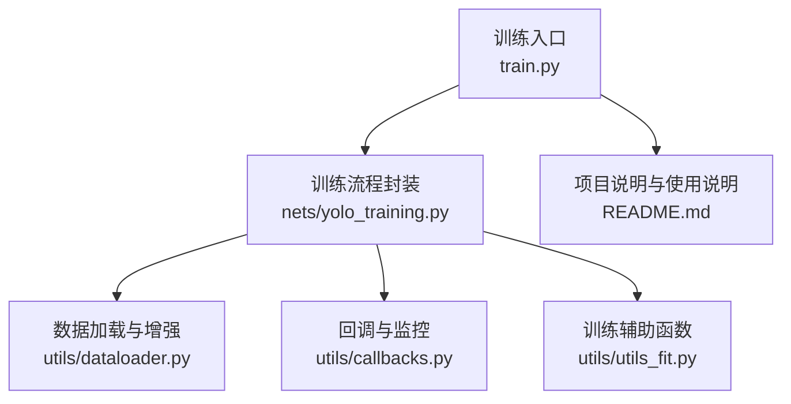
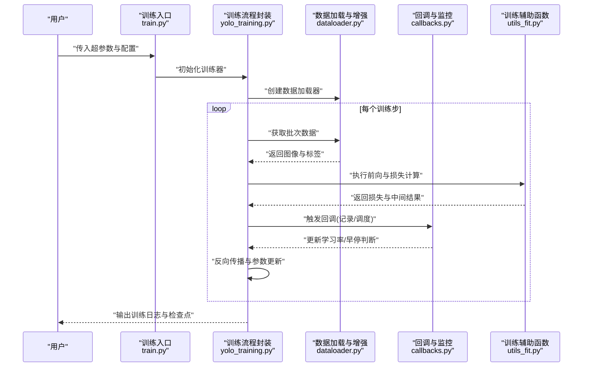
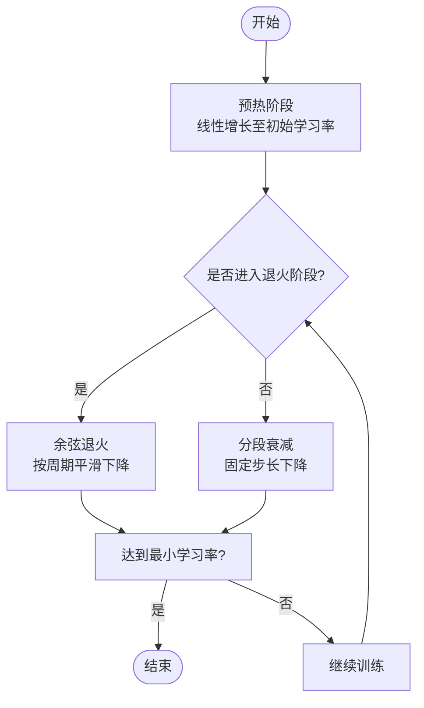
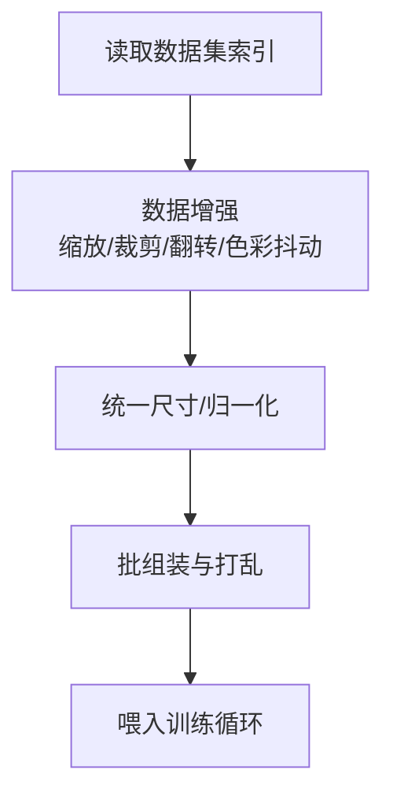
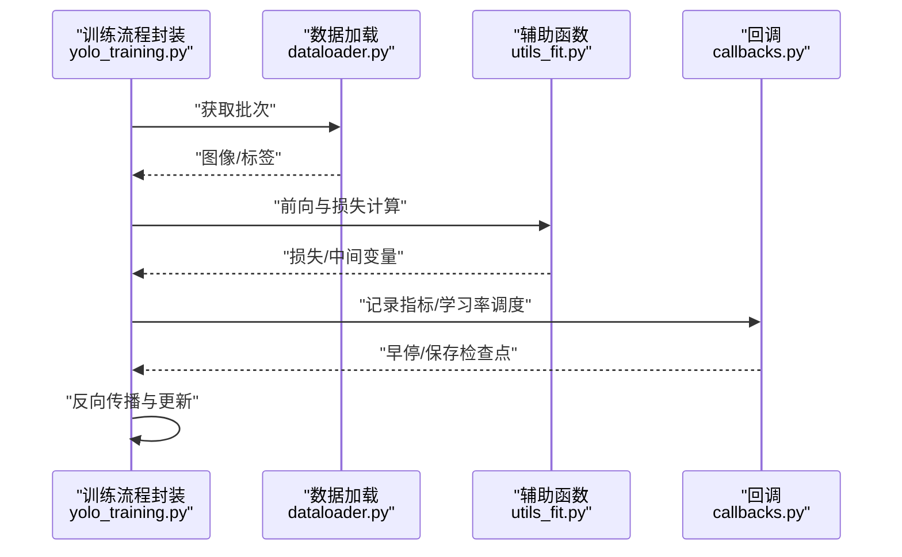
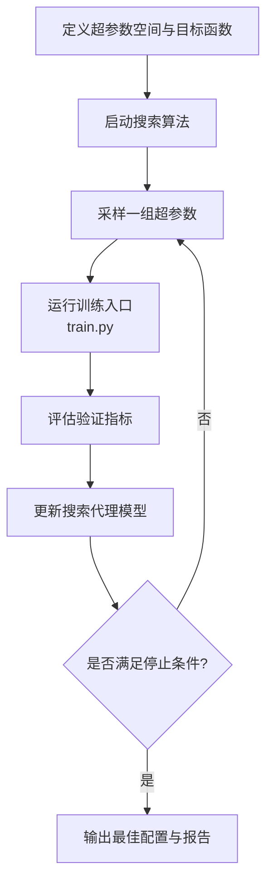
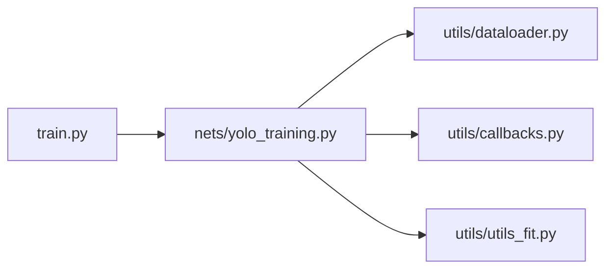

# 超参数调优

<cite>
**本文引用的文件**   
- [train.py](file://train.py)
- [yolo_training.py](file://nets/yolo_training.py)
- [dataloader.py](file://utils/dataloader.py)
- [callbacks.py](file://utils/callbacks.py)
- [utils_fit.py](file://utils/utils_fit.py)
- [README.md](file://README.md)
</cite>

## 目录
1. [简介](#简介)
2. [项目结构](#项目结构)
3. [核心组件](#核心组件)
4. [架构总览](#架构总览)
5. [详细组件分析](#详细组件分析)
6. [依赖关系分析](#依赖关系分析)
7. [性能考量](#性能考量)
8. [故障排查指南](#故障排查指南)
9. [结论](#结论)
10. [附录](#附录)

## 简介
本指南面向使用本项目进行目标检测训练的工程师与研究者，聚焦于“超参数调优”的系统化方法与实践。内容涵盖关键超参数的影响机制（学习率策略、批量大小、数据增强强度等）、搜索策略（网格搜索、随机搜索、贝叶斯优化）、不同数据集规模下的调整建议与迁移学习策略、高级学习率调度（预热、余弦退火），以及自动化调参工具的配置与结果评估方法。文档以代码仓库中的训练入口、训练流程、数据加载与回调为核心依据，提供可操作的实践路径。

## 项目结构
本项目围绕 YOLO 系列目标检测任务组织，训练相关的关键位置包括：
- 训练入口与配置：位于训练脚本中，负责解析命令行参数、构建训练器、启动训练循环。
- 训练流程封装：封装了训练主循环、日志记录、模型保存、指标计算等逻辑。
- 数据加载与增强：实现数据集读取、图像预处理、数据增强流水线。
- 回调与监控：包含早停、学习率调度、指标可视化等回调。

图表来源
- [train.py](file://train.py)
- [yolo_training.py](file://nets/yolo_training.py)
- [dataloader.py](file://utils/dataloader.py)
- [callbacks.py](file://utils/callbacks.py)
- [utils_fit.py](file://utils/utils_fit.py)
- [README.md](file://README.md)

章节来源
- [train.py](file://train.py)
- [yolo_training.py](file://nets/yolo_training.py)
- [dataloader.py](file://utils/dataloader.py)
- [callbacks.py](file://utils/callbacks.py)
- [utils_fit.py](file://utils/utils_fit.py)
- [README.md](file://README.md)

## 核心组件
- 训练入口与参数解析：负责接收并校验超参数（如学习率、批量大小、训练轮数、权重路径、数据路径等），初始化训练器与回调，进入训练循环。
- 训练流程封装：管理训练迭代、损失计算、梯度更新、指标统计、检查点保存、日志输出。
- 数据加载与增强：实现批次采样、图像缩放/裁剪/翻转/色彩抖动等增强操作，控制数据吞吐与多样性。
- 回调与监控：实现学习率调度（预热、余弦退火等）、早停、指标记录与可视化。
- 训练辅助函数：封装常用训练步骤（如前向传播、损失聚合、后处理等）。

章节来源
- [train.py](file://train.py)
- [yolo_training.py](file://nets/yolo_training.py)
- [dataloader.py](file://utils/dataloader.py)
- [callbacks.py](file://utils/callbacks.py)
- [utils_fit.py](file://utils/utils_fit.py)

## 架构总览
下图展示了从训练入口到数据加载、训练循环与回调的调用关系，便于理解超参数在各模块间的传递与作用点。

图表来源
- [train.py](file://train.py)
- [yolo_training.py](file://nets/yolo_training.py)
- [dataloader.py](file://utils/dataloader.py)
- [callbacks.py](file://utils/callbacks.py)
- [utils_fit.py](file://utils/utils_fit.py)

## 详细组件分析

### 学习率策略与调度
- 关键超参数
  - 初始学习率：决定初始步长大小，过大易震荡，过小收敛慢。
  - 预热步数/比例：在训练初期以小学习率逐步提升，有助于稳定训练。
  - 退火策略：余弦退火或分段衰减，帮助后期精细收敛。
  - 最小学习率：退火的下限，避免学习率过低导致停滞。
- 作用机制
  - 预热阶段降低早期梯度爆炸风险，使网络快速适应数据分布。
  - 余弦退火平滑降低学习率，利于跳出局部极小并稳定收敛。
  - 结合早停与验证指标，动态终止或恢复训练。
- 推荐实践
  - 小数据集：较短预热、较快退火，配合较小学习率。
  - 大数据集：较长预热、更平缓退火，允许更大初始学习率。
  - 迁移学习：冻结主干时用小学习率，解冻后分阶段提高学习率。

章节来源
- [callbacks.py](file://utils/callbacks.py)
- [yolo_training.py](file://nets/yolo_training.py)
- [train.py](file://train.py)

#### 学习率调度流程图

图表来源
- [callbacks.py](file://utils/callbacks.py)
- [yolo_training.py](file://nets/yolo_training.py)

### 批量大小与数据吞吐
- 关键超参数
  - 批量大小：影响梯度估计方差、显存占用与收敛稳定性。
  - 数据加载线程数：影响 I/O 吞吐，避免 GPU 饥饿。
  - 图像尺寸与缓存：大尺寸带来更高精度但增加内存与时间成本。
- 影响机制
  - 较大批量提升稳定性与并行度，但可能降低泛化；需配合学习率按比例放大。
  - 较小批量引入噪声正则，有利于泛化，但训练不稳定。
- 推荐实践
  - 显存受限：优先减小图像尺寸与批量，再考虑梯度累积。
  - 多卡训练：按卡数线性调整学习率，保持每样本有效学习率一致。
  - I/O 瓶颈：增大线程数、启用预取与缓存。

章节来源
- [dataloader.py](file://utils/dataloader.py)
- [yolo_training.py](file://nets/yolo_training.py)
- [train.py](file://train.py)

#### 数据加载与增强流程

图表来源
- [dataloader.py](file://utils/dataloader.py)

### 数据增强强度与正则化
- 关键超参数
  - 几何增强：Mosaic、MixUp、随机裁剪、旋转、仿射变换强度。
  - 色彩增强：亮度、对比度、饱和度、色调抖动幅度。
  - 随机擦除/遮挡：抑制过拟合，提升鲁棒性。
- 影响机制
  - 强增强提升泛化，但可能破坏小目标或细粒度特征；需平衡任务需求。
  - 小目标密集场景应谨慎使用过度裁剪与缩放。
- 推荐实践
  - 小数据集：适度增强，避免破坏关键信息。
  - 大数据集：较强增强，配合正则化（权重衰减、Dropout 等）。
  - 域差异大：引入颜色与光照增强，提升跨域鲁棒性。

章节来源
- [dataloader.py](file://utils/dataloader.py)

### 训练循环与指标监控
- 关键超参数
  - 训练轮数、验证频率、早停耐心值、检查点保存策略。
  - 损失权重与类别不平衡处理。
- 影响机制
  - 合理验证频率与早停防止过拟合，缩短无效训练时间。
  - 检查点策略支持断点续训与最佳模型选择。
- 推荐实践
  - 使用验证集 mAP 作为主要指标，结合 Loss 曲线诊断。
  - 对类别不平衡采用加权损失或重采样。

章节来源
- [yolo_training.py](file://nets/yolo_training.py)
- [utils_fit.py](file://utils/utils_fit.py)
- [callbacks.py](file://utils/callbacks.py)

#### 训练主循环时序图

图表来源
- [yolo_training.py](file://nets/yolo_training.py)
- [dataloader.py](file://utils/dataloader.py)
- [utils_fit.py](file://utils/utils_fit.py)
- [callbacks.py](file://utils/callbacks.py)

### 搜索策略与自动化调参
- 网格搜索
  - 适用：超参数空间小、维度低。
  - 优点：覆盖完整；缺点：组合爆炸。
- 随机搜索
  - 适用：高维空间、部分参数影响显著。
  - 优点：更高效探索；缺点：不保证全局最优。
- 贝叶斯优化
  - 适用：昂贵评估、连续/离散混合空间。
  - 优点：利用历史结果指导搜索；缺点：实现复杂。
- 自动化工具集成
  - 将训练入口作为可重复执行的子进程，通过配置文件或命令行参数注入超参数。
  - 使用 Ray Tune、Optuna、Weights & Biases Sweeps 等工具管理实验与资源。
  - 定义目标函数为验证集 mAP 或综合评分，设置早停与资源上限。

章节来源
- [train.py](file://train.py)
- [README.md](file://README.md)

#### 自动化调参工作流

[此图为概念性流程，无需图表来源]

### 不同数据集规模与迁移学习策略
- 小数据集（数百至数千样本）
  - 使用预训练权重，冻结主干若干层，仅微调头部与小学习率。
  - 适度增强，避免破坏稀缺样本信息；早停耐心值较小。
- 中等数据集（数万样本）
  - 解冻更多层，逐步提高学习率；增强强度适中。
  - 使用余弦退火与预热，配合验证集监控。
- 大数据集（数十万以上样本）
  - 更大批量与更强增强；学习率可按批量线性放大。
  - 更长预热与更平缓退火，充分利用数据多样性。

章节来源
- [train.py](file://train.py)
- [yolo_training.py](file://nets/yolo_training.py)
- [dataloader.py](file://utils/dataloader.py)

## 依赖关系分析
训练入口依赖训练流程封装、数据加载与回调模块；训练流程封装进一步依赖辅助函数与外部库。整体耦合清晰，职责分离良好。

图表来源
- [train.py](file://train.py)
- [yolo_training.py](file://nets/yolo_training.py)
- [dataloader.py](file://utils/dataloader.py)
- [callbacks.py](file://utils/callbacks.py)
- [utils_fit.py](file://utils/utils_fit.py)

章节来源
- [train.py](file://train.py)
- [yolo_training.py](file://nets/yolo_training.py)
- [dataloader.py](file://utils/dataloader.py)
- [callbacks.py](file://utils/callbacks.py)
- [utils_fit.py](file://utils/utils_fit.py)

## 性能考量
- 显存与吞吐
  - 批量大小与图像尺寸直接影响显存占用；I/O 线程数与预取影响吞吐。
  - 多卡训练时按卡数线性调整学习率，保持每样本有效学习率一致。
- 数值稳定性
  - 预热与较小初始学习率有助于稳定初期训练；梯度裁剪可防爆炸。
- 收敛效率
  - 余弦退火与早停结合，减少无效训练；验证频率合理设置。
- 正则化与泛化
  - 数据增强与权重衰减协同；类别不平衡采用加权损失或重采样。

[本节为通用指导，无需章节来源]

## 故障排查指南
- 训练不收敛或震荡
  - 检查学习率是否过大；启用预热与余弦退火；适当减小批量或增大梯度裁剪。
- 过拟合
  - 增强强度不足；增加正则化（权重衰减、Dropout）；提前早停。
- I/O 瓶颈
  - 增大数据加载线程数；启用缓存与预取；减少不必要的磁盘操作。
- 显存溢出
  - 减小批量或图像尺寸；启用梯度累积；关闭不必要日志与可视化。
- 指标异常
  - 检查标签格式与类别映射；确认验证集划分与评估脚本一致性。

章节来源
- [callbacks.py](file://utils/callbacks.py)
- [yolo_training.py](file://nets/yolo_training.py)
- [dataloader.py](file://utils/dataloader.py)

## 结论
超参数调优是一个系统工程，需要结合任务特性、数据规模与硬件约束进行权衡。建议以“先粗后细”的策略开展：先用随机搜索或贝叶斯优化定位大致范围，再用网格搜索精细化；同时重视学习率策略与数据增强的协同，辅以合理的监控与早停机制，以获得稳定且高效的训练效果。

[本节为总结性内容，无需章节来源]

## 附录
- 常用超参数清单
  - 学习率：初始学习率、预热步数、退火策略、最小学习率。
  - 批量大小：单卡/多卡批量、梯度累积步数。
  - 数据增强：几何与色彩增强强度、随机擦除概率。
  - 训练控制：训练轮数、验证频率、早停耐心值、检查点策略。
- 自动化调参示例思路
  - 将训练入口封装为可重复执行的任务，定义超参数空间与目标函数，使用 Optuna/Ray Tune 进行搜索与报告。
  - 记录每次实验的超参数、指标与日志，便于复现与回溯。

[本节为补充信息，无需章节来源]