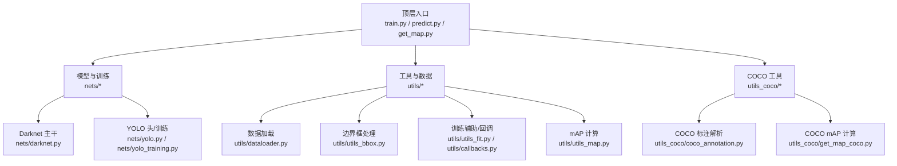
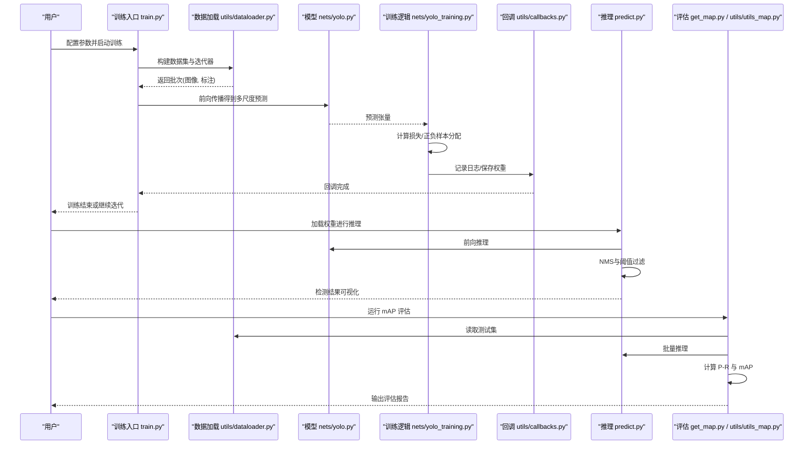
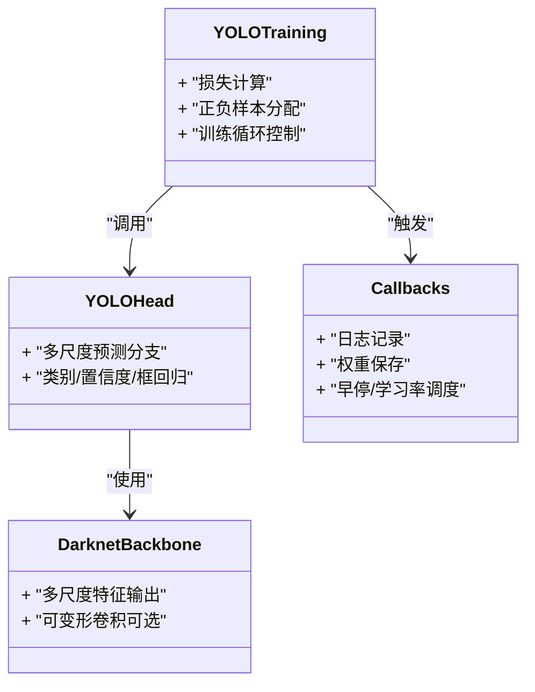
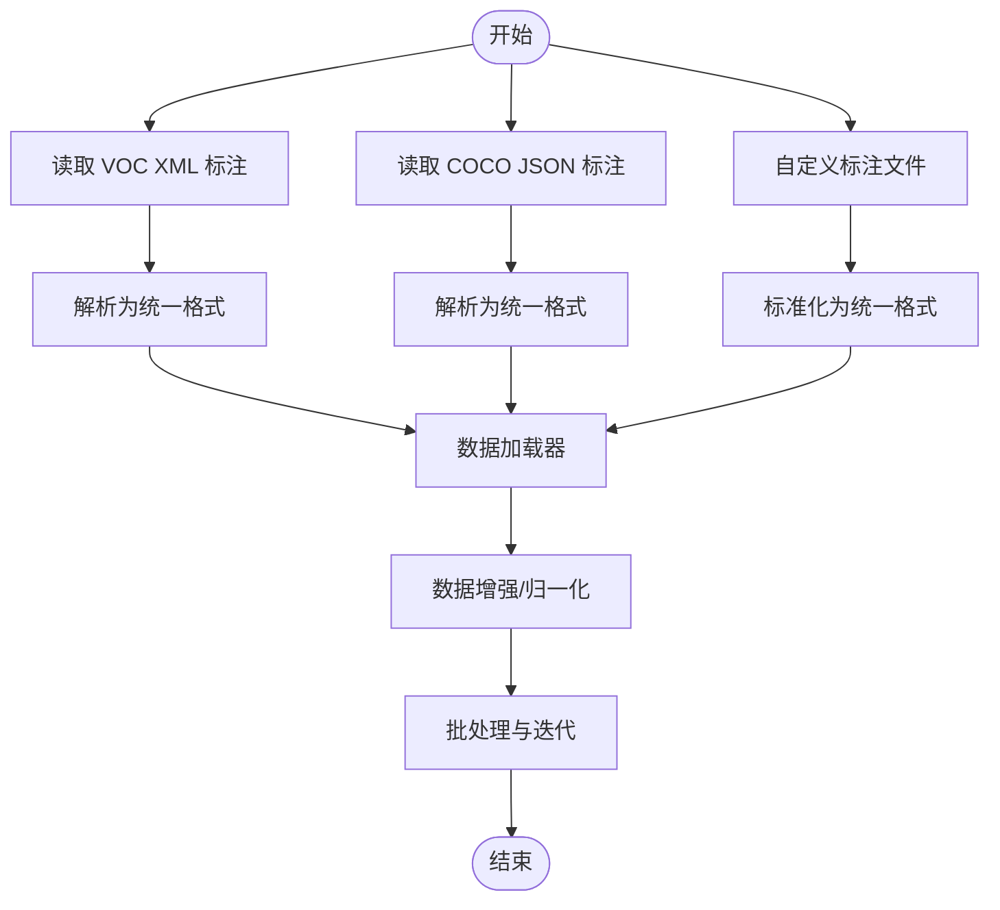
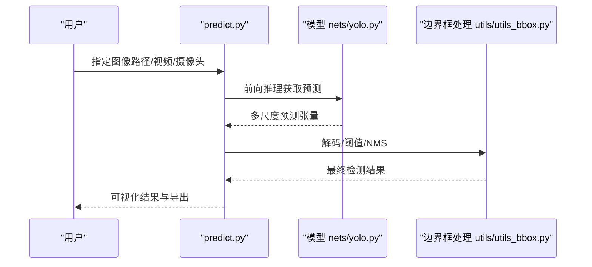
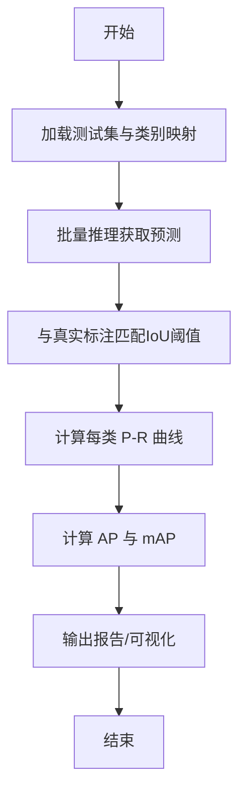
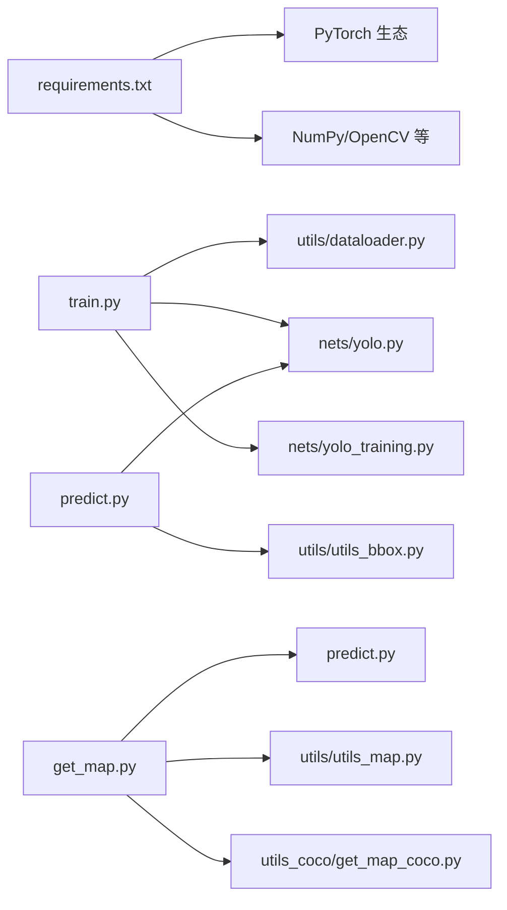

# 项目概述

<cite>
**本文引用的文件**   
- [README.md](file://README.md)
- [train.py](file://train.py)
- [predict.py](file://predict.py)
- [yolo.py](file://yolo.py)
- [nets/yolo.py](file://nets/yolo.py)
- [nets/darknet.py](file://nets/darknet.py)
- [nets/deform_conv_v2.py](file://nets/deform_conv_v2.py)
- [nets/yolo_training.py](file://nets/yolo_training.py)
- [utils/dataloader.py](file://utils/dataloader.py)
- [utils/utils_fit.py](file://utils/utils_fit.py)
- [utils/callbacks.py](file://utils/callbacks.py)
- [utils/utils_bbox.py](file://utils/utils_bbox.py)
- [utils/utils_map.py](file://utils/utils_map.py)
- [utils_coco/coco_annotation.py](file://utils_coco/coco_annotation.py)
- [utils_coco/get_map_coco.py](file://utils_coco/get_map_coco.py)
- [get_map.py](file://get_map.py)
- [voc_annotation.py](file://voc_annotation.py)
- [requirements.txt](file://requirements.txt)
</cite>

## 目录
1. [简介](#简介)
2. [项目结构](#项目结构)
3. [核心组件](#核心组件)
4. [架构总览](#架构总览)
5. [详细组件分析](#详细组件分析)
6. [依赖关系分析](#依赖关系分析)
7. [性能与优化建议](#性能与优化建议)
8. [故障排查指南](#故障排查指南)
9. [结论](#结论)
10. [附录](#附录)

## 简介
TogetherNet 是一个基于 YOLO 系列算法的目标检测工程实现，提供从数据准备、模型训练、推理预测到性能评估的完整流程。项目支持 VOC 与 COCO 数据集格式，并具备对自定义数据集的适配能力。其网络主干采用 Darknet 风格构建，并在关键位置引入可变形卷积以增强特征表达；训练侧包含损失计算、标签生成与回调机制；评估侧提供 mAP 计算工具链。整体设计强调模块化与可扩展性，便于快速复现实验与迁移到新任务。

## 项目结构
仓库采用“功能分层 + 模块内聚”的组织方式：
- 顶层脚本：训练入口、推理入口、mAP 评估入口、VOC 标注转换等
- nets：模型定义（YOLO 头/主干）、训练相关逻辑
- utils：数据加载、边界框处理、训练辅助、指标计算等
- utils_coco：COCO 专用标注解析与 mAP 计算
- model_data：类别名文件与权重占位
- 其他：日志、结果输出、示例数据等

图表来源
- [train.py:1-200](file://train.py#L1-L200)
- [predict.py:1-200](file://predict.py#L1-L200)
- [get_map.py:1-200](file://get_map.py#L1-L200)
- [nets/yolo.py:1-200](file://nets/yolo.py#L1-L200)
- [nets/darknet.py:1-200](file://nets/darknet.py#L1-L200)
- [nets/yolo_training.py:1-200](file://nets/yolo_training.py#L1-L200)
- [utils/dataloader.py:1-200](file://utils/dataloader.py#L1-L200)
- [utils/utils_bbox.py:1-200](file://utils/utils_bbox.py#L1-L200)
- [utils/utils_fit.py:1-200](file://utils/utils_fit.py#L1-L200)
- [utils/callbacks.py:1-200](file://utils/callbacks.py#L1-L200)
- [utils/utils_map.py:1-200](file://utils/utils_map.py#L1-L200)
- [utils_coco/coco_annotation.py:1-200](file://utils_coco/coco_annotation.py#L1-L200)
- [utils_coco/get_map_coco.py:1-200](file://utils_coco/get_map_coco.py#L1-L200)

章节来源
- [README.md:1-200](file://README.md#L1-L200)
- [requirements.txt:1-200](file://requirements.txt#L1-L200)

## 核心组件
- 模型定义与训练
  - 主干网络：Darknet 风格卷积堆叠，负责提取多尺度特征
  - YOLO 头：多尺度预测分支，输出类别置信度与边界框回归量
  - 训练逻辑：损失函数组合、正负样本分配、梯度更新与回调
- 数据管线
  - 数据加载器：图像读取、增强、归一化、打包为批次
  - 标注适配：VOC XML 与 COCO JSON 解析，统一内部格式
- 推理与可视化
  - 预测流程：前向推理、后处理（NMS、阈值过滤）、可视化绘制
- 评估工具
  - mAP 计算：P-R 曲线、平均精度、COCO 标准评测接口

章节来源
- [nets/darknet.py:1-200](file://nets/darknet.py#L1-L200)
- [nets/yolo.py:1-200](file://nets/yolo.py#L1-L200)
- [nets/yolo_training.py:1-200](file://nets/yolo_training.py#L1-L200)
- [utils/dataloader.py:1-200](file://utils/dataloader.py#L1-L200)
- [voc_annotation.py:1-200](file://voc_annotation.py#L1-L200)
- [utils_coco/coco_annotation.py:1-200](file://utils_coco/coco_annotation.py#L1-L200)
- [predict.py:1-200](file://predict.py#L1-L200)
- [get_map.py:1-200](file://get_map.py#L1-L200)
- [utils/utils_map.py:1-200](file://utils/utils_map.py#L1-L200)
- [utils_coco/get_map_coco.py:1-200](file://utils_coco/get_map_coco.py#L1-L200)

## 架构总览
下图展示了从数据到训练再到推理与评估的整体数据流与控制流。

图表来源
- [train.py:1-200](file://train.py#L1-L200)
- [utils/dataloader.py:1-200](file://utils/dataloader.py#L1-L200)
- [nets/yolo.py:1-200](file://nets/yolo.py#L1-L200)
- [nets/yolo_training.py:1-200](file://nets/yolo_training.py#L1-L200)
- [utils/callbacks.py:1-200](file://utils/callbacks.py#L1-L200)
- [predict.py:1-200](file://predict.py#L1-L200)
- [get_map.py:1-200](file://get_map.py#L1-L200)
- [utils/utils_map.py:1-200](file://utils/utils_map.py#L1-L200)

## 详细组件分析

### 模型与训练（YOLO + Darknet）
- 主干网络（Darknet）
  - 由多层卷积与下采样构成，逐步扩大感受野，输出多尺度特征图
  - 在部分层引入可变形卷积以增强形变目标表征
- YOLO 头
  - 针对每个尺度输出三类信息：类别概率、置信度、边界框偏移
  - 多尺度融合提升小目标与大目标的检测稳定性
- 训练逻辑
  - 损失项通常包括分类损失、置信度损失与定位损失
  - 正负样本策略与标签编码在训练模块中实现
  - 通过回调记录训练曲线、保存最佳权重

图表来源
- [nets/darknet.py:1-200](file://nets/darknet.py#L1-L200)
- [nets/deform_conv_v2.py:1-200](file://nets/deform_conv_v2.py#L1-L200)
- [nets/yolo.py:1-200](file://nets/yolo.py#L1-L200)
- [nets/yolo_training.py:1-200](file://nets/yolo_training.py#L1-L200)
- [utils/callbacks.py:1-200](file://utils/callbacks.py#L1-L200)

章节来源
- [nets/darknet.py:1-200](file://nets/darknet.py#L1-L200)
- [nets/deform_conv_v2.py:1-200](file://nets/deform_conv_v2.py#L1-L200)
- [nets/yolo.py:1-200](file://nets/yolo.py#L1-L200)
- [nets/yolo_training.py:1-200](file://nets/yolo_training.py#L1-L200)
- [utils/callbacks.py:1-200](file://utils/callbacks.py#L1-L200)

### 数据处理与标注适配（VOC/COCO/自定义）
- VOC 适配
  - 将 VOC XML 转换为内部统一格式，便于数据加载器消费
- COCO 适配
  - 解析 COCO JSON，映射类别与边界框，支持标准评测
- 自定义数据集
  - 遵循统一的标注结构即可接入，无需修改核心训练/推理代码
- 数据加载器
  - 支持图像读取、增强、归一化、动态尺寸与批处理

图表来源
- [voc_annotation.py:1-200](file://voc_annotation.py#L1-L200)
- [utils_coco/coco_annotation.py:1-200](file://utils_coco/coco_annotation.py#L1-L200)
- [utils/dataloader.py:1-200](file://utils/dataloader.py#L1-L200)

章节来源
- [voc_annotation.py:1-200](file://voc_annotation.py#L1-L200)
- [utils_coco/coco_annotation.py:1-200](file://utils_coco/coco_annotation.py#L1-L200)
- [utils/dataloader.py:1-200](file://utils/dataloader.py#L1-L200)

### 推理与后处理（预测流程）
- 前向推理：输入图像经模型得到多尺度预测
- 后处理：置信度阈值过滤、非极大值抑制（NMS）、坐标还原
- 可视化：在原图上绘制边界框与类别标签

图表来源
- [predict.py:1-200](file://predict.py#L1-L200)
- [nets/yolo.py:1-200](file://nets/yolo.py#L1-L200)
- [utils/utils_bbox.py:1-200](file://utils/utils_bbox.py#L1-L200)

章节来源
- [predict.py:1-200](file://predict.py#L1-L200)
- [utils/utils_bbox.py:1-200](file://utils/utils_bbox.py#L1-L200)

### 性能评估（mAP 计算）
- VOC 风格 mAP
  - 基于 P-R 曲线积分计算 AP，再按类别求均值
- COCO 风格 mAP
  - 使用 COCO API 计算多种 IoU 阈值下的 mAP
- 工具链
  - 批量推理+匹配+统计，输出详细指标与可视化

图表来源
- [get_map.py:1-200](file://get_map.py#L1-L200)
- [utils/utils_map.py:1-200](file://utils/utils_map.py#L1-L200)
- [utils_coco/get_map_coco.py:1-200](file://utils_coco/get_map_coco.py#L1-L200)

章节来源
- [get_map.py:1-200](file://get_map.py#L1-L200)
- [utils/utils_map.py:1-200](file://utils/utils_map.py#L1-L200)
- [utils_coco/get_map_coco.py:1-200](file://utils_coco/get_map_coco.py#L1-L200)

## 依赖关系分析
- 外部依赖
  - 深度学习框架与数值库（见 requirements.txt）
  - 图像处理与可视化工具
- 内部依赖
  - 训练入口依赖数据加载器、模型与训练逻辑
  - 推理入口依赖模型与边界框后处理
  - 评估入口依赖推理与指标计算模块

图表来源
- [requirements.txt:1-200](file://requirements.txt#L1-L200)
- [train.py:1-200](file://train.py#L1-L200)
- [predict.py:1-200](file://predict.py#L1-L200)
- [get_map.py:1-200](file://get_map.py#L1-L200)
- [utils/dataloader.py:1-200](file://utils/dataloader.py#L1-L200)
- [nets/yolo.py:1-200](file://nets/yolo.py#L1-L200)
- [nets/yolo_training.py:1-200](file://nets/yolo_training.py#L1-L200)
- [utils/utils_bbox.py:1-200](file://utils/utils_bbox.py#L1-L200)
- [utils/utils_map.py:1-200](file://utils/utils_map.py#L1-L200)
- [utils_coco/get_map_coco.py:1-200](file://utils_coco/get_map_coco.py#L1-L200)

章节来源
- [requirements.txt:1-200](file://requirements.txt#L1-L200)

## 性能与优化建议
- 数据层面
  - 合理的数据增强与归一化能显著提升泛化能力
  - 针对小目标场景可增加高分辨率分支或调整锚点/网格划分
- 模型层面
  - 主干深度与宽度需根据算力与精度需求权衡
  - 可变形卷积在复杂形变目标上有效，但会引入额外开销
- 训练层面
  - 学习率调度与早停策略有助于稳定收敛
  - 混合精度与梯度累积可在显存受限下加速训练
- 推理层面
  - 批量推理与缓存可提升吞吐
  - 选择合适的 NMS 阈值与置信度阈值平衡召回与误检

[本节为通用指导，不直接分析具体文件]

## 故障排查指南
- 环境依赖问题
  - 检查 Python 版本与第三方库安装是否满足 requirements.txt
- 数据路径与格式
  - 确认 VOC XML 与 COCO JSON 路径正确且格式规范
  - 自定义数据集需遵循统一标注结构
- 训练异常
  - 若出现维度不匹配，检查输入尺寸与模型配置
  - 若损失不下降，检查学习率、数据增强强度与类别不平衡
- 推理失败
  - 检查权重路径与类别映射文件一致性
  - 调整置信度阈值与 NMS 参数以改善结果
- 评估不一致
  - 核对 IoU 阈值设置与类别映射是否与评测协议一致

章节来源
- [requirements.txt:1-200](file://requirements.txt#L1-L200)
- [voc_annotation.py:1-200](file://voc_annotation.py#L1-L200)
- [utils_coco/coco_annotation.py:1-200](file://utils_coco/coco_annotation.py#L1-L200)
- [utils/utils_fit.py:1-200](file://utils/utils_fit.py#L1-L200)
- [utils/callbacks.py:1-200](file://utils/callbacks.py#L1-L200)
- [predict.py:1-200](file://predict.py#L1-L200)
- [get_map.py:1-200](file://get_map.py#L1-L200)

## 结论
TogetherNet 提供了完整的 YOLO 目标检测工程链路，涵盖数据、模型、训练、推理与评估。其模块化设计使 VOC/COCO 与自定义数据集均可平滑接入，同时通过可变形卷积与完善的训练/评估工具链，兼顾精度与易用性。对于初学者，可从 VOC 入门，逐步过渡到 COCO 与自定义任务；对于有经验的开发者，可通过替换主干、调整训练策略与后处理参数来探索更高性能方案。

[本节为总结性内容，不直接分析具体文件]

## 附录
- 术语对照
  - 主干网络：Darknet 风格卷积骨干
  - YOLO 头：多尺度预测分支
  - 正负样本分配：训练阶段选择参与计算的样本策略
  - NMS：非极大值抑制，用于去重冗余检测框
  - mAP：平均精度，衡量检测精度的核心指标
- 常用命令参考
  - 训练：运行训练入口脚本并传入配置文件
  - 推理：指定图像/视频路径与权重文件进行预测
  - 评估：运行 mAP 计算脚本并指定测试集路径

[本节为补充说明，不直接分析具体文件]