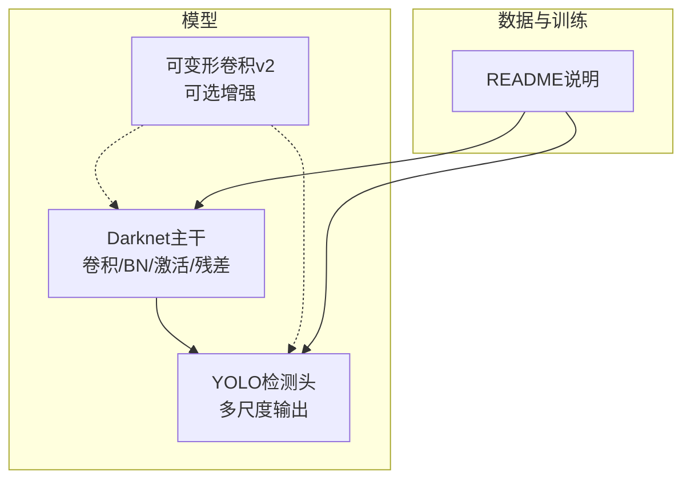
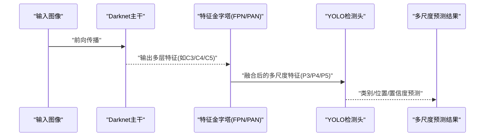
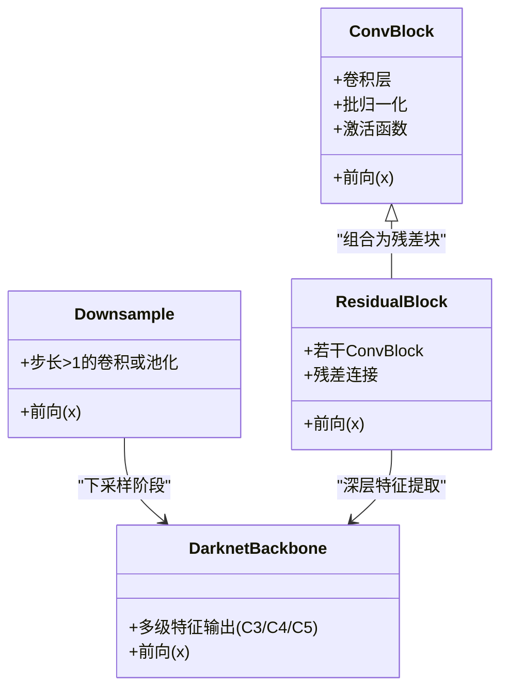
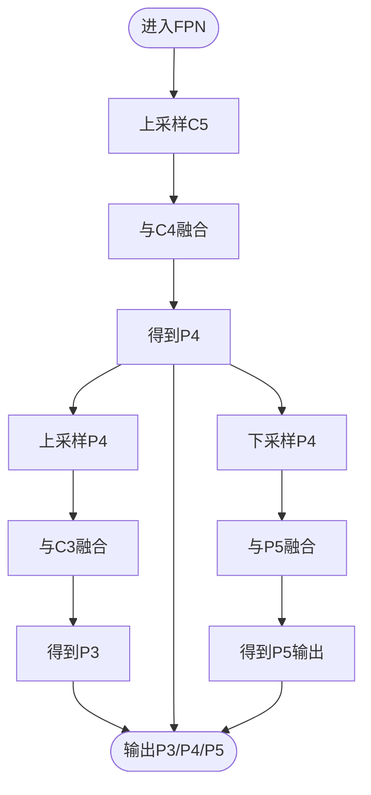
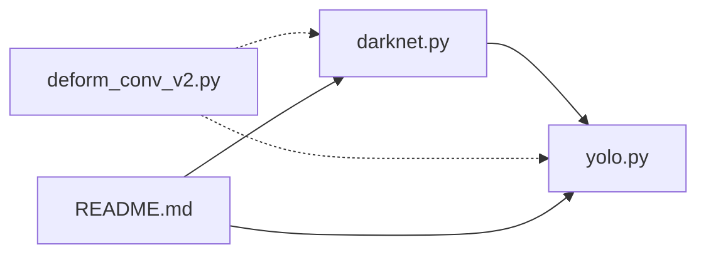

# Darknet骨干网络

<cite>
**本文引用的文件**   
- [darknet.py](file://nets/darknet.py)
- [yolo.py](file://nets/yolo.py)
- [deform_conv_v2.py](file://nets/deform_conv_v2.py)
- [README.md](file://README.md)
</cite>

## 目录
1. [简介](#简介)
2. [项目结构](#项目结构)
3. [核心组件](#核心组件)
4. [架构总览](#架构总览)
5. [详细组件分析](#详细组件分析)
6. [依赖关系分析](#依赖关系分析)
7. [性能考量](#性能考量)
8. [故障排查指南](#故障排查指南)
9. [结论](#结论)
10. [附录](#附录)

## 简介
本文件面向Darknet骨干网络的架构文档，聚焦以下目标：
- 解释Darknet的层次结构设计，包括卷积层、批归一化、激活函数与残差连接的组合模式。
- 对比不同规模Darknet变体（如Darknet-19、Darknet-53）的深度与特征提取能力差异。
- 说明特征金字塔（Feature Pyramid）的实现机制与多尺度特征融合策略。
- 提供自定义Darknet结构的指导：如何添加新的卷积块、修改网络深度与通道数。
- 解释预训练权重加载方法与迁移学习应用场景。
- 给出网络可视化图与特征图分析工具的使用建议。

## 项目结构
本项目围绕YOLO系列检测任务组织代码，骨干网络Darknet位于nets模块中，并与YOLO检测头协同工作。关键目录与文件职责如下：
- nets/darknet.py：定义Darknet主干网络及其构建逻辑（卷积块、残差块、下采样等）。
- nets/yolo.py：实现YOLO检测头与特征金字塔（FPN/PAN）的多尺度融合流程。
- nets/deform_conv_v2.py：可选的可变形卷积实现，用于增强骨干或检测头的表达能力。
- README.md：项目说明、使用方式与依赖信息。

图表来源
- [darknet.py](file://nets/darknet.py)
- [yolo.py](file://nets/yolo.py)
- [deform_conv_v2.py](file://nets/deform_conv_v2.py)
- [README.md](file://README.md)

章节来源
- [README.md](file://README.md)

## 核心组件
- 卷积块（Conv Block）
  - 典型组成：卷积层 + 批归一化 + 激活函数（如LeakyReLU）。
  - 作用：进行空间特征提取与非线性变换。
- 残差块（Residual Block）
  - 典型组成：若干卷积块串联后，将输入与输出相加形成残差连接。
  - 作用：缓解梯度消失、加深网络同时保持训练稳定性。
- 下采样（Downsample）
  - 常用方式：步长为2的卷积或池化，降低分辨率并提升通道数。
  - 作用：扩大感受野，生成更高层语义特征。
- 特征金字塔（Feature Pyramid）
  - 在YOLO检测头中，通过上采样与拼接/相加融合多尺度特征，得到P3/P4/P5等层级输出。
  - 作用：兼顾小目标与大目标的检测精度。

章节来源
- [darknet.py](file://nets/darknet.py)
- [yolo.py](file://nets/yolo.py)

## 架构总览
下图展示Darknet主干与YOLO检测头的整体交互关系，以及可选的可变形卷积增强路径。

图表来源
- [darknet.py](file://nets/darknet.py)
- [yolo.py](file://nets/yolo.py)

## 详细组件分析

### Darknet主干网络（卷积块与残差块）
- 设计要点
  - 卷积块通常采用“卷积+BN+激活”的顺序，保证数值稳定与非线性表达。
  - 残差块由多个卷积块堆叠而成，并在末尾加入恒等映射的残差连接，有助于训练更深网络。
  - 下采样阶段通过步长大于1的卷积或池化逐步缩小特征图尺寸，同时增加通道数以承载更高维语义。
- 复杂度与特性
  - 随着深度增加，感受野增大，对大目标与全局上下文更敏感；但计算量与显存占用也相应上升。
  - 残差连接改善梯度流动，使较深网络更易收敛。
- 常见变体
  - Darknet-19：相对较浅，适合轻量级场景与小目标快速推理。
  - Darknet-53：更深且通道更多，特征表达能力更强，适合高精度需求。

图表来源
- [darknet.py](file://nets/darknet.py)

章节来源
- [darknet.py](file://nets/darknet.py)

### 特征金字塔（FPN）与多尺度融合
- 机制概述
  - 自顶向下路径：从高层特征（如C5）开始，通过上采样与低层特征（如C4、C3）融合，得到P5、P4、P3等多尺度特征。
  - 自底向上路径（PAN风格）：进一步利用低层到高层的路径增强定位信息。
- 融合策略
  - 上采样：双线性插值或反卷积，将高分辨率对齐到低层。
  - 拼接或相加：将上下层特征合并，保留细节与语义。
- 输出
  - P3/P4/P5分别对应不同尺度的检测分支，适配小、中、大目标。

图表来源
- [yolo.py](file://nets/yolo.py)

章节来源
- [yolo.py](file://nets/yolo.py)

### 可变形卷积（Deformable Conv v2）
- 适用场景
  - 当目标形状不规则或存在较大形变时，可变形卷积能自适应调整采样点，提升特征表达。
- 集成方式
  - 可在Darknet主干或YOLO检测头中替换标准卷积，以增强局部几何建模能力。
- 注意事项
  - 引入额外偏移场计算，带来一定开销；需权衡精度与速度。

章节来源
- [deform_conv_v2.py](file://nets/deform_conv_v2.py)

### 不同规模Darknet变体对比
- Darknet-19
  - 特点：较浅、通道较少，推理速度快，适合移动端或实时性要求高的场景。
  - 能力：对小目标有一定识别能力，但对复杂背景与大目标鲁棒性较弱。
- Darknet-53
  - 特点：更深、通道更多，具备更强的特征提取与泛化能力。
  - 能力：在大目标与复杂场景中表现更佳，但计算与内存成本更高。
- 选择建议
  - 根据任务需求（精度vs速度）、硬件资源与部署环境选择合适的变体。

章节来源
- [darknet.py](file://nets/darknet.py)

## 依赖关系分析
- 模块耦合
  - Darknet主干负责多尺度特征提取，YOLO检测头基于这些特征进行预测。
  - 可变形卷积作为可选增强模块，可与主干或检测头组合。
- 外部依赖
  - 框架依赖（如PyTorch/TensorFlow）与第三方库（如OpenCV、NumPy）在README中有说明。

图表来源
- [darknet.py](file://nets/darknet.py)
- [yolo.py](file://nets/yolo.py)
- [deform_conv_v2.py](file://nets/deform_conv_v2.py)
- [README.md](file://README.md)

章节来源
- [README.md](file://README.md)

## 性能考量
- 深度与通道数的权衡
  - 加深网络与增加通道数会提升精度，但显著增加计算量与显存占用。
- 下采样策略
  - 合理设置下采样步长与次数，平衡感受野与分辨率，避免过度降采样导致小目标丢失。
- 残差连接
  - 有助于训练更深网络，减少退化问题，提高收敛稳定性。
- 可变形卷积
  - 在特定任务中可提升精度，但需评估额外开销与延迟。

[本节为通用性能讨论，不直接分析具体文件]

## 故障排查指南
- 维度不匹配
  - 检查各层输入输出通道数与特征图尺寸是否一致，尤其是下采样与融合阶段。
- 梯度异常
  - 确认残差连接是否正确叠加，BN参数初始化与统计量更新是否正常。
- 精度不达预期
  - 核对预训练权重版本与当前网络结构是否匹配；必要时微调或更换更大规模的Darknet变体。
- 推理速度慢
  - 考虑减小网络深度或通道数，关闭可选的可变形卷积，或使用量化/剪枝优化。

[本节为通用排错建议，不直接分析具体文件]

## 结论
Darknet骨干网络通过“卷积块+BN+激活+残差”的组合模式，提供了强大的多尺度特征提取能力。结合YOLO检测头的特征金字塔，能够高效处理不同尺度的目标。在实际应用中，应根据任务需求与硬件条件选择合适的Darknet变体，并通过合理的结构与超参调优达到精度与速度的平衡。

[本节为总结性内容，不直接分析具体文件]

## 附录

### 自定义Darknet结构指导
- 添加新的卷积块
  - 在主干中插入新的卷积块序列，确保输入输出通道与特征图尺寸符合后续层的要求。
- 修改网络深度
  - 增加或减少残差块的堆叠数量，注意保持下采样阶段的节奏，避免过早或过晚降采样。
- 调整通道数
  - 按比例缩放各层通道数，保持前后层通道一致性；同时评估计算与显存变化。
- 集成可变形卷积
  - 在需要的位置替换标准卷积为可变形卷积，并进行端到端微调。

章节来源
- [darknet.py](file://nets/darknet.py)
- [deform_conv_v2.py](file://nets/deform_conv_v2.py)

### 预训练权重加载与迁移学习
- 权重加载
  - 确保权重文件与当前网络结构完全匹配（层名、通道数、深度），否则会出现加载失败或行为异常。
- 迁移学习
  - 冻结主干部分权重，仅训练检测头或最后几层；或在数据集相似的情况下进行全量微调。
- 验证与调试
  - 在小样本集上进行快速验证，观察损失曲线与mAP变化，逐步放开更多层进行微调。

章节来源
- [README.md](file://README.md)

### 网络可视化与特征图分析
- 网络结构可视化
  - 使用框架提供的可视化工具（如TensorBoard、Netron）导出模型结构图，便于检查层连接与维度。
- 特征图分析
  - 在推理过程中抽取中间层特征图，观察响应区域与感受野变化，辅助理解模型对不同目标的关注点。
- 最佳实践
  - 固定随机种子与输入尺寸，确保可视化结果可复现；对比不同变体的特征图，评估其表达能力差异。

[本节为通用工具使用建议，不直接分析具体文件]