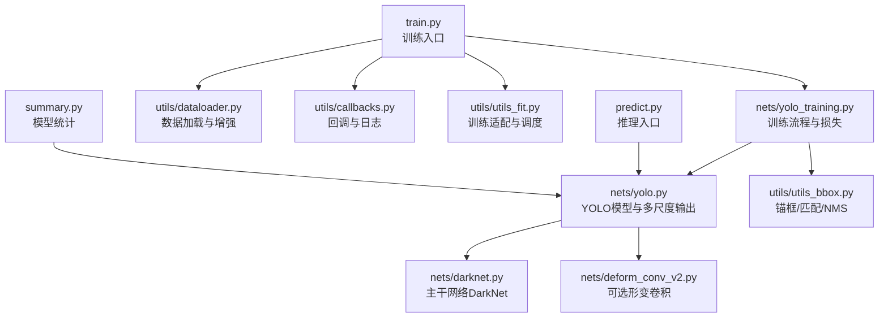
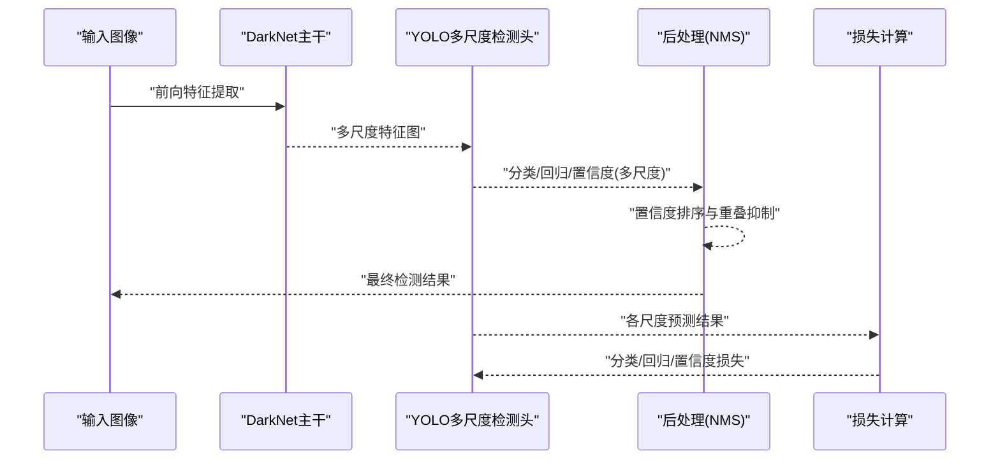
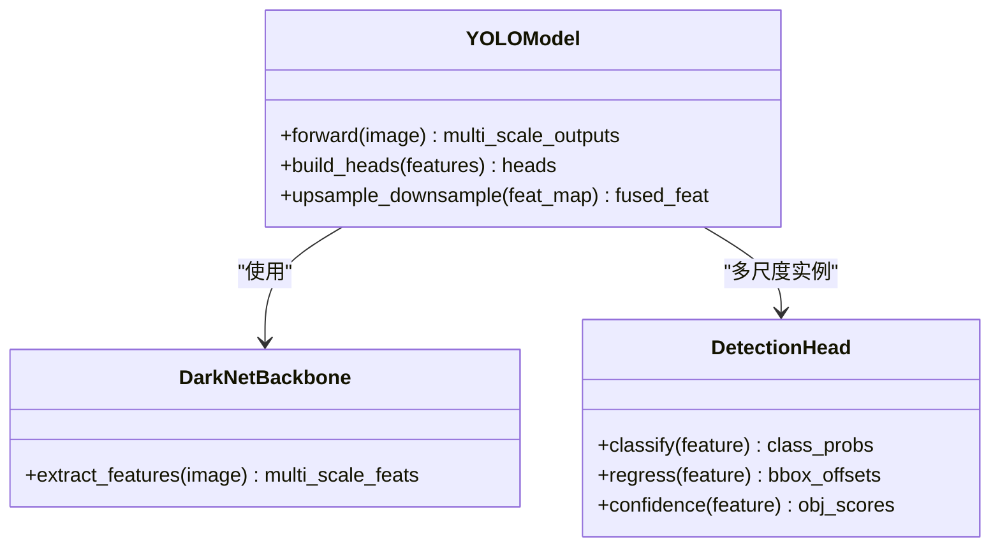
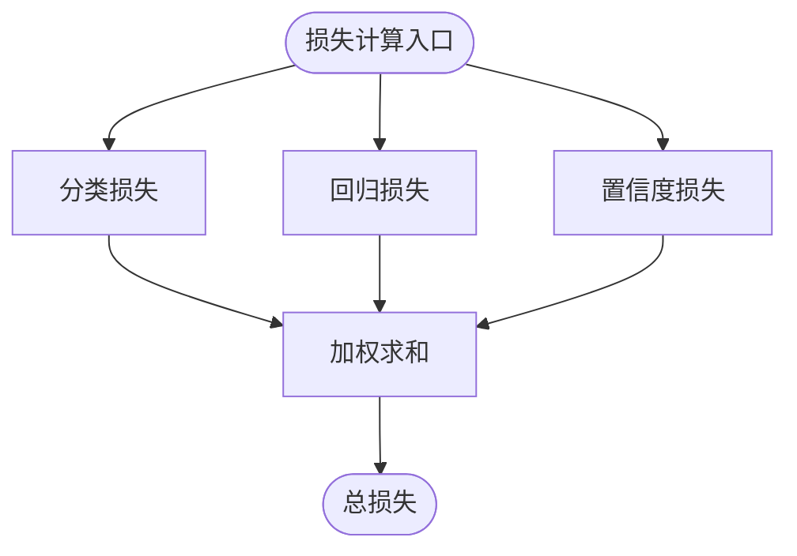
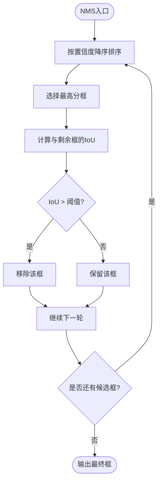
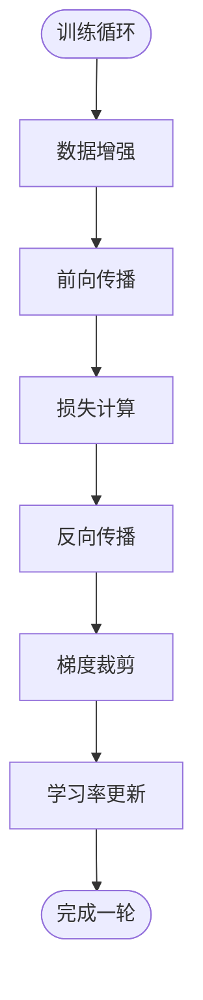
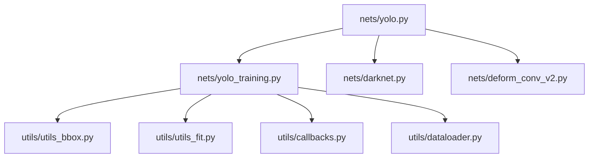

# YOLO核心创新

<cite>
**本文引用的文件**   
- [yolo.py](file://nets/yolo.py)
- [yolo_training.py](file://nets/yolo_training.py)
- [dataloader.py](file://utils/dataloader.py)
- [utils_bbox.py](file://utils/utils_bbox.py)
- [callbacks.py](file://utils/callbacks.py)
- [utils_fit.py](file://utils/utils_fit.py)
- [darknet.py](file://nets/darknet.py)
- [deform_conv_v2.py](file://nets/deform_conv_v2.py)
- [train.py](file://train.py)
- [predict.py](file://predict.py)
- [summary.py](file://summary.py)
</cite>

## 目录
1. [简介](#简介)
2. [项目结构](#项目结构)
3. [核心组件](#核心组件)
4. [架构总览](#架构总览)
5. [详细组件分析](#详细组件分析)
6. [依赖关系分析](#依赖关系分析)
7. [性能考虑](#性能考虑)
8. [故障排查指南](#故障排查指南)
9. [结论](#结论)
10. [附录](#附录)

## 简介
本技术文档聚焦于YOLO算法在该仓库中的核心创新与实现细节，围绕多尺度预测、锚框系统、损失函数设计、非极大值抑制（NMS）优化以及训练关键技巧展开。文档旨在帮助读者从代码层面理解多尺度特征图检测头、正负样本匹配规则、IoU阈值策略、分类/回归/置信度损失的加权组合方式，并给出可操作的参数调优建议与常见问题解决方案。

## 项目结构
本项目采用分层组织：网络定义与训练逻辑位于 nets 目录，数据加载与工具函数位于 utils 目录，顶层脚本负责训练、推理与评估。核心模块包括：
- 模型与训练：nets/yolo.py、nets/yolo_training.py、nets/darknet.py、nets/deform_conv_v2.py
- 数据与工具：utils/dataloader.py、utils/utils_bbox.py、utils/callbacks.py、utils/utils_fit.py
- 入口与辅助：train.py、predict.py、summary.py

图表来源
- [train.py](file://train.py)
- [nets/yolo_training.py](file://nets/yolo_training.py)
- [nets/yolo.py](file://nets/yolo.py)
- [nets/darknet.py](file://nets/darknet.py)
- [nets/deform_conv_v2.py](file://nets/deform_conv_v2.py)
- [utils/dataloader.py](file://utils/dataloader.py)
- [utils/utils_bbox.py](file://utils/utils_bbox.py)
- [utils/callbacks.py](file://utils/callbacks.py)
- [utils/utils_fit.py](file://utils/utils_fit.py)
- [predict.py](file://predict.py)
- [summary.py](file://summary.py)

章节来源
- [train.py](file://train.py)
- [nets/yolo.py](file://nets/yolo.py)
- [nets/yolo_training.py](file://nets/yolo_training.py)
- [utils/dataloader.py](file://utils/dataloader.py)
- [utils/utils_bbox.py](file://utils/utils_bbox.py)
- [utils/callbacks.py](file://utils/callbacks.py)
- [utils/utils_fit.py](file://utils/utils_fit.py)
- [nets/darknet.py](file://nets/darknet.py)
- [nets/deform_conv_v2.py](file://nets/deform_conv_v2.py)
- [predict.py](file://predict.py)
- [summary.py](file://summary.py)

## 核心组件
- 多尺度预测机制：在多个不同分辨率的特征图上并行进行目标检测，小目标由高分辨率层负责，大目标由低分辨率层负责，提升对不同尺度目标的鲁棒性。
- 预测头设计：每个尺度分支包含分类、回归与置信度三个子头，分别输出类别概率、边界框偏移与对象置信度。
- 锚框系统：基于先验尺寸生成锚框，结合正负样本匹配规则与IoU阈值筛选有效样本，稳定训练收敛。
- 损失函数：分类损失、回归损失与置信度损失按权重组合，兼顾定位精度与分类准确性。
- NMS优化：对候选框进行置信度排序与重叠抑制，提高最终检测结果质量。
- 训练技巧：数据增强、学习率调度、梯度裁剪等策略协同提升泛化能力与稳定性。

章节来源
- [nets/yolo.py](file://nets/yolo.py)
- [nets/yolo_training.py](file://nets/yolo_training.py)
- [utils/utils_bbox.py](file://utils/utils_bbox.py)

## 架构总览
下图展示了从输入图像到多尺度输出的端到端流程，包括主干特征提取、多尺度检测头、后处理与训练损失计算路径。

图表来源
- [nets/darknet.py](file://nets/darknet.py)
- [nets/yolo.py](file://nets/yolo.py)
- [utils/utils_bbox.py](file://utils/utils_bbox.py)
- [nets/yolo_training.py](file://nets/yolo_training.py)

## 详细组件分析

### 多尺度预测机制与检测头
- 多尺度特征图：主干网络在不同深度输出多分辨率特征图，用于覆盖不同尺度的目标。
- 检测头：每个尺度分支包含分类头、回归头与置信度头，分别预测类别概率、边界框偏移与对象置信度。
- 设计要点：
  - 高分辨率层对小目标更敏感，低分辨率层对大目标更稳健。
  - 各尺度输出形状与锚框数量决定最终预测张量维度。
  - 通过上采样或下采样融合相邻尺度信息，提升跨尺度表达能力。

图表来源
- [nets/yolo.py](file://nets/yolo.py)
- [nets/darknet.py](file://nets/darknet.py)

章节来源
- [nets/yolo.py](file://nets/yolo.py)
- [nets/darknet.py](file://nets/darknet.py)

### 锚框系统与正负样本匹配
- 锚框生成策略：根据数据集目标尺寸分布设定先验锚框，或在训练阶段动态调整。
- 正样本匹配规则：将真实框与各尺度锚框进行IoU比较，超过阈值的锚框作为正样本；同时考虑中心点落入网格的约束。
- 负样本选择：未匹配到的锚框为负样本，通常仅选取高置信度负样本以缓解类别不平衡。
- IoU阈值设置：根据任务难度与目标尺度分布调节，平衡召回与误检。

```mermaid
flowchart TD
Start(["开始"]) --> GenAnchors["生成锚框(多尺度)"]
GenAnchors --> ComputeIoU["计算真实框与锚框IoU"]
ComputeIoU --> MatchRule{"满足匹配规则?"}
MatchRule --> |是| PosSample["标记为正样本"]
MatchRule --> |否| NegSample["标记为负样本"]
PosSample --> FilterNeg["过滤高难负样本"]
NegSample --> FilterNeg
FilterNeg --> End(["结束"])
```

图表来源
- [utils/utils_bbox.py](file://utils/utils_bbox.py)
- [nets/yolo_training.py](file://nets/yolo_training.py)

章节来源
- [utils/utils_bbox.py](file://utils/utils_bbox.py)
- [nets/yolo_training.py](file://nets/yolo_training.py)

### 损失函数设计与权重组合
- 分类损失：衡量类别预测与真实标签的差异，常用交叉熵或其变体。
- 回归损失：衡量边界框偏移预测与真实框的差异，常用平滑L1或GIoU类损失。
- 置信度损失：衡量对象存在性与预测置信度的差异，区分前景与背景。
- 权重组合：通过超参数字典对各分量损失进行加权，平衡定位与分类性能。

图表来源
- [nets/yolo_training.py](file://nets/yolo_training.py)

章节来源
- [nets/yolo_training.py](file://nets/yolo_training.py)

### 非极大值抑制（NMS）优化与参数调优
- 基本流程：按类别置信度排序，依次保留最高分框，抑制与其IoU超过阈值的其余框。
- 优化策略：
  - 批量排序与向量化IoU计算提升速度。
  - 自适应阈值：针对不同类别或尺度设置差异化IoU阈值。
  - 软NMS：对重叠框进行分数衰减而非直接剔除，提升密集场景表现。
- 参数调优：
  - 置信度阈值：控制召回与精度的权衡。
  - IoU阈值：影响抑制强度，过小易漏检，过大易重复检测。
  - 每类最大检测数：限制输出规模，避免冗余。

图表来源
- [utils/utils_bbox.py](file://utils/utils_bbox.py)

章节来源
- [utils/utils_bbox.py](file://utils/utils_bbox.py)

### 训练关键技巧
- 数据增强：随机缩放、裁剪、翻转、色彩抖动、MixUp/CutMix等，提升模型鲁棒性与泛化能力。
- 学习率调度：余弦退火、分段下降、Warmup预热等策略，加速收敛并避免局部最优。
- 梯度裁剪：限制梯度范数，防止爆炸，提升训练稳定性。
- 正则化与优化器：权重衰减、AdamW、SGD+动量等选择与配置。

图表来源
- [utils/dataloader.py](file://utils/dataloader.py)
- [utils/utils_fit.py](file://utils/utils_fit.py)
- [utils/callbacks.py](file://utils/callbacks.py)

章节来源
- [utils/dataloader.py](file://utils/dataloader.py)
- [utils/utils_fit.py](file://utils/utils_fit.py)
- [utils/callbacks.py](file://utils/callbacks.py)

## 依赖关系分析
- 模型与训练耦合：yolo_training.py依赖yolo.py的输出与utils_bbox.py的匹配/NMS逻辑。
- 主干网络扩展：darknet.py提供基础特征提取，deform_conv_v2.py可作为可选增强模块。
- 数据与训练适配：dataloader.py提供增强后的批次数据，utils_fit.py封装训练循环与调度。

图表来源
- [nets/yolo.py](file://nets/yolo.py)
- [nets/yolo_training.py](file://nets/yolo_training.py)
- [nets/darknet.py](file://nets/darknet.py)
- [nets/deform_conv_v2.py](file://nets/deform_conv_v2.py)
- [utils/utils_bbox.py](file://utils/utils_bbox.py)
- [utils/utils_fit.py](file://utils/utils_fit.py)
- [utils/callbacks.py](file://utils/callbacks.py)
- [utils/dataloader.py](file://utils/dataloader.py)

章节来源
- [nets/yolo.py](file://nets/yolo.py)
- [nets/yolo_training.py](file://nets/yolo_training.py)
- [nets/darknet.py](file://nets/darknet.py)
- [nets/deform_conv_v2.py](file://nets/deform_conv_v2.py)
- [utils/utils_bbox.py](file://utils/utils_bbox.py)
- [utils/utils_fit.py](file://utils/utils_fit.py)
- [utils/callbacks.py](file://utils/callbacks.py)
- [utils/dataloader.py](file://utils/dataloader.py)

## 性能考虑
- 多尺度融合效率：合理选择上采样与下采样策略，减少冗余计算。
- 锚框数量与尺寸：过多样本导致计算开销增大，需结合数据集分布精简。
- NMS批处理：向量化实现与提前剪枝降低后处理耗时。
- 混合精度与算子优化：启用FP16与高效卷积核，提升吞吐。
- 早停与验证监控：依据mAP或验证损失自动停止，避免过拟合。

[本节为通用指导，不直接分析具体文件]

## 故障排查指南
- 训练发散或不收敛：
  - 检查学习率与Warmup策略是否合适。
  - 确认梯度裁剪阈值是否过小导致欠拟合。
  - 核对损失权重是否失衡，尤其是置信度损失。
- 检测漏检或重复检测：
  - 调整置信度阈值与IoU阈值。
  - 检查锚框尺寸是否与目标分布匹配。
  - 观察NMS实现是否存在数值不稳定。
- 数据加载瓶颈：
  - 增加缓存与并行读取。
  - 简化增强操作或按需启用。
- 内存溢出：
  - 减小批次大小或输入分辨率。
  - 释放中间变量与及时垃圾回收。

章节来源
- [nets/yolo_training.py](file://nets/yolo_training.py)
- [utils/utils_bbox.py](file://utils/utils_bbox.py)
- [utils/dataloader.py](file://utils/dataloader.py)
- [utils/utils_fit.py](file://utils/utils_fit.py)

## 结论
本仓库实现了YOLO的多尺度预测、锚框匹配、损失组合与NMS后处理，并通过数据增强、学习率调度与梯度裁剪等训练技巧提升性能。建议在部署前针对数据集特性校准锚框与阈值参数，并结合硬件条件优化计算路径以获得最佳效果。

[本节为总结，不直接分析具体文件]

## 附录
- 入口与辅助脚本：
  - train.py：训练主入口，整合数据、模型、训练循环与回调。
  - predict.py：推理入口，加载模型并进行检测与可视化。
  - summary.py：打印模型结构与参数量统计。

章节来源
- [train.py](file://train.py)
- [predict.py](file://predict.py)
- [summary.py](file://summary.py)