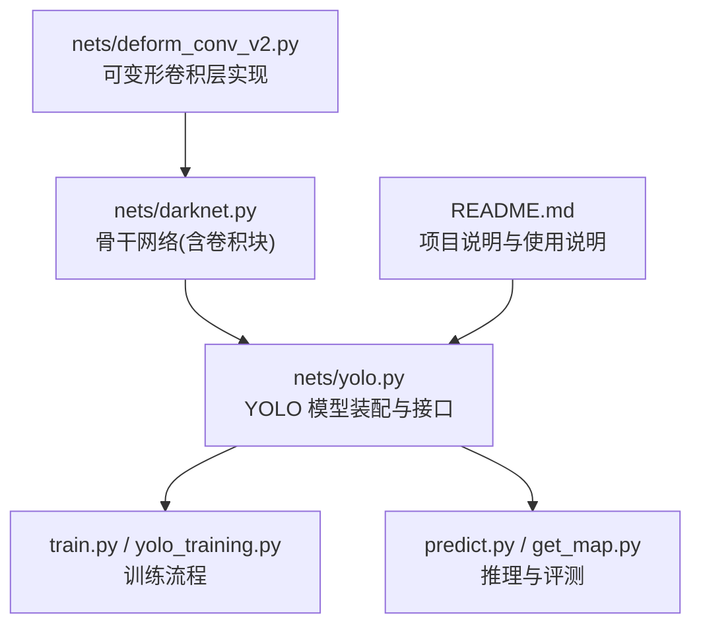
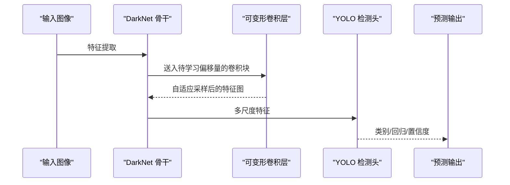
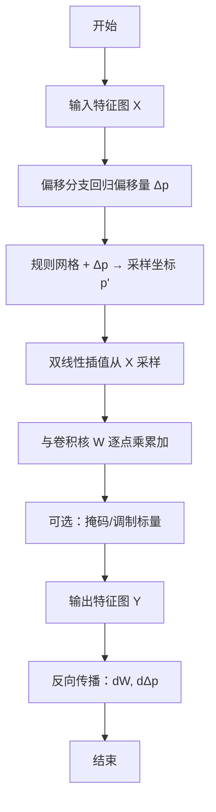
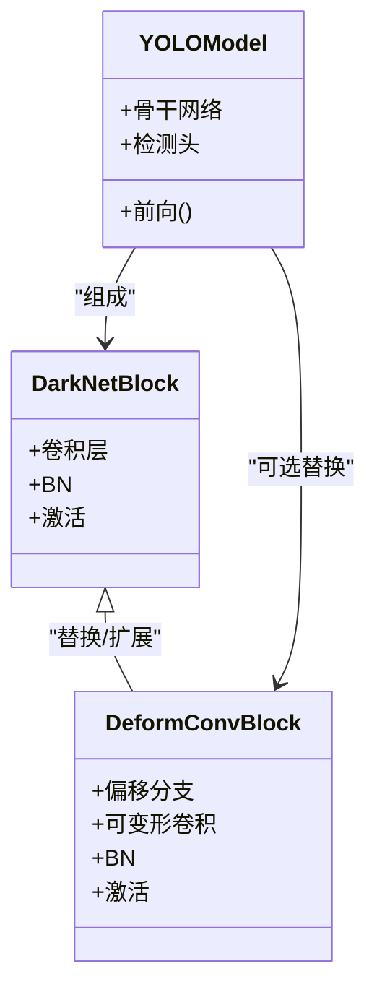
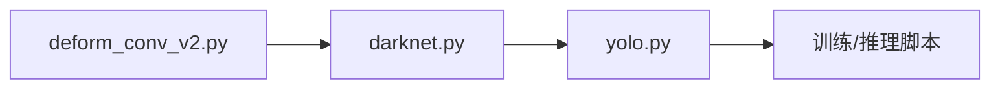

# 可变形卷积实现

<cite>
**本文引用的文件**   
- [deform_conv_v2.py](file://nets/deform_conv_v2.py)
- [yolo.py](file://nets/yolo.py)
- [darknet.py](file://nets/darknet.py)
- [README.md](file://README.md)
</cite>

## 目录
1. [简介](#简介)
2. [项目结构](#项目结构)
3. [核心组件](#核心组件)
4. [架构总览](#架构总览)
5. [详细组件分析](#详细组件分析)
6. [依赖关系分析](#依赖关系分析)
7. [性能考量](#性能考量)
8. [故障排查指南](#故障排查指南)
9. [结论](#结论)
10. [附录](#附录)

## 简介
本技术文档围绕可变形卷积（Deformable Convolution）在目标检测中的原理与工程实现展开，重点解析自适应感受野机制、偏移量学习与空间变换过程，并结合仓库中 nets/deform_conv_v2.py 的实现细节，系统阐述权重初始化、前向传播与反向传播梯度计算。同时给出在 YOLO 模型中集成可变形卷积的实践建议、参数调优要点，以及与传统卷积的对比思路与基准测试方法。

## 项目结构
本项目为基于 PyTorch 的目标检测训练/推理框架，核心网络定义位于 nets 目录，YOLO 主入口与训练流程分别由 yolo.py 与 yolo_training.py 提供；可变形卷积层实现于 deform_conv_v2.py。

图示来源
- [deform_conv_v2.py](file://nets/deform_conv_v2.py)
- [darknet.py](file://nets/darknet.py)
- [yolo.py](file://nets/yolo.py)
- [README.md](file://README.md)

章节来源
- [README.md](file://README.md)

## 核心组件
- 可变形卷积层：在标准卷积基础上引入可学习的偏移量，使采样点位置随输入自适应变化，从而获得动态感受野。
- 传统卷积模块：固定网格采样的标准卷积核，作为基线对比。
- YOLO 主干与检测头：通过替换或插入可变形卷积以增强对形变目标的表征能力。

章节来源
- [deform_conv_v2.py](file://nets/deform_conv_v2.py)
- [darknet.py](file://nets/darknet.py)
- [yolo.py](file://nets/yolo.py)

## 架构总览
下图展示了可变形卷积在 YOLO 中的典型集成方式：骨干网络中的若干卷积块被替换为可变形卷积，以提升对尺度、姿态与形变的鲁棒性。

图示来源
- [darknet.py](file://nets/darknet.py)
- [deform_conv_v2.py](file://nets/deform_conv_v2.py)
- [yolo.py](file://nets/yolo.py)

## 详细组件分析

### 可变形卷积层（deform_conv_v2.py）
本节从算法到代码层面拆解可变形卷积的关键步骤。

- 自适应感受野机制
  - 标准卷积使用规则网格采样；可变形卷积在每个采样点叠加可学习的二维偏移，形成非规则采样，从而扩大并自适应调整感受野。
  - 偏移量通常由一个轻量分支从输入特征图回归得到，并与原始网格相加后用于双线性插值采样。

- 偏移量学习
  - 偏移分支一般包含若干卷积层与激活函数，输出通道数为 2×K（K 为采样点数），每个采样点对应 (dx, dy)。
  - 为避免偏移发散，常见做法包括归一化、正则化或在损失中加入偏移约束项。

- 空间变换与采样
  - 将偏移量加到规则网格上得到采样坐标，随后通过双线性插值从输入特征图中取值，再与卷积核进行加权求和。
  - 该过程完全可微，支持端到端训练。

- 权重初始化
  - 卷积核权重通常采用 Kaiming/MSRA 初始化，偏置初始化为零。
  - 偏移分支的权重与偏置也常采用相似策略，但需关注数值稳定性，避免初期过大偏移导致采样越界。

- 前向传播算法
  - 输入特征图 → 偏移分支回归偏移量 → 生成采样坐标 → 双线性插值采样 → 与卷积核做逐点乘累加 → 输出特征图。
  - 若存在掩码（mask）或调制标量，可在采样后进行逐元素调制，进一步增强表达能力。

- 反向传播与梯度
  - 梯度沿双线性插值路径回传至偏移量与卷积核权重，同时考虑边界处理与插值导数。
  - 偏移量梯度受采样坐标与插值权重共同影响，需保证数值稳定与梯度有效传播。

图示来源
- [deform_conv_v2.py](file://nets/deform_conv_v2.py)

章节来源
- [deform_conv_v2.py](file://nets/deform_conv_v2.py)

### 在 YOLO 中的集成方式
- 替换策略
  - 将骨干网络中的部分标准卷积块替换为可变形卷积块，保持输入输出通道一致，便于无缝替换。
- 渐进式替换
  - 先在浅层少量替换验证可行性，再逐步增加比例，观察收敛与精度变化。
- 训练策略
  - 可先冻结骨干，仅训练检测头与偏移分支，再解冻全量微调。
  - 适当降低学习率，配合数据增强与正则化，提升稳定性。

图示来源
- [darknet.py](file://nets/darknet.py)
- [deform_conv_v2.py](file://nets/deform_conv_v2.py)
- [yolo.py](file://nets/yolo.py)

章节来源
- [yolo.py](file://nets/yolo.py)
- [darknet.py](file://nets/darknet.py)
- [deform_conv_v2.py](file://nets/deform_conv_v2.py)

### 与传统卷积的对比与实验设计
- 指标
  - mAP@0.5、mAP@[0.5:0.95]、FPS、参数量与 FLOPs。
- 设置
  - 相同骨干深度、相同优化器与超参，仅替换指定比例的卷积为可变形卷积。
- 预期优势
  - 对形变目标、遮挡与复杂背景具有更强鲁棒性，尤其在中小目标与长尾类别上表现更稳。
- 注意事项
  - 显存与计算开销略有上升，需权衡精度与速度。

[本节为通用方法论，不直接分析具体文件，故无“章节来源”]

## 依赖关系分析
- 模块耦合
  - deform_conv_v2.py 提供可变形卷积算子；darknet.py 组织骨干网络；yolo.py 装配整体模型。
- 外部依赖
  - 主要依赖 PyTorch 张量与自动微分机制；若使用 CUDA 加速的可变形卷积内核，需确保驱动与版本兼容。

图示来源
- [deform_conv_v2.py](file://nets/deform_conv_v2.py)
- [darknet.py](file://nets/darknet.py)
- [yolo.py](file://nets/yolo.py)

章节来源
- [deform_conv_v2.py](file://nets/deform_conv_v2.py)
- [darknet.py](file://nets/darknet.py)
- [yolo.py](file://nets/yolo.py)

## 性能考量
- 计算与内存
  - 可变形卷积相比标准卷积额外引入偏移分支与双线性插值，FLOPs 与显存占用略增。
- 数值稳定性
  - 偏移量过大可能导致采样越界或梯度不稳定，建议结合归一化、正则化与较小的初始学习率。
- 硬件加速
  - 若平台提供高效可变形卷积内核，优先启用以获得更好吞吐。
- 训练技巧
  - 渐进式替换、两阶段训练（冻结骨干→全量微调）、强数据增强与标签平滑有助于收敛与泛化。

[本节为通用指导，不直接分析具体文件，故无“章节来源”]

## 故障排查指南
- 训练不收敛或损失震荡
  - 检查偏移分支是否过深/过宽；尝试减小学习率或加入 L2 正则。
  - 确认偏移量未出现异常大值，必要时添加裁剪或归一化。
- 精度未提升甚至下降
  - 评估替换比例是否过高；先从少量浅层替换开始。
  - 核对数据增强强度与标签质量，避免噪声干扰。
- 推理速度慢
  - 检查是否启用了可用的 CUDA 加速内核；关闭不必要的调试日志。
- 维度不匹配或越界报错
  - 核对输入通道/输出通道与 padding 设置；确认采样坐标范围与边界处理逻辑。

[本节为通用排障建议，不直接分析具体文件，故无“章节来源”]

## 结论
可变形卷积通过引入可学习偏移量实现了自适应感受野，在目标检测中对形变目标与复杂背景具备显著优势。在本项目中，可通过替换骨干网络中的部分卷积块来集成可变形卷积，并以渐进式替换与两阶段训练策略保障稳定性。建议在同等条件下开展与传统卷积的对比实验，综合评估 mAP、速度与资源消耗，找到精度与效率的最佳平衡点。

[本节为总结性内容，不直接分析具体文件，故无“章节来源”]

## 附录

### 在 YOLO 中集成可变形卷积的实践清单
- 选择替换位置
  - 优先在浅层与中层各选若干关键卷积块进行替换，保持通道一致性。
- 配置与初始化
  - 使用稳定的权重初始化策略；为偏移分支设置较小初始学习率。
- 训练流程
  - 第一阶段：冻结骨干，仅训练检测头与偏移分支。
  - 第二阶段：解冻全量网络，使用较低学习率微调。
- 评估与迭代
  - 记录 mAP、FPS、显存占用；根据结果调整替换比例与超参。

[本节为实践建议，不直接分析具体文件，故无“章节来源”]