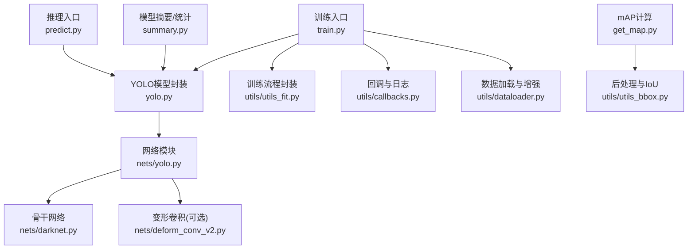
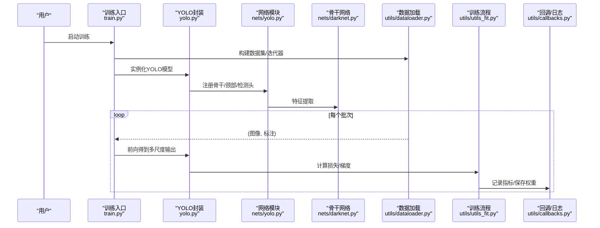
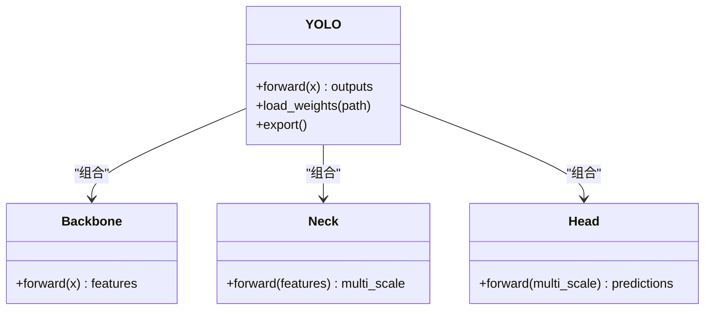
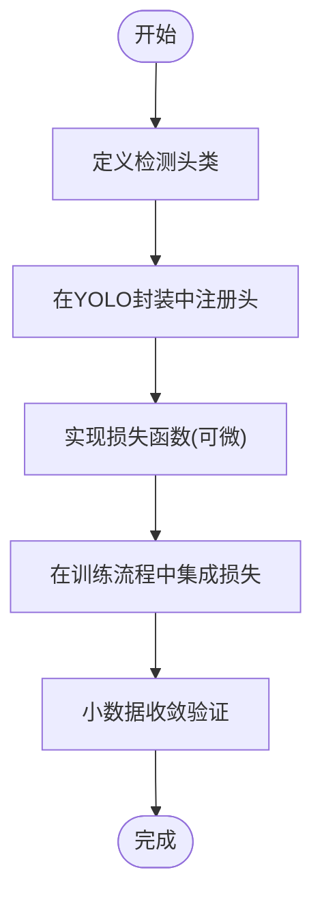
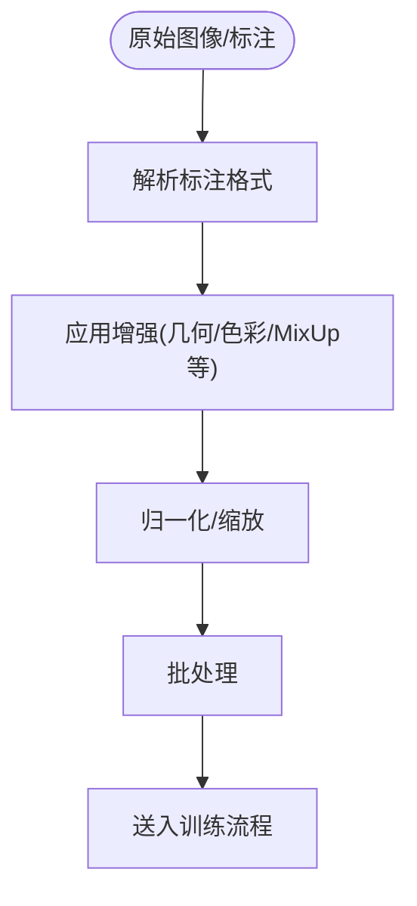
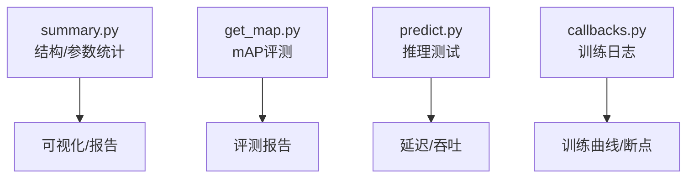
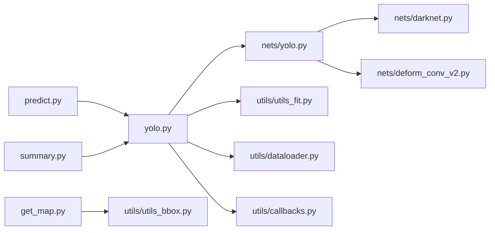

# 模型定制与扩展

<cite>
**本文引用的文件**   
- [README.md](file://README.md)
- [train.py](file://train.py)
- [yolo.py](file://yolo.py)
- [nets/yolo.py](file://nets/yolo.py)
- [nets/darknet.py](file://nets/darknet.py)
- [nets/deform_conv_v2.py](file://nets/deform_conv_v2.py)
- [nets/yolo_training.py](file://nets/yolo_training.py)
- [utils/dataloader.py](file://utils/dataloader.py)
- [utils/utils_fit.py](file://utils/utils_fit.py)
- [utils/callbacks.py](file://utils/callbacks.py)
- [utils/utils_bbox.py](file://utils/utils_bbox.py)
- [utils/utils_map.py](file://utils/utils_map.py)
- [summary.py](file://summary.py)
- [predict.py](file://predict.py)
- [get_map.py](file://get_map.py)
</cite>

## 目录
1. [简介](#简介)
2. [项目结构](#项目结构)
3. [核心组件](#核心组件)
4. [架构总览](#架构总览)
5. [详细组件分析](#详细组件分析)
6. [依赖关系分析](#依赖关系分析)
7. [性能考虑](#性能考虑)
8. [故障排查指南](#故障排查指南)
9. [结论](#结论)
10. [附录](#附录)

## 简介
本指南面向希望基于现有YOLO实现进行二次开发的工程师，聚焦“模型定制与扩展”的实用方法。内容覆盖：
- 自定义骨干网络并接入YOLO框架（结构定义、权重初始化、接口适配）
- 新增检测头与损失函数（前向传播与反向传播梯度）
- 数据增强策略扩展（自定义图像变换与标注格式支持）
- 模型压缩与加速（剪枝、量化、知识蒸馏）
- 模型监控与分析（结构可视化、参数量统计、推理速度测试）
- 完整示例路径与调试技巧

目标是帮助开发者快速、稳健地实现定制化功能，并在工程上可落地。

## 项目结构
仓库采用分层组织：顶层为训练/预测入口与工具脚本；nets存放网络结构与训练逻辑；utils提供数据加载、评估、可视化等通用能力。

图表来源
- [train.py](file://train.py)
- [yolo.py](file://yolo.py)
- [nets/yolo.py](file://nets/yolo.py)
- [nets/darknet.py](file://nets/darknet.py)
- [nets/deform_conv_v2.py](file://nets/deform_conv_v2.py)
- [utils/utils_fit.py](file://utils/utils_fit.py)
- [utils/callbacks.py](file://utils/callbacks.py)
- [utils/dataloader.py](file://utils/dataloader.py)
- [predict.py](file://predict.py)
- [get_map.py](file://get_map.py)
- [utils/utils_bbox.py](file://utils/utils_bbox.py)
- [summary.py](file://summary.py)

章节来源
- [README.md](file://README.md)
- [train.py](file://train.py)
- [yolo.py](file://yolo.py)
- [nets/yolo.py](file://nets/yolo.py)
- [nets/darknet.py](file://nets/darknet.py)
- [nets/deform_conv_v2.py](file://nets/deform_conv_v2.py)
- [utils/dataloader.py](file://utils/dataloader.py)
- [utils/utils_fit.py](file://utils/utils_fit.py)
- [utils/callbacks.py](file://utils/callbacks.py)
- [utils/utils_bbox.py](file://utils/utils_bbox.py)
- [utils/utils_map.py](file://utils/utils_map.py)
- [summary.py](file://summary.py)
- [predict.py](file://predict.py)
- [get_map.py](file://get_map.py)

## 核心组件
- 训练入口与配置：负责解析参数、构建数据集、实例化模型、启动训练循环与保存检查点。
- YOLO模型封装：统一模型的前向接口、多尺度输出拼接、NMS后处理、导出与加载权重。
- 网络模块：包含主干特征提取器、颈部融合与检测头，以及可选的变形卷积模块。
- 训练流程封装：封装优化器、学习率调度、损失计算、梯度裁剪与日志记录。
- 数据加载与增强：提供图像读取、缩放、归一化、随机翻转/色彩抖动、Mosaic/Copy-Paste等增强。
- 评估与可视化：mAP计算、混淆矩阵、曲线绘制、模型结构摘要与参数量统计。
- 推理入口：单图/批量推理、可视化结果保存。

章节来源
- [train.py](file://train.py)
- [yolo.py](file://yolo.py)
- [nets/yolo.py](file://nets/yolo.py)
- [nets/darknet.py](file://nets/darknet.py)
- [nets/deform_conv_v2.py](file://nets/deform_conv_v2.py)
- [utils/utils_fit.py](file://utils/utils_fit.py)
- [utils/dataloader.py](file://utils/dataloader.py)
- [utils/callbacks.py](file://utils/callbacks.py)
- [utils/utils_bbox.py](file://utils/utils_bbox.py)
- [utils/utils_map.py](file://utils/utils_map.py)
- [summary.py](file://summary.py)
- [predict.py](file://predict.py)

## 架构总览
下图展示了从训练到推理的关键调用链与数据流，便于理解如何替换或扩展各模块。

图表来源
- [train.py](file://train.py)
- [yolo.py](file://yolo.py)
- [nets/yolo.py](file://nets/yolo.py)
- [nets/darknet.py](file://nets/darknet.py)
- [utils/dataloader.py](file://utils/dataloader.py)
- [utils/utils_fit.py](file://utils/utils_fit.py)
- [utils/callbacks.py](file://utils/callbacks.py)

## 详细组件分析

### 自定义骨干网络并集成到YOLO
目标：在不破坏现有接口的前提下，替换或新增骨干网络（如ResNet、EfficientNet、ConvNeXt等），并确保与颈部和检测头的尺寸对齐。

步骤要点
- 定义骨干类：遵循统一的输入输出约定，返回多尺度特征图列表（例如P3/P4/P5）。
- 权重初始化：对卷积层使用合适的初始化策略（如Kaiming），对BN层保留预训练权重时注意均值/方差对齐。
- 接口适配：在YOLO封装中注册新骨干，确保通道数与下采样倍率符合检测头期望。
- 兼容性校验：打印中间特征形状，确认与原有neck/head的维度匹配。

参考位置
- 骨干网络定义与使用：[nets/darknet.py](file://nets/darknet.py)
- 网络模块装配与多尺度输出：[nets/yolo.py](file://nets/yolo.py)
- YOLO封装对外接口：[yolo.py](file://yolo.py)

图表来源
- [yolo.py](file://yolo.py)
- [nets/yolo.py](file://nets/yolo.py)
- [nets/darknet.py](file://nets/darknet.py)

章节来源
- [nets/darknet.py](file://nets/darknet.py)
- [nets/yolo.py](file://nets/yolo.py)
- [yolo.py](file://yolo.py)

### 添加新的检测头与损失函数
目标：引入新的检测头（如Anchor-free、解耦头、动态标签分配）与对应的损失（分类、回归、分布焦点等）。

步骤要点
- 检测头实现：接收多尺度特征，输出类别概率与边界框回归量；保持与YOLO封装的输入/输出契约一致。
- 损失函数：实现前向损失计算，并确保可微；若涉及复杂标签分配，需在反向传播中保证梯度稳定。
- 集成方式：在YOLO封装中注册新头与损失，必要时调整超参（如正负样本比例、正则系数）。
- 验证：在小数据集上进行收敛性测试，观察loss下降与mAP提升趋势。

参考位置
- 检测头与前向组装：[nets/yolo.py](file://nets/yolo.py)
- 训练流程与损失调用：[nets/yolo_training.py](file://nets/yolo_training.py)
- YOLO封装接口：[yolo.py](file://yolo.py)

图表来源
- [nets/yolo.py](file://nets/yolo.py)
- [nets/yolo_training.py](file://nets/yolo_training.py)
- [yolo.py](file://yolo.py)

章节来源
- [nets/yolo.py](file://nets/yolo.py)
- [nets/yolo_training.py](file://nets/yolo_training.py)
- [yolo.py](file://yolo.py)

### 数据增强策略扩展
目标：扩展数据增强管线，支持更多变换与自定义标注格式，提高模型鲁棒性与泛化能力。

步骤要点
- 图像变换：在数据加载器中插入自定义变换（如随机擦除、MixUp、CutMix、几何/色彩增强）。
- 标注格式：若使用新数据集，需适配标注解析与坐标归一化，确保与现有训练/评估流程兼容。
- 批内增强：考虑Mosaic/Copy-Paste等高级增强，注意内存与I/O开销。
- 验证：通过可视化若干批次图像与标注，确保增强正确且无越界。

参考位置
- 数据加载与增强管线：[utils/dataloader.py](file://utils/dataloader.py)
- 训练流程封装（含数据迭代）：[utils/utils_fit.py](file://utils/utils_fit.py)
- 回调与日志（用于可视化/记录）：[utils/callbacks.py](file://utils/callbacks.py)

图表来源
- [utils/dataloader.py](file://utils/dataloader.py)
- [utils/utils_fit.py](file://utils/utils_fit.py)
- [utils/callbacks.py](file://utils/callbacks.py)

章节来源
- [utils/dataloader.py](file://utils/dataloader.py)
- [utils/utils_fit.py](file://utils/utils_fit.py)
- [utils/callbacks.py](file://utils/callbacks.py)

### 模型压缩与加速技术
目标：在保持精度的前提下降低模型体积与延迟，满足部署需求。

常用技术
- 结构化剪枝：按通道/滤波器移除冗余分支，配合微调恢复精度。
- 非结构化剪枝：稀疏权重，需要特定硬件/库支持以获得加速收益。
- 量化：INT8/FP16量化，结合校准集进行离线或在线量化。
- 知识蒸馏：用大模型指导小模型训练，提升小模型表现。
- 算子替换与融合：将多个算子融合为高效内核，减少内存访问。

实践建议
- 先做基准测试（参数量、FLOPs、延迟），再逐步引入压缩策略。
- 剪枝后务必进行微调，避免精度骤降。
- 量化前进行数值稳定性检查（异常值、激活范围）。
- 蒸馏时选择合适的教师模型与损失权重配比。

参考位置
- 模型摘要与统计：[summary.py](file://summary.py)
- 训练流程封装（便于加入剪枝/量化钩子）：[utils/utils_fit.py](file://utils/utils_fit.py)
- 推理入口（便于部署与加速测试）：[predict.py](file://predict.py)

章节来源
- [summary.py](file://summary.py)
- [utils/utils_fit.py](file://utils/utils_fit.py)
- [predict.py](file://predict.py)

### 模型监控与分析工具
目标：系统化监控训练过程与模型质量，定位问题并指导优化。

关键工具
- 结构可视化：打印网络层信息、特征图尺寸变化，确认设计意图。
- 参数量统计：统计总参数量、可训练参数，辅助对比不同变体。
- 推理速度测试：在不同设备/精度下进行延迟与吞吐测试。
- mAP评估：使用标准评测脚本进行公平比较。

参考位置
- 模型摘要/统计：[summary.py](file://summary.py)
- mAP计算：[get_map.py](file://get_map.py)
- 后处理与IoU：[utils/utils_bbox.py](file://utils/utils_bbox.py)
- 训练回调与日志：[utils/callbacks.py](file://utils/callbacks.py)

图表来源
- [summary.py](file://summary.py)
- [get_map.py](file://get_map.py)
- [predict.py](file://predict.py)
- [utils/callbacks.py](file://utils/callbacks.py)
- [utils/utils_bbox.py](file://utils/utils_bbox.py)

章节来源
- [summary.py](file://summary.py)
- [get_map.py](file://get_map.py)
- [predict.py](file://predict.py)
- [utils/callbacks.py](file://utils/callbacks.py)
- [utils/utils_bbox.py](file://utils/utils_bbox.py)

## 依赖关系分析
- 低耦合高内聚：YOLO封装作为对外统一接口，内部组合骨干、颈部与检测头，便于替换与扩展。
- 数据与训练分离：数据加载与增强独立于训练流程，便于复用与并行优化。
- 评估与训练解耦：mAP计算与训练流程分离，避免耦合导致的副作用。

图表来源
- [yolo.py](file://yolo.py)
- [nets/yolo.py](file://nets/yolo.py)
- [nets/darknet.py](file://nets/darknet.py)
- [nets/deform_conv_v2.py](file://nets/deform_conv_v2.py)
- [utils/utils_fit.py](file://utils/utils_fit.py)
- [utils/dataloader.py](file://utils/dataloader.py)
- [utils/callbacks.py](file://utils/callbacks.py)
- [get_map.py](file://get_map.py)
- [utils/utils_bbox.py](file://utils/utils_bbox.py)
- [predict.py](file://predict.py)
- [summary.py](file://summary.py)

章节来源
- [yolo.py](file://yolo.py)
- [nets/yolo.py](file://nets/yolo.py)
- [nets/darknet.py](file://nets/darknet.py)
- [nets/deform_conv_v2.py](file://nets/deform_conv_v2.py)
- [utils/utils_fit.py](file://utils/utils_fit.py)
- [utils/dataloader.py](file://utils/dataloader.py)
- [utils/callbacks.py](file://utils/callbacks.py)
- [get_map.py](file://get_map.py)
- [utils/utils_bbox.py](file://utils/utils_bbox.py)
- [predict.py](file://predict.py)
- [summary.py](file://summary.py)

## 性能考虑
- 数据I/O瓶颈：优先使用多线程/异步加载、缓存与预取，减少磁盘IO等待。
- GPU利用率：合理设置batch size与混合精度，避免显存溢出。
- 算子效率：选择高效的卷积/激活实现，必要时替换为算子融合版本。
- 内存带宽：减少不必要的中间张量复制，尽量原地操作。
- 评估一致性：固定随机种子与数据顺序，确保实验可复现。

## 故障排查指南
常见问题与定位思路
- 维度不匹配：检查骨干/颈部/检测头的通道与下采样倍率，打印中间特征形状。
- 损失不下降：检查学习率、标签分配、正负样本比例与损失权重。
- 过拟合/欠拟合：调整正则、数据增强强度与模型容量。
- 推理错误：核对NMS阈值、置信度阈值与坐标归一化。
- 量化/剪枝退化：进行微调与校准，检查数值稳定性与稀疏模式。

参考位置
- 训练流程封装（含日志与断点）：[utils/utils_fit.py](file://utils/utils_fit.py)
- 回调与日志（可视化与记录）：[utils/callbacks.py](file://utils/callbacks.py)
- 后处理与IoU（NMS/坐标处理）：[utils/utils_bbox.py](file://utils/utils_bbox.py)
- mAP评测（定位指标问题）：[get_map.py](file://get_map.py)

章节来源
- [utils/utils_fit.py](file://utils/utils_fit.py)
- [utils/callbacks.py](file://utils/callbacks.py)
- [utils/utils_bbox.py](file://utils/utils_bbox.py)
- [get_map.py](file://get_map.py)

## 结论
通过模块化设计与清晰的接口契约，本项目易于进行骨干网络替换、检测头与损失扩展、数据增强升级以及压缩加速。建议在每次改动后进行小规模验证与基准测试，确保精度与性能平衡。借助监控与分析工具，可系统化定位问题并持续优化。

## 附录
- 快速上手
  - 训练：参考训练入口与配置文件，准备数据集与类别文件。
  - 推理：使用推理入口加载权重并进行可视化。
  - 评估：运行mAP计算脚本获取评测指标。
- 扩展清单
  - 新增骨干：在骨干文件中定义类，并在网络模块中注册。
  - 新增检测头/损失：实现类并在训练流程中集成。
  - 数据增强：在数据加载器中添加变换与标注解析。
  - 压缩加速：在训练流程中加入剪枝/量化钩子，并进行微调。
  - 监控分析：使用摘要与评测脚本生成报告。