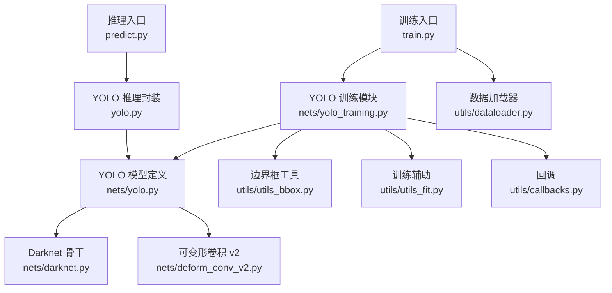
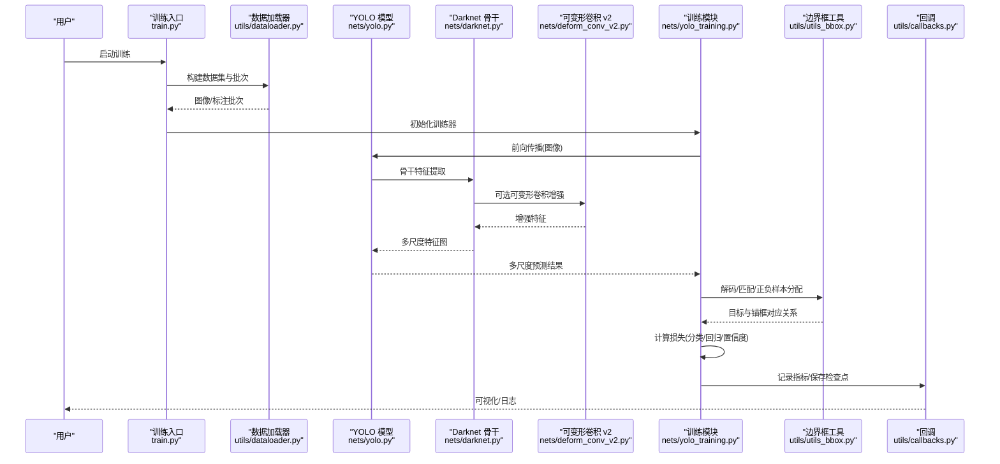
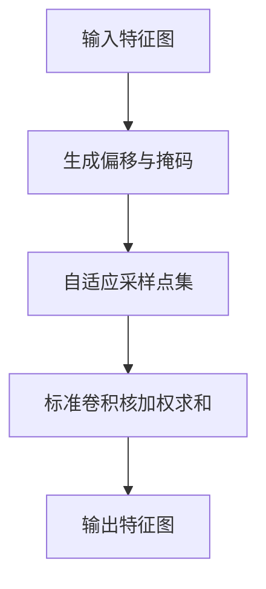
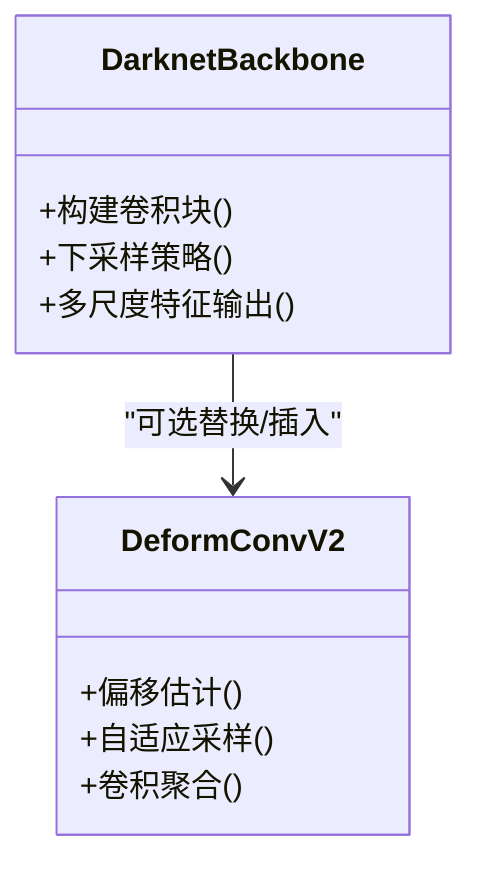
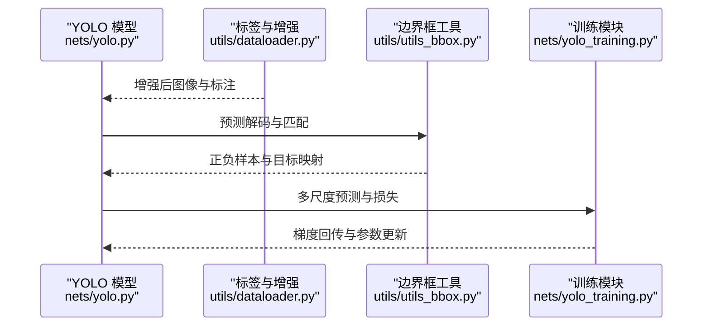
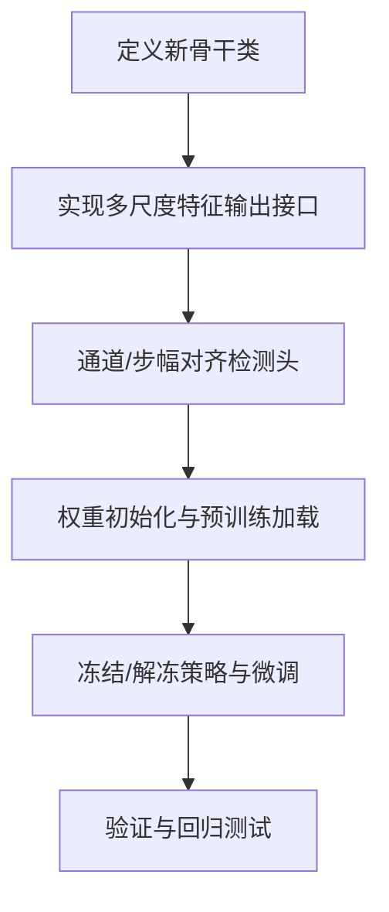
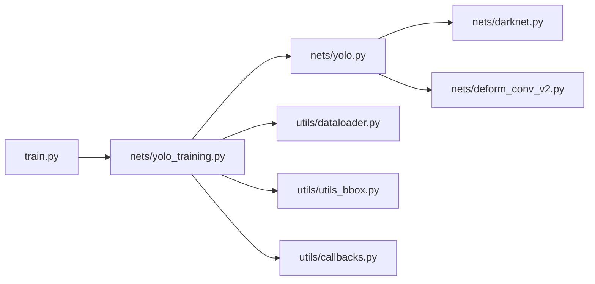

# 高级功能

<cite>
**本文引用的文件**   
- [README.md](file://README.md)
- [train.py](file://train.py)
- [yolo.py](file://yolo.py)
- [nets/darknet.py](file://nets/darknet.py)
- [nets/deform_conv_v2.py](file://nets/deform_conv_v2.py)
- [nets/yolo.py](file://nets/yolo.py)
- [nets/yolo_training.py](file://nets/yolo_training.py)
- [utils/dataloader.py](file://utils/dataloader.py)
- [utils/utils_bbox.py](file://utils/utils_bbox.py)
- [utils/utils_fit.py](file://utils/utils_fit.py)
- [utils/callbacks.py](file://utils/callbacks.py)
- [predict.py](file://predict.py)
</cite>

## 目录
1. [简介](#简介)
2. [项目结构](#项目结构)
3. [核心组件](#核心组件)
4. [架构总览](#架构总览)
5. [详细组件分析](#详细组件分析)
6. [依赖关系分析](#依赖关系分析)
7. [性能考量](#性能考量)
8. [故障排查指南](#故障排查指南)
9. [结论](#结论)
10. [附录](#附录)

## 简介
本文件聚焦 TogetherNet 的高级功能，围绕可变形卷积（Deformable Convolution）、Darknet 骨干网络、YOLO 检测头与训练流程展开，提供从原理到工程落地的完整说明。文档涵盖：
- 可变形卷积的自适应感受野机制及其在复杂目标检测中的收益
- Darknet 骨干网络的特征提取设计与扩展方式
- YOLO 多尺度预测、锚框机制与损失函数设计要点
- 自定义骨干网络接入与权重初始化方法
- 模型修改与扩展的最佳实践（新检测头、数据增强）
- 迁移学习与微调的技术细节（预训练权重使用、领域适应）

## 项目结构
TogetherNet 采用“主干/检测头/训练与工具”分层组织，关键目录与职责如下：
- nets：核心网络实现（Darknet 骨干、可变形卷积、YOLO 检测头与训练逻辑）
- utils：数据加载、边界框处理、训练辅助与回调
- 根脚本：训练、推理、评估等入口

图表来源
- [train.py](file://train.py)
- [nets/yolo_training.py](file://nets/yolo_training.py)
- [nets/yolo.py](file://nets/yolo.py)
- [nets/darknet.py](file://nets/darknet.py)
- [nets/deform_conv_v2.py](file://nets/deform_conv_v2.py)
- [utils/dataloader.py](file://utils/dataloader.py)
- [utils/utils_bbox.py](file://utils/utils_bbox.py)
- [utils/utils_fit.py](file://utils/utils_fit.py)
- [utils/callbacks.py](file://utils/callbacks.py)
- [predict.py](file://predict.py)
- [yolo.py](file://yolo.py)

章节来源
- [README.md](file://README.md)
- [train.py](file://train.py)
- [yolo.py](file://yolo.py)

## 核心组件
- 可变形卷积 v2：在标准卷积基础上引入偏移量学习，使感受野随内容自适应变化，提升对形变、遮挡、尺度变化目标的建模能力。
- Darknet 骨干：以堆叠卷积块构建深层特征金字塔基础，强调计算效率与特征表达能力平衡，便于替换或扩展。
- YOLO 检测头：多尺度输出、锚框机制与任务特定损失组合，兼顾速度与精度。
- 训练管线：数据加载、标签生成、损失计算、优化与回调一体化，支持灵活配置与监控。

章节来源
- [nets/deform_conv_v2.py](file://nets/deform_conv_v2.py)
- [nets/darknet.py](file://nets/darknet.py)
- [nets/yolo.py](file://nets/yolo.py)
- [nets/yolo_training.py](file://nets/yolo_training.py)
- [utils/dataloader.py](file://utils/dataloader.py)
- [utils/utils_bbox.py](file://utils/utils_bbox.py)
- [utils/utils_fit.py](file://utils/utils_fit.py)
- [utils/callbacks.py](file://utils/callbacks.py)

## 架构总览
下图展示从输入图像到最终检测输出的端到端流程，突出骨干、可变形卷积、多尺度检测头与训练循环的关键交互。

图表来源
- [train.py](file://train.py)
- [nets/yolo_training.py](file://nets/yolo_training.py)
- [nets/yolo.py](file://nets/yolo.py)
- [nets/darknet.py](file://nets/darknet.py)
- [nets/deform_conv_v2.py](file://nets/deform_conv_v2.py)
- [utils/dataloader.py](file://utils/dataloader.py)
- [utils/utils_bbox.py](file://utils/utils_bbox.py)
- [utils/callbacks.py](file://utils/callbacks.py)

## 详细组件分析

### 可变形卷积（Deformable Convolution v2）
- 原理要点
  - 在标准卷积采样网格上叠加可学习的二维偏移，使采样位置随输入内容自适应调整。
  - v2 版本通常包含更稳健的偏移估计与调制策略，减少噪声干扰并提升稳定性。
- 优势与应用
  - 自适应感受野：对形变、遮挡、尺度变化具有更强鲁棒性。
  - 复杂场景检测：在密集小目标、长尾类别、强背景干扰下表现更佳。
- 集成方式
  - 作为骨干或颈部模块的替换单元，保持通道对齐与步幅一致即可无缝接入。
  - 注意偏移分支参数量与正则化，避免过拟合。

图表来源
- [nets/deform_conv_v2.py](file://nets/deform_conv_v2.py)

章节来源
- [nets/deform_conv_v2.py](file://nets/deform_conv_v2.py)

### Darknet 骨干网络
- 设计要点
  - 以重复的卷积块与下采样结构构建深层特征，强调计算效率与表达力平衡。
  - 通过残差连接与批归一化稳定训练，利于迁移与微调。
- 特征提取机制
  - 浅层保留空间细节，深层语义更强；多尺度特征可用于后续检测头融合。
- 扩展建议
  - 替换部分卷积块为可变形卷积以提升形变建模。
  - 增加注意力或通道重标定模块改善难例表征。

图表来源
- [nets/darknet.py](file://nets/darknet.py)
- [nets/deform_conv_v2.py](file://nets/deform_conv_v2.py)

章节来源
- [nets/darknet.py](file://nets/darknet.py)

### YOLO 检测头与训练
- 多尺度预测
  - 在不同深度的特征图上并行预测，覆盖大中小目标，提升召回与定位精度。
- 锚框机制
  - 基于数据集先验尺寸设定锚框，结合正负样本分配策略提高训练稳定性。
- 损失函数设计
  - 分类损失、定位损失与置信度损失联合优化；对正负样本不平衡进行加权或采样。
- 训练流程
  - 数据增强、标签预处理、前向计算、损失反传、优化更新与监控回调协同工作。

图表来源
- [nets/yolo.py](file://nets/yolo.py)
- [utils/dataloader.py](file://utils/dataloader.py)
- [utils/utils_bbox.py](file://utils/utils_bbox.py)
- [nets/yolo_training.py](file://nets/yolo_training.py)

章节来源
- [nets/yolo.py](file://nets/yolo.py)
- [nets/yolo_training.py](file://nets/yolo_training.py)
- [utils/dataloader.py](file://utils/dataloader.py)
- [utils/utils_bbox.py](file://utils/utils_bbox.py)

### 自定义骨干网络接入指南
- 步骤概览
  - 定义新骨干类，遵循输入输出接口：接收张量，返回多尺度特征图列表。
  - 确保各尺度特征图的通道数与步幅符合检测头期望。
  - 提供权重初始化策略（如 He/Kaiming），并对已加载的预训练权重做键名映射与切片加载。
- 权重初始化与迁移
  - 仅加载兼容层权重，忽略不匹配层；对新增层使用随机初始化或启发式初始化。
  - 冻结部分层进行冷启动微调，逐步解冻以提升收敛稳定性。
- 最佳实践
  - 保持模块化与可插拔，使用注册表或工厂模式管理不同骨干。
  - 在验证集上对比 mAP 与速度，评估替换带来的收益与代价。

章节来源
- [nets/darknet.py](file://nets/darknet.py)
- [nets/yolo.py](file://nets/yolo.py)
- [utils/utils_fit.py](file://utils/utils_fit.py)

### 模型修改与扩展最佳实践
- 新检测头
  - 保持多尺度输出格式一致，适配现有损失与后处理。
  - 若引入新的预测维度，需同步更新标签编码与正负样本分配。
- 数据增强
  - 在数据加载阶段实施几何与色彩增强，保证与标注同步变换。
  - 针对小目标与密集场景，可加入 MixUp/CutMix/Mosaic 等策略。
- 训练稳定性
  - 合理设置学习率调度与权重衰减，配合早停与检查点保存。
  - 使用回调记录关键指标，便于复现与回溯。

章节来源
- [nets/yolo.py](file://nets/yolo.py)
- [nets/yolo_training.py](file://nets/yolo_training.py)
- [utils/dataloader.py](file://utils/dataloader.py)
- [utils/callbacks.py](file://utils/callbacks.py)

### 迁移学习与微调技术细节
- 预训练权重使用
  - 加载通用数据集（如 COCO/VOC）权重，屏蔽不匹配层后继续训练。
  - 对头部与骨干分别设置不同的学习率，加速领域适应。
- 领域适应
  - 先在源域上微调骨干，再在目标域上端到端微调。
  - 结合数据增强与正则化缓解域间分布差异。
- 评估与回退
  - 以 mAP 为主要指标，辅以 PR 曲线与混淆矩阵分析。
  - 出现退化时回滚至上一检查点并调整超参。

章节来源
- [nets/yolo_training.py](file://nets/yolo_training.py)
- [utils/utils_fit.py](file://utils/utils_fit.py)
- [utils/callbacks.py](file://utils/callbacks.py)

## 依赖关系分析
- 模块耦合
  - 训练入口依赖训练模块与数据加载器；训练模块依赖 YOLO 模型、边界框工具与回调。
  - YOLO 模型依赖 Darknet 骨干与可变形卷积（可选）。
- 外部依赖
  - 数据加载与增强、可视化和日志记录由 utils 与回调模块统一封装，降低耦合度。

图表来源
- [train.py](file://train.py)
- [nets/yolo_training.py](file://nets/yolo_training.py)
- [nets/yolo.py](file://nets/yolo.py)
- [nets/darknet.py](file://nets/darknet.py)
- [nets/deform_conv_v2.py](file://nets/deform_conv_v2.py)
- [utils/dataloader.py](file://utils/dataloader.py)
- [utils/utils_bbox.py](file://utils/utils_bbox.py)
- [utils/callbacks.py](file://utils/callbacks.py)

章节来源
- [train.py](file://train.py)
- [nets/yolo_training.py](file://nets/yolo_training.py)
- [nets/yolo.py](file://nets/yolo.py)
- [nets/darknet.py](file://nets/darknet.py)
- [nets/deform_conv_v2.py](file://nets/deform_conv_v2.py)
- [utils/dataloader.py](file://utils/dataloader.py)
- [utils/utils_bbox.py](file://utils/utils_bbox.py)
- [utils/callbacks.py](file://utils/callbacks.py)

## 性能考量
- 可变形卷积的额外开销主要来自偏移估计与自适应采样，建议在瓶颈层选择性使用，并结合剪枝与量化优化部署。
- Darknet 骨干可通过减少通道数或替换高效卷积核提升速度，但需权衡精度。
- 多尺度预测带来计算冗余，可在推理阶段按需裁剪尺度或采用动态分辨率。
- 训练阶段的数据增强与标签匹配会增加 CPU/GPU 负载，建议异步数据加载与批内并行。

## 故障排查指南
- 训练不收敛
  - 检查学习率与权重衰减是否过大；确认正负样本比例与损失权重设置。
  - 查看回调记录的指标曲线，定位异常阶段。
- 精度下降
  - 核对数据增强是否与标注同步；检查边界框解码与匹配逻辑。
  - 对比不同骨干与检测头的 ablation 结果，定位问题模块。
- 内存溢出
  - 减小批次大小或输入分辨率；关闭不必要的日志与中间变量保存。
- 推理速度慢
  - 关闭多尺度中低贡献尺度；启用算子融合与半精度推理。

章节来源
- [utils/utils_fit.py](file://utils/utils_fit.py)
- [utils/callbacks.py](file://utils/callbacks.py)
- [utils/utils_bbox.py](file://utils/utils_bbox.py)
- [nets/yolo_training.py](file://nets/yolo_training.py)

## 结论
TogetherNet 将可变形卷积与 Darknet 骨干、YOLO 多尺度检测头有机结合，提供了高扩展性与高性能的目标检测方案。通过合理的骨干替换、检测头扩展、数据增强与迁移学习策略，可在复杂场景中显著提升检测效果与鲁棒性。建议在实际工程中结合 ablation 实验与部署约束，持续迭代优化。

## 附录
- 快速上手
  - 训练：参考训练入口与训练模块的配置项，准备数据与类别文件后启动训练。
  - 推理：使用推理入口加载权重并进行批量预测。
- 常用路径
  - 训练入口：[train.py](file://train.py)
  - 推理入口：[predict.py](file://predict.py)
  - YOLO 模型与训练：[nets/yolo.py](file://nets/yolo.py)、[nets/yolo_training.py](file://nets/yolo_training.py)
  - 骨干与可变形卷积：[nets/darknet.py](file://nets/darknet.py)、[nets/deform_conv_v2.py](file://nets/deform_conv_v2.py)
  - 数据与工具：[utils/dataloader.py](file://utils/dataloader.py)、[utils/utils_bbox.py](file://utils/utils_bbox.py)、[utils/utils_fit.py](file://utils/utils_fit.py)、[utils/callbacks.py](file://utils/callbacks.py)